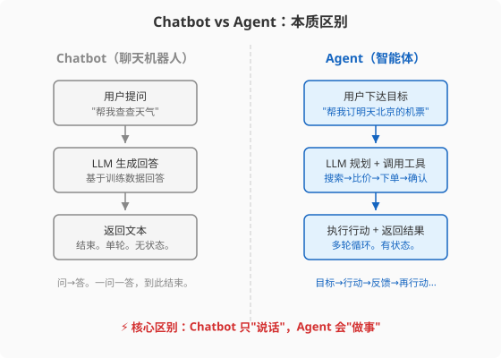
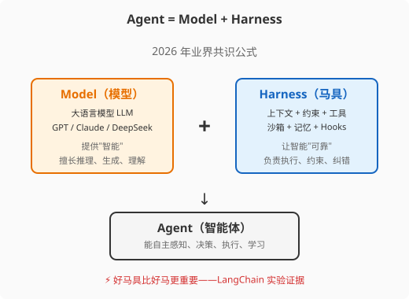
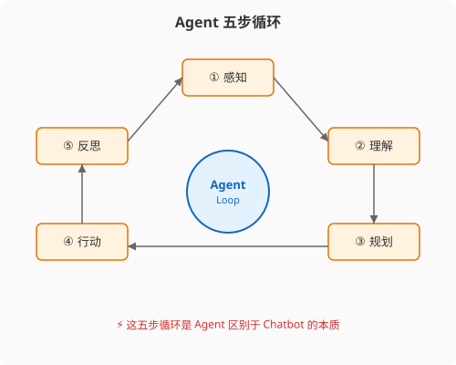

### 第 1 章 什么是 AI Agent：从聊天机器人到自主智能体

> 📖 本章你将学会：Agent 的精确定义、Agent 与 Chatbot 的本质区别、Agent 的五步循环模型、Agent 的核心公式

---

#### 开篇：带工具箱的实习生

想象你招了一个实习生。这个实习生智商 150，读过人类有史以来几乎所有的书，记忆力惊人，但你发现他有几个"特点"：

第一，他每隔几秒就会"失忆"——上一秒你跟他说的话，下一秒他就忘了，除非你写在便签上递给他。

第二，他只会说话，不会动手。他能告诉你"应该把这份报告发给王总"，但他自己不会打开邮箱、不会点发送按钮。

第三，他的知识停留在入职那天。今天之后发生的事，他一概不知，除非你把新闻剪报递给他。

第四，他偶尔会"一本正经地胡说八道"——用极其自信的语气告诉你一个完全错误的事实。

你会怎么用这个实习生？你会给他配一个工具箱：一个便签本（记忆）、一个邮箱客户端（工具）、一个新闻订阅（实时知识）、一个审核流程（纠错机制）。然后你告诉他目标，让他自己规划、自己动手、自己检查。

**这就是 Agent。**

大模型（LLM）是那个智商 150 但有四个"特点"的实习生。Agent 是给他配上工具箱、让他自主完成任务的完整系统。

---

#### 1.1 Agent 的定义：不是"会聊天的 AI"，而是"会做事的 AI"

##### 1.1.1 Agent 的四个关键动词

很多人把"AI Agent"理解成"会聊天的 AI"。这是一个根本性的误解。

ChatGPT 是会聊天的 AI。你问它问题，它回答你，对话结束。它不会主动去做任何事——不会发邮件、不会查数据库、不会执行代码、不会修改文件。

**Agent 的核心特征是四个动词：感知、决策、执行、学习。**

| 动词 | 含义 | Chatbot | Agent |
|------|------|---------|-------|
| 感知 | 接收环境信息 | 用户打字输入 | 用户输入 + 工具返回 + 系统状态 |
| 决策 | 决定下一步做什么 | LLM 生成文本 | LLM 规划行动序列 |
| 执行 | 采取实际行动 | 无（只输出文字） | 调用工具、执行代码、修改文件 |
| 学习 | 从经验中改进 | 无 | 记忆系统 + 反思循环 |

**一句话定义**：Agent 是一个以 LLM 为大脑、能自主感知环境、规划行动、调用工具执行、并通过反馈学习的系统。

> 💡 注意"自主"这个词。Chatbot 的每一步都由用户驱动——你问一句它答一句。Agent 的特点是：你给它一个目标，它自己决定怎么完成，中间不需要你逐步指挥。



##### 1.1.2 Agent vs Chatbot vs Workflow vs Copilot

这四个概念经常被混用，但它们有本质区别。用"你去餐厅吃饭"来类比：

**Chatbot（聊天机器人）** 是菜单上的菜品图片——你看看图片，问问服务员是什么菜，然后你自己去别的地方吃。它只提供信息，不提供行动。

**Copilot（副驾驶）** 是坐在你旁边的副驾——你开车，它帮你导航、提醒你转弯，但方向盘始终在你手里。GitHub Copilot 就是这种模式：你写代码，它补全。

**Workflow（工作流）** 是餐厅的流水线——洗菜→切菜→炒菜→装盘→上菜，每一步都是预先编排好的，LLM 在其中只是某个环节的工具。流程是确定的，LLM 不能改变流程。

**Agent（智能体）** 是你雇的一个私人厨师——你告诉他"我想吃一顿川菜，不要太辣"，他自己去看冰箱里有什么、决定做什么菜、自己动手做、做完端给你。中间过程他自己决定。

| 维度 | Chatbot | Copilot | Workflow | Agent |
|------|---------|---------|----------|-------|
| 谁驱动 | 用户每步驱动 | 用户主导，AI 辅助 | 预设流程驱动 | AI 自主驱动 |
| 能否行动 | ❌ 只输出文字 | ⚠️ 辅助编辑 | ✅ 执行预设步骤 | ✅ 自主选择行动 |
| 流程是否固定 | N/A | N/A | ✅ 固定 | ❌ 动态决定 |
| 有无工具 | ❌ | ⚠️ 有限 | ✅ 预设工具集 | ✅ 自主选择工具 |
| 有无记忆 | ❌ | ⚠️ 会话内 | ❌ | ✅ 跨会话 |
| 典型产品 | ChatGPT 对话 | GitHub Copilot | n8n / Zapier + LLM | Codex CLI / Claude Code |

> ⚠️ 注意：这四个概念不是"高低之分"，而是"适用场景之分"。简单的问答用 Chatbot 就够了，不需要 Agent。Agent 的复杂度是有代价的——成本更高、更难控制、更容易出错。不要为了"看起来先进"就把所有东西都做成 Agent。

##### 1.1.3 Agent 的核心公式：Agent = Model + Harness

2026 年 2 月，HashiCorp 联合创始人 Mitchell Hashimoto 在博客文章《My AI Adoption Journey》中提出了一个公式，这个公式后来被 OpenAI、Anthropic、LangChain 相继采纳，成为业界共识：

```
Agent = Model + Harness
```

**Model（模型）** 是大语言模型——GPT、Claude、DeepSeek 等。它提供"智能"：推理能力、语言理解、知识储备。但模型本身是一个"无状态的文本预测器"，它被关在一个没有窗户的房间里——不知道现在几点、不能上网、不能执行代码、不能记住昨天说过什么。

**Harness（马具）** 是模型之外的一切——上下文管理、工具调用、沙箱执行、记忆系统、行为约束、反馈循环。它让模型的"智能"变得"有用"和"可靠"。

> 💡 比喻：Model 是马，Harness 是马具（缰绳+马鞍+马蹄铁+护栏+道路）。马再快，没有马具你也骑不了；马具再好，没有马也跑不了。两者缺一不可，但**好马具比好马更重要**——这是一个反直觉但被数据验证的结论。

LangChain 做了一个实验：固定 GPT-4 模型不变，只改进 Harness（更好的上下文文件、结构化输出约束、自我验证循环、工具优化），Agent 在 Terminal Bench 2.0 基准上的得分从 **52.8% 提升到 66.5%**——提升幅度比换一个更贵的模型还大。



这个公式是全书的骨架。第二篇讲四大工程范式（Prompt → Context → Loop → Harness），第三篇讲 Harness 的六大组件怎么落地，后面所有章节都是对这个公式的展开。

---

#### 1.2 Agent 的五步循环

##### 1.2.1 感知 → 理解 → 规划 → 行动 → 反思

Agent 之所以是 Agent，不是因为它有 LLM，而是因为它有一个**循环**。

一个完整的 Agent 循环包含五个步骤：

1. **感知（Perceive）**：接收环境信息。可能是用户的新消息、工具调用的返回结果、系统状态的变化。
2. **理解（Understand）**：LLM 分析当前状态，理解"现在发生了什么""目标是什么""还差什么"。
3. **规划（Plan）**：LLM 决定下一步做什么。可能是一步，也可能是一个多步计划。
4. **行动（Act）**：执行规划。调用工具、执行代码、修改文件、发送消息。
5. **反思（Reflect）**：检查行动结果。成功了？失败了？需要调整计划吗？

然后回到第 1 步，开始下一轮循环。



这个循环是 Agent 的**定义性特征**。有没有这个循环，是 Agent 和 Chatbot 的分水岭：

- Chatbot 是"一问一答"——你问，它答，结束。没有循环。
- Agent 是"目标→循环→完成"——你给目标，它自己转圈，直到完成。

##### 1.2.2 最小 Agent 实现：ReAct 循环

2022 年 10 月，普林斯顿大学的 Shunyu Yao 和 Google Brain 的研究者发表了一篇论文《ReAct: Synergizing Reasoning and Acting in Language Models》（ICLR 2023），提出了一个简洁而强大的思想：**让 LLM 交替生成"推理"和"行动"**。

ReAct 是 **Rea**soning + **Act**ing 的缩写。它的核心循环是：

```
Thought（思考）：我现在应该做什么？为什么？
Action（行动）：调用某个工具
Observation（观察）：工具返回了什么结果
→ 回到 Thought，继续下一步
```

在 ReAct 之前，LLM 的"推理"（Chain-of-Thought）和"行动"（工具调用）是分开研究的。CoT 让模型"会想但不会做"——推理时无法获取外部信息；工具调用让模型"会做但不会想"——盲目执行而不解释理由。

ReAct 的贡献在于把两者**交错融合**：推理指导行动（"我应该先搜索这个关键词"），行动反哺推理（"搜索结果显示...所以下一步我应该..."）。

论文中的实验数据令人印象深刻：

| 任务 | CoT-only（只推理） | Act-only（只行动） | ReAct（推理+行动） |
|------|-------------------|-------------------|-------------------|
| HotpotQA（多跳问答） | 29.4% | 25.7% | **35.1%** |
| ALFWorld（交互式游戏） | — | 45% | **71%**（+26pp） |
| WebShop（在线购物） | — | 30.1% | **40.0%**（+10pp） |

ReAct 成为了现代 Agent 的基石。LangChain 的默认 Agent（`create_react_agent`）、AutoGPT 的主循环、OpenAI 的 Function Calling、Claude 的 Tool Use——它们的核心都是同一个 Thought-Action-Observation 循环。

> 💡 比喻：ReAct 之于 Agent，就像 MVC 之于 Web 框架。无论你用什么框架（LangChain、CrewAI、AutoGen），底层都是 ReAct 循环的变体。理解了 ReAct，就理解了所有 Agent 框架的共同骨架。

一个最小 ReAct Agent 的伪代码只有几十行：

```python
# 最小 ReAct Agent（伪代码示意）
tools = {"search": web_search, "calculator": calculate}

conversation = [system_prompt, user_message]

while True:
    # LLM 生成 Thought + Action
    response = llm.generate(conversation)
    
    if response.is_final_answer:
        return response.text  # 任务完成，返回最终答案
    
    # 解析出要调用的工具和参数
    tool_name, tool_input = parse_action(response)
    
    # 执行工具，获得 Observation
    observation = tools[tool_name](tool_input)
    
    # 把 Thought、Action、Observation 加入对话历史
    conversation.append(response)
    conversation.append(f"Observation: {observation}")
    
    # 继续下一轮循环
```

这段代码揭示了一个关键事实：**Agent 的核心不是模型，而是循环**。模型只是循环中的一个环节——那个负责"理解和规划"的环节。循环本身、工具调用、状态管理、终止条件，这些是 Harness 的工作。

---

#### 1.3 Agent 发展简史

##### 1.3.1 从符号主义到 LLM-Agent

AI Agent 并不是 2023 年才出现的概念。它的历史比大模型长得多。

**1950s-1980s：符号主义 Agent**。早期的 AI Agent 基于符号逻辑和规则系统。SHRDLU（1970）是一个能在积木世界里理解自然语言并执行操作的 Agent。这些系统推理能力强，但局限在封闭世界，无法处理真实环境的复杂性。

**1990s-2000s：强化学习 Agent**。RL Agent 通过试错学习最优策略。DeepMind 的 Atari 游戏 Agent（2013）和 AlphaGo（2016）是这一路线的巅峰。RL Agent 擅长在明确规则的环境中优化，但难以处理开放世界的语言理解和常识推理。

**2020-2022：LLM 驱动的 Agent 萌芽**。GPT-3（2020）展示了 LLM 的推理潜力。Chain-of-Thought（2022）让 LLM 学会"出声思考"。但这些都是在"语言空间"内的推理，没有与真实世界的交互。

**2022 年 10 月：ReAct 论文**。这是 LLM-Agent 的真正起点。ReAct 第一次让 LLM 在推理和行动之间交替，建立了"感知-思考-行动"的闭环。

**2023 年：Agent 框架爆发**。AutoGPT（2023.3）展示了"AI 自主完成任务"的可能性，虽然效果粗糙但引爆了想象力。LangChain、LlamaIndex 相继推出 Agent 模块。BabyAGI、AgentGPT 等项目涌现。

**2024 年：工具调用标准化**。OpenAI 发布 Function Calling，Anthropic 发布 Tool Use。MCP 协议（2024.11）为工具调用建立了标准。框架从"玩具"走向"工具"。

**2025 年 6 月：Context Engineering 范式确立**。Andrej Karpathy 在 X 上发推支持"context engineering"术语[^karpathy-context]。OpenAI Codex CLI（2025.4）、Claude Code 等终端编程 Agent 出现，展示了 Agent 在真实工程场景中的价值。

**2026 年 2 月：Harness Engineering 命名**。HashiCorp 联合创始人 Mitchell Hashimoto 在《My AI Adoption Journey》中正式提出 `Agent = Model + Harness`[^hashimoto-harness]。六天后 OpenAI 发表百万行代码实验报告。A2A 协议 v1.0 发布（2026.03）。Agent 从"能用"走向"可靠"。

**2026 年 6 月：Loop Engineering 系统化**。Google 工程总监 Addy Osmani 正式命名 Loop Engineering，定义为"设计系统让 Agent 自动循环执行任务"[^osmani-loop]。OpenClaw 创始人 Peter Steinberger 的推文 24 小时内获 220 万浏览。

##### 1.3.2 2025-2026 年 Agent 框架格局

到 2026 年中期，Agent 生态形成了几个层次：

**模型层**：GPT-5.x / Claude 4.x / DeepSeek / 开源模型（Llama、Qwen），提供基础推理能力。

**框架层**：LangGraph（图驱动编排）、OpenAI Agents SDK（官方框架）、CrewAI（角色驱动多 Agent），提供 Agent 构建的基础设施。

**工具层**：MCP 协议 + 数千个 MCP Server，提供标准化的工具调用能力。

**平台层**：Codex CLI / Claude Code（终端编程）、Coze / Dify（低代码平台），提供开箱即用的 Agent 产品。

**协议层**：MCP（Agent→工具，纵向）、A2A（Agent→Agent，横向），提供标准化的通信能力。

这个分层结构很像 Web 开发：模型是数据库，框架是 Spring/Django，工具是各种 SDK，平台是现成产品，协议是 HTTP。

---

#### 1.4 本章小结

本章建立了三个核心心智模型：

**心智模型 1：Agent ≠ Chatbot**。Chatbot 只"说话"，Agent 会"做事"。区别在于有没有"循环"——感知→理解→规划→行动→反思的闭环。

**心智模型 2：Agent = Model + Harness**。Model 提供智能，Harness 让智能可靠。好马具比好马更重要——这是 2026 年业界用数据验证的共识。

**心智模型 3：ReAct 是 Agent 的共同骨架**。无论你用什么框架，底层都是 Thought-Action-Observation 循环的变体。理解了 ReAct，就理解了所有 Agent。

下一章，我们深入 Agent 的"大脑"——LLM，看看它到底能做什么、不能做什么。只有理解了 LLM 的能力边界，你才知道 Harness 需要补什么。

---

[^karpathy-context]: Andrej Karpathy, X/Twitter 推文, 2025-06-25, https://x.com/karpathy/status/1937902205765607626

[^hashimoto-harness]: Mitchell Hashimoto, "My AI Adoption Journey", 2026-02-05, https://hashimoto.jp

[^osmani-loop]: Addy Osmani, "Loop Engineering", 2026-06-07, https://addyosmani.com/blog/loop-engineering
