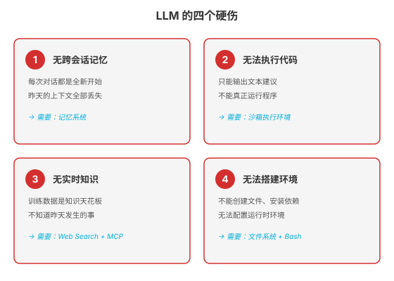
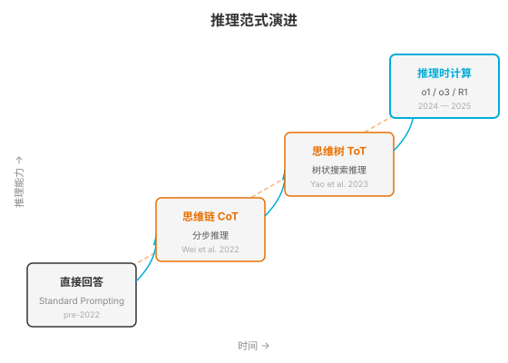
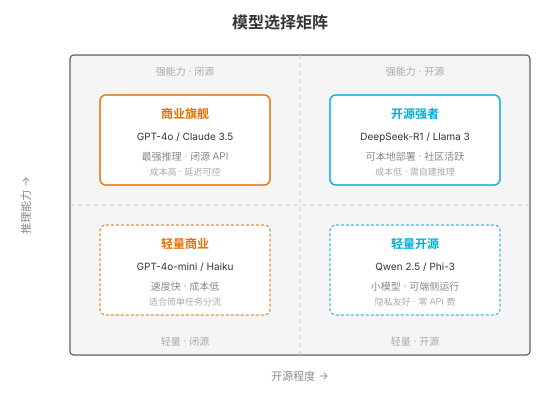

### 第 2 章 LLM 作为 Agent 大脑：能力边界与推理范式

> 📖 本章你将学会：LLM 作为 Agent 大脑的四个硬伤、推理范式从 CoT 到 Test-Time Compute 的演进脉络、模型选择策略与分级方案

---

#### 开篇：天才的大脑，残缺的身体

上一章我们说，Agent 是"带工具箱的实习生"。这一章我们放大这个实习生的"大脑"——看看它到底有多聪明，又有哪些致命缺陷。

想象你遇到了一个天赋异禀但身体残疾的天才。他的大脑可以瞬间理解量子力学、可以背诵整部《莎士比亚全集》、可以推导复杂的数学证明。但他有三个物理限制：

第一，他没有手——他不能翻书、不能打字、不能按按钮。所有知识只能通过别人念给他听来获取，所有结论只能通过嘴说出来。

第二，他的记忆每七秒会重置一次——像电影《记忆碎片》里的主角一样。除非你把关键信息写在他的手臂上，否则他完全不记得刚才发生了什么。

第三，他的知识停留在某一天——比如 2025 年 1 月 1 日。这天之后发生的所有事情，他一无所知。

这个比喻精准地描述了 LLM 作为 Agent 大脑的处境。LLM 的推理能力令人惊叹，但它有四个"硬伤"——不是通过改进 Prompt 就能解决的物理级限制。理解这些硬伤，你才能理解 Harness 每一个组件存在的理由。

---

#### 2.1 LLM 的四个硬伤

LLM 作为 Agent 的大脑，能力很强，但有四个根本性的限制。这四个限制不是"还不够好"的问题，而是架构层面的"做不到"——必须靠外部系统（Harness）来补。

##### 2.1.1 硬伤一：无法维持跨会话状态

LLM 是**无状态**的。每一次 API 调用都是一次全新的推理——模型本身不记得上一次调用的任何内容。

你昨天和 GPT 聊了两个小时的项目方案，今天打开新对话，它对你的项目一无所知。这不是它"忘了"，而是它从根本上就**没有记忆机制**。所谓的"对话历史"，只不过是每次调用时把之前的消息全部重新发给模型——模型读到这些消息后，"看起来"像是在延续昨天的对话，但它本身从未存储过任何东西。

> 💡 比喻：LLM 像一个每天早上醒来都失忆的侦探。你把昨天的案情记录递给他，他读完就能接着推理——但只要你不递给他，他连昨天办过这个案子都不知道。

这带来一个工程问题：对话越长，历史消息越多，每次调用的 Token 消耗就越大。一个持续一天的 Agent 会话，上下文可能膨胀到数十万 Token，既贵又慢，还会遇到上下文窗口的硬限制。

**Harness 补法**：记忆系统。第 6 章（Context 工程）和第 11 章（Skills 系统）会详细展开——用短期记忆（对话历史压缩）、工作记忆（会话状态持久化）、长期记忆（向量存储/知识图谱）三层架构来管理跨会话状态。

##### 2.1.2 硬伤二：无法执行代码

LLM 是一个**文本预测器**。它的输出永远是文本——可以是自然语言、可以是代码、可以是 JSON，但都是"文字"，不是"行动"。

你让 LLM "写一个 Python 脚本算一下斐波那契数列"，它会写出完美的代码。但它**不会自己运行这段代码**。它只能把代码交给你，由你来执行。如果代码有 bug，它也只能靠"读代码"来猜测哪里错了——它看不到运行结果。

这就像一个只会画图纸但不会开机器的工程师。他画的图纸可能很精确，但机器到底能不能转起来，他不知道。

对于 Agent 来说，这是致命的。Agent 需要的不只是"知道怎么做"，而是"真正去做"。一个不能执行代码的 Agent，就像一个不能下棋的棋手——它只能"说"该怎么走，不能真正移动棋子。

**Harness 补法**：沙箱执行环境。第 9 章会展开——通过 Bash + 沙箱（macOS Seatbelt / Docker / E2B 云沙箱），让 Agent 能真正运行代码、查看结果、根据结果修正。这是"自我验证循环"的基础——写代码→运行→看结果→修复→再运行。

##### 2.1.3 硬伤三：无法获取实时知识

LLM 的知识有**截止日期**。GPT-4o 的训练数据截止到 2024 年 10 月，Claude 3.5 截止到 2024 年 4 月。模型不知道训练完成之后发生的任何事情。

你问它"今天的天气"，它会告诉你它不知道。你问它"最新的 Go 版本是什么"，它可能回答 1.22（而实际上已经到 1.24 了）。你问它"昨天发布的那个 CVE 漏洞"，它完全不知道你在说什么。

更隐蔽的问题是知识的**幻觉**。当模型不知道某件事时，它不会说"我不知道"，而是会**编造一个看起来合理的答案**。这不是模型在"骗你"，而是它的生成机制决定的——它根据训练数据中的统计规律预测下一个词，如果训练数据里没有相关信息，它就会生成一个"最像正确答案"的错误答案。

> ⚠️ 这就是为什么 Agent 不能只靠 LLM 的参数化知识。一个不知道今天日期、不知道最新技术版本、不知道实时价格的 Agent，在真实场景中几乎不可用。

**Harness 补法**：Web Search + MCP。第 10 章（MCP 协议）会展开——通过 Web Search 工具获取实时信息，通过 MCP Server 连接企业内部知识库、API、数据库，让 Agent 能在推理时"查阅"最新信息。这就是 RAG（检索增强生成）的本质——开卷考试而非闭卷考试。

##### 2.1.4 硬伤四：无法搭建工作环境

LLM 不能**操作环境**。它不能创建文件、不能安装依赖包、不能配置环境变量、不能启动服务。

你让 LLM "帮我搭一个 React 项目"，它会告诉你步骤：`npx create-react-app my-app`，然后 `cd my-app`，然后 `npm install`……但它自己不会执行这些命令。你得自己手动操作。

这四个硬伤合在一起，构成了 LLM 从"聊天工具"到"Agent 大脑"之间的鸿沟：

| 硬伤 | LLM 现状 | 需要的 Harness 组件 |
|------|----------|-------------------|
| 无跨会话记忆 | 每次调用都是全新开始 | 记忆系统（三层架构） |
| 无法执行代码 | 只输出文本建议 | 沙箱 + Bash |
| 无实时知识 | 知识停留在训练截止日 | Web Search + MCP + RAG |
| 无法搭建环境 | 不能操作文件/系统 | 文件系统 + 工具调用 |

> 💡 记住这四个硬伤。全书第三篇的每一个组件——沙箱、MCP、Skills、记忆系统——都是在补这四个硬伤中的一个或多个。当你理解了"LLM 缺什么"，你就理解了 Harness 要建什么。

---

#### 2.2 推理范式演进

LLM 有四个硬伤，但它的核心优势——**推理能力**——在过去四年里经历了一场静悄悄的革命。这场革命不是来自更大的模型，而是来自"怎么让模型思考"的方法论变革。

##### 2.2.1 Chain-of-Thought：让 LLM "出声思考"

2022 年 1 月，Google Research 的 Jason Wei 等人发表了一篇论文《Chain-of-Thought Prompting Elicits Reasoning in Large Language Models》（NeurIPS 2022），做了一个极其简单但影响深远的实验。

他们发现：在 Prompt 里加一句话——**"Let's think step by step"（让我们一步一步思考）**——LLM 的推理能力就会大幅提升。

这不是在"教"模型新知识，而是在改变模型的**生成路径**。正常情况下，LLM 直接从问题跳到答案，中间的推理过程被"压缩"在了模型内部。而 CoT 让模型把推理过程"展开"成文字——每一步推理都变成显式的 Token，模型可以"看到"自己前面的推理，从而更准确地推导下一步。

论文中的实验数据令人震惊。在 GSM8K（小学数学应用题基准）上：

| 方法 | GSM8K 准确率 |
|------|-------------|
| 标准提示（直接回答） | 17.7% |
| Chain-of-Thought | **58.1%** |

提升超过 40 个百分点——仅仅因为加了一句"一步一步思考"。

几个月后，Takeshi Kojima 等人发表了《Large Language Models are Zero-Shot Reasoners》（NeurIPS 2022），发现即使不提供示例，仅仅在问题后加一句 "Let's think step by step"，也能显著提升推理能力。这被称为 **Zero-shot CoT**——你不需要教模型怎么推理，只需要提醒它"慢慢想"。

> 💡 比喻：CoT 就像考试时要求"写出解题过程"。一个学生可能心算就能得到答案，但如果你要求他写出每一步，他的准确率会更高——因为写出来的过程强迫他检查每一步的逻辑。LLM 也是如此：生成出来的推理 Token 成了它自己的"工作记忆"。

CoT 的核心洞察是：**推理是 Token 生成过程，更多的推理 Token = 更多的计算量 = 更好的推理结果**。这个洞察后来成为了 Test-Time Compute 范式的理论基础。

##### 2.2.2 Tree-of-Thoughts：树状探索与回溯

CoT 是线性的——一条路走到底。但很多问题不是线性的：你在推理到第三步时发现走错了，需要回到第一步换一条路。

2023 年 5 月，普林斯顿大学的 Shunyu Yao（对，就是 ReAct 的作者）等人发表了《Tree of Thoughts: Deliberate Problem Solving with Large Language Models》（NeurIPS 2023, arXiv:2305.10601），提出了 **Tree-of-Thoughts（ToT）** 框架。

ToT 把推理过程组织成一棵**树**：

- 每个节点是一个"思维状态"（Thought）——对问题当前阶段的一个推理片段
- 从当前状态可以生成多个分支——不同的推理方向
- 用一个评估函数给每个状态打分——哪些方向值得继续
- 可以回溯——发现当前方向走不通，退回上一个节点换一条路

这就像下棋时的"思考树"：你不是只想一步，而是从当前局面出发，展开多种可能的走法，评估每种走法的前景，选择最优路径，必要时回溯。

ToT 在需要"搜索"和"规划"的任务上表现突出。论文中的实验数据：

| 任务 | CoT | ToT |
|------|-----|-----|
| 24 点游戏 | 4% | **49%** |
| 创意写作 | 7.56%（人类评分） | **7.56**（相当） |
| 交叉词谜 | 60% | **78%** |

同期，Marc Besta 等人发表了《Graph of Thoughts: Solving Elaborate Problems with Large Language Models》（2023），进一步把树结构推广为**图结构**——思维节点之间可以有任意连接，而不只是父子关系。这允许更灵活的推理组合，比如把两个不同分支的中间结果合并。

> 💡 CoT → ToT → GoT 的演进，本质上是把推理从"一维线"变成"二维树"再变成"三维图"。维度越高，搜索空间越大，但计算成本也越高。在 2023 年，这些方法都需要多次调用 LLM，成本很高——这正是后来 Test-Time Compute 范式要解决的问题。

##### 2.2.3 推理时计算扩展：o1/o3 范式与 Test-Time Compute

2024 年 9 月，OpenAI 发布了 **o1** 模型——这是推理范式的一次范式跳跃。

o1 不是"更大的模型"，而是一个**训练方式不同**的模型。它通过强化学习训练模型"在回答之前先花大量时间思考"——生成一个隐式的思维链，探索多种推理路径，自我验证，然后才给出答案。

o1 的推理能力提升是惊人的。在 AIME（美国数学邀请赛）上：

| 模型 | AIME 准确率 |
|------|------------|
| GPT-4o | 13.4% |
| o1 | **83.3%** |

在 GPQA（研究生水平科学问答）上，o1 达到 78.0%——超过了人类专家的 69.7%。

2025 年 4 月，OpenAI 发布了 **o3** 模型，进一步推进了这一范式。o3 在 ARC-AGI 基准上达到 87.5%——这是一个被认为"对 AI 几乎不可能"的抽象推理测试，o3 是第一个达到如此高分数的模型。o3 还引入了**可配置推理努力**（reasoning effort）——你可以选择让模型花更多或更少的计算来推理，在质量和成本之间权衡。

这一范式的核心思想被总结为 **Test-Time Compute**（推理时计算扩展）：与其只靠训练时增加参数，不如在推理时增加计算量来提升能力。这和 CoT 的洞察一脉相承——更多的推理 Token = 更好的结果——但 o1/o3 把它做到了极致：模型在内部自动生成超长的思维链，用户看不到但效果显著。

2025 年 1 月，DeepSeek 发布了 **DeepSeek-R1**，证明了这个范式不只有商业闭源模型能做。R1 使用 **GRPO**（Group Relative Policy Optimization）训练方法，完全开源，在多个推理基准上达到或接近 o1 的水平。R1 的发表（后续发表于 Nature）让全世界的研究者都能研究和复现 Test-Time Compute 范式。

| 里程碑 | 时间 | 核心贡献 |
|--------|------|----------|
| Chain-of-Thought | 2022.01 | "出声思考"提升推理，NeurIPS 2022 |
| Zero-shot CoT | 2022.05 | "Let's think step by step"，NeurIPS 2022 |
| Tree-of-Thoughts | 2023.05 | 树状搜索推理，NeurIPS 2023 |
| Graph of Thoughts | 2023.08 | 图结构推理 |
| OpenAI o1 | 2024.09 | Test-Time Compute 范式，AIME 83% |
| DeepSeek-R1 | 2025.01 | 开源推理模型，GRPO 训练 |
| OpenAI o3 | 2025.04 | ARC-AGI 87.5%，可配置推理努力 |

> 💡 对 Agent 开发者来说，这条演进线的意义在于：**推理能力不再是模型的静态属性，而是可以动态调节的工程参数**。你可以选择"快但粗糙"（直接回答）或"慢但精确"（Test-Time Compute），根据任务复杂度动态切换。这就像人类的大脑——简单问题快速直觉回答，复杂问题停下来慢慢想。

---

#### 2.3 模型选择策略

理解了 LLM 的硬伤和推理范式，接下来是一个实际问题：**该用哪个模型？**

##### 2.3.1 GPT vs Claude vs DeepSeek vs 开源模型的能力矩阵

2026 年中期的主流模型可以分为四个象限：

| 象限 | 代表模型 | 推理能力 | 成本 | 部署方式 | 适合场景 |
|------|----------|----------|------|----------|----------|
| 商业旗舰 | GPT-4o / Claude 3.5 Sonnet | ★★★★★ | 高 | 闭源 API | 复杂规划、高质量输出 |
| 开源强者 | DeepSeek-R1 / Llama 3 | ★★★★☆ | 低 | 自建推理 | 数据敏感、成本敏感 |
| 轻量商业 | GPT-4o-mini / Claude Haiku | ★★★☆☆ | 极低 | 闭源 API | 简单任务分流、高并发 |
| 轻量开源 | Qwen 2.5 / Phi-3 | ★★☆☆☆ | 零 | 端侧运行 | 隐私优先、离线场景 |

选模型不是"越贵越好"。一个常见错误是所有任务都用最贵的模型——结果是成本爆炸，而且简单任务的延迟反而更高（大模型推理更慢）。

##### 2.3.2 模型分级策略：贵模型规划 + 便宜模型执行

Agent 系统的最佳实践是**模型分级**——不同任务用不同级别的模型。

这就像公司的人力结构：CEO 负责战略规划（少而精），部门经理负责战术分解（中等频率），一线员工负责执行（多而快）。如果你让 CEO 去做每个一线任务，公司效率会崩溃。Agent 也一样。

典型的三级模型策略：

| 层级 | 模型 | 职责 | 调用频率 | 成本占比 |
|------|------|------|----------|----------|
| 规划层 | GPT-4o / Claude 3.5 Opus | 任务分解、策略制定、复杂推理 | 低（1-3 次/任务） | ~30% |
| 执行层 | GPT-4o-mini / Claude Haiku | 工具调用、代码生成、格式转换 | 中（5-15 次/任务） | ~50% |
| 校验层 | GPT-4o-mini / 开源小模型 | 结果检查、格式验证、简单分类 | 高（每次行动后） | ~20% |

> 💡 比喻：这就像外科手术团队——主刀医生（规划层）决定手术方案，住院医生（执行层）做具体操作，护士（校验层）核对每个步骤。你不能让主刀医生做所有事，也不能让住院医生制定方案。模型分级就是这个逻辑在 Agent 上的应用。

这个策略还有一个变体：**路由器模式**。用一个轻量模型（或规则引擎）做"前台接待"，判断任务复杂度，然后路由到不同级别的模型。简单问题直接用小模型回答（快且便宜），复杂问题转给大模型处理（慢但精确）。

Codex CLI 就用了类似的策略：用户输入首先经过一个轻量的意图识别，简单请求（如"加个注释"）直接用小模型处理，复杂请求（如"重构这个模块"）才启动完整的 Agent 循环。

---

#### 2.4 本章小结

本章建立了关于 LLM 作为 Agent 大脑的两个核心认知：

**认知 1：LLM 有四个硬伤，Harness 的每个组件都在补这些硬伤。**

无记忆→需要记忆系统。无法执行代码→需要沙箱。无实时知识→需要 Web Search + MCP。无法搭建环境→需要文件系统 + 工具调用。理解了 LLM 缺什么，你就理解了 Harness 要建什么。

**认知 2：推理能力从"静态属性"变成了"可调参数"。**

从 CoT 的"出声思考"到 o1/o3 的 Test-Time Compute，推理不再是模型大小的附属品，而是一个独立的工程维度。你可以根据任务复杂度，动态选择"快而粗"或"慢而精"的推理策略。模型分级策略让 Agent 在成本和质量之间找到平衡点。

下一章，我们暂时离开"大脑"的讨论，看看 Agent 开发的完整技术栈全景——从模型层到框架层到工具层到平台层，为后续的工程实践做好地图。
