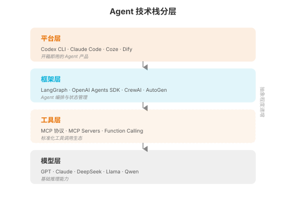
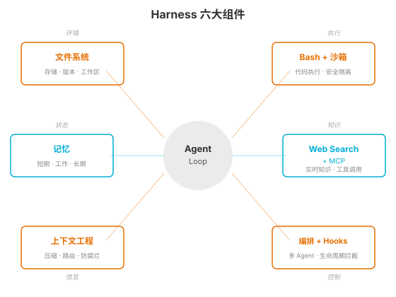

### 第 3 章 Agent 开发环境与技术栈全景

> 📖 本章你将学会：Agent 技术栈的四层分层模型、Harness 六大组件的全景图、三大主流框架的定位与选型、低代码平台的适用边界、开发环境搭建

---

#### 开篇：GPS 地图与工具箱

前两章我们讨论了"Agent 是什么"和"LLM 的大脑有什么局限"。但在动手写代码之前，你需要一张地图——知道你站在哪里，要去哪里，有哪些路可以走。

想象你要去一个陌生的城市工作。你不会一落地就冲进某个工厂开始拧螺丝，你会先打开地图，看看城市的分区：商业区在哪、工业区在哪、住宅区在哪。然后你会去五金店买一个工具箱——锤子、扳手、螺丝刀——根据你要做的工作选择合适的工具。

Agent 开发也一样。在写第一行代码之前，你需要知道整个技术版图长什么样：哪些是基础层（模型），哪些是工具层（MCP），哪些是框架层（LangGraph），哪些是平台层（Codex CLI）。然后你需要选择你的"工具箱"——用哪个框架、哪个平台、哪个开发环境。

这一章就是你的 GPS 地图和工具箱清单。

---

#### 3.1 技术栈分层

##### 3.1.1 模型层 → 框架层 → 工具层 → 平台层

Agent 技术栈可以从下到上分为四层。每一层为上层提供基础，每一层解决不同维度的问题。



**模型层**是最底层——大语言模型本身。GPT、Claude、DeepSeek、Llama、Qwen……这些模型提供基础推理能力。模型层是"大脑"，你在第 2 章已经了解了它的能力和局限。模型层的特点是：你几乎不能修改它（除非你训练自己的模型），你只能选择它、调用它。

**工具层**是标准化工具调用生态。核心是 MCP 协议（Model Context Protocol）——2024 年 11 月 Anthropic 发布的工具调用标准协议。工具层解决的问题是：Agent 怎么连接外部世界？怎么调用数据库、API、文件系统？MCP 之于 Agent 工具调用，就像 HTTP 之于 Web 通信——一个让所有人都能接入的标准协议。

**框架层**是 Agent 编排与管理的基础设施。LangGraph、OpenAI Agents SDK、CrewAI、AutoGen……这些框架帮你处理 Agent 开发中最繁琐的部分：状态管理、循环控制、工具调用分发、错误恢复、人机协作、可观测性。你可以不用框架、从零手写 Agent 循环（第 1 章的 ReAct 伪代码就是例子），但一旦 Agent 逻辑复杂到需要循环、分支、并行、持久化，框架的价值就显现出来了。

**平台层**是开箱即用的 Agent 产品。Codex CLI（终端编程 Agent）、Claude Code、Coze（字节跳动的低代码平台）、Dify（开源 LLMOps 平台）……平台层把模型+工具+框架打包成可以直接使用的产品。平台层的特点是：你不需要写代码就能用，但定制能力有限。

> 💡 比喻：模型层是"发动机"，工具层是"传动轴和轮胎"，框架层是"底盘和悬挂"，平台层是"整车"。你可以买整车（平台），也可以自己组装（框架+工具+模型），还可以从零造发动机（训练模型）——但绝大多数人选择买整车或自己组装。

这四层不是"哪个最好"的关系，而是"你在哪一层工作"的问题。如果你是产品经理，可能只用平台层（Coze 搭个 Bot）。如果你是应用工程师，会用框架层+工具层（LangGraph + MCP）。如果你是研究者，可能直接在模型层做实验。

##### 3.1.2 Harness 六大组件

在第 1 章我们介绍了 `Agent = Model + Harness` 公式。Harness 是模型之外的一切——它让模型的"智能"变得"有用"和"可靠"。Harness 包含六大组件，这六大组件是全书第三篇的主题，这里先给你一个全景图。



**组件 1：文件系统**。Agent 需要一个工作空间——创建文件、读取文件、修改文件、管理版本。文件系统是 Agent 的"办公桌"。没有文件系统，Agent 只能在内存中工作，一关机什么都没了。Codex CLI 的核心设计之一就是文件系统工具——Agent 可以读写代码文件、创建项目结构、管理 .git 版本。

**组件 2：Bash + 沙箱**。Agent 需要能执行代码——运行脚本、安装依赖、跑测试。但执行代码有风险：Agent 可能运行 `rm -rf /`，可能安装恶意包，可能发起未授权的网络请求。Bash + 沙箱让 Agent "能动手但不能闯祸"。Codex CLI 用 macOS Seatbelt（sandbox-exec）和 Linux Landlock 实现沙箱隔离，Docker 容器提供更强的隔离，E2B 提供云端远程沙箱。

**组件 3：记忆**。第 2 章说过，LLM 无跨会话记忆。记忆系统补这个硬伤，分三层：短期记忆（当前对话历史）、工作记忆（会话状态持久化，如 SQLite）、长期记忆（向量存储/知识图谱，可跨会话检索）。OpenClaw 用"72 小时上下文缓存 + SQLite 永久存储"实现双模记忆。

**组件 4：Web Search + MCP**。第 2 章说过，LLM 无实时知识。Web Search 让 Agent 能搜索互联网，MCP 让 Agent 能连接企业内部系统（数据库、API、知识库）。MCP 是工具调用的标准化协议——一个 MCP Server 可以暴露工具（Tools）、资源（Resources）、提示词模板（Prompts），任何支持 MCP 的 Agent 都能调用。

**组件 5：上下文工程**。上下文窗口是有限的（即使 128K Token 也会用完），长会话中性能会退化（Context Rot），信息会被"遗忘"（"迷失在中间"效应）。上下文工程系统性管理模型每次推理时看到的信息——压缩对话历史、路由相关上下文、防止信息腐烂。

**组件 6：编排 + Hooks**。当系统从单 Agent 变成多 Agent，就需要编排——谁做什么、怎么通信、怎么汇总结果。Hooks 是生命周期拦截——在 Agent 执行命令前检查（安全）、执行后记录（审计）、完成前验证（质量）。LangChain 的中间件优先架构就是编排 + Hooks 的典型实践。

> 💡 这六大组件是全书第三篇的展开主题。第 9 章（沙箱）、第 10 章（MCP）、第 11 章（Skills）、第 12 章（Rule + Hooks）、第 13 章（Sub-Agent）会逐一深入。这一章你只需要知道"有这六样东西"——它们构成了 Harness 的完整版图。

---

#### 3.2 框架三国杀

框架层是 Agent 开发者最常打交道的层。2026 年中期，三大主流框架各有鲜明定位：LangGraph 重控制、OpenAI Agents SDK 重简洁、CrewAI 重角色。

##### 3.2.1 LangGraph：图驱动的 Agent 编排

**LangGraph** 是 LangChain 团队推出的图驱动编排框架，也是 2026 年企业采用率最高的 Agent 编排框架。它的核心抽象是 **StateGraph**——把 Agent 工作流建模为有向图：节点是函数，边是状态转移，条件边实现分支和循环。

LangGraph 2025 年 10 月发布 1.0 GA（正式版），到 2026 年中期已迭代到 1.2 版本。关键特性包括：

- **状态持久化**：通过 Checkpointer 机制，每个节点的状态变更自动持久化，Agent 崩溃后可从断点恢复
- **人机协作**：`interrupt()` 函数让 Agent 在关键步骤暂停，等待人工审批后继续
- **条件路由**：条件边根据当前状态动态决定下一个节点，实现分支和循环
- **多 Agent 编排**：Supervisor 模式、Network 模式、Hierarchical 模式（第五篇展开）
- **LangSmith 集成**：深度集成的可观测性——Trace、Replay、时间旅行调试

LangGraph 的优势是**控制力极强**——你可以精确控制每一步的执行路径、状态流转、错误恢复。代价是**学习曲线陡峭**——状态图、Reducer、Command 这些概念需要时间适应，代码量也比其他框架大。

> 💡 比喻：LangGraph 就像手动挡赛车——换挡、离合、油门全由你控制，赛道上表现最强，但你需要技术。如果你的 Agent 工作流有复杂分支、循环、并行、人机审批，LangGraph 是首选。如果只是简单的线性流程，用它就是大炮打蚊子。

**适合场景**：复杂条件分支和循环的企业级工作流、需要持久化和断点续传的长时任务、需要完整可观测性的生产系统。

##### 3.2.2 OpenAI Agents SDK：官方 Agent 框架

**OpenAI Agents SDK** 是 OpenAI 2025 年 3 月发布的官方 Agent 框架，是实验性项目 Swarm 的生产级继任者。它的设计哲学是**极简**——五个核心原语覆盖 Agent 开发全生命周期。

五大原语：

- **Agent**：LLM + 指令 + 工具 + 交接规则
- **Handoff**：Agent 间的任务转交（一个 Agent 把对话控制权交给另一个）
- **Guardrail**：输入/输出验证（拦截不安全或越界的内容）
- **Session**：跨轮次的对话状态持久化
- **Tracing**：内置的执行追踪与可视化

2026 年 4 月，OpenAI 发布了重大更新，引入了**原生沙箱执行**（SandboxAgent）和**长时任务 Harness**——Agent 可以在隔离的容器环境中执行代码、读写文件、运行命令，状态可跨小时甚至跨天持久化。这标志着 Agents SDK 从"轻量编排工具"进化为"完整的 Agent 平台"。

Agents SDK 的优势是**简洁和 OpenAI 生态深度集成**——几行代码就能跑起来一个 Agent，内置的 Traces 仪表盘开箱即用，原生支持 OpenAI 的 Web Search、File Search、Code Interpreter 等托管工具。2026 年版本还通过 LiteLLM 适配器支持 100+ 非 OpenAI 模型。代价是**对非 OpenAI 生态的深度定制能力有限**——虽然支持其他模型，但最优体验仍绑定 OpenAI 模型。

> 💡 比喻：Agents SDK 就像自动挡轿车——挂 D 挡踩油门就能走，新手友好，但你想自己换挡就不太方便。如果你用 OpenAI 模型、需要快速原型验证，Agents SDK 是最低成本的选择。

**适合场景**：使用 OpenAI 模型的快速原型验证、需要 Handoff 模式的客服分流场景、偏好极简 API 的团队。

##### 3.2.3 CrewAI：角色驱动的多 Agent

**CrewAI** 是 2024 年 1 月由 João Moura 创建的开源 Python 框架，专门为**角色驱动的多 Agent 协作**设计。到 2026 年中期，CrewAI 在 GitHub 获得了 54,000+ Star，声称 Fortune 500 中 63% 的企业有所采用（厂商自报数据）。

CrewAI 的核心抽象是 **Crew**——一个由多个角色化 Agent 组成的团队。每个 Agent 有三个定义属性：

- **Role**（角色）：你是谁？（如"研究员"、"作家"、"审查员"）
- **Goal**（目标）：你要做什么？（如"收集相关信息"、"撰写文章初稿"、"检查质量"）
- **Backstory**（背景故事）：你的专业背景是什么？（影响 Agent 的行为风格）

Crew 支持两种执行模式：**Sequential**（顺序执行，Agent 依次完成任务）和 **Hierarchical**（层级执行，一个 Manager Agent 协调分配任务）。2025 年新增的 **Flows** API 提供了事件驱动的工作流编排——用 `@start`、`@listen`、`@router` 装饰器定义管道。

CrewAI 的优势是**角色抽象直观**——定义"研究员→作家→审查员"的流水线只需 30-60 行代码，非常符合人类对"团队协作"的直觉。2026 年版本还增加了 MCP 支持（stdio/SSE/Streamable HTTPS）和 Skills Repository（渐进式披露的技能库）。代价是**动态分支能力弱**——当工作流需要复杂条件路由时，CrewAI 会变得别扭，这种场景 LangGraph 更合适。此外，多 Agent 间的上下文传递容易导致 Token 膨胀。

> 💡 比喻：CrewAI 就像剧组——导演、演员、摄影师各有角色，按剧本顺序拍。如果你的任务是"研究→写作→审查"这种流水线，CrewAI 是最自然的选择。如果你需要"根据情况动态切换路径"，LangGraph 更适合。

**适合场景**：角色分工明确的内容生产流水线（研究→写作→审查）、快速搭建多 Agent 原型、Python 技术栈团队。

##### 三大框架对比

| 维度 | LangGraph | OpenAI Agents SDK | CrewAI |
|------|-----------|-------------------|--------|
| 核心抽象 | StateGraph（状态图） | Agent + Handoff | Crew（角色团队） |
| 编排模型 | 图驱动（节点+边） | 交接驱动 | 角色驱动 |
| 控制力 | ★★★★★ | ★★★☆☆ | ★★★☆☆ |
| 学习曲线 | 陡峭 | 平缓 | 平缓 |
| 多 Agent | 原生支持 | Handoff 模式 | 原生 Crew |
| 状态持久化 | Checkpointer | Session | 有限 |
| 可观测性 | LangSmith 深度集成 | 内置 Traces | 第三方（Langfuse） |
| MCP 支持 | ✅ | ✅ | ✅ |
| 模型无关 | ✅ | ✅（LiteLLM） | ✅ |
| 适合场景 | 复杂工作流 | 快速原型 | 角色流水线 |

---

#### 3.3 低代码平台定位

不是所有 Agent 都需要写代码。低代码平台让非技术人员也能搭建 Agent，适合快速验证和简单场景。

##### 3.3.1 Coze / Dify 适合什么场景

**Coze（扣子）** 是字节跳动 2024 年推出的低代码 Agent 平台。它的核心定位是"全民级"——零代码、零部署，十分钟即可搭建一个可用的 Bot 并发布到飞书、抖音、微信、网页等多端。Coze 内置数千款插件（搜索、绘图、数据解析、语音生成），支持豆包/GPT/通义千问等多模型切换，深度整合字节系生态。

Coze 的优势是**上手门槛极低和多端发布能力**——非技术人员也能快速搭建，一键发布到多个渠道是独一档的能力。代价是**定制能力有限**——不支持私有化部署，工作流复杂度受限，导出格式专有（供应商锁定风险）。截至 2026 年，Coze 尚不支持 MCP 协议。

**适合**：个人创作者快速搭建 AI 助手、中小企业轻量客服 Bot、内容生成机器人、零基础创业者验证想法。

**Dify** 是 2026 年热度飙升的开源 LLMOps 平台，定位"低代码可视化 + 企业级定制"。GitHub Star 75,000+（2026 年数据），支持 SaaS 云端和私有化部署双模式。Dify 整合了模型管理、RAG 知识库、流程编排、Prompt 调试、灰度发布、日志监控全链路能力。

Dify 的优势是**平衡了易用性和专业性**——可视化工作流编排直观高效，同时开放 API 和源码级定制。内置完善的 LLMOps 工具链（版本管理、用量监控、权限分配），支持任意 LLM 提供商，开源社区活跃。代价是**需要一定的运维能力**——私有化部署需要 Docker 和基础设施工作。

**适合**：中小技术团队搭建企业 AI 应用、需要私有化部署的数据敏感场景、垂直行业知识库问答、客户智能客服系统。

> ⚠️ 低代码平台和代码框架不是"二选一"的关系。成熟团队经常组合使用——用 Coze 快速做原型验证市场反应，用 Dify 搭建生产级应用，用 LangGraph 处理平台无法覆盖的复杂逻辑。关键是根据场景选择合适的工具，不要为了"看起来先进"就什么都用代码写。

---

#### 3.4 开发环境搭建

##### 3.4.1 Python + uv + Jupyter + LangGraph + LangSmith

本书的实战代码基于 Python 技术栈。以下是推荐的开发环境配置：

**Python 3.12+**。LangGraph 1.0 要求 Python 3.10+，建议用 3.12 获得最佳性能和兼容性。

**uv** 替代 pip 做包管理。uv 是 Astral（ruff 的团队）开发的 Rust 写的 Python 包管理器，比 pip 快 10-100 倍，支持 lockfile 和虚拟环境管理。2026 年已成为 Python 社区的主流选择。

```bash
# 安装 uv
curl -LsSf https://astral.sh/uv/install.sh | sh

# 创建项目
uv init my-agent
cd my-agent
uv venv

# 安装核心依赖
uv add langgraph langchain-openai langsmith
```

**Jupyter** 用于交互式开发和调试。Agent 开发中，你需要频繁测试 Prompt、观察工具调用结果、调试状态流转——Jupyter 的交互式环境非常适合这些工作。

**LangSmith** 用于可观测性。LangSmith 是 LangChain 团队的 Agent 追踪和评估平台，可以可视化 Agent 的每一步决策、工具调用、Token 消耗。LangGraph 与 LangSmith 深度集成，是调试 Agent 问题的核心工具。

```bash
# 环境变量配置
export LANGSMITH_TRACING=true
export LANGSMITH_API_KEY=your_key
export OPENAI_API_KEY=your_key
```

##### 3.4.2 框架选型决策树

面对三大框架，怎么选？用一个简单的决策树：

```
你的 Agent 需要……
│
├─ 复杂条件分支和循环？
│  ├─ 是 → LangGraph
│  └─ 否 → 继续
│
├─ 多个角色化 Agent 协作？
│  ├─ 是 → CrewAI
│  └─ 否 → 继续
│
├─ 使用 OpenAI 模型 + 快速原型？
│  ├─ 是 → OpenAI Agents SDK
│  └─ 否 → 继续
│
└─ 都不满足？
   └─ 默认选 LangGraph（最通用、生态最成熟）
```

> 💡 经验法则：如果你不知道选哪个，选 LangGraph。它的通用性最强、生态最成熟、文档最完善。当你明确知道自己的场景适合 CrewAI（角色流水线）或 Agents SDK（OpenAI 生态快速验证）时，再换。框架不是终身选择——Agent 逻辑稳定后迁移成本可控。

---

#### 3.5 本章小结

本章建立了一个完整的"地图"认知：

**认知 1：Agent 技术栈分四层——模型层、工具层、框架层、平台层。** 模型层是大脑，工具层（MCP）是手脚，框架层（LangGraph 等）是骨骼，平台层（Codex CLI 等）是整车。你在哪一层工作，取决于你的角色和需求。

**认知 2：Harness 有六大组件——文件系统、Bash+沙箱、记忆、Web Search+MCP、上下文工程、编排+Hooks。** 这六大组件分别补 LLM 的四个硬伤，并保障系统的可靠性。全书第三篇会逐一深入展开。

**认知 3：三大框架各有定位——LangGraph 重控制、Agents SDK 重简洁、CrewAI 重角色。** 没有最好的框架，只有最适合场景的框架。不确定时选 LangGraph。

第一篇到这里结束。你已经建立了 Agent 的心智模型——知道 Agent 是什么（第 1 章）、LLM 大脑有什么局限（第 2 章）、技术栈长什么样（第 3 章）。第二篇我们将深入四大工程范式——Prompt → Context → Loop → Harness——这是从"说什么"到"怎么做事"的工程递进。
