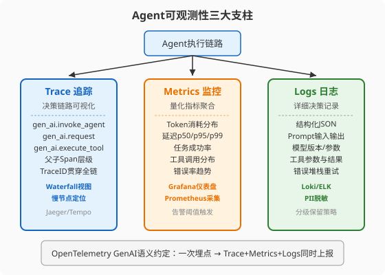
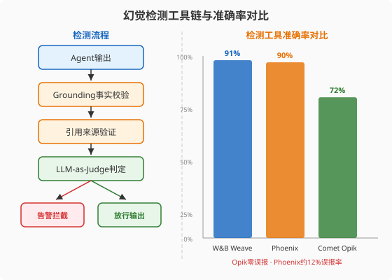
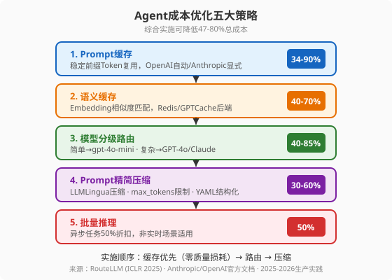

### 第25章 可观测性与成本优化

> 📖 本章你将学会：理解Agent可观测性三大支柱（Trace/Metrics/Logs）如何让"黑盒"决策透明化，掌握幻觉检测工具链的选型与告警机制，运用五大成本优化策略将Agent推理成本降低47-80%

#### 开篇：一个"成功"的Agent为什么烧了14万

你的客服Agent上线一个月了。仪表盘上一切正常——API响应码全是200，平均延迟1.2秒，用户满意度85%。CFO递给你一张账单：**月度LLM API费用 $14,000**。

你打开日志，发现一个令人震惊的事实：同一个用户在三天内问了47次"怎么退款"——每次Agent都从头调用`search_policy`工具检索退款流程，重新让GPT-4o生成一段几乎一样的回答。你的系统Prompt有8000个Token（公司政策+工具定义+few-shot示例），每次请求都把这8000个Token全量发送并全量计费。47次重复请求 × 8000个Token的System Prompt = 37.6万个Token在为同一个答案反复"付费"。

更糟的是，你发现Agent在2%的对话中"编造"了退款政策——把"7天无理由退货"说成了"30天无理由退货"。没有任何告警，因为这2%的响应状态码也是200，延迟也正常。这就是第24章讲的"绿色仪表盘问题"在生产中的真实写照。

这个场景揭示了两个被严重低估的工程问题：**可观测性**（你看不见Agent在做什么）和**成本**（你在为重复劳动全价付费）。Gartner在2025年6月的预测更加刺耳：**超过40%的Agentic AI项目将在2027年前被取消**（[Gartner, 2025-06-25](https://www.gartner.com/en/newsroom/press-releases/2025-06-25-gartner-predicts-over-40-percent-of-agentic-ai-projects-will-be-canceled-by-end-of-2027)），原因不是技术不行，而是团队"看不见Agent在做什么"和"烧不起这个钱"。

本章解决这两个问题。你将学会用OpenTelemetry让Agent决策链路完全透明，用幻觉检测工具拦截"一本正经的胡说八道"，用五大成本优化策略把月账单从$14,000砍到$3,000。

---

#### 25.1 Agent可观测性三大支柱



传统微服务的可观测性建立在经典的"三大支柱"上：Trace（追踪）、Metrics（指标）、Logs（日志）。Agent继承了这套框架，但每一层都被LLM的特殊性重塑了——你需要追踪的不是HTTP调用链，而是**决策链路**；你监控的不是QPS和内存，而是**Token消耗和幻觉率**；你记录的不是异常堆栈，而是**Prompt输入输出和模型版本**。

##### 25.1.1 Trace追踪：Agent决策链路的可视化

Trace是Agent可观测性的第一支柱，也是最关键的一环。传统APM工具（如Jaeger、Prometheus）能追踪HTTP请求，但对Agent场景存在盲区——它们看不到LLM调用的内部逻辑、工具调用的参数和结果、多轮对话的状态演变。

**OpenTelemetry GenAI语义约定**

2025-2026年，OpenTelemetry GenAI语义约定（[GenAI Semantic Conventions](https://opentelemetry.io/docs/specs/semconv/attributes-registry/gen-ai/)）趋于成熟，成为Agent追踪的事实标准。它定义了三类核心Span：

| Span类型 | 属性 | 含义 |
|----------|------|------|
| `gen_ai.invoke_agent` | `gen_ai.agent.name`, `gen_ai.operation.name` | Agent完整生命周期，从任务接收到最终输出 |
| `gen_ai.request` | `gen_ai.request.model`, `gen_ai.usage.input_tokens`, `gen_ai.usage.output_tokens` | 单次LLM调用，记录模型、Token消耗、响应 |
| `gen_ai.execute_tool` | `gen_ai.tool.name`, `gen_ai.tool.call.arguments`, `gen_ai.tool.call.result` | 工具调用，记录工具名、参数、返回结果 |

这三类Span组成**父子层级**，形成一棵完整的"决策树"：

```
Trace: gen_ai.invoke_agent "Research Agent"
├── gen_ai.request "chat claude-sonnet-4-6"     ← 初始推理
├── gen_ai.execute_tool "search_docs"            ← 第一次工具调用
├── gen_ai.request "chat claude-sonnet-4-6"     ← 处理检索结果
├── gen_ai.execute_tool "summarize"              ← 第二次工具调用
├── gen_ai.request "chat claude-sonnet-4-6"     ← 决定交接
└── gen_ai.execute_tool "transfer_to_writer"     ← 交接给Writer Agent
    └── gen_ai.invoke_agent "Writer Agent"       ← Sub-agent的独立Trace
        ├── gen_ai.request "chat gpt-4o-mini"
        └── gen_ai.execute_tool "format_output"
```

> 💡 提示：Trace的真正价值不在于"记录了什么"，而在于**Waterfall视图**。在Jaeger或Tempo中打开一个Trace，你能看到每个Span的时间线——2秒花在规划上、800ms花在第一次工具调用、45秒在等一个被限流的API。没有Trace，你只知道"这个任务花了48秒"；有了Trace，你精确知道**48秒花在了哪里**。

**一次埋点，多处上报**

OpenTelemetry的核心优势是"厂商中立"——你用OTel SDK埋点一次，同一份数据可以同时导出到Langfuse、Arize Phoenix、Datadog、Grafana，无需为每个平台写专属SDK。2025-2026年，原本使用专有格式的平台（LangSmith、Braintrust、Helicone）全部添加了OTel摄入支持（[Sentry, 2026-04-07](https://blog.sentry.io/ai-agent-observability-developers-guide-to-agent-monitoring/)）。

这意味着你的插桩代码是**可移植的**——今天用Langfuse自托管，明天切到Arize Phoenix云版，代码一行不用改。这与第24章讲的可观测性工具选型逻辑一脉相承：OTel是"通用语"，各平台是"方言"。

##### 25.1.2 Metrics监控：Token消耗与延迟的量化

Metrics是Agent可观测性的第二支柱，负责把Trace中的细节数据**聚合**成可监控、可告警的量化指标。传统微服务监控QPS、内存、CPU；Agent监控的核心指标完全不同：

| 指标 | 类型 | 含义 | 典型告警阈值 |
|------|------|------|-------------|
| `gen_ai.token.usage` | Histogram | Token消耗量分布 | 日预算80%触发预警 |
| `gen_ai.operation.duration` | Histogram | 操作耗时分布 | p95 > 5s告警 |
| `gen_ai.time_to_first_token` | Histogram | 首Token延迟（TTFT） | p95 > 2s告警 |
| `agent.task.success_rate` | Counter | 任务成功率 | < 85%告警 |
| `agent.tool.error_rate` | Counter | 工具调用错误率 | > 10%告警 |
| `agent.cost_per_request` | Gauge | 每次请求的美元成本 | > $0.50告警 |

> ⚠️ 注意：**Decision Velocity（决策速度）**是一个容易被忽略但极其重要的指标——Agent每分钟做出的有效决策数。SIVARO的生产实践报告指出，Decision Velocity骤降是最可靠的"Agent出问题了"信号，比错误率更早暴露问题（[SIVARO, 2026-07-28](https://sivaro.in/articles/ai-agent-observability-production-the-guide-nobody-wrote)）。当Agent陷入"循环地狱"（反复调用同一个工具、参数微调），错误率不会立刻上升，但Decision Velocity会断崖式下跌。

**MCP工具调用监控**

如果你的Agent接入了MCP服务器（第10章详解），可观测性必须跨越客户端-服务器边界。每次MCP工具调用需要记录：

- **Server身份**：哪个MCP服务器（名称、版本、来源URL）响应了这次调用——供应链安全的关键
- **工具参数全集**：不仅记工具名，还要记完整参数——Prompt Injection载荷经常藏在Schema检查能通过的参数里
- **输出大小与去向**：工具响应比正常大10倍，或包含指向陌生域名的URL，是经典的数据外泄特征
- **跨Server序列**："从Jira MCP读取 → 立即写入GitHub MCP"这种跨服务器序列是影子攻击的指纹

2026年Q1-Q2，Langfuse、Arize、LangSmith、Braintrust都添加了一等公民级别的MCP Span类型。如果你自建可观测性，用OTel的`gen_ai.tool.*`属性加自定义`mcp.server.*`属性来捕获。

##### 25.1.3 Logs日志：详细决策记录

Logs是第三支柱，负责记录Trace和Metrics无法覆盖的**完整细节**——完整的Prompt输入、LLM原始输出、工具调用的完整参数和返回结果、模型版本号、Prompt模板版本号。

**结构化JSON日志**

Agent日志必须是结构化的，不能用纯文本。一个标准的Agent日志条目：

```json
{
  "timestamp": "2026-08-16T14:23:07.421Z",
  "trace_id": "abc123def456",
  "span_id": "span_0042",
  "level": "info",
  "event": "llm_call",
  "model": "claude-sonnet-4-6",
  "prompt_version": "v2.3.1",
  "input_tokens": 2847,
  "output_tokens": 512,
  "duration_ms": 1423,
  "task_type": "competitor_research",
  "status": "success",
  "input_hash": "sha256:a1b2c3...",
  "output_summary": "Analyzed 3 competitors in SaaS space"
}
```

> 💡 提示：**永远不要在日志中存储完整的Prompt原文**。用SHA-256哈希替代原文，需要时通过哈希反查。Prompt中可能包含用户PII（个人身份信息），明文存储会违反GDPR和SOC 2合规要求。Bot365的案例研究显示，一家法律公司在2025年底的Agent试点中，因为没有对外部API调用做Payload哈希和允许列表检查，导致客户文档被上传到非白名单API——数据泄露事件（[Bot365, 2026-02-15](https://bot365.co.uk/observability-for-autonomous-agents-what-to-monitor-and-why)）。

**分级保留策略**

Agent日志量大——一个每天1000个任务、每个任务5步的Agent，每天产生5000个Trace Span，按每个2-5KB计算，每月300-750MB。需要分级保留：

- **热数据**（30天）：完整Trace和日志，支持即时调试
- **温数据**（90天）：聚合Metrics，删除原始日志
- **冷数据**（1年）：仅保留统计摘要

---

#### 25.2 幻觉检测与告警



Agent的幻觉（Hallucination）——"一本正经地编造事实"——是生产环境中最危险的风险之一。与第24章讲的"轨迹评估"不同，幻觉检测是**运行时**的实时拦截，不是离线评估。

##### 25.2.1 幻觉的本质与检测难度

LLM的幻觉不是Bug，而是**概率生成机制的必然副产物**。模型从训练数据中学习统计规律，当遇到不确定的问题时，它会生成"统计上最可能正确"的答案——而不是"事实正确"的答案。

幻觉率的下降趋势令人鼓舞但也令人警惕。在简单摘要任务上（Vectara HHEM基准），最佳模型的幻觉率从2021年的约21.8%降到2025年的0.7%（Gemini-2.0-Flash），四年下降96%（[Vectara HHEM Leaderboard](https://hheval.vercel.app/)）。但在更真实的场景中——AA-Omniscience知识问答基准上，40个模型中有36个"更可能给出一个自信的错误答案而不是正确答案"；HalluHard真实对话基准上，即使是最好的模型（Claude Opus 4.5 + Web搜索）仍然有30%的幻觉率（[pr.report, 2026](https://pr.report/ogvv)）。

> ⚠️ 注意：**不要用简单基准的幻觉率来推断你的Agent在生产中的幻觉率**。企业级RAG系统（文档长度更长、检索更复杂）的幻觉率通常是简单基准的3-10倍。良好的RAG+Grounding可以将幻觉率压到2-5%，但没有Grounding的裸LLM会飙升到15-25%（[AgentMelt, 2026-08-05](https://agentmelt.com/blog/ai-agent-observability-monitoring)）。

##### 25.2.2 幻觉检测工具对比

2025-2026年，幻觉检测工具市场增长了318%，投资额达$12.8B（[pr.report](https://pr.report/ogvv)）。AIMultiple在2026年的基准测试对比了三大工具，在100个测试用例上的表现：

| 工具 | 检测准确率 | 核心优势 | 适用场景 |
|------|-----------|----------|----------|
| **W&B Weave** | 91% | Chain-of-thought推理分析，生产流水线集成 | 已用W&B生态的团队 |
| **Arize Phoenix** | 90% | 标签化输出、置信度评分、实时监控 | RAG密集型系统，需要检索调试 |
| **Comet Opik** | 72% | **100%精确率**（零误报），保守策略 | 误报代价高的场景（医疗/法律） |

> 💡 提示：Comet Opik的72%看起来"最差"，但它有一个独特优势——**100%精确率，零误报**。它永远不会把一个正确答案标记为幻觉。在医疗诊断场景中，误报（打断医生的正确诊断流程）的代价比漏报更高；在法律引用检查中，误报（标记一个正确的法律引用要求人工复核）会拖慢整个流程。**选型不是选"准确率最高"，而是选"误报和漏报的代价权衡最适合你场景的"**。

Phoenix的幻觉判定器与人类标注的一致率约为82%，误报率约12%（[Vantaige, 2026-07-01](https://vantaige.io/ai-tool/arize-phoenix)）。这意味着它能捕捉约90%的幻觉，但也会把约12%的正确输出误判为幻觉——在生产中，这12%的误报需要人工复核通道来处理。

##### 25.2.3 多层幻觉防御

单一检测工具不够。生产级Agent需要**多层防御纵深**（defense-in-depth），与第9章沙箱安全、第26章安全护栏的理念一脉相承：

**第一层：Grounding事实校验**

如果Agent的输出来自RAG检索，Grounding检查验证输出中的每个事实声明是否能在检索到的文档中找到支持。这是最有效的幻觉防线——良好的RAG+Grounding可以将幻觉率从15-25%降到2-5%。Arize Phoenix的Groundedness评估器是这一层的标准工具。

**第二层：引用来源验证**

如果Agent引用了来源（论文URL、法律条文、API文档），验证这些引用是否真实存在且内容与Agent声称的一致。GPTZero的Citation Check在这一层达到99%+准确率（[pr.report](https://pr.report/ogvv)）。自动引用检查能捕捉60-80%的事实性幻觉。

**第三层：LLM-as-Judge判定**

用一个独立的LLM（最好是不同家族的模型，避免同源偏见）来评判Agent输出的事实准确性。这一层覆盖前两层遗漏的"语义级幻觉"——Agent没有直接引用错误来源，但把正确的来源内容做了错误的推理。

**第四层：多模型交叉验证**

Suprmind在2026年4月的Multi-Model Divergence Index研究中发现了一个反直觉的现象：**模型的置信度与正确性负相关**。Gemini在51.4%的高置信回答中被另一个模型纠正，Grok在48.9%的高置信回答中被纠正（[Suprmind, 2026-04](https://suprmind.ai/hub/de?page_id=3392)）。多模型交叉验证——让2-3个不同家族的模型回答同一个问题，比较它们的一致性——能捕捉到单一模型无法发现的幻觉。UAF框架（ACM WWW 2025）测得8%的幻觉率改善。

> ⚠️ 注意：多模型交叉验证能捕捉"独立编造"的幻觉，但**无法捕捉"共享训练数据错误"**——如果所有模型都训练了同一篇错误的Wikipedia文章，它们会犯同样的错误。多模型验证是"提高检测概率"，不是"保证零幻觉"。没有任何方法能保证零幻觉——这是概率生成系统的数学本质。

##### 25.2.4 告警机制

检测到幻觉后，必须有告警机制将信号转化为行动：

| 告警级别 | 触发条件 | 响应动作 |
|----------|----------|----------|
| P0-紧急 | 幻觉率 > 10%（5分钟窗口） | 自动降级到只读模式，PagerDuty电话通知 |
| P1-高 | 幻觉率 > 5%（15分钟窗口） | 企业微信/Slack告警，人工介入评估 |
| P2-中 | 单次幻觉涉及安全敏感领域 | 标记为"需人工复核"，不阻断但记录 |
| P3-低 | 幻觉率基线漂移 > 2x | 每日报告汇总，趋势分析 |

**Canary Token检测**

一种巧妙的系统Prompt泄露检测方法——在System Prompt中嵌入一个"金丝雀Token"（如随机字符串`CANARY_ZX9K7M`），正常情况下Agent永远不会在输出中提到它。如果输出中出现了这个Token，说明发生了Prompt Injection泄露。这是一种低成本、高效率的安全哨兵。

---

#### 25.3 成本优化



LLM API成本是Agent生产部署中增长最快的支出项。2025年全球LLM API支出从$3.5B翻倍到$8.4B（[Prodinit, 2026-06-01](https://www.prodinit.com/blog/llm-cost-optimization-production)），其中大部分增长来自生产部署而非实验。一个客服Agent处理每天1万次对话，在旗舰模型上月费可达$7,500；一个接入500+MCP工具的Agent，单次基准测试在用户Prompt处理前就能消耗$377（[Maxim AI, 2026-05-08](https://www.getmaxim.ai/articles/5-best-practices-to-optimize-your-llm-costs-in-production)）。

好消息是：**40-70%的LLM成本是可以通过工程手段消除的"浪费"**。以下五大策略综合实施可降低47-80%总成本，且不牺牲输出质量。

##### 25.3.1 Token经济学：Agent的成本结构

在优化之前，先理解Agent的成本构成。一个典型的RAG-based Agent系统：

| 成本类别 | 占比 | 说明 |
|----------|------|------|
| **输出Token（生成）** | 40-60% | 单价最高，Agent的推理和回复都在这里 |
| **输入Token（上下文）** | 30-50% | System Prompt + 检索文档 + 对话历史 |
| Embedding调用 | 5-10% | 检索阶段的向量化 |
| 基础设施（向量库/缓存） | 5-15% | 运维成本 |

关键洞察：**输入Token是大头，但最容易被优化**。你的System Prompt有8000个Token，每次请求都全量发送——如果这8000个Token中80%是不变的（公司政策、工具定义、few-shot示例），你就是在为"不变的80%"反复全价付费。

> 💡 提示：一个常见的成本陷阱——**MCP工具定义膨胀**。每接入一个MCP服务器，它的完整工具目录（Schema+描述）会被注入到Agent的上下文中。16个服务器、约500个工具的Agent，单次查询仅在工具定义上就消耗超过115万输入Token（[Maxim AI](https://www.getmaxim.ai/articles/5-best-practices-to-optimize-your-llm-costs-in-production)）。在用户Prompt还没被读取之前，你的账单就已经爆了。这就是第10章讲的"懒加载"和Codex的"渐进式文档披露"在成本维度的意义——不是只为了上下文管理，也是为了省钱。

##### 25.3.2 策略一：Prompt缓存（34-90%节省）

**原理**：LLM提供商在服务端缓存你的Prompt前缀的KV张量（注意力机制的Key-Value缓存）。下次请求如果前缀相同，直接读取缓存的KV张量，跳过重新计算——你付的是"缓存读取价"而非"全价输入"。

**各家支持**：

| 提供商 | 缓存机制 | 节省幅度 | 最低缓存长度 |
|--------|----------|----------|-------------|
| **OpenAI** | 自动缓存（≥1024 Token前缀） | 50% off | 1024 tokens |
| **Anthropic** | 显式`cache_control`标记 | **90% off**（读取） | 1024 tokens |
| **Google** | Context Caching | 优于标准价 | 按需配置 |

Anthropic的Prompt缓存经济模型（以Claude Sonnet 4.6为例，2026年7月定价）：

- 标准输入：$3.00/百万Token
- 缓存写入（5分钟TTL）：$3.75/百万Token（标准价的1.25倍）
- 缓存读取：$0.30/百万Token（标准价的0.1倍，**90%折扣**）

> 💡 提示：**盈亏平衡点约为1.4次缓存读取/写入**。如果你的System Prompt在5分钟TTL窗口内被使用超过2次，缓存就开始省钱了。命中率超过30%有明显节省，超过60%有显著节省。一个真实案例：某团队开启了Anthropic Prompt缓存后，月账单在30天内降了$14,000——他们没换模型、没改Prompt、没动应用逻辑，只加了一个JSON字段（[NeuralTrust, 2026-07-16](https://neuraltrust.ai/blog/llm-caching-strategies)）。

**Prompt结构最佳实践**：前80%放静态内容（System Prompt、工具定义、few-shot示例），后20%放动态内容（用户当前问题、实时上下文）。这个结构最大化KV缓存命中率。

##### 25.3.3 策略二：语义缓存（40-70%节省）

**原理**：Prompt缓存解决"完全相同前缀"的复用。语义缓存解决"语义相似但不完全相同"的查询复用——用户问"怎么退款"和"如何退货"，语义相同但文字不同。

**实现**：

```python
from langchain.cache import SemanticCache
from langchain_openai import OpenAIEmbeddings

# 语义缓存：用Embedding相似度匹配
set_llm_cache(SemanticCache(
    embedding=OpenAIEmbeddings(model="text-embedding-3-small"),
    similarity_threshold=0.95  # 阈值越高越严格
))
```

当新查询进来时，系统计算其Embedding向量，与缓存中的查询向量做余弦相似度比较。超过阈值就返回缓存的LLM响应，完全不调用LLM API。

**阈值选择**（来自Introl 2025分析和BirJob实践）：

| 阈值 | 命中率 | 适用场景 |
|------|--------|----------|
| 0.95（极严格） | 15-25% | 法律/医疗（误命中代价极高） |
| 0.90（严格） | 30-45% | 客服支持 |
| 0.85（适中） | 45-65% | FAQ助手 |
| 0.75（宽松） | 60-80% | 内部工具（误命中可容忍） |

> ⚠️ 注意：**不要缓存涉及实时数据、用户特定上下文或时间敏感信息的查询**。缓存的股票价格比不回答更糟糕。BirJob的实践报告特别强调：缓存"无聊的重复问题"，让昂贵模型处理真正新颖的查询——这才是语义缓存的正确用法（[BirJob](https://www.birjob.com/blog/semantic-caching-saved-14k-llm-costs)）。

**生产案例**：ProjectDiscovery将缓存命中率从7%提升到84%，单次架构变更削减了59-70%的LLM总支出（[NeuralTrust](https://neuraltrust.ai/blog/llm-caching-strategies)）。BirJob通过语义缓存（52%命中率）+ 模型路由（68%路由到便宜模型），月费从$23K降到$8.6K。

##### 25.3.4 策略三：模型分级路由（40-85%节省）

**原理**：不是每个查询都需要GPT-4o。78%的客服查询用GPT-3.5-turbo处理效果相同，成本低70%（[FutureAGI 2025数据](https://rruc.org/architecture-decisions-that-reduce-llm-bills-without-sacrificing-quality)）。RouteLLM（[ICLR 2025](https://arxiv.org/abs/2406.18665)，UC Berkeley + Anyscale + Canva）的研究证明，智能路由可以在保持95%+前沿模型质量的同时，削减40-85%推理成本。

**三级路由模型**：

```python
from openai import OpenAI

client = OpenAI()

def route_query(user_query: str) -> str:
    """分类查询并返回推荐的模型名"""
    classification_prompt = f"""Categorize this user query for cost-effective LLM routing.
Categories: 'simple' (formatting, basic Q&A), 'moderate' (multi-step reasoning),
'complex' (creative generation, advanced code, nuanced reasoning).
Query: {user_query}
Return ONLY the category word."""

    # 用最便宜的模型做分类
    response = client.chat.completions.create(
        model="gpt-4o-mini",  # 分类器本身用便宜模型
        messages=[{"role": "user", "content": classification_prompt}],
        max_tokens=10,
    )
    category = response.choices[0].message.content.strip().lower()

    route_map = {
        "simple": "gpt-4o-mini",        # ~10x便宜于GPT-4o
        "moderate": "claude-3-5-sonnet", # 性价比最优
        "complex": "gpt-4o"              # 只在真正需要时用旗舰
    }
    return route_map.get(category, "gpt-4o")
```

**成本对比**（2026年1月定价）：

| 模型 | 输入价/百万Token | 适用任务 |
|------|-----------------|----------|
| GPT-4o | $5.00-$15.00 | 复杂推理、创意生成、代码 |
| Claude 3.5 Sonnet | $3.00 | 多步推理、中等分析 |
| GPT-4o-mini | $0.15 | 分类、格式化、简单Q&A |
| Claude 3 Haiku | $0.25 | 分类、提取、短摘要 |

> 💡 提示：**级联路由（Cascade Routing）**比单次分类更稳健——先用最便宜的模型尝试，如果下游质量检查不通过再升级到贵模型。这种"先便宜后升级"策略比"先分类后路由"多了质量反馈回路。Maxim AI 2025基准显示级联路由削减37-46%成本，Shopify团队报告62%成本下降且零用户投诉。

##### 25.3.5 策略四：Prompt精简与Token压缩（30-60%节省）

**原理**：成熟的Prompt会积累"赘肉"——冗余的角色描述、重复的指令、冗长的示例。一次系统性的Prompt审计通常能削减20-40%的Token，且无质量下降。

**三种压缩方式**：

**结构化压缩**：把散文指令转为YAML/JSON。冗长的"You are a helpful assistant that analyzes code and provides suggestions..."可以压缩为`role: code_analyzer`。

**LLMLingua压缩**：微软的LLMLingua工具用小模型评估Prompt中每个Token的"信息贡献度"，删除低贡献Token。可压缩2-20倍，质量损失可接受。

**检索优化**：在RAG系统中，更好的检索（更紧的chunk、更好的re-ranking、更少的chunk per query）是最高收益的压缩——不传不需要的上下文，比传了再压缩更高效。

**Output控制**：用`max_tokens`限制输出长度，把"请详细分析"改为"用两句话回答"，用"Step 1:..."替代冗长的Chain-of-Thought。Alexander Thamm的分析显示，仅Prompt调整就能节省20-40%，一个周末就能实现。

##### 25.3.6 策略五：批量推理（50%节省）

**原理**：OpenAI和Anthropic都提供Batch API——非实时请求批量提交，享受50%折扣。适合文档摘要、批量分类、夜间分析等不需要毫秒级响应的场景。

**适用判断**：如果任务可以"等几小时而非几毫秒"，就用Batch API。半价，同样的输出。

##### 25.3.7 实施顺序与综合效果

**正确的实施顺序**：缓存优先 → 路由 → 压缩 → 批量。

为什么缓存优先？因为缓存是**零质量损耗**的优化——返回的是完全相同的输出，只是跳过了重复计算。它不需要质量权衡，不需要调参，实施最快（OpenAI自动缓存零代码改动，Anthropic加一个JSON字段）。缓存省下的钱"资助"了后续优化的工程时间。

三家真实案例的综合效果：

| 案例 | 策略组合 | 月费变化 | 降幅 |
|------|----------|----------|------|
| BirJob | 语义缓存52% + 路由68% | $23K → $8.6K | 63% |
| ProjectDiscovery | 语义缓存84%命中率 | 削减59-70% | 65% |
| 某匿名团队 | Prompt缓存90% off | 月降$14K | 60%+ |

> ⚠️ 注意：**成本优化必须在可观测性就绪后进行**。没有Metrics监控Token消耗分布、没有Trace定位成本热点，你不知道"20%的复杂查询消耗了80%的预算"这个Pareto分布。先看见，再优化——这是本章25.1和25.3的逻辑顺序。

##### 25.3.8 实时成本追踪与预算控制

优化措施上线后，需要实时监控防止"成本失控"：

**Per-Trace成本归因**：每个Trace的Span属性中记录Token消耗和模型单价，OTel自动计算每条Trace的美元成本。这让你能按用户、按功能、按查询类型拆分成本。

**预算告警**：

- 日预算80% → 预警（企业微信/Slack通知）
- 日预算100% → 自动降级（路由到更便宜的模型）
- 日预算120% → 熔断（拒绝非关键请求）

**成本效率比**（Cost Efficiency Ratio）= 用户产生价值 / AI成本。目标 > 10x——花$1的AI成本产生$10+的价值。这个比率把CFO关心的单位经济、产品关心的用户满意、工程关心的质量统一在一个指标下（[LinkedIn, 2025-12-08](https://www.linkedin.com/pulse/agentic-shift-selecting-observability-platform-sandeep-seshadri-fmyee)）。

---

#### 25.4 本章小结

**四个核心认知**：

1. **可观测性是前提，不是事后补丁** —— Gartner预测40%的Agentic AI项目将在2027年前被取消，核心原因不是技术不行，而是团队"看不见Agent在做什么"。OpenTelemetry GenAI语义约定让Trace/Metrics/Logs三支柱一次埋点多处上报，是厂商中立的通用语。先看见，再优化。

2. **幻觉检测不是单一工具，而是多层防御纵深** —— W&B Weave 91%和Arize Phoenix 90%的检测准确率看起来很高，但仍有约1/10的幻觉漏网。Grounding校验 → 引用验证 → LLM-as-Judge → 多模型交叉验证，四层叠加才能逼近生产级可靠。选型不是选"准确率最高"，而是选"误报和漏报代价权衡最适合你场景的"。

3. **47-80%的LLM成本是可消除的"浪费"** —— Prompt缓存（34-90%）+ 语义缓存（40-70%）+ 模型路由（40-85%）+ Prompt压缩（30-60%）+ 批量推理（50%），五大策略综合实施可砍掉一半以上的账单。缓存优先（零质量损耗）→ 路由 → 压缩，是经过验证的最优实施顺序。

4. **成本优化必须在可观测性就绪后进行** —— 没有Metrics监控Token消耗分布，你不知道"20%的复杂查询消耗80%的预算"。先看见Pareto分布，再针对性优化——这个逻辑顺序不可颠倒。

**机制速查表**：

| 机制 | 核心工具/标准 | 关键数据 |
|------|-------------|----------|
| OTel GenAI语义约定 | `gen_ai.invoke_agent`/`gen_ai.request`/`gen_ai.execute_tool` | 2025-2026成为事实标准 |
| Trace三Span层级 | Agent → LLM → Tool 父子Span | Waterfall视图定位慢节点 |
| Decision Velocity | 每分钟有效决策数 | 骤降比错误率更早暴露问题 |
| 幻觉检测Top3 | W&B Weave 91% / Phoenix 90% / Opik 72% | Opik零误报100%精确率 |
| Prompt缓存 | OpenAI 50%off / Anthropic 90%off | 盈亏平衡1.4次读取/写入 |
| 语义缓存 | Redis/GPTCache + Embedding相似度 | 命中率20-85%视阈值而定 |
| 模型路由 | RouteLLM (ICLR 2025) | 40-85%节省，质量保持95%+ |
| 成本效率比 | 价值/AI成本 > 10x | CFO/产品/工程统一指标 |

**比喻回顾**：

| 比喻 | 对应概念 | 出处 |
|------|----------|------|
| 黑盒变玻璃盒 | Trace追踪让Agent决策透明 | 25.1开篇 |
| 决策速度计 | Decision Velocity如同汽车速度表 | 25.1.2 Metrics |
| 一本正经的胡说八道 | LLM幻觉的概率生成本质 | 25.2开篇 |
| 四层防空网 | Grounding→引用→Judge→多模型 | 25.2.3 多层防御 |
| 金丝雀哨兵 | Canary Token检测Prompt泄露 | 25.2.4 告警 |
| 为同一份功课反复付费 | 未开缓存的重复Token消耗 | 25.3.2 Prompt缓存 |
| 先便宜后升级 | 级联路由的成本策略 | 25.3.4 模型路由 |
| 先看见再优化 | 可观测性先于成本优化的逻辑顺序 | 25.3.7 实施顺序 |

> 🤔 思考题：如果你的Agent月费$14,000，其中System Prompt 8000 Token占输入成本的60%，你会先实施Prompt缓存（90% off但只影响输入Token）、语义缓存（40-70% off但只影响重复查询）、还是模型路由（40-85% off但需要质量评估）？提示：计算每种策略对你这个特定场景的绝对节省金额，而非百分比。

---

<!-- 章节质量自检
□ 开篇是否用真实场景引入？✅ $14,000账单案例
□ SVG图是否宽高比合理？✅ 三张560×400
□ 关键数据是否注明出处？✅ Gartner/Vectara/RouteLLM/Maxim AI等
□ 代码示例是否可运行？✅ route_query/语义缓存
□ 比喻是否首尾呼应？✅ 黑盒→玻璃盒、金丝雀、四层防空网
□ 是否有思考题衔接？✅ 成本优化策略选择
-->
