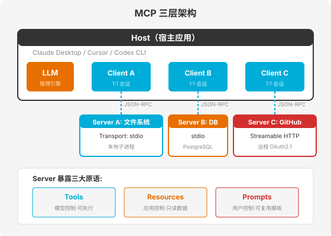
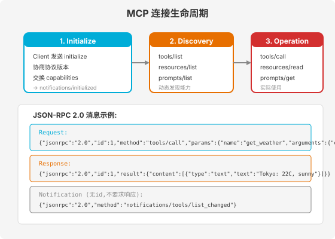

### 第 10 章 MCP 协议深度解析 — 工具生态的标准化

> 📖 本章你将学会：MCP 是什么及为什么需要它、三层架构（Host-Client-Server）与三大原语（Tools/Resources/Prompts）、JSON-RPC 2.0 通信原理与生命周期、用 Python FastMCP 和 TypeScript SDK 各从零开发一个 MCP Server、MCP 与 Function Calling 的关系、MCP 生态实践与安全考虑

---

#### 开篇：AI 工具调用的"USB-C 时刻"

在 USB-C 出现之前，每台设备都有自己的充电接口——苹果用 Lightning，安卓用 Micro-USB，笔记本用圆孔适配器，相机用专有接口。出门带一堆充电线，互相不兼容。USB-C 一统天下后，一根线充所有设备。

AI 工具调用在 MCP 出现之前，也是这种局面：

- OpenAI 有 Function Calling，格式是 `{"name": "...", "arguments": {...}}`
- Anthropic 有 Tool Use，格式是 `{"type": "tool_use", "name": "..."}`
- Google 有 Function Declarations，格式又不一样
- 每个 IDE（Cursor、VS Code、JetBrains）有自己的工具定义格式
- 每个 Agent 框架（LangChain、CrewAI、AutoGen）有自己的工具抽象

结果是 N 个 AI 应用 × M 个工具 = N×M 个定制适配器。每增加一个工具，要为每个 AI 应用写一套适配代码；每增加一个 AI 应用，要为每个工具写一套适配代码。这就是 **"N×M 爆炸"问题**。

2024 年 11 月，Anthropic 发布了 **Model Context Protocol（MCP）**——一个开放标准，用一套协议统一了 AI 应用与外部工具的连接方式。就像 USB-C 统一了充电接口一样，MCP 让任何 AI 应用（Host）都能通过同一套协议连接任何工具（Server）。

> 💡 比喻：MCP 之于 AI 工具调用，就像 HTTP 之于 Web 通信、LSP 之于编辑器语言服务、USB-C 之于设备充电——它不关心你是什么模型、什么工具，只定义"怎么连、怎么发现、怎么调用"。

---

#### 10.1 MCP 是什么

##### 10.1.1 AI 工具调用的"USB-C 标准"

MCP（Model Context Protocol）是一个基于 **JSON-RPC 2.0** 的开放标准协议，定义了 AI 应用如何与外部工具、数据源和服务进行标准化通信。

核心设计目标：

1. **协议而非框架**：MCP 是一个线协议（wire protocol），不是某个框架的 API。任何语言、任何平台都可以实现
2. **动态发现**：工具不是硬编码在 AI 应用中的，而是在运行时通过 `tools/list` 动态发现
3. **双向通信**：不仅 AI 应用可以调用工具（Client→Server），Server 也可以请求 AI 应用做推理（Server→Client，通过 Sampling）
4. **传输无关**：同一套 JSON-RPC 消息可以走 stdio（本地）或 Streamable HTTP（远程）

##### 10.1.2 为什么需要 MCP：Function Calling 的碎片化困境

在 MCP 之前，让 AI 调用外部工具主要依赖各厂商的 Function Calling：

```
# OpenAI Function Calling 格式
tools = [{"type": "function", "function": {"name": "get_weather", "parameters": {...}}}]
response = openai.chat.completions.create(model="gpt-4", tools=tools, messages=[...])

# Anthropic Tool Use 格式
tools = [{"name": "get_weather", "input_schema": {...}}]
response = anthropic.messages.create(model="claude-3", tools=tools, messages=[...])
```

问题在于：每个厂商的格式不同，工具定义不可移植。如果你写了一个天气查询工具给 OpenAI 用，想迁移到 Claude，得重写工具定义格式。

MCP 解决了这个问题：你写一个 MCP Server 暴露天气查询工具，任何支持 MCP 的 AI 应用（Claude Desktop、Cursor、VS Code Copilot、Codex CLI）都能直接使用，无需适配代码。这就是从 N×M 降到 N+M 的本质——N 个 AI 应用 + M 个 MCP Server，各自独立开发，通过标准协议连接。

##### 10.1.3 MCP 的设计哲学：协议而非框架

MCP 的设计哲学可以总结为三条原则：

**原则一：关注点分离**。协议层（JSON-RPC 消息格式）与传输层（stdio/HTTP）分离。同一套协议消息可以在不同传输上运行，不因传输方式改变而重写。

**原则二：能力协商**。连接建立时，双方协商各自支持的能力（capabilities）。Client 声明支持 sampling 和 elicitation，Server 声明支持 tools、resources 和 prompts。只有双方都支持的能力才会被使用，保证向后兼容。

**原则三：最小信任**。MCP 标准化了"怎么连"，但不标准化"信任谁"。Server 可以是恶意的（返回包含 Prompt 注入的内容），因此 Host 必须对工具调用保持人工审批权。MCP 让"连接"变容易，但把"信任决策"留给 Host 和用户。

---

#### 10.2 MCP 架构

MCP 采用 **Host-Client-Server** 三层架构，每个角色职责清晰。



##### 10.2.1 Host：Agent 应用本体

**Host** 是运行 LLM 的 AI 应用——Claude Desktop、Cursor、VS Code Copilot、Codex CLI 等。Host 的职责：

- 运行 LLM 推理，管理对话上下文
- 创建和管理多个 Client 实例（每个 Client 对应一个 Server 连接）
- 执行安全策略和用户授权（工具调用前的审批）
- 聚合来自多个 Server 的上下文，注入到 LLM 的提示中

一个 Host 可以同时连接多个 Server——比如同时连文件系统 Server、数据库 Server 和 GitHub Server，让 AI 能读写文件、查询数据库、管理 PR。

##### 10.2.2 Client：Host 内部的协议客户端

**Client** 是 Host 内部的连接器组件，与每个 Server 维护 **1:1 的有状态会话**。Client 的职责：

- 发送 `initialize` 请求，协商协议版本和能力
- 发送 `tools/list`、`resources/list`、`prompts/list` 发现 Server 能力
- 将 LLM 的工具调用请求转发为 `tools/call` JSON-RPC 消息
- 接收 Server 返回的结果，交回给 Host 处理
- 接收 Server 的通知（如 `notifications/tools/list_changed`），刷新能力列表

Client 不做业务决策——它只是协议层的"邮递员"，负责把请求和响应在 Host 和 Server 之间传递。

##### 10.2.3 Server：暴露工具/资源/提示词的独立进程

**Server** 是一个轻量级程序，通过 MCP 协议向 Client 暴露三类能力：Tools（工具）、Resources（资源）、Prompts（提示词模板）。Server 可以是：

- **本地进程**（stdio 传输）：Host 启动 Server 作为子进程，通过 stdin/stdout 通信。适合文件系统、本地数据库等
- **远程服务**（Streamable HTTP 传输）：Server 是一个 HTTP 端点，支持 OAuth 2.1 认证。适合 GitHub、Slack 等云端服务

Server 通常很小（几百行代码），因为 MCP 协议处理了大部分通信细节，Server 只需要定义"我提供什么能力"。

##### 10.2.4 Transport：通信层

MCP 支持两种传输方式，同一套 JSON-RPC 消息可以在两种传输上运行：

| 传输方式 | 适用场景 | 特点 |
|----------|----------|------|
| stdio | 本地 Server（子进程） | 零网络延迟，OS 级进程隔离，无内置认证 |
| Streamable HTTP | 远程 Server（云端） | HTTP POST 请求 + SSE 流式响应，支持 OAuth 2.1 |

**stdio 传输**：Host 将 Server 作为子进程启动，通过标准输入/输出交换 JSON-RPC 消息。每条消息以换行符分隔。关键规则：**stdout 只能输出 MCP 协议消息**——任何 `console.log` 或 `print` 都会污染消息流，导致 Client 静默断连。调试日志必须输出到 stderr。

**Streamable HTTP 传输**（2025 年 3 月取代旧版 SSE）：Client 发送 HTTP POST 请求，Server 可以通过 Server-Sent Events 流式返回多个响应。支持无状态和有状态两种模式，适合部署在反向代理后的云端环境。

---

#### 10.3 MCP 三大原语

MCP 定义了 Server 可以暴露的三类核心能力，称为**原语（Primitives）**。每个原语有不同的控制方——这决定了"谁决定何时使用它"。

##### 10.3.1 Tools：可执行的函数调用（Model-controlled）

**Tools** 是 AI 模型可以调用的可执行函数。关键特征是 **Model-controlled**——由 LLM 决定何时调用哪个工具。

每个 Tool 包含：
- `name`：工具名称
- `description`：工具描述（LLM 据此决定何时调用）
- `inputSchema`：JSON Schema 格式的输入参数定义

发现与调用流程：
```
Client → Server: tools/list          # 发现所有工具
Server → Client: [{name, description, inputSchema}, ...]

Client → Server: tools/call           # 调用特定工具
  params: {name: "get_weather", arguments: {city: "Tokyo"}}
Server → Client: {content: [{type: "text", text: "Tokyo: 22C"}]}
```

典型 Tool 示例：查询数据库、发送邮件、执行代码、调用外部 API。Tools 可以有副作用（写入数据、发送请求），因此 Host 通常在执行前要求用户确认。

##### 10.3.2 Resources：可读取的数据源（Application-controlled）

**Resources** 是以 URI 标识的只读数据源。关键特征是 **Application-controlled**——由 Host 应用（而非 LLM）决定何时加载哪些资源到上下文中。

每个 Resource 包含：
- `uri`：资源标识符（如 `file:///project/README.md`、`postgres://users/schema`）
- `name`：资源名称
- `mimeType`：MIME 类型（如 `text/markdown`、`application/json`）

Resources 类似 REST API 的 GET 端点——只读、无副作用。Host 可以根据用户操作（如打开了某个文件）自动将对应 Resource 加载到上下文中。

> 💡 比喻：Tools 是"按钮"（按下会执行动作），Resources 是"书架"（拿来读但不修改），Prompts 是"流程模板"（一键启动标准工作流）。谁控制？Tools 由模型控制（AI 自己决定按哪个按钮），Resources 由应用控制（应用决定读哪本书），Prompts 由用户控制（用户选择启动哪个流程）。

##### 10.3.3 Prompts：可复用的提示词模板（User-controlled）

**Prompts** 是 Server 预定义的可复用提示词模板。关键特征是 **User-controlled**——由用户（通过 Host UI）显式选择触发，而非 LLM 自动调用。

每个 Prompt 包含：
- `name`：模板名称
- `description`：模板描述
- `arguments`：模板参数（可选）

典型 Prompt 示例：代码审查模板（`"审查这个 PR 的代码质量"`）、SQL 生成模板（`"根据用户问题生成 SQL 查询"`）、调试辅助模板（`"分析这个错误日志"`）。用户通过斜杠命令或 UI 按钮触发，模板展开为带参数的完整提示词。

##### 10.3.4 Sampling：让 Server 请求 LLM 推理（反向调用）

**Sampling** 是一个特殊的客户端原语——它允许 Server **反向请求** Host 的 LLM 进行推理。

正常流程是 LLM→Client→Server（模型调用工具），Sampling 反转了方向：Server→Client→LLM（Server 请求模型推理）。

这有什么用？假设你写了一个数据库 MCP Server，用户问"帮我分析上月销售数据趋势"。Server 查询数据库拿到原始数据后，可以用 Sampling 请求 Host 的 LLM 来"分析这些数据的趋势"——Server 不需要自己内置 LLM，而是借用 Host 的模型能力。

Sampling 是双向 MCP 的关键设计——它让 Server 也能构建"Agentic"工作流，同时保持 Host 对模型访问的控制权（Host 可以审批、限制 Sampling 请求）。

---

#### 10.4 MCP 通信原理

##### 10.4.1 JSON-RPC 2.0 协议基础

MCP 的所有通信基于 **JSON-RPC 2.0**——一个轻量级的远程过程调用协议。每条消息都是一个 JSON 对象，有三种类型：

| 消息类型 | 特征 | 示例 |
|----------|------|stdio|
| Request | 有 `id`，期待 Response | `{"jsonrpc":"2.0","id":1,"method":"tools/call",...}` |
| Response | 有相同 `id`，含 `result` 或 `error` | `{"jsonrpc":"2.0","id":1,"result":{...}}` |
| Notification | 无 `id`，不要求响应 | `{"jsonrpc":"2.0","method":"notifications/..."}` |



##### 10.4.2 生命周期：Initialize → Capability Negotiation → Operation → Shutdown

一次完整的 MCP 连接经历四个阶段：

**阶段一：Initialize（初始化握手）**

Client 发送 `initialize` 请求，包含协议版本和自身能力：

```json
{
  "jsonrpc": "2.0",
  "id": 1,
  "method": "initialize",
  "params": {
    "protocolVersion": "2025-06-18",
    "capabilities": {
      "sampling": {},
      "elicitation": {}
    },
    "clientInfo": {"name": "claude-desktop", "version": "1.0.0"}
  }
}
```

Server 回应自己的协议版本和能力：

```json
{
  "jsonrpc": "2.0",
  "id": 1,
  "result": {
    "protocolVersion": "2025-06-18",
    "capabilities": {
      "tools": {"listChanged": true},
      "resources": {},
      "prompts": {}
    },
    "serverInfo": {"name": "filesystem-server", "version": "1.2.0"}
  }
}
```

Client 发送 `notifications/initialized` 确认握手完成。

**阶段二：Discovery（能力发现）**

Client 调用 `tools/list`、`resources/list`、`prompts/list` 发现 Server 提供的能力清单。Server 返回每个原语的名称、描述和参数 Schema。

**阶段三：Operation（实际使用）**

Client 根据用户请求和 LLM 决策，调用 `tools/call`、`resources/read`、`prompts/get` 等方法。Server 执行操作并返回结果。期间 Server 可以发送通知（如 `notifications/tools/list_changed`）告知能力变化。

**阶段四：Shutdown（关闭连接）**

传输层关闭连接。stdio 传输下 Host 终止 Server 子进程；HTTP 传输下 Client 关闭 HTTP 连接。

##### 10.4.3 stdio vs Streamable HTTP 的适用场景

| 维度 | stdio | Streamable HTTP |
|------|-------|-----------------|
| 部署位置 | 本地子进程 | 远程云端 |
| 延迟 | 零网络延迟 | 网络往返延迟 |
| 认证 | OS 进程级隔离 | OAuth 2.1 / Bearer Token |
| 扩展性 | 单机单进程 | 可水平扩展、负载均衡 |
| 典型场景 | 文件系统、本地 DB | GitHub、Slack、云 API |

---

#### 10.5 从零开发一个 MCP Server

##### 10.5.1 Python 方案：FastMCP 框架

**FastMCP** 是 MCP 官方 Python SDK 中的高级框架（原为独立项目，后合并入官方 SDK）。核心理念：用装饰器把普通 Python 函数变成 MCP 工具，自动从类型标注生成 JSON Schema。

安装：

```bash
pip install mcp
# 或使用 uv（推荐）
uv pip install mcp
```

完整示例——文件系统 MCP Server：

```python
from mcp.server.fastmcp import FastMCP
import os
import json

mcp = FastMCP("FileSystemServer")

# --- Tools ---

@mcp.tool()
def read_file(path: str) -> str:
    """读取文件内容。

    Args:
        path: 文件路径（绝对路径或相对路径）
    """
    with open(path, "r", encoding="utf-8") as f:
        return f.read()

@mcp.tool()
def list_directory(path: str) -> str:
    """列出目录中的文件和子目录。

    Args:
        path: 目录路径
    """
    entries = os.listdir(path)
    return json.dumps(entries, ensure_ascii=False)

@mcp.tool()
def write_file(path: str, content: str) -> str:
    """写入文件内容。

    Args:
        path: 文件路径
        content: 要写入的内容
    """
    with open(path, "w", encoding="utf-8") as f:
        f.write(content)
    return f"已写入 {len(content)} 字符到 {path}"

# --- Resources ---

@mcp.resource("file://{path}")
def get_file_resource(path: str) -> str:
    """以资源形式暴露文件内容（只读）。"""
    with open(path, "r", encoding="utf-8") as f:
        return f.read()

@mcp.resource("config://server-info")
def server_info() -> str:
    """服务器元信息。"""
    return json.dumps({"name": "FileSystemServer", "version": "1.0.0"})

# --- Prompts ---

@mcp.prompt()
def review_code(file_path: str) -> str:
    """生成代码审查提示词。

    Args:
        file_path: 要审查的文件路径
    """
    return f"请审查文件 {file_path} 的代码质量，关注:\n1. 潜在 Bug\n2. 性能问题\n3. 代码风格\n4. 安全隐患"

# --- 启动 ---

if __name__ == "__main__":
    mcp.run(transport="stdio")
```

FastMCP 的核心设计：

- `@mcp.tool()` 装饰器：将函数注册为 Tool，自动从类型标注生成 `inputSchema`，从 docstring 生成 `description`
- `@mcp.resource("uri模板")` 装饰器：将函数注册为 Resource，支持参数化 URI（如 `file://{path}`）
- `@mcp.prompt()` 装饰器：将函数注册为 Prompt 模板
- `mcp.run(transport="stdio")`：启动 Server，默认使用 stdio 传输

##### 10.5.2 TypeScript 方案：@modelcontextprotocol/sdk

TypeScript SDK 使用 **Zod** 进行运行时 Schema 验证，提供编译时和运行时的双重类型安全。

安装：

```bash
npm install @modelcontextprotocol/sdk zod
npm install -D typescript @types/node
```

完整示例——数据库查询 MCP Server：

```typescript
import { McpServer } from "@modelcontextprotocol/sdk/server/mcp.js";
import { StdioServerTransport } from "@modelcontextprotocol/sdk/server/stdio.js";
import { z } from "zod";

const server = new McpServer({
  name: "database-server",
  version: "1.0.0",
});

// Tool: 执行只读 SQL 查询
server.tool(
  "query_database",
  "执行只读 SQL 查询并返回结果",
  {
    sql: z.string().describe("SQL SELECT 查询语句"),
    limit: z.number().int().positive().max(100).default(10)
      .describe("返回行数上限"),
  },
  async ({ sql, limit }) => {
    // 验证：只允许 SELECT
    if (!sql.trim().toUpperCase().startsWith("SELECT")) {
      return {
        content: [{ type: "text", text: "错误: 只允许 SELECT 查询" }],
        isError: true,
      };
    }
    try {
      const results = await executeQuery(sql, limit);
      return {
        content: [{ type: "text", text: JSON.stringify(results, null, 2) }],
      };
    } catch (error) {
      return {
        content: [{ type: "text", text: `查询失败: ${error.message}` }],
        isError: true,
      };
    }
  }
);

// Resource: 暴露数据库 Schema
server.resource(
  "db-schema",
  "postgres://schema",
  async (uri) => ({
    contents: [{
      uri: uri.href,
      mimeType: "application/json",
      text: JSON.stringify(await getDbSchema()),
    }],
  })
);

// 启动 Server
const transport = new StdioServerTransport();
await server.connect(transport);
// 重要: 日志输出到 stderr, 不能用 console.log
console.error("Database MCP Server running on stdio");
```

TypeScript SDK 的关键规则：

- **Zod Schema 即文档**：`z.string().describe("...")` 中的描述不仅是文档，更是 LLM 决定如何调用工具的依据
- **stdout 只走协议消息**：所有调试日志必须用 `console.error`（输出到 stderr），`console.log` 会破坏 stdio 消息流
- **错误返回而非抛出**：工具执行失败时返回 `{isError: true, content: [...]}`，而非 throw——让 LLM 能读取错误信息并自行恢复

##### 10.5.3 测试与调试：MCP Inspector

**MCP Inspector** 是官方提供的可视化调试工具，可以在不连接完整 AI 应用的前提下测试 MCP Server：

```bash
# 测试 Python Server
npx @modelcontextprotocol/inspector python server.py

# 测试 TypeScript Server
npx @modelcontextprotocol/inspector node dist/index.js
```

Inspector 打开一个 Web 界面（`http://localhost:5173`），展示 Server 的所有 Tools/Resources/Prompts，并允许你手动调用工具、查看 JSON-RPC 消息流。

##### 10.5.4 发布与分发：配置文件 / 包管理 / 注册中心

MCP Server 的分发方式：

**方式一：配置文件**（最常见）。用户在 Host 的配置文件中声明 Server：

```json
// Claude Desktop 配置: ~/Library/Application Support/Claude/claude_desktop_config.json
{
  "mcpServers": {
    "filesystem": {
      "command": "python",
      "args": ["/path/to/server.py"]
    },
    "github": {
      "command": "npx",
      "args": ["-y", "@modelcontextprotocol/server-github"],
      "env": {"GITHUB_TOKEN": "ghp_xxx"}
    }
  }
}
```

**方式二：包管理**。将 Server 发布为 npm 包或 PyPI 包，用户通过 `npx` 或 `pip install` 安装。

**方式三：注册中心**（2025 年 11 月发布）。MCP Registry 提供标准化的 Server 发现和验证市场，类似 npm registry 之于 Node 包。

---

#### 10.6 MCP 与 Function Calling 的关系与转换

##### 10.6.1 MCP 是协议，Function Calling 是能力

MCP 和 Function Calling 不是竞争关系，而是**分层关系**：

- **Function Calling** 是 LLM 的**能力**——模型能生成结构化的函数调用请求
- **MCP** 是 AI 应用与工具之间的**协议**——标准化工具的发现、定义和调用

LLM 本身不"说"MCP 语言。LLM 说的是 Function Calling（各厂商格式不同）。Host 的职责是将 MCP Tools 转换为 LLM 能理解的 Function 定义，将 LLM 的函数调用请求转换回 MCP 的 `tools/call`。

##### 10.6.2 Host 如何将 MCP Tools 转换为 LLM 可理解的 Function Schema

转换流程：

```
1. Client 调用 tools/list 获取 MCP 工具清单
2. Host 将每个 MCP Tool 转换为 LLM 的 Function 定义:
   - OpenAI 格式: {"type":"function","function":{"name":"...","parameters":inputSchema}}
   - Anthropic 格式: {"name":"...","input_schema":inputSchema}
3. LLM 收到用户消息 + 函数定义, 决定调用哪个函数
4. LLM 输出函数调用请求 (如 {"name":"get_weather","arguments":{"city":"Tokyo"}})
5. Host 将其转换为 MCP tools/call 请求, 通过 Client 发送给 Server
6. Server 执行并返回结果
7. Host 将结果注入 LLM 上下文, LLM 继续推理
```

##### 10.6.3 从 Function Calling 迁移到 MCP 的成本

迁移成本很低——你不需要修改 LLM 调用代码，只需要：

1. 将原来内联在代码中的工具定义，提取为独立的 MCP Server
2. 在 Host 配置中注册 MCP Server
3. Host 自动从 Server 发现工具，转换为 LLM 的 Function 格式

好处是：工具定义与 AI 应用解耦，同一套工具可以被所有支持 MCP 的 AI 应用使用。

---

#### 10.7 MCP 生态实践

截至 2025 年底，MCP 生态已相当成熟：

**协议版本演进**：
- 2024 年 11 月：初始发布，stdio + SSE 传输，三大原语
- 2025 年 3 月：Streamable HTTP 替代 SSE，OAuth 2.1 认证
- 2025 年 6 月：结构化工具输出、Elicitation 原语
- 2025 年 11 月（一周年发布）：Tasks 原语（长时任务）、简化 OAuth、Sampling with Tools
- 2025 年 12 月：Anthropic 将 MCP 捐赠给 Linux Foundation 的 Agentic AI Foundation（AAIF），成为社区驱动标准

**采用方**：
- AI 应用：Claude Desktop/Code、Cursor、VS Code Copilot、Codex CLI、Windsurf、Zed、JetBrains
- 模型厂商：OpenAI（ChatGPT Desktop + Agents SDK）、Google Gemini、Microsoft Copilot
- 官方 Server：文件系统、GitHub、PostgreSQL、Slack、Google Drive、Sentry 等 30+
- 社区 Server：2000+（覆盖 Notion、Jira、AWS、Linear、浏览器自动化等）

**SDK**：Python、TypeScript、Java、Kotlin、C#、Go、PHP

Gartner 预测：到 2026 年底，75% 的 API 网关厂商将在产品中包含 MCP 支持。

---

#### 10.8 MCP 最佳实践与安全考虑

##### 10.8.1 工具命名与描述的最佳实践

工具的 `description` 是 LLM 决定"何时调用"的唯一依据。好的描述应该：

- **说明做什么**：`"获取指定城市的当前天气"` 而非 `"weather function"`
- **说明何时用**：`"当用户询问天气、温度、降水情况时使用此工具"`
- **说明参数含义**：每个参数的 `.describe()` 要解释取值范围和格式

##### 10.8.2 错误处理与优雅降级

工具执行失败时，返回 `isError: true` 而非抛出异常。这让 LLM 能读取错误信息并自行恢复——比如换一个查询条件重试，或告知用户失败原因。

##### 10.8.3 安全边界：Server 权限最小化

MCP 是"能力暴露协议"，不是"授权协议"。生产部署必须额外加层：

- **认证**：远程 Server 必须 OAuth 2.1，本地 Server 用容器隔离
- **最小权限**：Server 凭据从只读开始，避免 `files:*` 或 `admin:*` 通配符
- **Prompt 注入防护**：Server 返回的外部数据视为不可信，注入上下文前需消毒
- **人工审批**：有副作用的工具（写入、删除、发送）必须保留人工否决权
- **审计日志**：记录每次工具调用的参数、响应和耗时

##### 10.8.4 性能优化：连接复用 / 缓存 / 异步

- **连接复用**：Streamable HTTP Server 实现连接 keep-alive，避免每次调用重新握手
- **差异化超时**：轻量查询 5-10s，外部 API 调用 ~30s，长时任务用 Tasks 原语
- **流式响应**：大文本输出用流式传输，让 Client 增量处理
- **工具数量控制**：单个 Server 暴露的工具不超过 20 个，超过则拆分

---

#### 10.9 本章小结

**四个核心认知：**

**认知一：MCP 是 AI 工具调用的 USB-C。** 在 MCP 之前，N 个 AI 应用 × M 个工具 = N×M 个定制适配器。MCP 用一套 JSON-RPC 2.0 协议统一了工具的发现、定义和调用，将 N×M 降为 N+M。任何 AI 应用（Host）通过 Client 连接任何工具（Server），协议一致，互操作零成本。

**认知二：三层架构 + 三大原语是 MCP 的骨架。** Host-Client-Server 三层架构实现了关注点分离——Host 管安全和编排，Client 管协议通信，Server 管能力暴露。三大原语按控制方区分：Tools 由模型控制（AI 自己决定调用），Resources 由应用控制（应用决定加载什么数据），Prompts 由用户控制（用户选择启动哪个工作流）。Sampling 反转了调用方向，让 Server 也能借用 Host 的 LLM。

**认知三：开发 MCP Server 极其简单。** Python 用 FastMCP 的 `@mcp.tool()` 装饰器，TypeScript 用 `server.tool()` + Zod Schema，十几行代码就能暴露一个工具。自动从类型标注生成 JSON Schema，自动处理协议细节。调试用 MCP Inspector 可视化测试，分发用配置文件或包管理。

**认知四：MCP 标准化了连接，不标准化信任。** MCP 让"连接工具"变容易，但安全责任仍在 Host——Server 可以是恶意的，返回的数据可能包含 Prompt 注入，工具调用可能有副作用。生产部署必须在 MCP 之上加认证、沙箱、审计和人工审批层。

> 🔗 **下一章**：MCP 解决了"工具标准化调用"问题，但 Agent 的能力不仅靠工具——还需要"渐进式扩展"的知识和技能。第 11 章将深入 Skills 系统：如何用按需加载机制解决上下文爆炸，让 Agent 在不膨胀上下文的前提下获得丰富能力。
