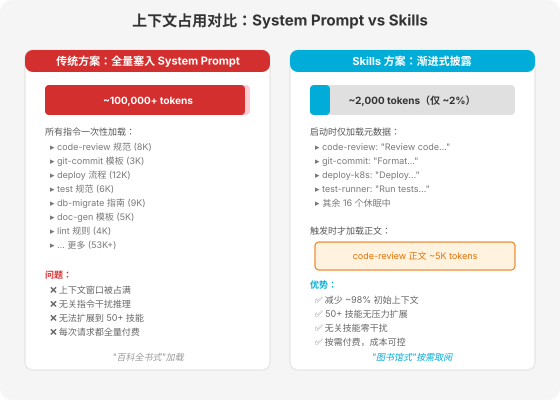
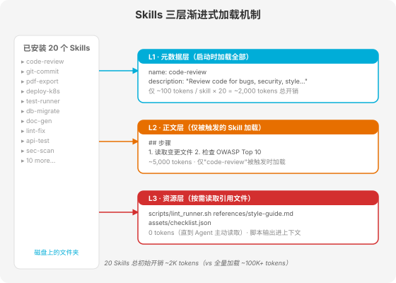
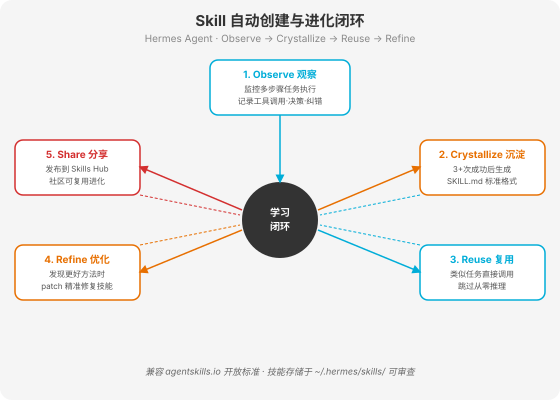

# 第 11 章 Skills 系统 — 能力的渐进式扩展

> **"Skills 不是给 Agent 装更多脑子，而是给它一个按需打开的工具箱——平时合上不占地方，要用时翻开恰好够用。"**

---

## 11.1 Skills 是什么

想象你雇了一位天赋极高但经验为零的新员工。他什么都能学，但你不可能在他入职第一天就把公司所有 SOP、代码规范、部署流程、安全检查清单一股脑塞进他脑子里——他会信息过载，反而什么都做不好。

聪明的做法是：给他一个文件柜。每个抽屉贴着标签——"代码审查流程""Git 提交规范""K8s 部署指南"。平时这些抽屉关着，不占注意力；当他需要做某件事时，拉开对应的抽屉，看完用完，再合上。

**Skills 就是 AI Agent 的文件柜。**

### 11.1.1 从"百科全书"到"图书馆"

传统的 Agent 增强方式是"百科全书式"的：把所有指令、规范、流程全部写进 System Prompt，每次对话都全量加载。这在指令少的时候管用，但当你想教 Agent 四十种不同工作流时，System Prompt 就会膨胀到十万 tokens 以上，把上下文窗口撑爆。

Skills 翻转了这个模型。它不是"始终加载"，而是"按需加载"——启动时只读取每个 Skill 的名字和一句话描述（约 100 tokens），判断当前任务是否匹配；匹配了才加载完整指令；指令中引用的脚本和参考文档，更是等到真正需要时才读取。



### 11.1.2 开放标准的诞生

2025 年 12 月 18 日，Anthropic 将 Agent Skills 作为**开放标准**正式发布，规范维护在 [agentskills.io](https://agentskills.io)。这不是 Claude Code 的私有格式，而是一个跨平台的公共协议。

它的传播速度令人侧目：

- 发布后 **48 小时内**，Microsoft 将其接入 VS Code Copilot，OpenAI 将其加入 ChatGPT 和 Codex CLI
- 到 2026 年 3 月，**30+ 工具**已支持同一套 `SKILL.md` 文件格式，包括 Claude Code、OpenAI Codex CLI、Gemini CLI、Cursor、VS Code Copilot、GitHub Copilot、Junie、Goose、Roo Code 等
- 该标准现归入 **AAIF（Agentic AI Foundation）**——Linux Foundation 旗下的代理 AI 基金会管理，与 MCP、AGENTS.md 同属一个标准家族

### 11.1.3 Skill vs Tool vs Plugin

这三个概念经常被混淆，但它们解决的是不同层面的问题：

| 概念 | 本质 | 类比 | 加载方式 |
|------|------|------|----------|
| **Tool** | 单个可执行函数 | 螺丝刀——干一件具体的事 | 始终在工具箱里 |
| **Skill** | 程序性知识包 | 操作手册——指导怎么做事 | 按需打开 |
| **Plugin** | 功能扩展模块 | 外挂设备——给系统加新能力 | 安装即常驻 |

Tool 回答"我能做什么动作"，Skill 回答"遇到某类任务我该怎么一步步做"，Plugin 回答"我需要什么新功能模块"。三者互补而非替代：一个 Skill 可以编排多个 Tools，一个 Plugin 可以包含多个 Skills。

---

## 11.2 Skills 的三层加载机制

Skills 的核心设计哲学是**渐进式披露（Progressive Disclosure）**——只展示足够的信息来帮助 Agent 决定下一步做什么，然后根据需要披露更多细节。



### 11.2.1 L1 元数据层（启动时加载，~100 tokens/skill）

Agent 启动时，扫描所有已安装 Skills 的 `SKILL.md` 文件，**只读取 YAML frontmatter 中的 `name` 和 `description` 两个字段**。这两个字段加起来约 100-200 个 tokens。

20 个 Skills 的 L1 总开销约 2,000 tokens——不到上下文窗口的 2%。这些元数据让 Agent 知道"有哪些技能可用"以及"每个技能大概干什么"，但不知道具体怎么做。

### 11.2.2 L2 正文层（触发时加载，<5,000 tokens）

当用户请求与某个 Skill 的 `description` 语义匹配时，Agent 才加载该 Skill 的完整 `SKILL.md` 正文。正文包含具体指令、步骤、约束和示例，建议控制在 500 行以内、5,000 tokens 以下。

关键点：**只有被触发的那个 Skill 才加载正文**。其余 19 个 Skills 继续保持"休眠"状态，零额外开销。

### 11.2.3 L3 资源/脚本层（按需加载，0 tokens 直到访问）

SKILL.md 正文中可以引用 `scripts/`、`references/`、`assets/` 子目录下的文件。这些文件在磁盘上静静躺着，**不消耗任何 token**，直到 Agent 在执行过程中主动决定读取它们。

脚本的特殊之处在于：它作为**独立进程**运行，代码本身不进入上下文窗口，只有脚本的输出结果（通常是结构化数据）才返回给 Agent。一个 500 行的 Python 脚本，对 Agent 来说只消耗其输出那几十行 tokens。

### 11.2.4 加载触发机制

Agent 根据用户请求**自主决定**何时调用哪个 Skill，而非依赖关键词匹配或正则表达式。这是**语义级别的匹配**——Agent 理解用户意图后，对照所有 Skills 的 description 进行选择。

举例：用户说"帮我看看这次改动有没有安全问题"，Agent 语义理解到这是代码审查 + 安全检查，匹配到 `code-review` 技能的 description（"Review code for bugs, security, style..."），触发加载。

---

## 11.3 SKILL.md 标准结构

### 11.3.1 目录结构

一个 Skill 就是一个文件夹，最少只需要一个 `SKILL.md` 文件：

```
my-skill/
├── SKILL.md          # 必需：元数据 + 指令
├── scripts/          # 可选：可执行脚本
│   ├── lint_runner.sh
│   └── complexity_check.py
├── references/       # 可选：按需加载的参考文档
│   ├── style-guide.md
│   └── api-spec.yaml
└── assets/           # 可选：模板、静态资源
    └── checklist.json
```

### 11.3.2 YAML Frontmatter

`SKILL.md` 文件以 YAML frontmatter 开头，用 `---` 分隔。只有两个字段是必填的：

```yaml
---
name: code-review
description: >
  Review code for bugs, security vulnerabilities (OWASP Top 10),
  and style violations. Use when the user asks for code review,
  mentions security issues, or wants to check code quality before
  committing.
---
```

**完整字段规范：**

| 字段 | 必填 | 约束 | 用途 |
|------|------|------|------|
| `name` | 是 | ≤64字符，仅小写字母/数字/连字符，须匹配目录名 | 唯一标识符 |
| `description` | 是 | ≤1024字符，描述做什么+何时用 | **唯一的触发信号** |
| `license` | 否 | 许可证名称或引用文件 | 版权声明 |
| `compatibility` | 否 | ≤500字符 | 环境要求（产品/包/网络） |
| `metadata` | 否 | 任意键值对 | 版本/作者/标签等 |
| `allowed-tools` | 否 | 空格分隔的工具列表（实验性） | 预授权工具范围 |

### 11.3.3 name 字段的规则

`name` 的约束比看起来严格：

- 必须与所在目录名**完全匹配**
- 只允许小写字母、数字和连字符
- 不能以连字符开头或结尾
- 不能有连续连字符（`--`）

```
✅ code-review
✅ pdf-processing
✅ data-analysis-v2
❌ Code-Review      # 大写不允许
❌ -code-review     # 不能以连字符开头
❌ code--review     # 连续连字符不允许
```

### 11.3.4 description — 整个 Skill 最重要的字段

`description` 是 Agent 决定是否加载某个 Skill 的**唯一依据**。在 L1 阶段，Agent 只能看到 `name` 和 `description`，正文再精彩也不会被读到，除非 description 先说服了 Agent。

**好的 description 要同时包含"做什么"和"何时用"：**

```yaml
# ✅ 好——具体、包含触发词
description: >
  Extract text and tables from PDF files, fill PDF forms, and
  merge multiple PDFs. Use when working with PDF documents or
  when the user mentions PDFs, forms, or document extraction.

# ❌ 差——太模糊，永远不会被触发
description: Helps with PDFs.
```

编写规则：
- 用第三人称（"Extracts..." 而非 "You can extract..."）
- 前置具体的名词和动词
- 包含用户实际会输入的触发短语
- 控制在 1024 字符以内，通常两三句话足够

---

## 11.4 怎么写好一个 Skill

### 11.4.1 紧凑且程序化（Compact and Programmatic）

Skill 的正文不是写给人看的散文，而是写给 Agent 执行的指令。指令要精确而非冗长——每句话都应该可执行、可验证。

```markdown
# ✅ 紧凑程序化
## 步骤
1. 运行 `npm test` 确保所有测试通过
2. 检查 `db/migrations/` 是否有待执行迁移
3. 执行 `./scripts/deploy-staging.sh`
4. 验证 staging URL 健康检查返回 200

# ❌ 冗长散文式
首先，你可能需要考虑运行测试。测试是很重要的，因为它可以
帮助我们发现潜在的问题。运行测试的方法是使用 npm test
命令，这个命令会...
```

### 11.4.2 第三人称祈使句

避免"你应该""你需要"等第二人称表述，直接用祈使句：

```markdown
# ✅ 祈使句
检查所有变更文件的安全漏洞
验证错误处理是否完整
标记不符合项目规范的部分

# ❌ 第二人称
你应该检查所有变更文件的安全漏洞
你需要验证错误处理是否完整
```

### 11.4.3 确定性脚本优先

能脚本化的不用自然语言。脚本的输出是确定性的，不依赖 Agent 的"理解"，减少了幻觉的可能。

```markdown
## 复杂度检查
运行 `scripts/complexity_check.py --threshold 10` 检查圈复杂度。
如果输出中存在 FAIL 行，将其纳入审查报告。
```

脚本在 context window 外执行，500 行代码不占一个 token，只有输出结果进入上下文。

### 11.4.4 Just-in-Time 加载

正文只放核心指令，长内容移到 `references/`，让 Agent 按需读取：

```markdown
## 代码规范
完整规范见 `references/style-guide.md`。
关键规则：函数不超过 50 行，参数不超过 5 个，避免三层以上嵌套。
```

### 11.4.5 完整示例：代码审查 Skill

下面是一个完整的 `code-review` Skill：

**目录结构：**
```
code-review/
├── SKILL.md
├── scripts/
│   ├── lint_runner.sh
│   └── complexity_check.py
└── references/
    └── owasp-checklist.md
```

**SKILL.md：**
```yaml
---
name: code-review
description: >
  Review code for bugs, security vulnerabilities (OWASP Top 10),
  style violations, and performance issues. Use when the user asks
  for code review, mentions security, wants to check code quality,
  or before committing changes.
license: MIT
metadata:
  author: team-platform
  version: "1.2"
allowed-tools: Read Grep Bash(git:*)
---

# Code Review

## 流程
1. 运行 `git diff --name-only HEAD~1` 获取变更文件列表
2. 逐个读取变更文件的完整内容
3. 运行 `scripts/lint_runner.sh` 执行静态分析
4. 运行 `scripts/complexity_check.py --threshold 10` 检查圈复杂度
5. 对照安全检查清单（见 `references/owasp-checklist.md`）

## 检查清单
- [ ] 输入验证是否完整
- [ ] 错误消息是否泄露内部信息
- [ ] 是否存在 SQL 注入向量
- [ ] 是否存在硬编码密钥
- [ ] 边界条件和异常路径是否处理

## 输出格式
按严重程度分级输出：
- 🔴 Critical：安全漏洞或数据丢失风险
- 🟡 Warning：潜在 bug 或可维护性问题
- 🔵 Info：风格建议或优化机会

每个发现包含：文件路径、行号、问题描述、修复建议。
```

**scripts/lint_runner.sh：**
```bash
#!/bin/bash
# 运行项目配置的 linter，输出 JSON 格式结果
if [ -f ".eslintrc.json" ]; then
    npx eslint --format json $(git diff --name-only HEAD~1 | grep '\.ts$\|\.js$')
elif [ -f ".flake8" ]; then
    flake8 --format=json $(git diff --name-only HEAD~1 | grep '\.py$')
else
    echo '{"status":"no_linter_configured"}'
fi
```

**references/owasp-checklist.md：**
```markdown
# OWASP Top 10 审查要点

## A01 - 失效的访问控制
- 检查所有 API 端点是否有权限校验
- 验证垂直和水平权限边界
- 确认 session token 有过期机制

## A02 - 加密失败
- 检查是否使用 TLS 传输敏感数据
- 确认密码使用 bcrypt/argon2 而非 MD5/SHA1
...
```

---

## 11.5 为什么 Skill 能火

### 11.5.1 开发者友好：Markdown 而非代码

写一个 Skill 不需要学新语言、不需要配 SDK、不需要装依赖。你只需要创建一个文件夹，写一个 Markdown 文件。任何一个会用 Markdown 的开发者，五分钟内就能写出第一个 Skill。

这种低门槛让 Skills 的增长速度远超 MCP Server——后者需要写代码、配传输层、处理 JSON-RPC 协议，门槛高出几个数量级。

### 11.5.2 可组合可分享：技能市场

Skills 是文件，天然可版本控制、可打包分发。社区市场已经爆发：

- **SkillsMP**：聚合平台，从 GitHub 自动索引，截至 2026 年中已收录 **20 万+** 技能
- **ClawHub**：OpenClaw 生态的技能市场，**13,000+** 社区贡献的技能
- **Anthropic 官方目录**：与 Atlassian、Figma、Canva、Stripe、Notion、Zapier 等 10+ 合作伙伴共建
- **Solo.io agentregistry**：Kubernetes 生态的 Skills 注册中心，支持全生命周期管理

### 11.5.3 跨平台兼容

同一个 `SKILL.md` 文件，可以在 Claude Code、Codex CLI、Cursor、Gemini CLI 等 30+ 平台上使用。这在 AI 工具领域极为罕见——通常每个工具都有自己专有的配置格式。Skills 打破了厂商壁垒，让"一次编写，到处运行"在 Agent 领域成为现实。

### 11.5.4 渐进式能力扩展

不需要重新训练模型，不需要微调，不需要买更大的 GPU。装一个 Skill 文件夹，Agent 立刻获得新能力。这种"热插拔"式的能力扩展，让 Agent 的进化从"月级"缩短到"分钟级"。

### 11.5.5 社区生态爆发

Skills 正在经历一场"寒武纪大爆发"——正如 Simon Willison 所预言的："Skills 的爆发会让今年的 MCP 热潮看起来平淡无奇。" 从个人技能到团队技能到公共市场，知识正在被模块化、标准化、商品化。



以 Hermes Agent 为例，Skill 的进化已经形成完整闭环：Agent 在执行多步骤任务时自动观察（Observe）哪些模式反复出现，当同一模式成功 3 次以上便自动沉淀（Crystallize）为标准 SKILL.md 格式，后续类似任务直接复用（Reuse）跳过从零推理，发现更好方法时精准修复（Refine）已有技能，最终发布到社区市场供他人分享（Share）。这个闭环让 Agent 的能力增长从"人工编写"进化为"自动学习"。


