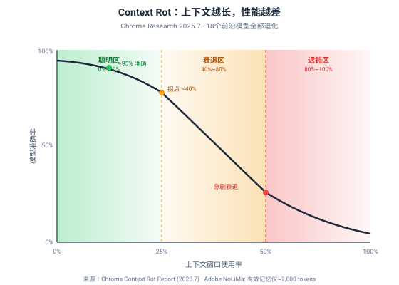
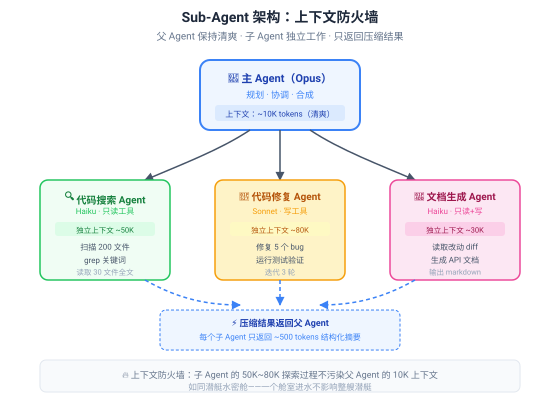
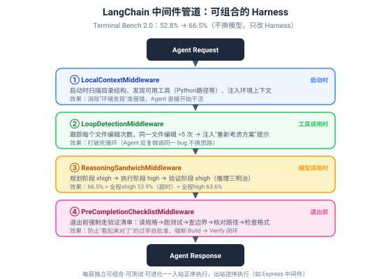

# 第 13 章 Sub-Agent 与 Context Firewall

> **核心比喻**：你是一个建筑项目的总工程师。你不会亲自去搬砖、焊钢筋、走电线——你把这些活分配给专业的施工队。每个施工队在自己的工区干活，干完后给你一份施工报告。你不需要知道他们搬了多少块砖、焊了几根钢筋，你只需要知道"三号楼主体结构完成，质量合格"。这就是 Sub-Agent 的核心思想：**把脏活累活外包给子 Agent，父 Agent 只接收精炼的结果**。

---

## 13.1 为什么需要 Sub-Agent

### 13.1.1 Context Rot：长会话中的性能退化

先讲一个反直觉的事实：**和 AI 聊得越久，它变得越蠢**。

这不是你的错觉。2025 年 7 月，向量数据库公司 Chroma 发布了一份里程碑式的研究报告《Context Rot: How Increasing Input Tokens Impacts LLM Performance》，测试了 18 个前沿模型（包括 GPT-4.1、Claude 4、Gemini 2.5、Qwen3 等），发现了一个残酷的规律：**所有模型都会随着输入长度增加而性能退化——不是平滑衰减，而是不规则波动式下降**。



更早的 2023 年，斯坦福大学的 Liu 等人在论文《Lost in the Middle》中首次揭示了 U 型注意力曲线：模型对上下文**开头和结尾**的信息关注度高，对**中间**的信息关注度低。一句话放在长上下文的中间，最容易被忽略。

2025 年 Adobe 的 NoLiMa 基准测试更扎心：13 个标称支持 128K+ tokens 的模型中，11 个在输入达到 32K tokens 时准确率就跌破短输入基线的一半。更惊人的发现是——**很多模型的有效记忆只有约 2,000 tokens**，哪怕广告窗口是 200 万。

> **类比**：上下文窗口不是"记忆"，而是"预算"。你以为给模型 200K tokens 的窗口就等于 200K tokens 的工作记忆？错。它更像一张桌子——你能往桌上堆 200K 的文件，但模型真正能"读到"的可能只有最上面那 2K。桌上的文件越多，找到关键那一页就越难。

Chroma 的研究还揭示了几个关键模式：

- **< 50% 填充时**：U 型曲线，中间信息容易丢失
- **> 50% 填充时**：退化为近因偏好，最早的信息最先丢失
- **近重复信息有害**：4 个略有不同的版本（3 个过时）比 1 个干净版本更让模型困惑
- **退化是安静的**：不会报错，token 数还在限制内，答案只是悄悄变模糊

MIT CSAIL 2026 年 1 月的研究进一步证实了"上下文污染"效应：模型在多轮对话中会被自己早期的错误回复拖累，形成"螺旋式恶化"——一旦在第 3 轮走错方向，后面 17 轮都在错误假设上累积，而且**不会自我纠正**。

微软 2025 年的研究量化了这个退化：多轮对话比单轮对话平均性能下降 39%，任务成功率从单轮的 ~90% 降到多轮的 ~65%。

这对 Agent 意味着什么？Agent 天然就是长会话——它需要多步推理、多次工具调用、多轮观察。一个执行 8 步任务的 Agent，上下文里堆了 8 步的完整记录（包括失败的尝试）。到第 20 步时，第 3 步的关键约束可能已经"淹没"在上下文的中间，模型再也"读"不到它了。

### 13.1.2 Context Firewall：子 Agent 获得全新上下文

解决 Context Rot 最直接的方法是什么？**开一个新对话**。

MIT 研究者的建议朴素而有力："点击'新建对话'不是在丢失上下文，有时只是在清除毒素。"

Sub-Agent 就是这个思路的工程化实现。与其让一个 Agent 在越来越长的上下文里挣扎，不如把任务拆分给多个子 Agent，每个子 Agent 拥有**全新的、小而高相关性的上下文**。



核心机制：

**父 Agent（主 Agent）保持清爽**：它只负责规划任务、分配工作、接收结果、合成最终输出。它的上下文始终保持在"聪明区"（< 40% 填充），不被子 Agent 的探索过程污染。

**子 Agent 独立工作**：每个子 Agent 拥有自己独立的上下文窗口，可以尽情探索——读 200 个文件、试 5 种方案、跑 3 轮测试——这些"脏活"的全过程留在子 Agent 的上下文里，不会泄漏到父 Agent。

**只返回压缩结果**：子 Agent 完成任务后，只向父 Agent 返回一份结构化摘要（通常 ~500 tokens），而不是完整的探索过程。父 Agent 的上下文只增加几百 tokens，而不是几万。

> **类比**：这就像潜艇的水密舱设计——每个舱室独立密封，一个舱室进水不会影响整艘潜艇。在 Agent 世界里，"进水"就是上下文污染——子 Agent 在探索中遇到错误信息、死胡同、大量噪音，这些都被隔离在子 Agent 的上下文里，不会"渗漏"到父 Agent。

Claude Code 的架构完美体现了这个设计。根据对 Claude Code 源代码的逆向工程分析，其核心是**主从分离的执行模型**：

- 主 Agent（nO 循环引擎）负责统筹全局
- SubAgent（I2A 实例）在独立执行环境中处理具体任务
- 两者通过 Task 工具实现**单向通信**——父 Agent 向子 Agent 发送任务描述，子 Agent 返回最终结果，中间过程完全隔离

这种设计带来四个隔离保证：

| 隔离维度 | 说明 | 效果 |
|----------|------|------|
| 独立循环实例 | 每个子 Agent 有自己的 nO 循环 | 不共享消息历史 |
| 专用消息队列 | 子 Agent 的对话独立存储 | 不干扰父 Agent 的上下文 |
| 隔离工具权限 | 子 Agent 只能访问被授权的工具 | 最小权限原则 |
| 独立错误处理 | 子 Agent 的错误不传播到父 Agent | 一个子 Agent 崩溃不影响其他 |

---

## 13.2 Sub-Agent 架构模式

### 13.2.1 规划者 + 执行者：Initializer Agent + Coding Agent

最常见的 Sub-Agent 模式是"规划者 + 执行者"双角色架构。

**Initializer Agent（规划者）**：负责理解任务、分析代码库、制定执行计划。它不写代码，只做调研和规划。通常使用更强的模型（如 Opus），因为规划需要深度推理。

**Coding Agent（执行者）**：负责按照计划执行——写代码、跑测试、修 bug。它不需要理解全局，只需要执行分配给它的具体任务。可以使用更快更便宜的模型（如 Haiku 或 Sonnet），因为执行是相对机械的。

这就像建筑项目：总工程师（Initializer）看图纸、算结构、出施工方案；施工队（Coding Agent）拿方案去搬砖、浇混凝土。总工程师不需要自己搬砖，施工队不需要自己算结构。

为什么要分离？因为规划和执行对上下文的需求完全不同：

- 规划需要**广而浅**的上下文：了解项目结构、技术栈、约束条件，但不深入代码细节
- 执行需要**窄而深**的上下文：聚焦于具体文件的完整内容、测试结果、错误日志

如果混在一起，规划阶段的广域信息会稀释执行阶段的深度信息，导致两种工作都做不好。

### 13.2.2 父 Agent 只接收压缩后的结构化结果

这是 Sub-Agent 架构的黄金法则：**子 Agent 返回的必须是结构化摘要，不是原始过程**。

好的返回：

```json
{
  "task": "搜索所有使用 deprecated API 的文件",
  "found": 12,
  "files": [
    {"path": "src/api/users.ts", "api": "oldFetch", "line": 42},
    {"path": "src/api/orders.ts", "api": "oldFetch", "line": 87},
    ...
  ],
  "recommendation": "统一替换为 fetchV2，涉及 12 个文件"
}
```

坏的返回：把搜索过程中读过的 200 个文件内容、grep 的完整输出、中间分析全部返回。

父 Agent 需要的只是"结果和决策依据"，不是"工作过程"。这就像你让助手去调研竞品，你要的是一份两页的摘要报告，不是助手调研时浏览过的 500 个网页的完整截图。

Claude Code 的 Task 工具描述中明确写道："When the agent is done, it will return a single message back to you. The result returned by the agent is not visible to the user."——子 Agent 只返回一条消息，这条消息就是它的全部输出，中间过程对外不可见。

### 13.2.3 模型分级：Opus 规划、Haiku 执行

Sub-Agent 架构的一个巨大优势是**成本优化**。不同任务对模型能力的要求差异巨大，用同一个模型处理所有任务是浪费。

| 角色 | 推荐模型 | 理由 | 相对成本 |
|------|----------|------|----------|
| 父 Agent（规划+合成） | Opus / GPT-4 | 需要深度推理、全局理解 | 1x |
| 代码修复子 Agent | Sonnet / GPT-4-mini | 需要代码能力但任务聚焦 | 0.3x |
| 代码搜索子 Agent | Haiku / GPT-4-mini | 主要是 grep+读取，不需要深度推理 | 0.1x |
| 文档生成子 Agent | Haiku | 模板化输出，不需要复杂推理 | 0.1x |

Anthropic 的数据显示，多 Agent 架构的 token 消耗是单 Agent 的约 15 倍——但这个数字需要正确理解。如果 15 倍的 token 中 90% 来自 Haiku（0.1x 成本），实际成本增加可能只有 2-3 倍，而任务成功率和复杂任务处理能力可能提升数倍。

> **关键认知**：Multi-Agent 的 15x token 消耗不是"浪费"，而是"用便宜的模型做量大的活，用贵的模型做关键的活"。就像公司不会让 CEO 去搬砖——不是因为 CEO 不会搬，而是因为搬砖不需要 CEO 级别的能力，用实习生更划算。

但也要警惕过度拆分。Anthropic 的数据同样显示：

- 单聊天：1x token 消耗
- 单 Agent：4x token 消耗
- Multi-Agent：15x token 消耗

如果一个任务用单 Agent 能在"聪明区"内完成，就不要拆分成 Multi-Agent。Sub-Agent 是解决 Context Rot 的手段，不是目的。**只在上下文开始"腐烂"时才引入子 Agent**。

---

## 13.3 LangChain 的中间件优先架构

### 13.3.1 四层中间件管道

2026 年 3 月 10 日，LangChain 的 Vivek Trivedy 发表《The Anatomy of an Agent Harness》，描述了一项引人注目的实验：在 Terminal Bench 2.0 基准测试上，**不换模型（全程 GPT-5.2-Codex），只改 Harness**，把分数从 52.8% 提升到 66.5%，排名从 Top 30 杀进 Top 5[^langchain-anatomy]。

他们怎么做到的？答案是**四层中间件管道**。



这四层中间件像 Express.js 的中间件链一样工作：入站路径正序执行（请求到达模型前），出站路径逆序执行（响应返回后）。每层独立、可组合、可测试。

**① LocalContextMiddleware — 环境感知注入**

```python
class LocalContextMiddleware(Middleware):
    async def on_agent_start(self, state: AgentState) -> MiddlewareResult:
        dir_structure = await self._map_directory(state.working_dir)
        tools_info = await self._discover_tools(state)
        context = f"## Working Environment\n{dir_structure}\n{tools_info}"
        return MiddlewareResult(continue_execution=True, inject_message=context)
```

Agent 启动时，自动扫描当前目录结构、发现可用工具（Python 安装路径等）、注入环境上下文。效果：消除"环境发现"类报错——Agent 不再需要跑 `ls`、`which python` 去摸索环境，直接开始干活。

> **类比**：这就像给新员工做入职培训——先告诉他办公室在哪、打印机在哪、Wi-Fi 密码多少，而不是让他自己满楼找。没有入职培训的新人，第一周有一半时间在"找东西"。

**② LoopDetectionMiddleware — 死循环检测**

跟踪每个文件的编辑次数。当同一文件被编辑超过 5 次时，注入提示："你已多次编辑同一文件，请重新考虑方案。"

这个中间件解决的是 Agent 最常见的失败模式之一：**毁灭循环（Doom Loop）**。Agent 陷入一种"微调陷阱"——对同一个 bug 反复修改，每次只改一点点，但方向始终不对。LangChain 观察到某些情况下 Agent 会反复微调同一文件 10+ 次而不换思路。

关键设计：不是硬停止，而是**nudge（轻推）**。保留 Agent 的自主性，只是提醒它"你可能走偏了"。

**③ ReasoningSandwichMiddleware — 推理三明治**

这是整个实验中最反直觉的发现。

GPT-5.2-Codex 有四个推理等级：low、medium、high、xhigh。直觉上，推理等级越高越好。但实验结果：

| 策略 | 分数 | 原因 |
|------|------|------|
| 全程 xhigh | 53.9% | 频繁超时，任务没做完 |
| 全程 high | 63.6% | 平衡但非最优 |
| **三明治（xhigh→high→xhigh）** | **66.5%** | 规划和验证深度推理，执行高效 |

**推理三明治**策略：规划阶段用 xhigh（深度理解问题），执行阶段降到 high（快速出代码不超时），验证阶段回到 xhigh（抓 bug 需要深度推理）。

这个发现的意义远超编码 Agent：**推理预算的分配比总量更重要**。在正确的阶段投入正确量级的推理，比全程最高推理效果更好。这就像考试——审题时要慢要深，做题时效率优先，检查时再慢下来仔细验算。全程慢吞吞做不完卷子，全程快冲冲容易粗心。

**④ PreCompletionChecklistMiddleware — 完成前强制验证**

Agent 最危险的行为是什么？**过早自批准**——写完代码，自己看一遍觉得"看起来没问题"，然后宣告完成。不跑测试，不查边界条件，不对照规格。

这个中间件在 Agent 准备退出时拦截它，强制走一遍验证清单：

```
- [ ] 读了完整的任务规格？
- [ ] 跑了所有测试并且通过？
- [ ] 检查了边界条件（不只是 happy path）？
- [ ] 输出格式匹配预期？
- [ ] 文件路径和规格完全一致？
```

LangChain 把这个模式称为"Ralph Wiggum Loop"——在 Agent 试图退出时用 Hook 强制它继续执行验证步骤。效果：把 Agent 从"Build → Done"变成"Build → Verify → Fix → Done"的闭环。

### 13.3.2 可组合、可测试、可进化的 Harness

LangChain 中间件架构的最大价值不是某个具体中间件的效果，而是**架构本身的设计哲学**。

**可组合**：每个中间件独立工作，增加或删除一层不影响其他层。你可以只用 LocalContextMiddleware + PreCompletionChecklistMiddleware，不用 LoopDetection 和 ReasoningSandwich。这让你可以按需组装，而不是全有或全无。

**可测试**：每个中间件可以单独测试。LocalContextMiddleware 的输入输出可以 mock，不需要跑完整 Agent 循环。这让 Harness 的质量保障变得可行——以前 Harness 是一个黑盒，改一处 Prompt 可能影响全局；现在每层有明确的输入输出契约。

**可进化**：LangChain 诚实地承认，某些中间件（如 LoopDetection）是"针对当前模型缺陷的设计启发式"。随着模型改进，这些护栏可能变得不必要。中间件架构让你可以随时移除过时的护栏——如果未来的模型不再陷入死循环，直接删掉 LoopDetectionMiddleware 即可，不影响其他层。

> **类比**：这就像搭积木。传统 Harness 是一整块塑料——改一个角要重新开模。中间件架构是乐高——每块独立，想加加想减减，坏了换一块就行。

LangChain 还引入了一个"元 Harness"组件：**Trace Analyzer Skill**。它从 LangSmith 拉取实验 trace 数据，并行启动多个错误分析 Agent，汇总发现和改进建议，然后把反馈转化为 Harness 编辑。这形成了一个" Harness 自己优化 Harness"的闭环——用 Agent 分析 Agent 的失败，比人工审查快几个数量级。

---

## 13.4 小结

本章我们从 Context Rot 问题出发，理解了为什么长会话会让 AI 变蠢，以及 Sub-Agent 架构如何通过上下文防火墙来解决这个问题。

**三个认知**：

**一、Context Rot 是所有 LLM 的通病，不是某个模型的 bug**。Chroma 测试了 18 个模型全部退化，Adobe 发现有效记忆可能只有 ~2,000 tokens。上下文不是"记忆"而是"预算"——堆得越多，找到关键信息越难。实务上的拐点大约在 40% 填充率，超过这个阈值性能开始明显衰退。

**二、Sub-Agent 的本质是上下文隔离，不是角色扮演**。子 Agent 的正确用法是在需要做大量探索工作时，让它在自己的窗口里完成探索，只返回精炼摘要给父 Agent。不要为了模仿职衔而建"QA 子 Agent""前端子 Agent"——如果任务量不大，单 Agent 在聪明区内就能搞定，拆分反而增加 15x token 成本。**只在上下文开始"腐烂"时才引入子 Agent**。

**三、Harness 是可组合的中间件管道，不是一整块黑盒**。LangChain 的实验证明，不换模型只改 Harness 就能从 52.8% 提升到 66.5%。四层中间件各管一件事——环境感知、循环检测、推理分配、完成前验证——可加可减可测试可进化。最反直觉的发现是推理三明治：规划和验证阶段用高推理预算，执行阶段用中档，比全程最高推理效果好 12.6 个百分点。

**关键数据**：

- Context Rot：18 个前沿模型全部退化（Chroma 2025.7），有效记忆可能仅 ~2,000 tokens（Adobe NoLiMa）
- 多轮退化：多轮对话比单轮平均退化 39%，~90% → ~65%（Microsoft Research 2025）
- Claude Code Sub-Agent：主从分离 + 单向通信 + 独立上下文，支持最多 49 个并发子 Agent
- LangChain Harness：52.8% → 66.5%（不换模型），推理三明治 66.5% > 全程high 63.6% > 全程xhigh 53.9%
- Multi-Agent 成本：单聊天 1x → 单 Agent 4x → Multi-Agent 15x token 消耗

**一个比喻记住全章**：上下文窗口是桌子不是记忆——文件堆越多越找不到关键页；Sub-Agent 是水密舱——一个舱进水不沉整艘船；中间件管道是乐高——每块独立可拆可装。

第三篇到此结束。从沙箱安全执行（第 9 章）到 MCP 协议（第 10 章），从 Skills 系统（第 11 章）到 Rule 与 Hooks（第 12 章），再到 Sub-Agent 与 Context Firewall（第 13 章），我们完整拆解了 Harness 工程的五大支柱。下一篇，我们将进入 Agent 设计模式——从工程实现上升到架构思考，学习可复用的智能体设计范式。

---

[^langchain-anatomy]: Vivek Trivedy, "The Anatomy of an Agent Harness", LangChain Blog, 2026-03-10, https://blog.langchain.com/the-anatomy-of-an-agent-harness
