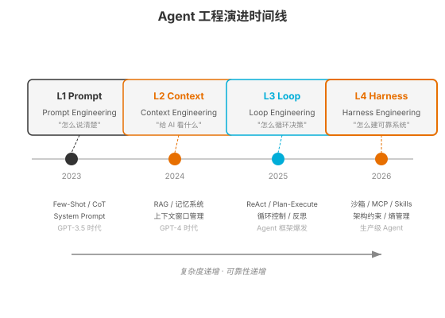
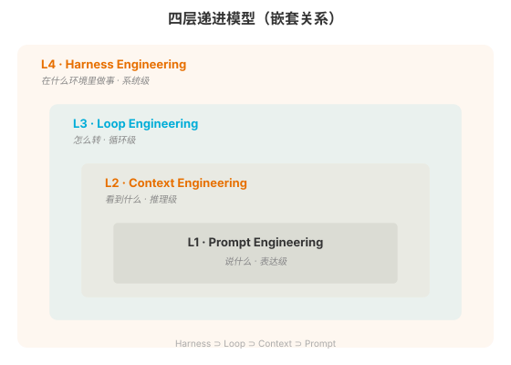

### 第 4 章 四大工程范式总览

> 📖 本章你将学会：Agent 工程从 Prompt 到 Harness 的演进脉络、四层递进模型的嵌套关系、为什么不能跳层、每层解决什么问题

---

#### 开篇：从"许愿"到"系统工程"

2023 年初，很多人觉得 AI 开发就是"写好 Prompt"——把指令写得越详细越好，多给几个例子，模型就能给出好结果。这种思路叫 Prompt Engineering，它确实是 AI 应用的起点，但只是起点。

到了 2025 年 6 月，Andrej Karpathy 在 X 上发推："+1 for 'context engineering' over 'prompt engineering'"，人们发现光写好 Prompt 不够——模型"看不到"关键信息时，Prompt 写得再好也没用。Context Engineering 范式确立：不要只关注"怎么说"，更要关注"给模型看什么"。

2026 年 2 月，Mitchell Hashimoto 命名 Harness Engineering，提出了核心公式 `Agent = Model + Harness`。Agent 不只是 Prompt + Context + Loop，还需要沙箱、记忆、MCP、Skills、Hooks——一整套让系统可靠运转的基础设施。LangChain 的实验证明，固定模型不变，仅优化 Harness 就能让基准得分从 52.8% 跳到 66.5%。

2026 年 6 月，Google 工程总监 Addy Osmani 正式命名 Loop Engineering——Agent 不是一次性给出答案，而是多步循环逼近目标。虽然循环的实践由来已久（ReAct 论文 2022 年即提出 Thought→Action→Observation 循环），但作为独立工程范式的系统化定义发生在 2026 年。

> 💡 **时间线说明**：从命名时间看，Harness Engineering（2026.02）先于 Loop Engineering（2026.06）。但概念上 Loop 是 Harness 的子集——本章按概念嵌套关系（Prompt ⊂ Context ⊂ Loop ⊂ Harness）排序，非严格命名时间顺序。

这四个阶段不是"谁取代谁"，而是**层层递进、嵌套包含**。这一章给你完整的全景图。

---

#### 4.1 Agent 工程的演进：从 Prompt 到 Harness



##### 4.1.1 2023 年：Prompt Engineering 统治一切

2023 年是 Prompt Engineering 的黄金时代。GPT-3.5/4 发布，人们发现通过精心设计 Prompt，模型能做到令人惊讶的事情——写代码、做翻译、分析数据、角色扮演。

这个阶段的核心方法论：

- **Few-Shot Learning**：在 Prompt 中给几个示例，让模型"学会"任务模式
- **Chain-of-Thought**：加一句"Let's think step by step"，让模型展开推理过程
- **System Prompt 设计**：用角色设定、行为约束、输出格式三段式定义模型行为
- **Prompt 模板化**：把 Prompt 做成可复用模板，变量化注入

Prompt Engineering 解决的核心问题是"表达"——怎么把任务说清楚，让模型理解你要什么。这确实重要，但它有一个根本局限：**模型只能基于你给它的信息推理**。你不说的事情它不知道，你没给的数据它看不到。Prompt 再好，也只是"表达层"的优化。

##### 4.1.2 2025 年：Context Engineering 范式转移

2025 年 6 月，Andrej Karpathy 在 X（推特）上发了一条影响深远的推文："+1 for 'context engineering' over 'prompt engineering'"，指出"人们通常将 prompt 与日常使用中给 LLM 的简短任务描述联系在一起，而在每一个工业级 LLM 应用中，context engineering 是一门精巧的艺术与科学，其核心在于恰到好处地填充上下文窗口"[^karpathy-context]。

同一时期，Shopify CEO Tobi Lütke 也发文支持"context engineering"这个术语。LangChain 随后在博客中系统阐述了 Context Engineering 的四种策略（Write / Select / Compress / Isolate）[^langchain-context]。

一个认知开始普及：**Prompt 只是 Context 的一个子集**。模型每次推理时看到的全部信息——System Prompt、对话历史、工具定义、检索结果、文件内容——这些共同构成了"Context"。Prompt Engineering 只优化了其中一小部分（你怎么说），而 Context Engineering 优化的是全部（模型看到什么）。Karpathy 那条推文标志了范式转移——他说"Context Engineering"这个术语的内涵与本意高度吻合，不像"Prompt Engineering"已经被大众误解为"对着 ChatGPT 打字"。

Context Engineering 的核心关注点：

- **上下文窗口管理**：Token 有限，怎么分配？Instructions / Knowledge / Tools 各占多少？
- **RAG（检索增强生成）**：不要把所有知识塞进 Prompt，而是按需检索相关片段注入
- **记忆系统**：短期记忆（对话历史）、工作记忆（会话状态）、长期记忆（向量存储）
- **上下文压缩**：长会话中历史会膨胀，需要摘要压缩、滑动窗口、选择性遗忘
- **Context Rot 防御**：长会话中性能会退化，需要主动管理上下文质量

> 💡 比喻：Prompt Engineering 是"写好便签条"，Context Engineering 是"整理整个办公桌"。便签条写得再好，如果办公桌上堆满了无关文件、重要资料被埋在底下，工作效率仍然低下。Context Engineering 系统性地管理模型"看到"的一切信息。

##### 4.1.3 2026 年 6 月：Loop Engineering 系统化定义

Loop Engineering 的技术实践由来已久——ReAct 循环（Thought → Action → Observation）在 2022 年即被提出，2025 年 7 月 Geoffrey Huntley 提出的 Ralph Loop 用一行 bash 实现"无限循环+每轮清空上下文"。但"Loop Engineering"作为独立工程范式的系统化定义，发生在 2026 年 6 月。

导火索是 2026 年 6 月 7 日，OpenClaw 创始人 Peter Steinberger 在 X 上发了一条 12 词推文："You shouldn't be prompting coding agents anymore. You should be designing loops that prompt your agents."——24 小时内获得超过 220 万次浏览[^steipete-loop]。同期，Claude Code 负责人 Boris Cherny 在 Acquired Unplugged 活动上说"我已经不 prompt Claude 了，是 loops 在跑"[^cherny-acquired]。

同一天，Google 工程总监 Addy Osmani 在个人博客发表长文正式命名 **Loop Engineering**，定义为"用一个你设计的系统，取代你自己作为那个 prompt Agent 的人"[^osmani-loop]。

Loop Engineering 关注的核心问题：

- **循环控制**：终止条件（任务完成/最大迭代/超时）、循环检测（状态指纹去重）、资源约束（Token 预算/API 限流）
- **循环变体**：ReAct（边想边做）、Plan-and-Execute（先规划后执行）、Reflection（自我反思改进）
- **循环陷阱**：无限循环、幻觉行动（调用不存在的工具）、循环依赖（A 等 B、B 等 A）

> ⚠️ **关于时间线的诚实说明**：从命名时间看，Harness Engineering（2026.02）先于 Loop Engineering（2026.06）。但本书按概念嵌套关系排列——Loop 是 Harness 的子集（Loop 控制"怎么转"，Harness 控制整个运行环境），因此 Loop 在前、Harness 在后。这不是命名时间顺序，而是概念依赖顺序。

##### 4.1.4 2026 年 2 月：Harness Engineering 命名

2026 年 2 月 5 日，HashiCorp 联合创始人、Terraform 作者 Mitchell Hashimoto 在个人博客《My AI Adoption Journey》中正式提出 Harness Engineering 概念[^hashimoto-harness]。他写道："每次当你发现 Agent 犯了一个错误，就花点时间去工程化一个解决方案，让它永远不会再犯同样的错误。"六天后（2 月 11 日），OpenAI 工程师 Ryan Lopopolo 发表了百万行代码实验报告，直接使用了这个词[^openai-million]。

Harness Engineering 不只是 Prompt + Context + Loop 的简单叠加，它增加了两个新维度：

- **架构约束（Architectural Constraints）**：沙箱隔离、权限分级、操作审批、确定性 Linter——用工程手段确保 Agent 只在边界内行事
- **熵管理（Entropy Management）**：文档一致性检查、约束扫描、模式强化、依赖审计——保障系统不随时间退化

LangChain 的实验是 Harness Engineering 价值的最好证据：固定 GPT-4 模型不变，仅优化 Harness（更好的上下文文件、结构化输出约束、自我验证循环、中间件架构），Terminal Bench 2.0 得分从 52.8% 提升到 66.5%——提升幅度比换一个更贵的模型还大。

OpenAI 的百万行代码实验更进一步：3 个工程师，5 个月，约 100 万行代码，零行手写——全部由 Agent 生成，靠的是极致的 Harness Engineering。

---

#### 4.2 四层递进模型

##### 4.2.1 嵌套关系：Harness ⊃ {Context ⊃ Prompt, Loop, 架构约束, 熵管理}



四层范式不是并列的四个独立模块，而是**嵌套**关系：

```
L4  Harness Engineering  —— 在什么环境里做事（系统级）
     ⊃ L3  Loop Engineering  —— 怎么转（循环级）
        ⊃ L2  Context Engineering  —— 看到什么（推理级）
           ⊃ L1  Prompt Engineering  —— 说什么（表达级）
```

**Prompt 是 Context 的子集**。Prompt（你写的指令）是 Context（模型看到的全部信息）的一部分。Context 还包括对话历史、工具定义、检索结果、文件内容等。

**Context 是 Loop 的一部分**。每一轮循环中，模型看到的 Context 决定了它这一轮的推理质量。Loop 控制"怎么转"，Context 控制"每轮看到什么"。

**Loop 是 Harness 的一部分**。Harness 不只有 Loop，还有架构约束（沙箱/权限/审批）和熵管理（一致性/防退化），这些保障 Loop 能长期可靠运转。

> 💡 理解嵌套关系的关键：每一层解决不同**维度**的问题。L1 解决"表达"，L2 解决"信息"，L3 解决"节奏"，L4 解决"可靠性"。维度不同，不能互相替代——你不能用更好的 Prompt 替代记忆系统，也不能用更好的 Loop 替代沙箱。

##### 4.2.2 每层解决什么问题（一句话总结）

| 层级 | 名称 | 一句话 | 解决的问题 | 核心方法 |
|------|------|--------|-----------|----------|
| L1 | Prompt Engineering | 说什么 | 任务表达不清 | System Prompt / Few-Shot / CoT / 结构化输出 |
| L2 | Context Engineering | 看到什么 | 信息缺失或过载 | RAG / 记忆系统 / 上下文压缩 / Context Rot 防御 |
| L3 | Loop Engineering | 怎么转 | 单轮推理无法完成复杂任务 | ReAct / Plan-Execute / 循环控制 / 反思 |
| L4 | Harness Engineering | 怎么可靠 | 系统不稳定、不安全、会退化 | 沙箱 / MCP / Skills / Hooks / 熵管理 |

##### 4.2.3 为什么不能跳层

一个常见错误是直接跳到 Harness Engineering，忽略底层。比如，你搭了一个精美的沙箱+MCP+Skills 系统，但 Prompt 写得很差——Agent 连任务都理解错了，再好的 Harness 也白搭。

另一个常见错误是停留在 Prompt 层，以为写好 Prompt 就够了。一个客服 Agent 如果没有记忆系统（L2），每次对话都从头开始；如果没有循环（L3），遇到多步骤任务就卡住；如果没有沙箱（L4），执行代码时一个 `rm -rf` 就毁了一切。

**不能跳层的原因是：每层解决的问题是不同维度的，下层问题是上层方案的前提。**

- 没有 L1（Prompt 不清晰）→ L2/L3/L4 都建立在错误理解上
- 没有 L2（Context 缺失）→ L3 的循环每轮都在"盲转"
- 没有 L3（无循环）→ L4 的 Harness 没有应用对象
- 没有 L4（无 Harness）→ L1/L2/L3 在生产环境中不可靠

> 💡 比喻：你不能跳过地基直接盖楼，也不能只打地基不盖楼。四层范式是递进的——L1 是 L2 的基础，L2 是 L3 的基础，L3 是 L4 的基础。但"基础"不等于"简单"——L1 做到极致也很深（Prompt 版本管理、A/B 测试、评估迭代），L4 做到极致更难（完整的 Harness 是一个系统工程）。

---

#### 4.3 本章小结

本章建立了四大工程范式的全景认知：

**认知 1：四大范式是演进而非替代。** 从 2023 年的 Prompt Engineering 到 2026 年的 Harness Engineering 和 Loop Engineering，每一层都是对前一层的"升维"——不是否定前一层，而是在前一层基础上增加新维度。Prompt 仍然重要，但它只是 Context 的一部分；Context 仍然重要，但它只是 Loop 的一部分；Loop 仍然重要，但它只是 Harness 的一部分。

**认知 2：四层是嵌套而非并列。** Harness ⊃ Loop ⊃ Context ⊃ Prompt。每一层解决不同维度的问题——表达、信息、节奏、可靠性——维度不同不能互相替代。

**认知 3：不能跳层。** 每层是下层方案的前提。Prompt 不清晰则一切建立在错误理解上；Context 缺失则循环"盲转"；无循环则 Harness 无应用对象；无 Harness 则生产环境不可靠。

接下来四章（第 5-8 章）逐一深入每一层：第 5 章 Prompt 工程，第 6 章 Context 工程，第 7 章 Loop 工程，第 8 章 Harness 工程。

---

[^karpathy-context]: Andrej Karpathy, X/Twitter 推文, 2025-06-25, https://x.com/karpathy/status/1937902205765607626

[^langchain-context]: LangChain Blog, "Context Engineering for Agents", 2025-07-02, https://blog.langchain.com/context-engineering-for-agents/

[^steipete-loop]: Peter Steinberger, X/Twitter 推文, 2026-06-07, https://x.com/steipete/status/2063697162748260627

[^cherny-acquired]: Boris Cherny, Acquired Unplugged 活动发言, 2026-06-02, https://www.acquired.com

[^osmani-loop]: Addy Osmani, "Loop Engineering", 2026-06-07, https://addyosmani.com/blog/loop-engineering

[^hashimoto-harness]: Mitchell Hashimoto, "My AI Adoption Journey", 2026-02-05, https://hashimoto.jp

[^openai-million]: Ryan Lopopolo, OpenAI Blog, 2026-02-11, https://openai.com
