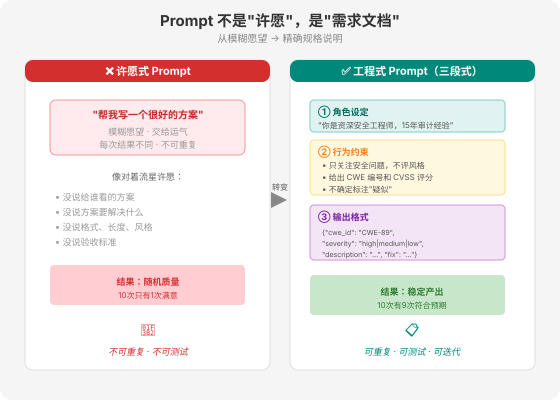
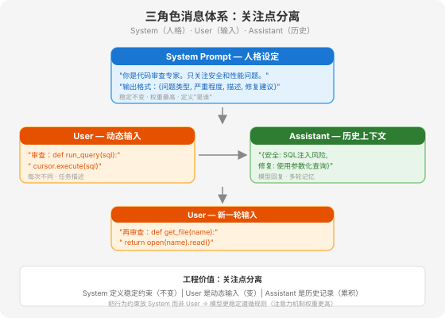
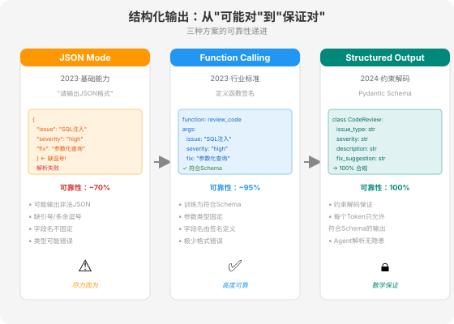
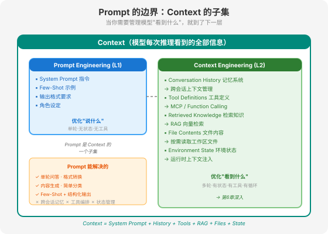

### 第 5 章 Prompt 工程 — 任务表达的艺术

> 📖 本章你将学会：结构化 Prompt 的工程方法、System Prompt 设计三段式、Prompt 版本管理与 A/B 测试、Prompt 的能力边界

---

#### 开篇：写 Prompt 不是"许愿"

很多人写 Prompt 像在"许愿"——"请你帮我写一个很好的方案"，然后期待模型给出完美结果。这跟对着流星许愿没有本质区别：你表达了一个模糊的愿望，把结果交给运气。

Prompt Engineering 的核心转变是：从"许愿"到"工程"。工程意味着——可重复、可测试、可迭代、可版本管理。一个好的 Prompt 不是"写得漂亮"，而是"每次都能稳定产出符合预期的结果"。

> 💡 比喻：写 Prompt 就像写需求文档给程序员。你不会跟程序员说"帮我做个好功能"——你会写清楚功能描述、输入输出、边界条件、验收标准。Prompt 也一样：把模糊的愿望变成精确的规格说明。



---

#### 5.1 Prompt 不是"许愿"：结构化提示的工程方法

##### 5.1.1 System / User / Assistant 三角色体系

现代 LLM API（OpenAI、Anthropic、Google）都采用三角色消息体系：

- **System**：设定模型的角色、行为约束、输出格式。System Prompt 是"人格设定"——定义模型是谁、怎么做事。
- **User**：用户的输入。用户的任务描述、问题、指令。
- **Assistant**：模型的回复。包括之前的回复历史和当前回复。

```python
messages = [
    {"role": "system", "content": "你是一个代码审查专家。只关注安全问题和性能问题。输出格式：{问题类型, 严重程度, 描述, 修复建议}。"},
    {"role": "user", "content": "审查这段代码：def run_query(sql): cursor.execute(sql)"},
    {"role": "assistant", "content": "{问题类型: 安全, 严重程度: 高, 描述: SQL注入风险, 修复建议: 使用参数化查询}"},
    {"role": "user", "content": "再审查这段：def get_file(name): return open(name).read()"}
]
```

三角色的工程价值在于**关注点分离**：System 定义稳定的行为约束（不随每次对话变化），User 是动态输入，Assistant 是历史上下文。把行为约束放在 System 而不是 User，可以让模型更稳定地遵循规则——System Prompt 的权重在注意力机制中天然更高。



##### 5.1.2 Few-Shot 与动态示例选择

Few-Shot Learning 是在 Prompt 中提供几个示例，让模型"学会"任务模式。这比纯指令描述更有效——模型从示例中推断隐含的模式和格式，比从自然语言描述中理解更准确。

**静态 Few-Shot**：在 Prompt 中固定写死几个示例。简单有效，但不够灵活——所有请求都用同样的示例，不管是否相关。

**动态 Few-Shot**：根据当前输入，从示例库中检索最相关的几个示例动态注入。这其实是 RAG 的一种特殊应用——检索的不是知识文档，而是"示例"。LangChain 的 `SemanticSimilarityExampleSelector` 就是这个思路。

```python
# 动态 Few-Shot 示例选择（伪代码）
examples = [
    {"input": "审查SQL代码", "output": "{安全: SQL注入...}"},
    {"input": "审查文件操作", "output": "{安全: 路径遍历...}"},
    {"input": "审查循环逻辑", "output": "{性能: 无限循环...}"},
]

# 根据当前输入检索最相关的2个示例
selected = semantic_search(current_input, examples, top_k=2)

# 动态构建 Few-Shot Prompt
few_shot = "\n".join([f"输入: {e['input']}\n输出: {e['output']}" for e in selected])
prompt = f"以下是几个审查示例：\n{few_shot}\n\n现在审查：{current_input}"
```

> 💡 Few-Shot 的关键不是"多"，而是"准"。3 个高度相关的示例比 10 个泛泛的示例效果好得多。动态选择的核心价值是让示例与当前任务对齐——这比固定示例的命中率高 20-30%（视任务而定）。

##### 5.1.3 结构化输出：JSON Mode / Function Calling / Structured Output

让模型输出结构化数据（而非自由文本）是 Prompt Engineering 的重要能力。三种主流方式：

**JSON Mode**：在 Prompt 中要求模型输出 JSON 格式。简单但不可靠——模型可能输出不合法的 JSON（缺少引号、多余逗号）。

**Function Calling**：定义函数签名（名称、参数、描述），模型生成符合签名的函数调用。这是 OpenAI 2023 年推出的能力，后来成为行业标准。模型被训练为生成符合 JSON Schema 的输出，可靠性远高于纯 JSON Mode。

**Structured Output（结构化输出）**：2024 年 OpenAI 推出的更严格的能力——保证模型输出 100% 符合指定的 JSON Schema。这通过约束解码（constrained decoding）实现：在生成每个 Token 时，只允许生成符合 Schema 的 Token。

```python
from pydantic import BaseModel

class CodeReview(BaseModel):
    issue_type: str  # "security" | "performance" | "style"
    severity: str    # "high" | "medium" | "low"
    description: str
    fix_suggestion: str

# 模型输出保证符合 CodeReview schema
result = client.beta.chat.completions.parse(
    model="gpt-4o",
    response_format=CodeReview,
    messages=[{"role": "user", "content": "审查这段代码..."}]
)
```

结构化输出对 Agent 至关重要——Agent 需要解析模型的输出来做决策（调用什么工具？传什么参数？），不结构化的输出意味着不稳定的解析，不稳定的解析意味着不可靠的 Agent。



---

#### 5.2 System Prompt 设计

##### 5.2.1 System Prompt 是 Agent 的"人格设定"

System Prompt 不是"给模型的一些提示"，而是 Agent 的**人格设定**——它定义了 Agent 是谁、做什么、怎么做、不做什么。

一个工程化的 System Prompt 包含三段：

1. **角色设定**：你是谁？你的专业领域是什么？
2. **行为约束**：你应该做什么？不应该做什么？边界在哪？
3. **输出格式**：你的输出应该是什么结构？

```
# 角色设定
你是一个资深安全工程师，专精 Web 应用安全审计。
你有 15 年安全审计经验，熟悉 OWASP Top 10 和 CWE 分类。

# 行为约束
- 只关注安全漏洞，不评论代码风格或性能问题
- 对每个发现的漏洞，给出 CWE 编号和 CVSS 评分估算
- 如果代码没有安全问题，明确回答"未发现安全风险"
- 不要编造不存在的漏洞；不确定时标注"疑似"

# 输出格式
输出 JSON 数组，每个元素：
{
  "cwe_id": "CWE-89",
  "severity": "high|medium|low",
  "location": "文件名:行号",
  "description": "漏洞描述",
  "fix": "修复建议"
}
```

##### 5.2.2 System Prompt 的动态生成策略

System Prompt 不一定是静态字符串——它可以根据运行时上下文**动态生成**。这在 Agent 场景中很常见：

- **注入项目信息**：根据当前工作目录的项目类型（Python/Go/Java）调整审查规则
- **注入用户偏好**：根据用户的历史反馈调整输出风格（简洁 vs 详细）
- **注入工具状态**：根据当前可用的工具列表调整行为约束

```python
def build_system_prompt(project_lang: str, available_tools: list[str]) -> str:
    return f"""
你是一个代码审查 Agent。
当前项目语言：{project_lang}
可用工具：{', '.join(available_tools)}

行为约束：
- 使用可用工具读取代码文件
- 针对 {project_lang} 的常见安全问题重点检查
"""
```

> ⚠️ 动态生成 System Prompt 时要注意**注入安全**。如果运行时上下文来自不可信来源（如用户输入、工具返回的网页内容），攻击者可能通过"Prompt 注入"篡改 System Prompt。第 26 章会详细讨论 Prompt 注入防御。

---

#### 5.3 Prompt 版本管理与 A/B 测试

##### 5.3.1 Prompt 即代码：版本控制与回滚

Prompt 是 Agent 行为的核心逻辑——它决定了 Agent 怎么理解任务、怎么决策、怎么输出。但很多团队把 Prompt 当成"配置"而不是"代码"，存在一个 Word 文档或飞书表格里，没有版本管理。

这是错误的。**Prompt 应该和代码一样纳入版本控制**：

- 每次修改有 commit 记录，可追溯谁在什么时候改了什么
- 可以回滚到之前的版本（"上次改了 Prompt 后准确率下降了，先回滚"）
- 可以做 A/B 测试（同时跑两个版本的 Prompt，比较效果）
- 可以做 Code Review（同事审查 Prompt 变更）

```python
# Prompt 版本管理示例（Prompt 作为 Python 模块）
# prompts/code_review/v1.py
SYSTEM_PROMPT = "你是一个代码审查专家..."

# prompts/code_review/v2.py  
SYSTEM_PROMPT = "你是一个资深安全工程师，专精 Web 应用安全审计..."

# 使用时显式指定版本
from prompts.code_review.v2 import SYSTEM_PROMPT
```

更成熟的方案是把 Prompt 存在数据库中，带版本号、评估指标、A/B 流量分配——这本质上是把 Prompt 管理做成一个"Prompt CI/CD"系统。LangSmith、Langfuse 等平台提供了这种能力。

##### 5.3.2 Prompt 评估与迭代

Prompt 不是"写一次就完了"——它需要持续评估和迭代。评估的核心问题是：**怎么知道这个 Prompt 比上一个好？**

三种评估方法：

**人工评估**：准备一批测试用例，人工对比两个版本 Prompt 的输出质量。准确但慢、贵、不可重复。

**LLM-as-Judge**：用一个 LLM（通常是更强的模型）来评估另一个 LLM 的输出质量。给 Judge 模型一个评分标准（rubric），让它对输出打分。速度快，但 Judge 模型本身也可能有偏差。

**自动化基准**：准备一批有标准答案的测试用例，用程序化方式计算准确率/格式合规率/工具调用正确率。最快最可重复，但需要前期投入构建测试集。

> 💡 最佳实践是组合使用：用自动化基准做快速迭代（每天跑），用 LLM-as-Judge 做深度评估（每周跑），用人工评估做关键版本验收。第 24 章会详细展开 Agent 评估方法论。

---

#### 5.4 Prompt 的边界：为什么单靠 Prompt 不够

##### 5.4.1 适用于：单轮问答、格式转换、内容生成

Prompt Engineering 在以下场景非常有效：

- **单轮问答**：用户问一个问题，模型给一个答案。Prompt 可以优化答案质量。
- **格式转换**：把非结构化文本转成结构化数据、把一种格式转成另一种。Prompt + 结构化输出可以很好地完成。
- **内容生成**：写邮件、写文档、写代码片段。Prompt 控制生成风格和内容方向。
- **简单分类**：情感分析、意图识别、垃圾检测。Few-Shot + 分类 Prompt 就够了。

这些场景的共同特点是：**单轮、无状态、无工具、无循环**。模型一次性看到所有需要的信息，一次性给出结果。

##### 5.4.2 不适用于：跨会话记忆、工具调用编排、状态管理

Prompt Engineering 在以下场景力不从心：

- **跨会话记忆**：你不可能把所有历史对话塞进 Prompt——上下文窗口有限，而且成本随长度线性增长。
- **工具调用编排**：Agent 需要根据中间结果决定下一步调用什么工具——这不是 Prompt 能静态定义的，需要循环。
- **状态管理**：Agent 需要跟踪任务进度、维护中间状态——这需要外部存储，不是 Prompt 能解决的。
- **长时任务**：任务跨越小时甚至天——不可能一个 Prompt 覆盖所有情况。

##### 5.4.3 从 Prompt 到 Context：Prompt 是 Context 的子集

当你发现"光靠 Prompt 不够"时，你就需要升级到 Context Engineering。

**Prompt 是 Context 的子集**。模型每次推理时看到的全部信息——System Prompt + 对话历史 + 工具定义 + 检索结果 + 文件内容——共同构成 Context。Prompt Engineering 只优化了其中一部分（你写的指令），而 Context Engineering 优化的是全部。

```
Context = System Prompt          ← Prompt Engineering 优化这里
        + Conversation History   ← Context Engineering: 记忆系统
        + Tool Definitions       ← Context Engineering: MCP
        + Retrieved Knowledge    ← Context Engineering: RAG
        + File Contents          ← Context Engineering: 文件系统
        + Environment State      ← Context Engineering: 状态管理
```

当你把视野从"Prompt"扩展到"Context"，你就从 L1（Prompt Engineering）升级到了 L2（Context Engineering）。下一章我们深入 Context 工程。



---

#### 5.5 本章小结

**认知 1：Prompt Engineering 是"工程"不是"许愿"。** 结构化的 System Prompt（角色+约束+格式三段式）、动态 Few-Shot、结构化输出——这些是把模糊愿望变成精确规格的工程方法。

**认知 2：Prompt 需要版本管理和评估迭代。** Prompt 即代码——纳入版本控制、做 A/B 测试、持续评估。没有评估的 Prompt 优化是盲目的。

**认知 3：Prompt 有明确的边界。** 单轮、无状态、无工具的场景用 Prompt 就够了；跨会话、多工具、长时任务需要升级到 Context Engineering。Prompt 是 Context 的子集——当你需要管理模型"看到什么"而不仅是"说什么"时，就到了下一层。
