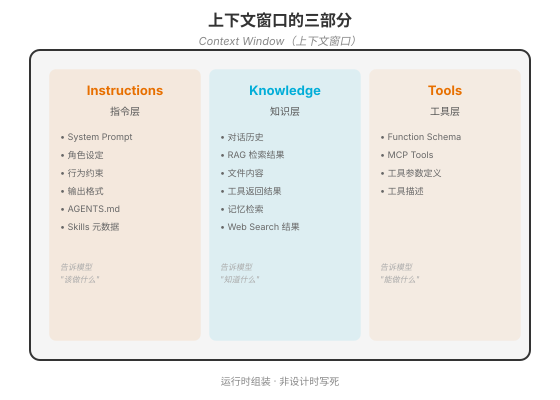
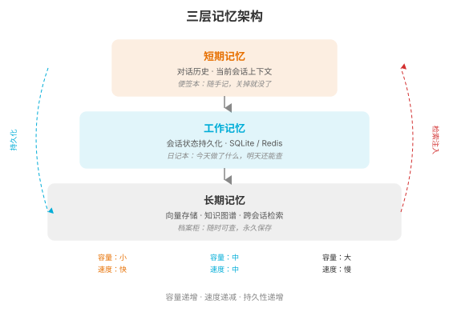

### 第 6 章 Context 工程 — 模型的信息环境

> 📖 本章你将学会：Context Engineering 的定义与核心挑战、上下文窗口管理的工程方法、三层记忆架构、RAG 管道与检索策略

---

#### 开篇：木匠的工作台

想象一个木匠。他的手艺再好，如果工作台只有 30 厘米宽，一次只能放一把锤子，他也做不出像样的家具。他需要一个大工作台，上面整齐地摆着正在做的半成品、需要的工具、参考图纸——但不至于堆得乱七八糟找不到东西。

LLM 的上下文窗口就是模型的工作台。工作台太小（上下文太短），模型"看不到"足够的信息；工作台太大但杂乱（上下文太长但无关信息多），模型"迷失在中间"，找不到关键信息。

Context Engineering 就是"管理这个工作台"的工程——决定工作台上放什么、什么时候清理、怎么从仓库（长期记忆）取东西上来。

> 💡 比喻：Prompt Engineering 是"写好便签条"，Context Engineering 是"整理整个工作台"。便签条写得再好，如果工作台上堆满了无关文件、关键资料被埋在底下，工作效率仍然低下。

---

#### 6.1 什么是 Context Engineering

##### 6.1.1 定义：系统性设计和管理模型在每次推理时看到的全部信息

Context Engineering 的定义是：**系统性设计和管理模型在每次推理时看到的全部信息**。

关键词是"全部信息"——不只是你写的 Prompt，还包括对话历史、工具定义、检索结果、文件内容、环境状态。所有这些在每次 API 调用时被组装成一个 Token 序列发送给模型，这个序列就是 Context。

##### 6.1.2 上下文窗口的三部分：Instructions / Knowledge / Tools



Context 可以分为三部分：

**Instructions（指令层）**：告诉模型"该做什么"。包括 System Prompt（角色设定、行为约束、输出格式）、AGENTS.md（项目级指令）、Skills 元数据（技能描述）。这部分通常相对稳定——不随每次对话变化。

**Knowledge（知识层）**：告诉模型"知道什么"。包括对话历史（之前的交互）、RAG 检索结果（从知识库检索的相关文档片段）、文件内容（Agent 读取的代码/文档）、工具返回结果（上一次工具调用的输出）、Web Search 结果（实时搜索的信息）。这部分高度动态——每次推理都可能不同。

**Tools（工具层）**：告诉模型"能做什么"。包括 Function Schema（函数定义）、MCP Tools（通过 MCP 协议暴露的工具）、工具参数定义和描述。这部分在 Agent 运行期间通常稳定，但不同会话可能不同（根据权限/配置加载不同工具集）。

##### 6.1.3 Context 是运行时组装的，不是设计时写死的

一个关键认知：**Context 是运行时组装的，不是设计时写死的**。

System Prompt 可以在设计时写好，但 Knowledge 部分是动态的——对话历史随对话增长，RAG 结果取决于当前查询，工具返回取决于执行结果。Context Engineering 的工作就是设计"运行时组装逻辑"：什么时候检索什么、检索多少、怎么压缩、怎么排序。

```python
# Context 运行时组装（伪代码）
def assemble_context(user_message, session_state):
    # 1. Instructions（静态+半静态）
    instructions = system_prompt + load_agents_md() + load_skill_descriptions()
    
    # 2. Knowledge（动态组装）
    history = compress_if_needed(session_state.history)  # 压缩对话历史
    rag_results = vector_search(user_message, top_k=5)    # RAG 检索
    relevant_files = read_relevant_files(user_message)    # 读取相关文件
    
    # 3. Tools（配置驱动）
    tools = load_mcp_tools() + load_function_tools()
    
    # 组装完整 Context
    return {
        "system": instructions,
        "messages": history + [{"role": "user", "content": user_message}],
        "knowledge": rag_results + relevant_files,
        "tools": tools
    }
```

##### 6.1.4 Context vs Prompt：措辞优化 vs 信息架构

Prompt Engineering 关注的是"措辞"——怎么把指令写得更好。Context Engineering 关注的是"信息架构"——模型应该看到什么信息、以什么顺序、在什么时间。

一个例子：你让 Agent 审查一段代码的 SQL 注入风险。

- **Prompt 方案**：在 System Prompt 里写"请检查 SQL 注入风险"。
- **Context 方案**：在 Context 里注入 OWASP SQL Injection 指南片段 + 3 个 SQL 注入漏洞示例 + 当前代码片段 + 项目使用的 ORM 框架文档。

Prompt 方案依赖模型"记住"训练数据中的 SQL 注入知识；Context 方案把相关知识直接放到模型面前——准确率天差地别。

---

#### 6.2 上下文窗口管理的核心挑战

##### 6.2.1 Token 经济学：长度 vs 成本 vs 质量的三角权衡

上下文窗口不是"越大越好"。更大的 Context 意味着：

- **更高成本**：API 按 Token 计费，Context 越长每次调用越贵
- **更高延迟**：模型处理更多 Token 需要更长时间
- **不一定更好**：过长的 Context 可能导致"迷失在中间"效应——模型对中间位置的信息注意力下降

Token 经济学是一个三角权衡：

| 策略 | 长度 | 成本 | 质量 | 适用场景 |
|------|------|------|------|----------|
| 最小 Context | 短 | 低 | 可能遗漏关键信息 | 简单任务 |
| 最大 Context | 长 | 高 | 可能"迷失在中间" | 需要大量上下文 |
| 精选 Context | 适中 | 中 | 平衡 | 大多数场景（推荐） |

"精选 Context"是最佳实践——只注入与当前任务高度相关的信息，用检索而非堆砌来管理 Knowledge 部分。

##### 6.2.2 Context Rot（上下文腐烂）：长会话中的性能退化

**Context Rot** 是指长会话中 Agent 性能逐渐退化的现象。原因有几个：

- **信息累积**：对话历史越来越长，早期的重要信息被后来的无关信息"稀释"
- **注意力分散**：模型对超长 Context 的注意力呈 U 形曲线——开头和结尾的信息关注度高，中间的关注度低
- **指令漂移**：长会话中模型可能逐渐偏离 System Prompt 的约束——被中间的对话内容"带偏"

Context Rot 不是突然发生的，而是渐进的。一个 Agent 在前 10 轮表现完美，到第 50 轮可能开始"忘记"早期的约束——不是真的忘了（信息还在 Context 里），而是注意力被稀释了。

**防御策略**：
- 定期压缩对话历史（摘要化旧对话）
- 在长会话中周期性"提醒"关键约束（在 User 消息中重复关键规则）
- 使用 Sub-Agent（第 13 章）——把长任务拆分成多个短会话

##### 6.2.3 "迷失在中间"效应：注意力呈 U 形曲线

2023 年，Liu 等人发表了论文《Lost in the Middle: How Language Models Use Long Contexts》（TACL 2024），揭示了一个重要现象：**模型对 Context 中间位置的信息检索准确率显著低于开头和结尾**。

实验设计：在一个长文档中放置关键信息，位置从开头到结尾变化。结果显示准确率呈 U 形曲线——开头和结尾的准确率高（70%+），中间的准确率低（30%-）。

这对 Context Engineering 的启示是：**重要信息要放在 Context 的开头或结尾，不要埋在中间**。

- System Prompt 在最前面（开头优势）——所以行为约束要放 System Prompt
- 最新用户输入在最后面（结尾优势）——所以当前任务描述天然有优势
- RAG 检索结果放在中间——需要通过重排序（Re-ranking）把最相关的放前面

---

#### 6.3 上下文压缩与记忆管理

##### 6.3.1 三层记忆架构



Agent 的记忆系统分为三层，用"办公场景"类比：

**短期记忆（便签本）**：当前对话的历史消息。容量小、速度快、关掉就没。这是 Context 中的 Conversation History 部分。当对话变长时需要压缩或滑动窗口。

**工作记忆（日记本）**：会话状态的持久化存储。用 SQLite 或 Redis 存储，记录当前会话的关键状态——任务进度、中间结果、决策记录。会话结束后可保存，下次会话可恢复。

**长期记忆（档案柜）**：跨会话的知识存储。用向量数据库（如 ChromaDB、Qdrant）或知识图谱存储，支持语义检索。Agent 可以从长期记忆中检索与当前任务相关的历史经验、用户偏好、项目背景。

三层之间有两个关键操作：

- **持久化**：短期记忆中的关键信息"沉淀"到工作记忆或长期记忆
- **检索注入**：从工作记忆或长期记忆中检索相关信息，注入到短期记忆（Context）中

##### 6.3.2 压缩策略

当对话历史过长时，需要压缩。四种策略：

**摘要压缩**：用 LLM 把旧对话摘要成一段总结。"用户问了X，Agent用工具Y做了Z，结果是W"。保留关键信息，丢弃细节。

**滑动窗口**：只保留最近 N 轮对话的原文，更早的只保留摘要。这是最常用的策略——近期对话用原文（细节重要），远期对话用摘要（只要大意）。

**选择性遗忘**：主动删除无关信息。比如工具调用的完整返回结果（可能很长）可以被压缩成"搜索返回了3条结果，第一条最相关"。

**工具结果压缩**：工具返回的数据往往包含大量无关字段。在注入 Context 前做结构化提取——只保留 Agent 需要的字段。

##### 6.3.3 文件驱动记忆：MEMORY.md / AGENTS.md

一种越来越流行的记忆方案是**文件驱动**——用 Markdown 文件作为持久化记忆。Codex CLI 用 `AGENTS.md`，OpenClaw 用 `MEMORY.md` + `SOUL.md`。

文件驱动记忆的优势是**透明可审计**——记忆是可读的文本文件，你可以看到 Agent"记住"了什么，可以手动编辑、版本控制。缺点是**容量有限**——不能把所有历史都写进文件，需要选择性持久化。

> 💡 文件驱动记忆本质上是工作记忆的一种实现——用文件系统替代数据库。对于个人 Agent（如代码助手）这种场景，文件驱动比数据库更简单直观。对于企业级 Agent（如客服系统），数据库方案更合适。

##### 6.3.4 数据库驱动记忆：SQLite + FTS5 全文检索

对于需要更结构化记忆的场景，SQLite + FTS5（全文检索扩展）是一个轻量但强大的方案：

```sql
-- 创建记忆表
CREATE TABLE memories (
    id TEXT PRIMARY KEY,
    content TEXT,
    metadata JSON,
    timestamp DATETIME DEFAULT CURRENT_TIMESTAMP,
    importance REAL DEFAULT 0.5
);

-- 创建全文检索索引
CREATE VIRTUAL TABLE memories_fts USING fts5(content, content='memories');

-- 检索相关记忆
SELECT m.* FROM memories m
JOIN memories_fts f ON m.id = f.rowid
WHERE memories_fts MATCH 'sql injection security'
ORDER BY m.importance DESC, m.timestamp DESC
LIMIT 5;
```

SQLite 的优势是零部署（单文件数据库）、FTS5 提供高质量的全文检索、Python 原生支持。对于大多数 Agent 场景，SQLite + FTS5 比向量数据库更简单、更快、更够用。

---

#### 6.4 RAG：检索增强生成

##### 6.4.1 RAG 本质：开卷考试 vs 闭卷考试

> 💡 比喻：不用 RAG 的 LLM 是"闭卷考试"——只能靠训练时记住的知识答题。用了 RAG 的 LLM 是"开卷考试"——可以翻参考书找答案。开卷考试的成绩通常比闭卷好，尤其是考最新的、冷门的知识。

RAG（Retrieval-Augmented Generation）的本质是：在模型推理前，先从外部知识库检索相关文档，把检索结果注入 Context，让模型基于检索到的信息生成答案。

RAG 解决的是第 2 章讲的 LLM 硬伤之三——"无实时知识"。模型的知识停留在训练截止日，RAG 让它能"查阅"最新信息。

##### 6.4.2 管道：加载 → 分块 → 嵌入 → 索引 → 检索 → 生成

RAG 的完整管道包含六个步骤：

1. **加载（Load）**：读取知识源——PDF、Word、Markdown、网页、数据库
2. **分块（Chunk）**：把长文档切成小块——通常 200-500 Token 一块
3. **嵌入（Embed）**：用 Embedding 模型把每个块转成向量
4. **索引（Index）**：把向量存入向量数据库——ChromaDB、Qdrant、Milvus
5. **检索（Retrieve）**：用户提问时，把问题也转成向量，从数据库检索最相似的块
6. **生成（Generate）**：把检索到的块注入 Context，让模型基于这些信息生成答案

##### 6.4.3 分块策略

分块是 RAG 质量的关键——分得不好，要么切碎了语义（一个完整概念被切成两半），要么块太大（包含太多无关信息）。

四种分块策略：

**固定大小分块**：每 N 个 Token 切一刀。简单但可能切碎语义。

**语义分块**：按段落、标题、句子边界切分。保留语义完整性，但块大小不均匀。

**递归分块**：先按大结构（章节）切，大的再按小结构（段落）切。兼顾层次和粒度。

**文档结构感知分块**：利用文档结构（Markdown 标题、代码函数边界）切分。效果最好但需要文档解析能力。

##### 6.4.4 检索策略进化

RAG 的检索策略在不断进化：

- **稠密检索**：用向量相似度检索。语义匹配强，但可能遗漏关键词精确匹配。
- **稀疏检索**：用 BM25 等全文检索方法。关键词匹配强，但不理解语义。
- **混合检索**：稠密 + 稀疏结合。取两者之长。
- **重排序（Re-ranking）**：检索后用 Cross-Encoder 重新排序，把最相关的排到前面。解决"迷失在中间"问题。
- **Agentic RAG**：Agent 自主决定检索什么、检索几次、怎么组合结果。不是单次检索，而是多轮迭代检索。
- **GraphRAG**：用知识图谱替代向量数据库。支持多跳推理（"A 的上级的上级是谁"）。

> 💡 Agentic RAG 是 2025-2026 年的前沿方向。传统 RAG 是"检索一次就生成"，Agentic RAG 是"Agent 自主决定检索策略"——可能先检索概览，再根据概览检索细节，中间还可能发现需要补充检索。这本质上是把 RAG 从"工具"升级为"Agent 循环"的一部分。

---

#### 6.5 本章小结

**认知 1：Context = Instructions + Knowledge + Tools。** Prompt 只是 Context 的一部分（Instructions 中的 System Prompt）。Context Engineering 管理模型每次推理时看到的全部信息——不只是"怎么说"，更是"给模型看什么"。

**认知 2：上下文管理是三角权衡。** 长度 vs 成本 vs 质量——不能一味追求大 Context。精选 Context（只注入高度相关的信息）是最佳实践。注意 Context Rot（长会话退化）和"迷失在中间"效应（U 形注意力曲线）。

**认知 3：三层记忆 + RAG 是 Context 工程的核心工具。** 短期记忆（对话历史）→ 工作记忆（会话状态）→ 长期记忆（向量存储）三层架构管理跨会话信息。RAG 让模型从"闭卷考试"变成"开卷考试"。文件驱动记忆（AGENTS.md）是轻量级工作记忆的优雅方案。

下一章我们进入 L3——Loop Engineering，看看 Agent 的循环是怎么设计的。
