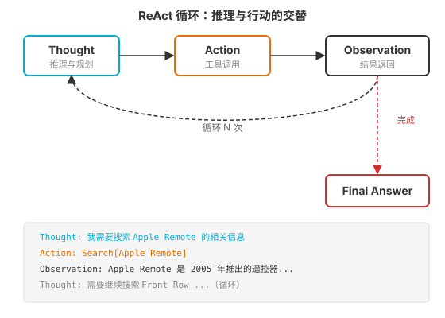
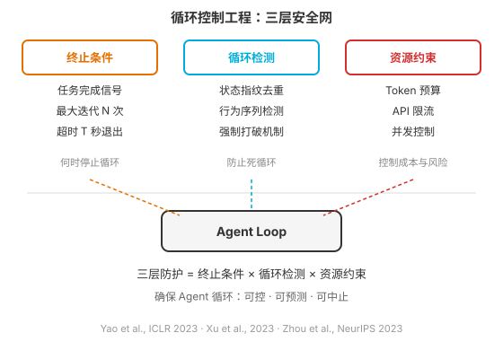
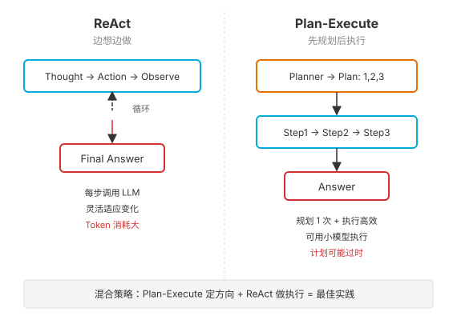

### 第 7 章 Loop 工程 — Agent 的定义性特征

> 📖 本章你将学会：Loop 工程的定义与本质、ReAct 循环的深度解析、循环控制工程的三层安全网、Plan-and-Execute 模式与混合策略

---

#### 开篇：永动机与刹车片

想象一台汽车发动机。活塞在气缸里上上下下，一遍又一遍——这就是"循环"。没有循环，发动机只点一次火就停了，那不叫发动机，叫烟花。

Agent 的 Loop 就是这台发动机的活塞运动。LLM 单次推理就像"点一次火"——它生成一段文本就结束了。但 Agent 不是烟花，Agent 需要持续运转：感知环境、思考对策、采取行动、观察结果、再思考……这个" Thought → Action → Observation → Thought "的循环，才是 Agent 区别于 Chatbot 的本质特征。

但循环带来一个工程难题：**怎么让循环停下来？** 发动机没有刹车就是失控的炸弹，Agent 的循环没有控制机制就是烧钱的黑洞。Loop 工程的核心，不只是"让循环转起来"，更是"让循环可控、可预测、可中止"。

> 💡 比喻：Prompt 工程是写好一张"指令便签条"，Context 工程是整理好整个"工作台"，Loop 工程是给发动机装上"油门、刹车和转速表"。三者缺一不可——光有便签条和工作台，发动机还是会空转到烧毁。

---

#### 7.1 什么是 Loop 工程

##### 7.1.1 Agent Loop = 感知 → 理解 → 规划 → 行动 → 反思

在第 1 章中，我们用"五步循环"定义了 Agent 的基本运作方式：

1. **感知**（Perceive）：接收用户输入或环境信号
2. **理解**（Understand）：解析意图，结合上下文理解当前状况
3. **规划**（Plan）：决定下一步做什么——调用哪个工具、生成什么内容
4. **行动**（Act）：执行工具调用，产生外部影响
5. **反思**（Reflect）：观察行动结果，评估是否达成目标，决定继续循环还是终止

这五步构成一个完整的 **Agent Loop**。Loop 工程就是系统性设计和管理这个循环的工程——决定循环的节奏、控制循环的终止、处理循环中的异常。

##### 7.1.2 Loop 是 Agent 区别于 Chatbot 的本质特征

Chatbot 和 Agent 的根本区别不在模型大小，不在是否接了工具，而在于**有没有循环**。

| 维度 | Chatbot | Agent |
|------|---------|-------|
| 运行模式 | 单轮：输入 → 推理 → 输出 | 多轮循环：感知 → 理解 → 规划 → 行动 → 反思 |
| 状态管理 | 无状态（每次独立） | 有状态（跨步维护上下文） |
| 工具使用 | 最多调一次工具 | 可循环调用多次工具 |
| 终止条件 | 生成结束即终止 | 需要显式终止条件 |
| 典型代表 | GPT 聊天界面 | AutoGPT、Codex CLI、Cursor Agent |

一个 Chatbot 加上工具调用不自动变成 Agent——关键在于它是否在一个循环中**持续感知、规划、行动、反思**。如果它只是"收到问题 → 调一次工具 → 回答"，那它还是 Chatbot，只不过是个会用工具的 Chatbot。只有当它能在循环中根据观察结果调整下一步行动时，它才真正成为 Agent。

> 💡 比喻：Chatbot 像外卖骑手——接到单、取餐、送到、结束。Agent 像侦探——到达现场、勘察线索、调整调查方向、再勘察、再调整……直到破案。侦探的价值不在于单次推理有多聪明，而在于他能在循环中不断逼近真相。

##### 7.1.3 单轮推理 vs 多轮循环：Agent 的分水岭

LLM 的单次推理是一个"前向传播"过程：输入 Token 序列 → 模型计算 → 输出 Token 序列。这个过程没有"回头路"——模型不能在生成中途说"等等，让我查一下资料再继续"。

ReAct 论文（Yao et al., ICLR 2023, arXiv:2210.03629）改变了这一点。它让 LLM 在推理过程中可以"暂停"去调用外部工具，获取信息后再"继续"推理。这种"推理与行动交替"的模式，就是 Agent Loop 的学术原型。

在 ReAct 之前，LLM 只能做"闭卷考试"——所有知识来自训练数据，错了就错了，没法查证。ReAct 让 LLM 变成了"开卷考试"——遇到不确定的问题，可以先去"翻书"（调用工具），再给出答案。

这个从"单轮"到"多轮循环"的转变，是 Agent 诞生的分水岭。

---

#### 7.2 ReAct 循环深度解析

##### 7.2.1 Thought → Action → Observation 循环

ReAct（**Re**asoning + **Act**ing）由普林斯顿大学的 Shunyu Yao 等人在 2022 年 10 月提出（arXiv:2210.03629），发表于 ICLR 2023（Oral Presentation）。论文标题完美概括了核心思想：**"Synergizing Reasoning and Acting in Language Models"**——让推理和行动产生协同效应。

ReAct 的循环结构极其简洁：

```
Thought: 我需要搜索 Apple Remote 的相关信息
Action: Search[Apple Remote]
Observation: Apple Remote 是 2005 年推出的遥控器...
Thought: 需要继续搜索 Front Row 软件
Action: Search[Front Row (software)]
Observation: Front Row 是一款已停产的媒体中心软件...
Thought: 现在我知道答案了
Action: Finish[键盘功能键]
```



三个组件各司其职：

- **Thought**（思考）：模型用自然语言进行推理——分析当前状态、规划下一步、处理异常。这部分是"内部独白"，帮助模型维持逻辑连贯性。
- **Action**（行动）：模型选择并调用一个工具。在原始论文中是 `Search`、`Lookup`、`Finish` 三个动作；现代实现中可以是任意 MCP 工具或 Function Calling。
- **Observation**（观察）：工具执行后返回的结果，被加入上下文供下一轮 Thought 使用。

关键洞察是**推理和行动的协同**：推理（Thought）帮助模型制定和调整行动计划，行动（Action）让模型从外部环境获取新信息，观察（Observation）将新信息反馈给推理过程。这种协同使 Agent 能够动态推理——根据外部反馈调整策略，而不是一次性生成固定的推理链。

##### 7.2.2 ReAct 的实验数据：为什么它改变了游戏规则

ReAct 论文的实验结果令人印象深刻（基于 PaLM-540B 模型）：

| 任务 | 基准方法 | ReAct | 提升 |
|------|----------|-------|------|
| HotpotQA（多跳问答） | CoT: 29.4% EM | ReAct+CoT-SC: 35.1% EM | +5.7% |
| HotpotQA（幻觉率） | CoT: 56% 幻觉 | ReAct: 6% 幻觉 | -50% |
| ALFWorld（交互决策） | 模仿学习: 22% | ReAct: 71% | +49% |
| WebShop（网页购物） | IL+RL: 46% | ReAct: 首次超越 RL | +10% |

最引人注目的是 HotpotQA 上的幻觉率从 56% 降到 6%——ReAct 通过让模型"先查再说"，将"一本正经地胡说八道"的倾向大幅压制。

##### 7.2.3 ReAct 变体：ReWOO / LATS / 递归 ReAct

ReAct 虽好，但有一个工程痛点：**每一步都要把完整的对话历史塞进 Prompt**，Token 消耗随步数线性增长。后续研究提出了多种改进变体。

**ReWOO（Reasoning WithOut Observation）** — Xu et al., 2023, arXiv:2305.18323

ReWOO 的核心思路是"解耦推理与观察"：让 Planner 在不看任何工具结果的情况下，一次性生成完整的工具调用计划（带变量引用），然后批量执行，最后由 Solver 汇总。

```
Plan: 我需要搜索 Apple Remote 的信息           → E1 = Search[Apple Remote]
Plan: 需要搜索它能控制的软件                     → E2 = Search[Front Row]
Plan: 查找其他能控制该软件的设备                  → E3 = Search[Front Row controls]
Solve: 综合 E1, E2, E3 得出答案 → Finish[键盘功能键]
```

ReWOO 在 HotpotQA 上实现了 **5 倍 Token 效率**和 **4% 准确率提升**。代价是计划是静态的——如果第一步搜索返回了意外结果，后续计划可能全部失效。它适合"路径可预见"的任务。

**LATS（Language Agent Tree Search）** — Zhou et al., NeurIPS 2023, arXiv:2310.04406

LATS 将蒙特卡洛树搜索（MCTS）引入 Agent 循环，让 Agent 不再走"单条路径"，而是在多条可能的行动路径上搜索，找到最优轨迹。它将 LLM 同时用作 Agent、价值函数和优化器。

| 方法 | HotpotQA (EM) | HumanEval (pass@1) | WebShop |
|------|---------------|---------------------|---------|
| CoT | 0.34 | 46.9% | N/A |
| ReAct | 0.32 | 56.9% | 53.8 |
| Reflexion | 0.51 | 68.1% | 64.2 |
| **LATS** | **0.71** | **92.7%** (GPT-4) | **75.9** |

LATS 在 HumanEval 上用 GPT-4 达到 92.7% pass@1，是当时的最优结果。代价是计算成本高——每一步要采样多条路径并评估，适合"答案可验证"的高价值任务（如编程、数学），不适合低成本实时场景。

**递归 ReAct（Recursive ReAct）**

递归 ReAct 在主循环中嵌套子循环——当主 Agent 遇到复杂子问题时，"派出"一个子 Agent 用 ReAct 解决，子 Agent 完成后把结果返回给主循环。这种结构类似人类解决问题时的"递归思维"——大问题拆成小问题，每个小问题独立探索。这在第 13 章的 Sub-Agent 模式中会深入讨论。

##### 7.2.4 ReAct 陷阱：循环依赖 / 幻觉行动 / 无限循环

ReAct 不是银弹，它有三个经典陷阱：

**陷阱一：循环依赖**。Agent 在第 N 步的 Thought 依赖第 N-1 步的 Observation，如果第 N-1 步工具返回了错误信息（比如搜索 API 返回了垃圾结果），错误会沿循环传播，导致后续所有推理都建立在错误基础上。这就像导航软件给了错误的路线，你越走越偏。

**陷阱二：幻觉行动**。模型"想象"了一个不存在的工具或编造了工具参数。比如 Action 中写了 `Translate[text]`，但工具列表里根本没有 Translate 工具。现代框架通过 Function Calling 的结构化输出大幅减少了这个问题，但在纯文本 ReAct 模式中仍然存在。

**陷阱三：无限循环**。Agent 陷入死循环——反复执行相同的 Action，得到相同的 Observation，再生成相同的 Thought，永远无法到达 Finish。这是最危险的陷阱，因为每一步都在烧 Token。

> ⚠️ 注意：无限循环不只是"浪费钱"——它是生产环境的头号故障源。一个失控的 Agent 在凌晨 3 点疯狂调用 API，可能在一个晚上烧掉数千美元。循环控制工程（下一节）就是专门解决这个问题的。

---

#### 7.3 循环控制工程

ReAct 论文解决了"怎么让循环转起来"的问题，但生产环境需要解决"怎么让循环安全地停下来"。循环控制工程是 Loop Engineering 的实践核心，包含三层安全网。



##### 7.3.1 终止条件设计：任务完成 / 最大迭代 / 超时

终止条件是循环的"刹车系统"。一个好的 Agent 循环必须有至少三种终止条件，形成多重保险。

**条件一：任务完成信号**。Agent 通过 `Finish[answer]` 或等效机制显式声明任务完成。这是"正常刹车"——Agent 认为自己已经达成目标。但模型可能"误判完成"（比如给了错误答案但自认为正确），所以不能只靠这一条。

**条件二：最大迭代次数**。设置硬性上限 `max_iterations`（通常 10-25 步），达到上限后强制终止。这是"油量报警"——不管任务有没有完成，跑够这么多步就停。这是防止无限循环的最后一道防线。

**条件三：超时机制**。设置 `timeout` 秒数（通常 60-300 秒），从循环开始计时，超时后终止。这是"时间到了"——即使迭代次数没用完，但如果卡在某一步太久（比如工具调用 hang 住了），也要强制退出。

```python
# 三重终止条件的工程实现
MAX_ITERATIONS = 20      # 最多循环 20 次
TIMEOUT_SECONDS = 180    # 最多运行 3 分钟

def agent_loop(task: str):
    start_time = time.time()
    for i in range(MAX_ITERATIONS):
        if time.time() - start_time > TIMEOUT_SECONDS:
            return "超时终止"
        
        thought, action = llm_reason(task, history)
        if action.type == "finish":
            return action.answer  # 正常终止
        
        observation = execute_tool(action)
        history.append((thought, action, observation))
    
    return "达到最大迭代次数，强制终止"
```

##### 7.3.2 循环检测与打破：状态指纹 / 行为去重

终止条件是"硬刹车"，循环检测是"防打滑"——在 Agent 陷入死循环之前就识别并打破它。

**状态指纹去重**。对每一步的 `(Thought, Action, Observation)` 三元组计算哈希指纹，如果发现连续两步（或三步）的指纹完全相同，说明 Agent 陷入了"完全相同的循环"。此时注入一条"你正在重复相同的操作，请尝试不同方法"的提示，强制 Agent 改变策略。

**行为序列检测**。不只看单步重复，还要检测"模式重复"——比如 Agent 反复执行 `Search[X] → Search[Y] → Search[X] → Search[Y]`，虽然单步不重复，但模式在循环。可以通过维护一个滑动窗口，检测最近 N 步是否构成重复模式。

```python
# 循环检测的工程实现
def detect_loop(history: list, window: int = 4) -> bool:
    if len(history) < window * 2:
        return False
    
    # 检查最近 window 步是否与前 window 步完全相同
    recent = [hash_step(h) for h in history[-window:]]
    previous = [hash_step(h) for h in history[-window*2:-window]]
    
    return recent == previous  # 模式重复检测
```

**强制打破机制**。检测到循环后，需要"打破"它——不能只是终止，而是尝试让 Agent 继续完成任务。常见策略包括：(1) 注入"你正在重复，请换一种方法"的提示；(2) 临时禁用导致循环的工具；(3) 切换到 Plan-and-Execute 模式重新规划；(4) 如果多次打破失败，才真正终止并报告失败。

##### 7.3.3 资源约束：Token 预算 / API 限流 / 并发控制

除了控制循环本身，还要控制循环消耗的资源。

**Token 预算**。为整个循环设置一个总 Token 预算（如 100K Token），每次 LLM 调用后累计消耗，超出预算则终止。这比单纯限制迭代次数更精确——有些步骤可能消耗很少 Token，有些可能消耗很多，Token 预算能更真实地反映成本。

**API 限流**。工具调用可能触发外部 API 的速率限制。需要在 Agent 循环中实现退避重试（exponential backoff）、请求队列和熔断器模式。当某个工具连续失败 N 次时，"熔断"该工具一段时间，避免持续打无效请求。

**并发控制**。如果 Agent 同时处理多个任务（或一个任务中有可并行的子步骤），需要控制并发度。过高的并发会触发 API 限流或耗尽系统资源，过低的并发则浪费时间。通常设置 `max_concurrent` 参数（如 3-5）来平衡。

> 💡 比喻：终止条件是"刹车"，循环检测是"防抱死系统"（ABS），资源约束是"油量和转速限制器"。三个系统协同工作，才能让 Agent 循环既高效又安全。

---

#### 7.4 从 ReAct 到 Plan-and-Execute

##### 7.4.1 先规划后执行 vs 边想边做

ReAct 是"边想边做"——每走一步看一步，根据观察结果决定下一步。这适合路径不确定的探索性任务，但对路径相对确定的多步任务，效率不高：每一步都要调用一次 LLM，而且只规划一步，缺乏全局视野。

Plan-and-Execute 是"先规划后执行"——先让 Planner 生成完整的步骤列表，再由 Executor 逐步执行。LangChain 在 2024 年 2 月发布了三种 Plan-and-Execute 架构（Plan-and-Execute、ReWOO、LLMCompiler），灵感来自 Wang et al. 的 Plan-and-Solve Prompting（ACL 2023）和 BabyAGI 项目。



两种模式的本质区别：

| 维度 | ReAct | Plan-and-Execute |
|------|-------|-------------------|
| 规划时机 | 每步规划一步 | 先规划全部步骤 |
| LLM 调用 | 每步一次（大模型） | 规划 1 次（大模型）+ 执行多次（可用小模型） |
| 全局视野 | 弱（只看一步） | 强（看全局计划） |
| 适应变化 | 强（随时调整） | 弱（计划可能过时） |
| Token 消耗 | 高（每步带完整历史） | 低（执行步只带当前步骤） |
| 典型场景 | 探索性任务、路径未知 | 多步流水线、依赖清晰 |

##### 7.4.2 何时用 ReAct，何时用 Plan-and-Execute

选型不是非此即彼，而是根据任务特征匹配：

**用 ReAct 的场景**：
- 任务路径不确定，需要根据中间结果调整方向（如开放式研究）
- 任务步骤少（1-5 步），规划开销不值得
- 需要实时交互，用户可能随时改变需求
- 成本不敏感，追求最高完成率

**用 Plan-and-Execute 的场景**：
- 任务路径可预见，步骤间有明确依赖关系（如数据处理管道）
- 任务步骤多（6+ 步），ReAct 的 Token 消耗成为问题
- 需要向用户展示"将要做什么"（计划可审计）
- 成本敏感，希望用小模型执行具体步骤

##### 7.4.3 混合策略：规划 + 执行 + 反思

生产环境的最佳实践不是选一种，而是**混合使用**——Plan-and-Execute 定大方向，每个步骤的执行用 ReAct 模式处理。

```
混合策略架构：

Planner（大模型）  →  生成计划: [Step1, Step2, Step3, Step4]
                         ↓
Executor（小模型 + ReAct）
    Step1: Thought → Action → Observe → Thought → Finish → 结果1
    Step2: Thought → Action → Observe → Finish → 结果2
    Step3: 失败 → 触发 Replanner
                         ↓
Replanner（大模型）  →  修改计划: [Step3', Step4']
                         ↓
Executor 继续执行 Step3', Step4'
                         ↓
Synthesizer  →  汇总所有步骤结果 → 最终答案
```

这种混合策略兼顾了全局规划（Plan-and-Execute 的优势）和局部灵活性（ReAct 的优势）。LangGraph 的 Plan-and-Execute Agent 就是这种混合架构的典型实现——Planner 节点生成计划，Executor 节点用 ReAct 模式执行每一步，Replanner 节点在失败时修改计划。

业界共识（2024-2026）也支持这种混合方式：
- 可预见的多步流水线用 Plan-and-Execute（配合失败再 Replan）
- 成功路径不要每步 Reflect（那是成本陷阱）
- 执行步内部常套 ReAct（外层计划、内层行动）
- 闲聊/单跳任务不要硬走 PE（短路到更轻的路径）

> 💡 比喻：ReAct 像在没有地图的森林里探索——走一步看一步，灵活但容易绕弯路。Plan-and-Execute 像拿着导航开车——先规划路线再出发，高效但遇到封路要重新规划。混合策略是"先看地图规划主干道，到了具体街区再边走边找门牌号"——兼顾效率和灵活。

---

#### 7.5 本章小结

Loop 工程是四大工程范式的第三层，也是 Agent 区别于 Chatbot 的本质特征。本章的核心认知：

**认知一：Loop 是 Agent 的定义性特征**。不是模型大小、不是是否接了工具，而是有没有在循环中持续感知-规划-行动-反思。ReAct（Yao et al., ICLR 2023）将 LLM 从"单轮推理"转变为"多轮循环"，这是 Agent 诞生的分水岭。

**认知二：循环控制比循环本身更重要**。让循环转起来很容易——一个 while 循环加几个工具定义就能跑。让循环安全地停下来很难——需要终止条件（刹车）、循环检测（ABS）、资源约束（转速限制）三层安全网。生产环境的 Agent 故障，80% 以上与循环失控有关。

**认知三：ReAct 和 Plan-and-Execute 不是对立的**。ReAct 适合探索性任务（边想边做），Plan-and-Execute 适合路径确定的多步任务（先规划后执行）。生产环境的最佳实践是混合策略——Plan-Execute 定方向 + ReAct 做执行 + Replanner 处理失败。

至此，四大工程范式已完成三个：L1 Prompt 工程（第 5 章）、L2 Context 工程（第 6 章）、L3 Loop 工程（本章）。它们是嵌套关系——Context 包含 Prompt，Loop 包含 Context，而最外层的 L4 Harness 工程包含 Loop。下一章我们将进入 Harness 工程的完整图景。
