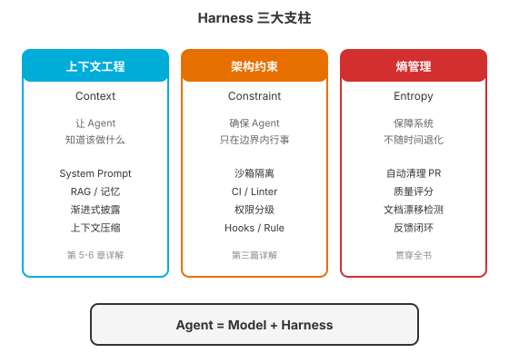
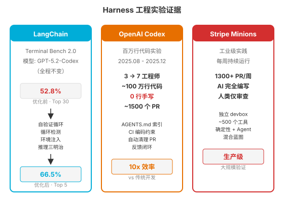

### 第 8 章 Harness 工程 — 构建可靠系统

> 📖 本章你将学会：Harness 工程的定义与核心公式、三大支柱（上下文/约束/熵管理）、六大组件概述、三个标志性实验案例

---

#### 开篇：骑手与马

一匹千里马，如果没有马鞍、缰绳、马蹄铁，骑手敢骑吗？不敢——不是马不够快，而是没有"驾驭系统"，骑手会被甩下来。

LLM 就是这匹千里马。它有惊人的推理能力、广博的知识储备、流畅的语言表达。但"裸"的 LLM 没有记忆（每次对话从零开始）、不能执行代码（只能生成文本）、无法获取实时信息（知识停留在训练截止日）、不能搭建工作环境（没有文件系统和终端）。

**Harness**（原意"马具"）就是套在 LLM 外面的"驾驭系统"——缰绳控制方向，马鞍提供稳定性，马蹄铁保护马蹄。Harness 工程是四大工程范式的最高层（L4），它包含 L1 Prompt 工程、L2 Context 工程、L3 Loop 工程，并在其上增加了架构约束和熵管理，形成一个完整的"让 Agent 可靠工作"的系统工程。

> 💡 比喻：Prompt 工程是"对马喊指令"，Context 工程是"给马看地图"，Loop 工程是"让马持续奔跑"，Harness 工程是"配齐马鞍、缰绳、马蹄铁、护栏和马厩"——前三个让马跑得快，Harness 让马跑得久、跑得安全、跑得可控。

---

#### 8.1 什么是 Harness 工程

##### 8.1.1 定义：设计让 Agent 可靠工作的完整系统

Harness 工程的定义是：**系统性设计让 AI Agent 可靠工作的完整系统**——包括上下文管理、工具编排、架构约束、反馈闭环和安全边界。

关键词是"完整系统"。前三层工程各管一块：Prompt 管指令质量，Context 管信息供给，Loop 管循环控制。Harness 工程把它们全部纳入一个统一的系统框架，并补充了两个关键维度：**架构约束**（确保 Agent 不做坏事）和**熵管理**（确保系统不随时间退化）。

##### 8.1.2 核心公式：Agent = Model + Harness

2026 年 2 月，HashiCorp 联合创始人 Mitchell Hashimoto 在博客中正式提出了这个公式：

> **Agent = Model + Harness**

这个公式看似简单，但它颠覆了行业的默认认知。过去大家以为"更好的 Agent = 更好的模型"——换 GPT-5、换 Claude 4、换更大的参数。但 Hashimoto 的公式明确指出：Agent 的表现由两部分决定，模型只是一半，另一半是 Harness。

更关键的是，这两部分的"杠杆率"不同。模型能力的提升需要巨额训练成本和漫长的研发周期，而 Harness 的优化是工程行为——改一个 Hook、加一个中间件、优化一个 Prompt，几小时内就能见效。

##### 8.1.3 Hashimoto 原则

Hashimoto 给出了 Harness 工程的核心实践原则：

> **"每当 Agent 犯错，就设计一个方案让它永远不再犯同样的错误。"**

这句话看似朴素，但它定义了 Harness 工程的迭代方式：**把每一次失败转化为一条永久性的系统约束**。Agent 忘了运行测试？加一个 PreCompletion Hook 强制运行。Agent 陷入死循环？加一个 LoopDetection 中间件。Agent 跨层调用了不该调用的模块？加一条 CI 规则阻断合并。

这种"失败→约束→永不重犯"的闭环，使得 Harness 随时间推移越来越健壮，Agent 能犯的错越来越少。这与传统软件的"修 Bug"完全不同——修 Bug 是改代码逻辑，Harness 约束是改系统环境。

---

#### 8.2 Harness 三大支柱



Thoughtworks 的杰出工程师 Birgitta Böckeler 在 Martin Fowler 官网上发表的分析文章，将 Harness 工程提炼为三个维度（Martin Fowler 本人也在 Twitter 上为这个框架站台）：

##### 8.2.1 上下文工程（Context）：让 Agent 知道该做什么

上下文工程确保 Agent 在正确时机获得正确信息。这包括我们第 5-6 章讨论的所有内容：System Prompt 设计、RAG 管道、三层记忆架构、渐进式披露、上下文压缩策略。

在 Harness 的框架下，上下文工程有一个重要升级：**可观测性数据直接暴露给 Agent**。OpenAI 的实验中，日志、指标、追踪信息通过本地可观测性栈向 Codex Agent 开放——Agent 可以用 LogQL 和 PromQL 查询来验证服务启动时间，甚至通过 Chrome DevTools Protocol 操作浏览器来重现 Bug。Agent 不再只是"写代码的工具"，它能"看见"代码运行后发生了什么。

##### 8.2.2 架构约束（Constraint）：确保 Agent 只在边界内行事

架构约束通过机械化手段强制执行边界。这是 Harness 区别于前三层工程的核心增量——Prompt 和 Context 管"说什么"和"知道什么"，约束管"能做什么"。

OpenAI 团队定义了严格的分层架构依赖流向：`Types → Config → Repo → Service → Runtime → UI`。任何违反依赖方向的代码都会被两种机制拦截：

- **确定性 Linter**：规则化检查，违反即报错。关键细节——工程师花了数小时重写 Linter 的错误输出格式，让错误消息直接包含修复建议，使 Agent 能"读懂"问题并自动修复。Linter 的受众从人类变成了 AI。
- **LLM 审计 Agent**：用于检查那些难以用形式化规则捕捉的语义违规。

> ⚠️ 注意：将规则写进文档让 Agent "自觉遵守"是无效的。Agent 会选择性遵守文档，但无法绕过编译器和 CI。**约束必须编码化，不能文档化。**

##### 8.2.3 熵管理（Entropy Management）：保障系统不随时间退化

熵管理是三个支柱中最容易被忽视、但对长期运行最关键的一个。

Böckeler 观察到 OpenAI 团队部署了专用的清理 Agent，定期扫描文档漂移、模式违规和依赖问题。为什么需要这个？因为 **Harness 本身也是代码和文档，它们同样会腐化**。随着代码库规模增长，AGENTS.md 可能变得冗长混乱，包含过时、矛盾或不再适用的指令。如果 Harness 自身腐化了，Agent 就会因为读到混乱指令而输出混乱代码。

熵管理的三个实践：
- **自动清理 PR**：后台 Agent 定期扫描偏差、更新质量评分、自动开重构 PR——像垃圾回收一样自动清理技术债。
- **质量评分系统**：为代码库的各个维度维护量化评分，持续追踪趋势。
- **文档漂移检测**：检测文档与代码的不一致，及时更新。

> 💡 比喻：上下文工程是"给骑手看地图"，架构约束是"给马路装护栏"，熵管理是"定期维护马路和护栏本身"。马路不维护会坑洼，护栏不维护会生锈——系统本身需要"保养"。

---

#### 8.3 Harness 六大组件（概述）

在第 3 章我们介绍了 Harness 的六大组件，这里从 Harness 工程的视角做系统性的概述。这六大组件将在第三篇（第 9-13 章）逐一深入展开。

| 组件 | 职责 | 对应工具 | 详解章节 |
|------|------|----------|----------|
| 文件系统 | 存储与版本 | write_to_file / git | 第 3 篇贯穿 |
| Bash + 沙箱 | 代码自验证 | terminal / sandbox | 第 9 章 |
| 记忆（AGENTS.md） | 无需训练注入知识 | MEMORY.md / AGENTS.md | 第 12 章 |
| Web Search + MCP | 打破知识截止 | MCP Server / Web Search | 第 10 章 |
| 上下文工程 | 对抗信息腐烂 | Skills / 压缩策略 | 第 5-6, 11 章 |
| 编排 + Hooks | 保障多 Agent 协同 | Hooks / Sub-Agent | 第 12-13 章 |

这六大组件不是独立零件，而是相互支撑的系统——文件系统提供持久状态，沙箱提供安全执行环境，记忆系统提供跨会话知识，MCP 提供工具生态，上下文工程管理信息质量，编排和 Hooks 控制行为流程。缺任何一块，Agent 都无法可靠工作。

---

#### 8.4 实践案例



三个独立团队用不同的方式验证了同一个结论：**Harness 比 Model 更重要**。

##### 8.4.1 LangChain 实验：仅改 Harness，52.8%→66.5%

2026 年 3 月 10 日，LangChain 的 Vivek Trivedy 发表了《The Anatomy of an Agent Harness》——这是目前最干净的对照实验[^langchain-anatomy]。

**实验设置**：模型固定为 GPT-5.2-Codex，一个参数都不改。基准测试为 Terminal Bench 2.0（89 个编程任务）。唯一变量是 Harness。

**四项改进**：
1. **自验证循环**（PreCompletionChecklistMiddleware）：在 Agent 试图退出时拦截，强制运行验证清单。解决"写完就停"的问题——Agent 最常见的失败模式是生成代码后只"肉眼检查"就提交，不实际运行测试。
2. **环境信息注入**（LocalContextMiddleware）：启动时自动扫描工作目录、定位 Python 环境，注入上下文。减少 Agent 在陌生环境中盲目探索。
3. **循环检测**（LoopDetectionMiddleware）：追踪文件编辑次数，超过阈值注入"考虑换个方案"的提示。消除死循环。
4. **推理三明治**（ReasoningSandwichMiddleware）：规划和验证阶段用高推理强度，执行阶段用中推理强度。最反直觉的发现——给更多算力不一定更好，推理预算的分配比总量更关键。

**结果**：得分从 52.8% 提升到 66.5%（+13.7 个百分点），排名从 Top 30 跃升到 Top 5。

> 💡 这个实验的价值在于变量控制极其干净：模型不变，Harness 变，结果剧变。在"环境比模型更重要"这个论点上，这是目前最直接的证据。

##### 8.4.2 OpenAI 百万行零人工代码实验

2026 年 2 月 11 日，OpenAI 工程师 Ryan Lopopolo 发表报告，描述了一项"刻意设定的极端约束实验"——整个代码库从零开始，必须完全由 AI Agent 生成，零行人类手写代码[^openai-million]。

**核心数据**：
- 团队：3 名工程师起步（后扩展至 7 人）
- 时间：5 个月
- 产出：约 100 万行代码（应用逻辑、测试、CI、文档、内部工具）
- PR：约 1500 个合并请求
- 手写代码：0 行
- 效率：约为传统方式的 10 倍
- 人均日吞吐：3.5 个 PR

**工程师做了什么？** 不是写代码，而是**设计 Harness**：搭建初始仓库结构、编写约束规则、配置 Linter、建立反馈循环。当 Agent 卡顿时，工程师思考的是"Agent 缺失了哪种能力？如何让它理解并执行某项任务？"然后引导 Codex 将改进方案自行编写并提交回代码库。

**三条核心教训**：

1. **AGENTS.md 应精简为索引**。初期团队把所有规则塞进一个庞大的 AGENTS.md，结果 Agent 被信息淹没，性能反而下降。最终方案是 AGENTS.md 精简为约 100 行的"目录"，指向结构化的 `docs/` 子目录，Agent 按需查阅。

2. **约束必须编码化**。规则不写在 Wiki 里让人去看，而是编进 Linter、类型系统、CI 规则。Agent 选择性遵守文档，但无法绕过编译器。团队把关键分层规则嵌入 CI 流程，违反规则的 PR 被自动阻断。

3. **AGENTS.md 是动态反馈循环**。Agent 遇到失败后，把失败原因和解法写回 AGENTS.md。下一个 Agent session 读到更新后的内容，不再重复犯错。这就是 Hashimoto 原则的实践——"让 Agent 永远不再犯同样的错误"。

##### 8.4.3 Stripe 每周 1300+ AI 生成的 PR

Stripe 的 Minions 体系是 Harness 工程在大型组织的工业级实践。

**规模**：每周合并超过 1300 个由 AI 完全编写的 PR，人类仅负责审查。

**基础设施**：
- 每个 Agent 任务在独立的预热 devbox 中运行，与 Stripe 工程师使用的机器完全相同，约 10 秒内启动
- 内置 Stripe 代码库和服务，与生产系统及互联网完全隔离
- 通过名为 Toolshed 的中心化 MCP 服务器托管近 500 个工具
- Agent 与人类开发者享有完全一致的工具访问权限

**架构选择**：确定性节点与 Agent 节点混合的"蓝图"模式。可预测的步骤（推送到 Git、运行 Linter、触发 CI）全部交给确定性代码处理，只在需要判断或创造力的环节才调用 LLM。这种设计把 LLM 限制在"可控盒子"里，大幅提升可预测性。

---

#### 8.5 从理论到落地：第三篇导引

至此，第二篇"四大工程范式"全部完成。我们建立了一个完整的理论框架：

```
L4 Harness 工程（第 8 章）  — 构建可靠系统
  ⊃ L3 Loop 工程（第 7 章）  — Agent 的定义性特征
    ⊃ L2 Context 工程（第 6 章）— 模型的信息环境
      ⊃ L1 Prompt 工程（第 5 章）— 指令的艺术
```

四层是嵌套关系：每一层都包含内层，并增加新的维度。Prompt 管指令质量，Context 管信息供给，Loop 管循环控制，Harness 管系统可靠性。

但理论只是地图，实践才能到达目的地。第三篇"Harness 工程落地"将展开 Harness 六大组件的具体实现：

- **第 9 章 沙箱与安全执行**：如何让 Agent 安全地跑代码
- **第 10 章 MCP 协议深度解析**：如何让 Agent 标准化地调用工具
- **第 11 章 Skills 系统**：如何让 Agent 渐进式地获得能力
- **第 12 章 Rule 与 Hooks**：如何用确定性逻辑约束 Agent 行为
- **第 13 章 Sub-Agent**：如何用多 Agent 分工处理复杂任务

理论到此为止——接下来是"How"。

---

#### 8.6 本章小结

Harness 工程是四大工程范式的最高层，也是从理论走向实践的转折点。本章的核心认知：

**认知一：Agent = Model + Harness**。Agent 的表现由模型和 Harness 共同决定，而且 Harness 的杠杆率远高于模型——改模型需要巨额训练成本，改 Harness 是几小时的工程行为。LangChain 实验证明：同一模型，只改 Harness，得分从 52.8% 跳到 66.5%。

**认知二：Harness 三大支柱缺一不可**。上下文工程让 Agent "知道该做什么"，架构约束确保"只在边界内行事"，熵管理保障"系统不随时间退化"。三者构成了一个完整的可靠性保障体系——少了任何一根支柱，Agent 都会在长期运行中失控。

**认知三：Hashimoto 原则定义了迭代方式**。"每当 Agent 犯错，就设计一个方案让它永远不再犯同样的错误"——这把"调试模型"转化为了"调整系统"，每一次失败都变成一条永久性的系统约束。Harness 随时间推移越来越健壮，Agent 能犯的错越来越少。

**认知四：约束必须编码化，不能文档化**。写在文档里的规则 Agent 会选择性遵守，但编进 CI、Linter、类型系统的规则 Agent 无法绕过。OpenAI 的实验中，分层架构规则不是写在 Wiki 里，而是嵌入 CI 流程——违反即合并失败。

第二篇到此结束。我们用五章篇幅建立了四大工程范式的完整理论框架。接下来进入第三篇——Harness 工程的具体落地。

---

[^langchain-anatomy]: Vivek Trivedy, "The Anatomy of an Agent Harness", LangChain Blog, 2026-03-10, https://blog.langchain.com/the-anatomy-of-an-agent-harness

[^openai-million]: Ryan Lopopolo, OpenAI Blog, 2026-02-11, https://openai.com
