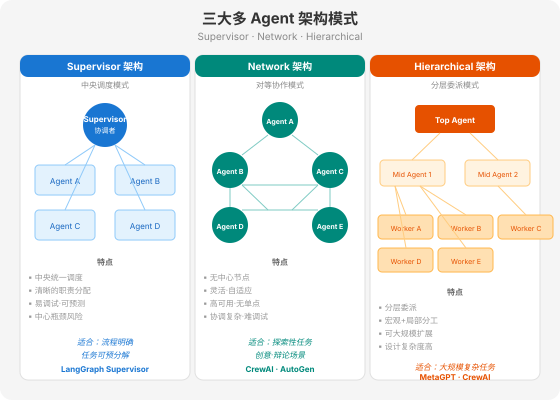
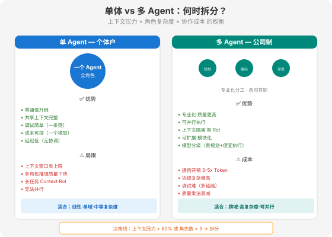

# 第 17 章 多 Agent 架构模式

> 📖 本章你将学会：三大多 Agent 架构模式（Supervisor / Network / Hierarchical）、单体与多 Agent 的决策边界、通信开销与完成率的权衡

---

## 17.1 为什么需要多 Agent

### 17.1.1 单 Agent 的三重天花板

一个 Agent 再强大，终究面临三个无法靠"更强的模型"解决的物理限制：

**天花板 1：上下文窗口的注意力衰减。** 你在第 13 章已经见过 Context Rot——Chroma 2025 年 7 月的测试显示，18 个前沿模型在长上下文中全部退化；Microsoft 的研究发现多轮对话后推理质量下降 39%。当一个 Agent 同时承担"需求分析 + 编码 + 测试 + 审查"四个角色时，它的上下文里塞满了四种不同类型的信息，注意力被分散到四个方向，每个方向的推理质量都在下降。

**天花板 2：角色切换的推理干扰。** LLM 不是人类——人类可以在"写代码"和"做审查"之间自如切换，因为两套思维模式由不同脑区负责。LLM 的所有推理在同一个权重矩阵里进行，上一个角色的思维模式会"泄漏"到下一个角色。一个刚写完代码的 Agent 去做自我审查时，它倾向于认为"自己写的代码没问题"——因为生成代码的上下文还残留着，它会从"作者"视角而非"审查者"视角看代码。

**天花板 3：串行执行的延迟累积。** 单 Agent 只能串行——写代码→测试→修复→再测试。如果这三个步骤可以并行（编码 Agent 写代码的同时，审查 Agent 审查已完成的文件），整体延迟可以大幅缩短。但单 Agent 无法并行，因为它只有一个推理链。

> **比喻：全能选手 vs 专业团队。**

> 全能选手什么都能做，但每件事都只有 70 分。专业团队里每个成员只做一件事，但做到 95 分。团队的总分不是 70×4=280，而是 95×4=380——前提是协作成本不超过 100 分。

### 17.1.2 多 Agent 的三个驱动力

驱动力 1：**复杂度管理**。当一个任务涉及多个领域（编码 + 设计 + 运维 + 文档），把每个领域交给一个专门的 Agent，每个 Agent 的上下文只包含自己领域的知识，推理质量显著提升。Claude Code 的 Sub-Agent 架构就是这条路线——主 Agent 负责规划，子 Agent 在隔离的上下文中执行，最多 49 个并发子 Agent。

驱动力 2：**专业分工**。不同的 Agent 可以用不同的模型——规划 Agent 用 Claude Opus（贵但聪明），执行 Agent 用 Claude Haiku（便宜但够快）。LangChain 的中间件实验证明了这种"模型分级"策略的有效性：固定模型不变，仅优化 Harness，Terminal Bench 2.0 得分从 52.8% 提升到 66.5%。

驱动力 3：**并行效率**。多个 Agent 可以同时工作——5 个 Agent 并行分析 5 个不同的代码文件，总延迟接近单个 Agent 分析一个文件的时间，而非五倍。这对于批量处理类任务（如代码审查、文档翻译、数据清洗）效果显著。

### 17.1.3 但多 Agent 不是银弹

多 Agent 带来了新的工程问题：

| 问题 | 说明 | 典型场景 |
|------|------|----------|
| **通信开销** | Agent 间传递信息消耗 Token，5 个 Agent 协作可能消耗单 Agent 的 3-5 倍 Token | 每个 Agent 的输出成为下一个 Agent 的输入 |
| **协调复杂度** | 谁先做？谁后做？结果冲突怎么办？ | 两个 Agent 给出矛盾的代码审查结论 |
| **故障归因** | 链路中任一 Agent 出错，整条链路出错 | 4 个 Agent 串联，第 3 个幻觉 → 后面全错 |
| **成本乘法** | 质量不会累加，只会乘法式衰减 | 4 个各 90% 正确 → 端到端 0.9⁴ ≈ 65.6% |
| **死锁风险** | Agent A 等 Agent B 的结果，Agent B 等 Agent A 的结果 | 循环依赖未被发现 |

> ⚠️ **关键数据**：微软研究院的实验数据表明，多 Agent 讨论在推理基准测试上对准确率有可量化的改善——但前提是编排层设计得当。编排层的设计水平对最终效果的影响远大于每个 Agent 本身的能力。

---

## 17.2 三大架构模式



### 17.2.1 Supervisor 架构：中央调度模式

**结构**：一个 Supervisor Agent 作为中央调度者，接收用户请求，分解为子任务，分派给专业 Worker Agent 执行，收集结果并汇总输出。

```
用户请求 → Supervisor Agent
              ├── 分解任务 → Agent A（编码）→ 结果 A
              ├── 分解任务 → Agent B（测试）→ 结果 B
              ├── 分解任务 → Agent C（审查）→ 结果 C
              └── 汇总结果 → 最终输出
```

**核心特征**：

- **中央控制**：Supervisor 决定分派什么任务给谁、以什么顺序执行、何时收集结果。Worker 之间不直接通信——所有通信经过 Supervisor 中转。
- **上下文隔离**：每个 Worker Agent 拥有独立的上下文窗口，不共享其他 Worker 的推理过程。Supervisor 只传递压缩后的结构化结果，不传递完整推理链。
- **可预测的控制流**：Supervisor 可以预定义任务分解策略，控制流是确定性代码路径而非 LLM 动态决定。

**LangGraph 的 Supervisor 实现**：

```python
from langgraph.graph import StateGraph, MessagesState, START, END

# Supervisor 决定下一步调用哪个 Worker
def supervisor(state: MessagesState) -> str:
    messages = state["messages"]
    response = llm.invoke([
        {"role": "system", "content": "你是任务调度器。根据当前状态决定下一步调用哪个 Agent。可选：coder / tester / reviewer / FINISH"},
        *messages
    ])
    return {"messages": [response]}  # 返回 "coder" / "tester" / "reviewer" / "FINISH"

# 构建 StateGraph
builder = StateGraph(MessagesState)
builder.add_node("supervisor", supervisor)
builder.add_node("coder", coder_agent)
builder.add_node("tester", tester_agent)
builder.add_node("reviewer", reviewer_agent)

# Supervisor 根据返回值路由
builder.add_conditional_edges("supervisor", lambda x: x["messages"][-1].content)
builder.add_edge("coder", "supervisor")
builder.add_edge("tester", "supervisor")
builder.add_edge("reviewer", "supervisor")
builder.add_edge(START, "supervisor")

graph = builder.compile()
```

> 💡 **比喻：项目经理制。** Supervisor 是项目经理，Worker 是各专业工程师。项目经理不写代码，但决定谁写什么、什么时候交。工程师之间不直接沟通——所有协作通过项目经理协调。好处是流程清晰、职责明确；坏处是项目经理是瓶颈——如果项目经理判断失误，整个团队跟着错。

**适用场景**：

- 流程明确的任务（步骤可预分解）
- 需要严格控制的业务流程
- 子任务有明确的前后依赖关系

**失败模式**：

| 失败模式 | 原因 | 防御策略 |
|----------|------|----------|
| Supervisor 瓶颈 | 所有请求经过中央，并发受限 | 设置 Worker 数量上限 + 并行分派 |
| 分解错误 | Supervisor 对任务理解偏差导致子任务分配不合理 | 加入 Plan-and-Verify 步骤 |
| 上下文膨胀 | Supervisor 累积所有 Worker 的结果，上下文越来越长 | 定期压缩 + 只保留结构化摘要 |

### 17.2.2 Network 架构：对等协作模式

**结构**：没有中央调度者。每个 Agent 地位平等，直接与其他 Agent 通信协商，共同推进任务。Agent 之间通过对话（而非中央分派）决定谁来做什么。

```
用户请求 → Agent A ←→ Agent B
              ↕           ↕
            Agent C ←→ Agent D
             （所有 Agent 直接通信协商）
```

**核心特征**：

- **去中心化**：没有单点故障，没有瓶颈节点。任何 Agent 都可以发起任务、接收任务、委派任务。
- **动态协商**：Agent 之间通过对话协商任务分配——类似人类团队在白板前讨论"谁负责什么"。
- **灵活但不可预测**：控制流由 LLM 动态决定，每次执行路径可能不同。

**CrewAI 的 Network 实现**：

```python
from crewai import Agent, Task, Crew

# 定义角色（平等的团队成员）
coder = Agent(
    role="高级编码工程师",
    goal="编写高质量代码，确保功能正确",
    backstory="10年开发经验，精通多种编程语言",
    allow_delegation=True  # 允许委派任务给其他 Agent
)

reviewer = Agent(
    role="代码审查专家",
    goal="发现代码中的安全漏洞和性能问题",
    backstory="安全审计专家，熟悉 OWASP Top 10",
    allow_delegation=True
)

tester = Agent(
    role="测试工程师",
    goal="编写全面的测试用例",
    backstory="自动化测试专家",
    allow_delegation=True
)

# 定义任务
tasks = [
    Task(description="实现用户认证模块", agent=coder),
    Task(description="审查认证模块的安全性", agent=reviewer),
    Task(description="编写认证模块的单元测试", agent=tester),
]

# Crew 模式（对等协作）
crew = Crew(agents=[coder, reviewer, tester], tasks=tasks, process=Process.sequential)
result = crew.kickoff()
```

> 💡 **比喻：敏捷团队。** Network 架构像一个没有固定 Project Manager 的敏捷团队——团队成员自己协商分工。好处是灵活、适应性强、每个人都能发挥主动性；坏处是效率取决于团队沟通质量——如果大家都在抢同一个任务，或者没人愿意做某个任务，就会卡住。

**适用场景**：

- 探索性任务（无法预先分解）
- 创意协作（如多视角辩论、方案共创）
- 研究/模拟环境

**失败模式**：

| 失败模式 | 原因 | 防御策略 |
|----------|------|----------|
| 无限循环 | Agent 反复协商但不执行 | 设置最大对话轮数 + 超时机制 |
| 死锁 | Agent A 等 B，B 等 A | 检测循环依赖 + 强制打破 |
| 成本爆炸 | 每个 Agent 都在调用 LLM 协商 | 限制参与协商的 Agent 数量 |

> ⚠️ **实践警告**：Network 架构在生产环境中要谨慎使用。多个来源的实践报告指出，网络模式"在实际应用中往往不切实际——没有清晰的流程，Agent 之间的通信是非结构化的，使得系统难以调试、不可靠且运行成本高。" 网络模式通常不适合生产使用，除非你特别需要去中心化设置。

### 17.2.3 Hierarchical 架构：分层委派模式

**结构**：Supervisor 架构的递归扩展。顶层 Agent 处理宏观目标，委托给中层 Agent；中层 Agent 进一步分解，委托给底层 Worker Agent。形成多层组织结构。

```
用户请求 → Top Agent（战略规划）
              ├── Mid Agent 1（后端组）→ Worker A + Worker B
              ├── Mid Agent 2（前端组）→ Worker C + Worker D
              └── Mid Agent 3（QA 组）  → Worker E + Worker F
```

**核心特征**：

- **分层委托**：每一层只与相邻层通信——Top 不直接管 Worker，而是通过 Mid 管理。每层 Supervisor 管理自己的 Worker 集群。
- **宏观 + 微观分工**：Top 做战略规划（"把这个项目拆成后端/前端/QA"），Mid 做战术决策（"后端再拆成 API + 数据库"），Worker 做执行（"写这个 API 端点"）。
- **可大规模扩展**：通过增加层级，可以管理数十甚至上百个 Agent。CrewAI 的三层架构（调度层 → 执行层 → 监控层）就是典型实践。

> 💡 **比喻：公司组织架构。** Hierarchical 架构就是公司的组织架构图——CEO 管总监，总监管经理，经理管工程师。CEO 不直接给工程师派活——他给总监定目标，总监把目标拆成 KPI 给经理，经理把 KPI 拆成具体任务给工程师。好处是可大规模扩展（一个人直接管 10 个人已经是极限，但通过分层可以管上万人）；坏处是信息在传递中会失真（CEO 的战略意图传到工程师时可能已经变味），而且层级越多延迟越高。

**适用场景**：

- 大规模复杂任务（需要数十个 Agent）
- 跨领域协作（不同领域由不同层级的 Agent 管理）
- 模拟人类组织结构（如 MetaGPT 模拟软件公司）

**MetaGPT 的软件公司模拟**：

MetaGPT 是 Hierarchical 架构的典型代表——它模拟一个完整软件公司的组织结构：

| 角色 | 层级 | 职责 |
|------|------|------|
| Product Manager | 顶层 | 需求分析、产品规划 |
| Architect | 中层 | 系统设计、技术选型 |
| Project Manager | 中层 | 任务分解、进度管理 |
| Engineer | 底层 | 代码实现 |
| QA Engineer | 底层 | 测试验证 |

这种结构让 MetaGPT 能够处理从需求到交付的完整软件开发生命周期——一个用户需求进来，Product Manager 分析后传给 Architect 做设计，Architect 传给 Project Manager 拆解任务，Project Manager 分配给 Engineer 实现，QA Engineer 验证。每一层只关注自己的领域，上下文不互相污染。

---

## 17.3 架构选型决策

### 17.3.1 单体 vs 多 Agent 的边界



什么时候该用多 Agent？这是工程实践中最常被问到的问题。答案不是"越复杂越多 Agent"，而是一个明确的决策框架：

**判断维度 1：上下文压力**

当单 Agent 的上下文使用超过窗口的 60% 时，考虑拆分。原因：Context Rot 从 60% 左右开始显著——Adobe NoLiMa 测试显示有效记忆约 2,000 tokens，Chroma 测试显示 18 个模型在长上下文中全部退化。如果你的 Agent 在完成任务前上下文已经塞满，它的推理质量已经在下降。

**判断维度 2：角色数量**

当任务需要超过 3 个不同角色时，考虑拆分。原因：LLM 的角色切换存在"思维泄漏"——刚写完代码的 Agent 做审查时，倾向于从作者视角而非审查者视角看代码。3 个角色以内，单 Agent 通过 System Prompt 切换还能勉强应对；超过 3 个，角色干扰累积，质量明显下降。

**判断维度 3：并行潜力**

当任务有可并行的独立子部分时，多 Agent 可以显著缩短延迟。例如：审查 5 个代码文件——单 Agent 串行需要 5 倍时间，多 Agent 并行只需 1 倍。

**判断维度 4：成本预算**

多 Agent 的 Token 消耗通常是单 Agent 的 3-5 倍（通信开销 + 重复推理）。如果成本预算紧张，优先考虑单 Agent + Context Engineering 优化，而非直接上多 Agent。

**决策表**：

| 维度 | 单 Agent | 多 Agent |
|------|----------|----------|
| 上下文压力 | < 60% 窗口 | > 60% 窗口 |
| 角色数量 | ≤ 3 | > 3 |
| 并行潜力 | 无（线性流程） | 有（独立子任务） |
| 成本预算 | 紧张 | 宽裕 |
| 调试需求 | 高（需要可追溯） | 中（可接受复杂度） |
| 任务复杂度 | 中等 | 高（跨领域） |

> **黄金法则**：从单 Agent 开始，用评估数据（而非直觉）证明拆分带来了质量提升，再逐步扩展为多 Agent。Anthropic 在《Building Effective Agents》中的建议在这里依然适用："找到最简单的解决方案，只在需要时才增加复杂度。"

### 17.3.2 通信开销与完成率的权衡

多 Agent 系统有一个根本性的工程权衡：**通信越多，协作越好，但成本越高**。

```
通信频率    完成率    Token成本    延迟
低 ←──────────────────────────────→ 高
60%        75%        90%         95%
1x         2x         3.5x        5x
```

通信频率太低（Agent 各做各的、不交换信息），完成率只有 60%——因为缺乏协调，结果拼不上。通信频率太高（每一步都向所有 Agent 广播），完成率可达 95%，但 Token 成本是单 Agent 的 5 倍。

**三种通信策略**：

**策略 1：最小通信（Supervisor 中转）**。Worker 只与 Supervisor 通信，Worker 之间不直接通信。通信开销最低（O(n)），但 Supervisor 是瓶颈。

**策略 2：结构化广播（状态共享）**。所有 Agent 共享一个状态黑板（LangGraph 的 StateGraph 模式），每个 Agent 的输出写入黑板，其他 Agent 可以读取。通信开销中等（O(n²) 读但 O(n) 写），灵活度高。

**策略 3：直接对话（Network 模式）**。Agent 之间直接对话协商。通信开销最高（O(n²)），但协作最灵活。

| 策略 | 通信开销 | 完成率 | 延迟 | 适用场景 |
|------|----------|--------|------|----------|
| 最小通信 | O(n) | 60-75% | 低 | 流程明确、可预分解 |
| 状态共享 | O(n²)读/O(n)写 | 75-90% | 中 | 需要灵活协作 |
| 直接对话 | O(n²) | 90-95% | 高 | 探索性、创意任务 |

> 💡 **实践建议**：大多数生产系统应该用"最小通信"或"状态共享"策略。直接对话（Network 模式）留给确实需要高度灵活协作的场景——并且务必设置最大通信轮数和 Token 预算上限。

### 17.3.3 模型分级策略

多 Agent 系统的一个重要优势是**模型分级**——不同层级的 Agent 使用不同级别的模型：

| 层级 | 模型选择 | 理由 |
|------|----------|------|
| 顶层（规划/决策） | Claude Opus / GPT-4o | 需要最强的推理能力做任务分解和战略决策 |
| 中层（协调/审查） | Claude Sonnet / GPT-4o-mini | 中等推理能力足够做协调和简单审查 |
| 底层（执行/编码） | Claude Haiku / GPT-4o-mini | 执行已分解的明确任务，速度优先于深度 |

这种分级策略的成本效益显著：顶层只有 1 个 Agent 用贵模型，中层 2-3 个用中等模型，底层 5-10 个用便宜模型。总成本远低于所有 Agent 都用最贵模型，且质量损失很小——因为底层任务已经充分分解，不需要复杂推理。

```python
# 模型分级配置示例
models = {
    "planner": "claude-opus-4",      # 规划：最强模型
    "coordinator": "claude-sonnet-4", # 协调：中等模型
    "coder": "claude-haiku-4",        # 编码：快速模型
    "tester": "claude-haiku-4",       # 测试：快速模型
    "reviewer": "claude-sonnet-4",    # 审查：中等模型
}
```

---

## 17.4 本章小结

### 三个核心认知

**认知 1：多 Agent 是"组织设计"而非"技术选择"。**

选哪种架构模式，本质上是在设计一个组织——Supervisor 是项目经理制、Network 是敏捷团队、Hierarchical 是公司层级制。组织设计的智慧（职责明确、沟通高效、层级适度）在 Agent 世界同样适用。

**认知 2：拆分必须有评估数据支撑。**

多 Agent 不是"越多越好"——通信开销、协调复杂度、成本乘法都是真实代价。拆分前必须用评估数据证明收益大于成本。"从单 Agent 开始，用数据驱动拆分决策"是最稳妥的工程路径。

**认知 3：编排层比单个 Agent 更重要。**

多 Agent 系统的质量上限由编排层（Supervisor / 调度逻辑 / 通信协议）决定，而非单个 Agent 的能力。5 个平庸 Agent 加上优秀的编排层，可以超过 5 个顶级 Agent 加上糟糕的编排层。编排层设计是第 18-20 章的核心主题。

### 架构模式速查

| 架构 | 核心特征 | 适用场景 | 代表框架 |
|------|----------|----------|----------|
| Supervisor | 中央调度，Worker 独立执行 | 流程明确，可预分解 | LangGraph |
| Network | 对等协作，动态协商 | 探索性，创意任务 | CrewAI, AutoGen |
| Hierarchical | 分层委派，宏观+微观分工 | 大规模复杂任务 | MetaGPT, CrewAI |

### 比喻回顾

| 比喻 | 对应概念 |
|------|---------|
| 全能选手 vs 专业团队 | 单 Agent vs 多 Agent——专业化分工提升质量 |
| 个体户 vs 公司制 | 单 Agent vs 多 Agent——组织化带来规模化 |
| 项目经理制 | Supervisor——中央统一调度，流程清晰 |
| 敏捷团队 | Network——对等协商，灵活自适应 |
| 公司组织架构 | Hierarchical——分层管理，可大规模扩展 |
| 通信频率权衡 | 完成率 vs 成本——通信越多协作越好但成本越高 |

---

*下接 → [第 18 章 Agent 通信协议 — MCP 与 A2A](./第18章%20Agent通信协议.md)*
