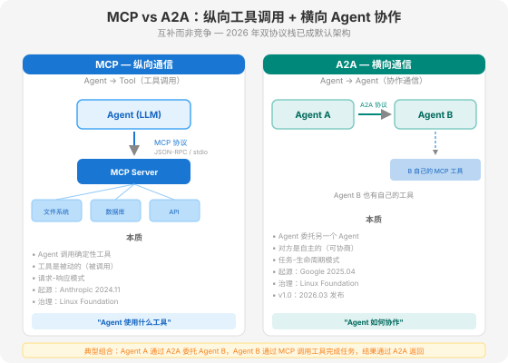
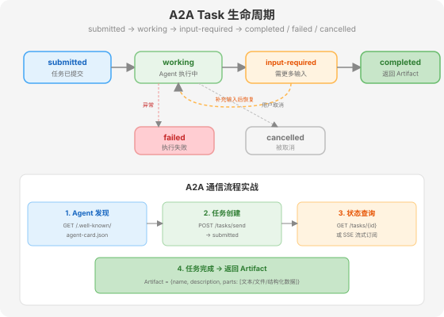

# 第 18 章 Agent 通信协议 — MCP 与 A2A

> 📖 本章你将学会：Agent 通信的两个维度、A2A 协议四大核心概念、Task 生命周期、A2A 通信流程实战、安全风险与防御

---

## 18.1 Agent 通信的两个维度

Agent 要协作，必须通信。但"通信"不是一个维度——它有两个正交方向：

- **纵向通信**：Agent → Tool。一个 Agent 需要调用外部工具（文件系统、数据库、API）。这是 MCP（Model Context Protocol）解决的问题，我们在第 10 章已经深入展开。
- **横向通信**：Agent → Agent。一个 Agent 需要委托另一个 Agent 执行任务、交换信息、协调行动。这是 A2A（Agent-to-Agent）协议解决的问题。



这两个协议**互补而非竞争**。一个典型的生产系统同时使用两者：

```
Agent A（编排者）
  ├── MCP → 文件系统、数据库、搜索引擎（纵向：Agent 调用工具）
  └── A2A → Agent B（数据分析专家）
              ├── MCP → 数据仓库、可视化工具
              └── A2A → Agent C（报告生成专家）
                          └── MCP → 模板引擎、文档系统
```

Agent A 通过 A2A 委托 Agent B 做数据分析，Agent B 通过 MCP 调用数据仓库工具获取数据，完成后通过 A2A 将结果返回给 Agent A。Agent B 又通过 A2A 委托 Agent C 生成报告。每层 Agent 各自用 MCP 管理自己的工具，用 A2A 与其他 Agent 协作。

> 💡 **比喻：USB-C + HTTP。** MCP 像 USB-C——标准化了 Agent 连接工具的接口（一个 USB-C 线接硬盘、接显示器、接充电器）。A2A 像 HTTP——标准化了 Agent 之间通信的协议（一个 HTTP 请求跨越组织边界传递信息）。你不会在"USB-C 还是 HTTP"之间选一个——它们解决不同层面的问题，你两者都需要。

### 18.1.1 MCP 回顾（第 10 章要点）

MCP 的核心定位是**纵向工具调用标准化**：

- **方向**：Agent → Tool（垂直）
- **传输**：JSON-RPC over stdio 或 Streamable HTTP
- **发起方**：Agent 内的 LLM
- **对端**：文件系统、API、数据库（被动的工具）
- **模式**：请求-响应（Agent 调用，工具返回）
- **起源**：Anthropic，2024 年 11 月
- **治理**：Linux Foundation / Agentic AI Foundation

### 18.1.2 A2A 的定位

A2A 的核心定位是**横向 Agent 协作标准化**：

- **方向**：Agent → Agent（水平）
- **传输**：HTTP + JSON-RPC 2.0，支持 SSE 流式推送，v0.3+ 支持 gRPC
- **发起方**：一个自主 Agent（编排者）
- **对端**：另一个自主 Agent（有自己独立的 LLM、工具、上下文）
- **模式**：任务-生命周期（委托 → 执行 → 交换 → 返回）
- **起源**：Google，2025 年 4 月
- **治理**：2025 年 6 月捐赠 Linux Foundation

关键区别在于：MCP 的对端是**被动的工具**——你调用它，它返回结果。A2A 的对端是**自主的 Agent**——你委托它任务，它自己决定怎么完成，可以拒绝、可以协商、可以中途请求更多信息。

---

## 18.2 A2A 协议是什么

### 18.2.1 起源与时间线

A2A（Agent-to-Agent）协议是 Google 于 **2025 年 4 月 9 日** 在 Google Cloud Next 大会上发布的开放协议，目标是让不同框架、不同厂商构建的 Agent 能够互相发现、通信、协作。

**关键时间线**（均经公开来源核实）：

| 时间 | 事件 | 来源 |
|------|------|------|
| 2025.04.09 | Google 在 Cloud Next 发布 A2A 协议，50+ 组织初始支持 | [Google Cloud Blog](https://cloud.google.com/blog/products/ai-machine-learning/agent2agent-protocol-is-getting-an-upgrade) |
| 2025.06 | Google 将 A2A 捐赠给 Linux Foundation，AWS/Cisco/Microsoft/Salesforce/SAP/ServiceNow 加入 | [Linux Foundation 公告](https://www.linuxfoundation.org/press/linux-foundation-launches-the-agent2agent-protocol-project-to-enable-secure-intelligent-communication-between-ai-agents) |
| 2025.07.31 | A2A v0.3.0 发布，引入 gRPC 支持 + Signed Agent Cards | [A2A Protocol 官方文档](https://a2a-protocol.org/latest/) |
| 2025.08 | IBM 的 ACP（Agent Communication Protocol）合并入 A2A，统一标准 | [dev.to 报道](https://dev.to/alexmercedcoder/the-state-of-agentic-ai-standards-in-2026-mcp-a2a-webmcp-osi-and-the-protocol-stack-taking-3o2l) |
| **2026.03.12** | **A2A v1.0 发布**——首个稳定的生产就绪版本 | [A2A Protocol GitHub](https://github.com/a2aproject/A2A) |
| 2026.04 | 一周年：150+ 组织支持，22K+ GitHub Stars，5 种语言 SDK | [Linux Foundation 一周年报告](https://agentmarketcap.ai/blog/2026/04/28/a2a-protocol-one-year-anniversary-linux-foundation-mcp-dual-stack) |

> ⚠️ **时间线说明**：A2A 不是 2026 年才出现的。Google 在 2025 年 4 月就发布了初版，2025 年 6 月捐赠给 Linux Foundation。2026 年 3 月的 v1.0 是首个稳定的生产就绪版本——这是"稳定"而非"诞生"。

### 18.2.2 设计目标

A2A 的设计目标可以用一句话概括：**让不同框架构建的 Agent 能像 Web 服务一样互相发现和协作**。

具体来说，A2A 解决三个问题：

1. **发现问题**：Agent A 怎么知道 Agent B 的存在？Agent B 有什么能力？→ Agent Card
2. **委托问题**：Agent A 怎么把任务交给 Agent B？怎么知道任务完成了？→ Task 生命周期
3. **交换问题**：Agent A 和 Agent B 怎么传递消息和产物？→ Message + Artifact

A2A 的核心设计原则是**Agent 不透明**——Agent A 不需要（也不应该）知道 Agent B 的内部实现（用什么模型、什么 Prompt、什么工具）。A2A 只标准化"信封"（任务格式、通信协议），不标准化"信件内容"（Agent 内部怎么推理）。这种"信封标准化、内容自由化"的设计，让不同厂商的 Agent 可以在不暴露内部架构的情况下协作。

### 18.2.3 A2A vs MCP 对比

| 维度 | MCP | A2A |
|------|-----|-----|
| **方向** | 纵向：Agent → Tool | 横向：Agent → Agent |
| **对端性质** | 被动工具（被调用） | 自主 Agent（可协商） |
| **发起方** | Agent 内的 LLM | 编排者 Agent |
| **传输** | stdio / Streamable HTTP | HTTP + JSON-RPC / gRPC / SSE |
| **通信模式** | 请求-响应 | 任务-生命周期 |
| **典型场景** | Agent 调用文件系统、数据库 | Agent 委托另一个 Agent |
| **起源** | Anthropic 2024.11 | Google 2025.04 |
| **治理** | Linux Foundation | Linux Foundation |
| **稳定版** | 已稳定 | v1.0（2026.03） |

> 💡 **一句话区分**：MCP 回答"Agent 使用什么工具"，A2A 回答"Agent 如何协作"。MCP 是工具调用标准化，A2A 是 Agent 间委托标准化。

---

## 18.3 A2A 四大核心概念

A2A 协议有四个核心概念：Agent Card、Task、Message、Artifact。理解了这四个概念，就理解了 A2A 的全部。

### 18.3.1 Agent Card（Agent 名片）

Agent Card 是 Agent 的**自描述文档**——一个 JSON 文件，发布在 Agent 的 well-known URL 上，声明"我是谁、我能做什么、怎么认证我"。

**发布位置**：

```
GET https://agents.example.com/.well-known/agent-card.json
```

> ⚠️ v1.0 将路径从 `/.well-known/agent.json` 改为 `/.well-known/agent-card.json`。v1.0 兼容的服务器应同时提供两个路径以支持旧客户端。

**Agent Card 内容**：

```json
{
  "name": "DataAnalystAgent",
  "description": "分析结构化数据集并生成统计报告",
  "url": "https://agents.example.com/data-analyst",
  "version": "1.2.0",
  "capabilities": {
    "streaming": true,
    "pushNotifications": true
  },
  "skills": [
    {
      "id": "analyze-csv",
      "name": "Analyze CSV",
      "description": "解析CSV文件并返回统计摘要"
    },
    {
      "id": "generate-report",
      "name": "Generate Report",
      "description": "根据分析结果生成可视化报告"
    }
  ],
  "authentication": {
    "schemes": ["Bearer"]
  }
}
```

**v1.0 新增：Signed Agent Cards**。v1.0 为 Agent Card 增加了**密码学签名**——接收方可以验证名片确实是由声称拥有该域名的发行者签发的，而非传输中被篡改的。这对于跨组织协作至关重要：在让一个公司的 Agent 委托支付任务给另一个公司的 Agent 之前，你至少需要验证对方的身份。

> 💡 **比喻：DNS 记录 + 服务发现。** Agent Card 像 DNS 记录——告诉你"这个域名对应什么服务、在哪个 IP"。又像服务发现——你不需要事先知道所有 Agent 的地址，只需要查询对方的 well-known URL 就能发现它的能力。Signed Agent Cards 则像 DNSSEC——不仅告诉你地址，还密码学证明这个地址是真的。

### 18.3.2 Task（任务）

Task 是 Agent 间协作的**核心单元**。一个 Agent 向另一个 Agent 发送一个 Task，接收方执行后返回结果。

**Task 的关键特性**：

- **有状态生命周期**：Task 不是"发过去就完"——它有明确的状态流转（submitted → working → completed 等）
- **长时任务支持**：Task 可以是异步的——发送后不立即返回，Agent 可以轮询状态或通过 SSE 流式订阅
- **可中断**：Task 可以中途暂停（input-required 状态），等待更多输入后恢复

### 18.3.3 Message（消息）

Message 是 Task 内的**对话轮次**。一个 Task 可以包含多轮 Message——Agent A 发一条消息，Agent B 回复一条，Agent A 再发一条……

**Message 结构**：

```json
{
  "role": "user",  // "user"（发起方）或 "agent"（接收方）
  "parts": [
    {
      "type": "text",
      "text": "请分析这份销售数据"
    },
    {
      "type": "file",
      "file": {
        "name": "sales.csv",
        "mimeType": "text/csv",
        "data": "..."  // base64 或 URL
      }
    }
  ]
}
```

Message 的 `parts` 可以是文本、文件或结构化数据。这种设计让 Agent 间可以传递任意类型的内容——不限于自然语言，还可以传文件、传 JSON、传图片。

### 18.3.4 Artifact（产物）

Artifact 是 Task 的**输出产物**——Agent 完成任务后产出的具体成果物。

**Artifact 结构**：

```json
{
  "name": "sales-analysis-report",
  "description": "2026年Q2销售数据分析报告",
  "parts": [
    {
      "type": "text",
      "text": "本季度销售额同比增长15%..."
    },
    {
      "type": "file",
      "file": {
        "name": "chart.png",
        "mimeType": "image/png"
      }
    }
  ]
}
```

Artifact 可以被其他 Agent 消费和引用——Agent C 可以引用 Agent B 产出的 Artifact 作为自己任务的输入。这让 Agent 间的协作形成流水线——每个 Agent 的产出成为下一个 Agent 的输入。

> 💡 **比喻：工单系统。** Task 像企业内部的工单——你提交一个工单（submitted），工程师开始处理（working），如果他需要更多信息会暂停等你回复（input-required），处理完交付成果（completed），如果处理不了就标记失败（failed），你也可以撤销工单（cancelled）。Message 是工单内的对话记录，Artifact 是工单的交付物。

---

## 18.4 A2A Task 生命周期详解



Task 有 7 个状态，分为三类：正常流转、中断等待、终止状态。

### 18.4.1 正常流转状态

**submitted（已提交）**：任务已创建并发送给接收 Agent，等待 Agent 接收。这是 Task 的初始状态。

**working（执行中）**：Agent 已接收任务并正在执行。在这个状态下，Agent 可能调用 MCP 工具、推理、生成分步结果。如果是长时任务，Agent 可以通过 SSE 流式推送中间进度。

### 18.4.2 中断等待状态

**input-required（需更多输入）**：Agent 在执行过程中发现需要更多信息才能继续——可能是需要人类介入（Human-in-the-Loop），也可能是需要发起方 Agent 提供额外数据。Task 在此状态**暂停**，等待发起方提供输入后恢复到 working 状态。

**auth-required（需认证）**（v1.0 新增）：Agent 需要认证才能继续执行——可能是策略引擎检查、消费/爆炸半径防护，或人工审批。这是 v1.0 专门为生产环境设计的 interrupted 状态。

> ⚠️ **设计要点**：input-required 和 auth-required 是**显式中断状态**——Task 明确暂停等待外部输入，而不是连接挂起或超时。这让发起方可以精确地知道"任务没失败，只是在等东西"。

### 18.4.3 终止状态

**completed（已完成）**：任务成功完成，返回 Artifact。发起方可以获取 Artifact 并用于后续处理。

**failed（失败）**：任务执行失败，返回错误信息。失败原因可能是 Agent 能力不足、工具调用失败、内部推理错误等。

**cancelled（已取消）**：任务被发起方取消。可能在任何状态下被取消。

### 18.4.4 状态转换规则

```
submitted → working（Agent 接收任务）
working → input-required（需要更多输入）
working → auth-required（需要认证/审批）
working → completed（成功完成）
working → failed（执行失败）
input-required → working（收到补充输入后恢复）
任意状态 → cancelled（被取消）
```

**异常处理**：

- **超时**：如果 Task 在 submitted 或 working 状态超过预设时间，发起方可以主动 cancel
- **恢复**：input-required 状态的 Task 恢复后，Agent 从中断点继续执行，而非从头开始
- **幂等性**：重复发送相同 Task 应返回相同结果（Agent 应实现幂等处理）

---

## 18.5 A2A 通信流程实战

### 18.5.1 完整通信流程

一个典型的 A2A 通信流程分为四步：

**步骤 1：Agent 发现**

发起方 Agent 获取接收方的 Agent Card：

```python
import httpx

async def discover_agent(agent_url: str) -> dict:
    """获取目标 Agent 的 Agent Card"""
    card_url = f"{agent_url}/.well-known/agent-card.json"
    async with httpx.AsyncClient() as client:
        response = await client.get(card_url)
        response.raise_for_status()
        card = response.json()

    # v1.0：验证签名（如果卡片已签名）
    if "signature" in card:
        verify_card_signature(card)  # 密码学验证

    return card

# 使用
card = await discover_agent("https://agents.example.com/data-analyst")
print(f"Agent: {card['name']}")
print(f"Skills: {[s['name'] for s in card['skills']]}")
```

**步骤 2：任务创建**

发起方创建 Task 并发送给接收方：

```python
async def send_task(agent_url: str, task_input: dict) -> dict:
    """创建并发送 A2A Task"""
    async with httpx.AsyncClient() as client:
        response = await client.post(
            f"{agent_url}/tasks/send",
            json={
                "id": "task-001",
                "message": {
                    "role": "user",
                    "parts": [
                        {"type": "text", "text": "请分析这份销售数据"},
                        {"type": "file", "file": {"name": "sales.csv", "data": "..."}}
                    ]
                }
            }
        )
        return response.json()

# 使用
task = await send_task(card["url"], {"description": "分析销售数据"})
print(f"Task status: {task['status']}")  # "submitted" 或 "working"
```

**步骤 3：状态查询**

对于长时任务，发起方可以轮询状态或通过 SSE 流式订阅：

```python
# 方式 A：轮询
async def poll_task_status(agent_url: str, task_id: str) -> dict:
    async with httpx.AsyncClient() as client:
        response = await client.get(f"{agent_url}/tasks/{task_id}/status")
        return response.json()

# 方式 B：SSE 流式订阅（推荐，减少轮询开销）
async def subscribe_task(agent_url: str, task_id: str):
    async with httpx.AsyncClient() as client:
        async with client.stream("GET", f"{agent_url}/tasks/{task_id}/subscribe") as response:
            async for line in response.aiter_lines():
                if line.startswith("data: "):
                    event = json.loads(line[6:])
                    print(f"Status update: {event['status']}")
                    if event["status"] in ("completed", "failed", "cancelled"):
                        break
```

**步骤 4：获取 Artifact**

任务完成后，获取产出物：

```python
async def get_artifact(agent_url: str, task_id: str) -> dict:
    async with httpx.AsyncClient() as client:
        response = await client.get(f"{agent_url}/tasks/{task_id}/artifact")
        return response.json()

# 使用
artifact = await get_artifact(card["url"], "task-001")
print(f"Artifact: {artifact['name']}")
for part in artifact["parts"]:
    if part["type"] == "text":
        print(part["text"])
    elif part["type"] == "file":
        save_file(part["file"])
```

### 18.5.2 完整示例：Agent A 委托 Agent B 做数据分析

```python
import asyncio
import httpx
import json

async def main():
    # 1. 发现数据分析 Agent
    card = await discover_agent("https://agents.example.com")
    print(f"Found agent: {card['name']} - {card['description']}")

    # 验证 Agent 有数据分析能力
    has_analyze_skill = any(s["id"] == "analyze-csv" for s in card["skills"])
    if not has_analyze_skill:
        raise ValueError("Agent doesn't support CSV analysis")

    # 2. 创建数据分析任务
    task = await send_task(card["url"], {
        "description": "分析Q2销售数据，生成趋势报告"
    })
    task_id = task["id"]
    print(f"Task created: {task_id}, status: {task['status']}")

    # 3. 流式订阅状态更新
    async for status_update in subscribe_task(card["url"], task_id):
        print(f"Progress: {status_update['status']}")
        if status_update["status"] == "input-required":
            # Agent 需要更多输入
            await provide_input(card["url"], task_id, "使用柱状图展示")
        elif status_update["status"] == "completed":
            break

    # 4. 获取分析报告
    artifact = await get_artifact(card["url"], task_id)
    print(f"Report: {artifact['name']}")
    for part in artifact["parts"]:
        if part["type"] == "text":
            print(part["text"][:200] + "...")
        elif part["type"] == "file":
            print(f" 附件: {part['file']['name']}")

asyncio.run(main())
```

---

## 18.6 A2A 安全风险与防御

### 18.6.1 四大安全风险

| 风险 | 说明 | 严重性 |
|------|------|--------|
| **恶意 Agent Card** | 攻击者发布虚假 Agent Card，声称有某些能力但实际是恶意 Agent | 高 |
| **任务劫持** | 中间人攻击截获 A2A 通信，篡改任务内容或结果 | 高 |
| **数据泄露** | 跨 Agent 的敏感信息流转——Agent A 传给 Agent B 的数据可能包含敏感信息 | 中 |
| **拒绝服务** | 恶意 Agent 发送大量 Task 消耗目标 Agent 资源 | 中 |

### 18.6.2 防御策略

**策略 1：Signed Agent Cards（v1.0 内置）**

v1.0 的 Signed Agent Cards 通过密码学签名解决"虚假 Agent Card"问题——接收方在委托任务前验证名片的签名，确认名片确实由声称拥有该域名的发行者签发。这是跨组织协作的最低安全基线。

**策略 2：OAuth 2.0 + PKCE**

v1.0 要求 Authorization Code 流程必须使用 PKCE（Proof Key for Code Exchange），阻止 Token 拦截攻击。同时移除了 implicit/password grant 等不安全的认证流程。

**策略 3：能力验证**

不要只信任 Agent Card 声明的能力——在实际委托敏感任务前，发送一个测试 Task 验证 Agent 确实具备声称的能力。

**策略 4：审计日志**

记录所有 A2A 通信——谁委托了什么任务、结果是什么、何时发生。在安全事件发生时，审计日志是追溯和归因的关键。

**策略 5：最小权限原则**

Agent Card 的 `authentication.schemes` 应使用最小权限——数据分析 Agent 不需要写入权限，只给读权限。v1.0 的多租户支持让一个端点可以服务多个 Agent，按租户隔离权限。

> ⚠️ **安全红线**：Red Hat 2026 年 6 月的安全洞察同样适用于 A2A——安全约束不能用 LLM 来执行，必须用确定性代码实现。Agent Card 的签名验证、认证流程、权限检查必须是代码层面的硬约束，不能依赖 Agent "自觉遵守"。

---

## 18.7 A2A 生态采用

### 18.7.1 主流框架支持

截至 2026 年中，A2A 已获得主流 Agent 框架的广泛支持：

| 框架 | A2A 支持状态 | 说明 |
|------|-------------|------|
| LangGraph | 已支持 | LangChain 生态，StateGraph + A2A 集成 |
| CrewAI | 已支持 | 角色驱动的多 Agent 框架 |
| AutoGen | 已支持 | Microsoft 的对话式多 Agent 框架 |
| LlamaIndex | 已支持 | 数据驱动的 Agent 框架 |
| Semantic Kernel | 已支持 | Microsoft 的 AI 编排框架 |
| Google ADK | 原生支持 | Google 官方 Agent Development Kit |

### 18.7.2 企业采用

A2A 已在多个企业级平台的生产环境中部署：

- **Microsoft**：Azure AI Foundry 和 Copilot Studio 原生支持 A2A
- **AWS**：Amazon Bedrock AgentCore 集成 A2A
- **Google Cloud**：Vertex AI Agent Builder 将 A2A 作为默认 Agent 间传输协议
- **Salesforce / SAP / ServiceNow**：均已部署 A2A 生产环境

### 18.7.3 与 MCP 的协同生态

2026 年的企业架构已经从"MCP vs A2A"之争转向"MCP + A2A 双协议栈"。Linux Foundation 同时托管 MCP 和 A2A，两者在 Agentic AI Foundation 下协同发展。企业架构师的共识是：

- **MCP** 用于 Agent 内部的工具调用（纵向）
- **A2A** 用于 Agent 间的协作通信（横向）
- 两者**组合使用**是默认参考架构

> 💡 **SDK 可用性**：A2A v1.0 提供五种语言的官方 SDK——Python、JavaScript/TypeScript、Java（Quarkus 发布 a2a-java-sdk 1.0.0.Alpha1）、Go、C#/.NET。所有 SDK 在 Linux Foundation 治理下维护，而非 Google 控制的单一代码库。

---

## 18.8 本章小结

### 五个核心认知

**认知 1：MCP 和 A2A 解决不同层面的问题，互补而非竞争。**

MCP 标准化"Agent → 工具"的纵向通信，A2A 标准化"Agent → Agent"的横向通信。生产系统同时使用两者——MCP 管理每个 Agent 的工具，A2A 管理 Agent 间的协作。

**认知 2：A2A 的四大核心概念覆盖了 Agent 协作的全部需求。**

Agent Card（发现）→ Task（委托）→ Message（对话）→ Artifact（产出）。发现 → 委托 → 交换 → 产出，这是一个完整的协作闭环。

**认知 3：Task 生命周期让异步协作成为可能。**

Task 不是"发过去就完"——它有 7 个状态、支持中断恢复、支持长时异步执行。这让 Agent 可以处理需要人工介入、需要多轮交互、需要长时间执行的任务。

**认知 4：A2A v1.0 的安全特性是企业级协作的基线。**

Signed Agent Cards（身份验证）+ OAuth 2.0 PKCE（认证安全）+ 多租户隔离 + 最小权限——这些是让一个组织的 Agent 安全地委托任务给另一个组织的 Agent 的最低要求。

**认知 5：A2A 已成为事实标准。**

150+ 组织支持、5 种语言 SDK、主流框架和企业平台全面集成、Linux Foundation 中立治理——A2A 在 Agent 间通信领域已没有实质竞争对手。IBM 的 ACP 已合并入 A2A，统一了标准。

### 关键数据

| 数据 | 来源 | 含义 |
|------|------|------|
| 2025.04.09 发布 | Google Cloud Next | A2A 协议诞生 |
| 2025.06 捐赠 Linux Foundation | Linux Foundation 公告 | 中立治理 |
| 2026.03.12 v1.0 | A2A GitHub | 首个稳定生产版 |
| 150+ 组织支持 | Linux Foundation 2026.04 一周年报告 | 生态规模 |
| 22K+ GitHub Stars | 同上 | 社区关注 |
| 5 种语言 SDK | Python/JS/Java/Go/.NET | 跨语言支持 |

### 比喻回顾

| 比喻 | 对应概念 |
|------|---------|
| USB-C + HTTP | MCP + A2A——不同层面的标准，互补使用 |
| DNS + 服务发现 | Agent Card——发现和定位 Agent |
| DNSSEC | Signed Agent Cards——密码学验证身份 |
| 工单系统 | Task 生命周期——提交→执行→中断→完成/失败 |

---

*下接 → [第 19 章 多 Agent 协作策略](./第19章%20多Agent协作策略.md)*
