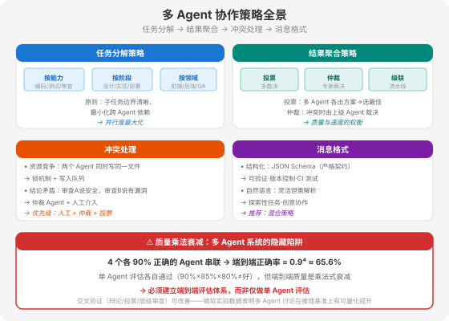

# 第 19 章 多 Agent 协作策略

> 📖 本章你将学会：任务分解策略、结果聚合方法、冲突处理机制、消息格式设计

---

## 19.1 协作策略



多 Agent 系统的核心挑战不在"怎么通信"（那是 A2A 协议的事），而在"怎么协作"。通信是管道，协作是内容。这一章回答四个工程问题：

1. 任务怎么分解给多个 Agent？
2. 多个 Agent 的结果怎么聚合？
3. Agent 之间冲突了怎么办？
4. Agent 之间传什么格式的消息？

### 19.1.1 任务分解：按能力 / 按阶段 / 按领域

任务分解是多 Agent 系统的第一步——把一个大任务拆成多个子任务，分配给不同的 Agent。三种分解策略：

**按能力分解**：根据 Agent 的专业能力划分任务。例如一个软件开发任务拆成"编码 Agent 写代码""测试 Agent 写测试""审查 Agent 做安全审计"。每个 Agent 在自己的专业领域内执行，互不干扰。

```
软件开发任务
├── 编码 Agent → 实现 API 端点
├── 测试 Agent → 编写单元测试
└── 审查 Agent → 安全漏洞扫描
```

**按阶段分解**：根据任务的生命周期阶段划分。例如一个数据处理任务拆成"采集 Agent 收集数据""清洗 Agent 处理数据""分析 Agent 做分析""报告 Agent 生成报告"。前一个阶段的输出是后一个阶段的输入。

```
数据处理任务
├── 采集 Agent → 从多个数据源收集
├── 清洗 Agent → 去重·格式化·校验
├── 分析 Agent → 统计分析·趋势识别
└── 报告 Agent → 生成可视化报告
```

**按领域分解**：根据业务领域划分。例如一个企业运营任务拆成"销售 Agent 管销售""库存 Agent 管库存""物流 Agent 管发货"。不同领域的 Agent 可以并行工作，通过共享状态协调。

```
企业运营任务
├── 销售 Agent → 处理订单
├── 库存 Agent → 检查库存
├── 物流 Agent → 安排发货
└── 财务 Agent → 开具发票
```

**分解原则**：

| 原则 | 说明 | 目的 |
|------|------|------|
| 子任务边界清晰 | 每个子任务的输入输出明确 | 避免重叠和遗漏 |
| 最小化跨 Agent 依赖 | 子任务之间尽量独立 | 并行度最大化 |
| 单一职责 | 一个 Agent 只负责一件事 | 推理质量最大化 |
| 可验证性 | 每个子任务有明确的验收标准 | 质量可控 |

> 💡 **比喻：项目管理中的 WBS。** 任务分解就是项目管理里的 WBS（Work Breakdown Structure，工作分解结构）。好的 WBS 让每个工作包独立、可分配、可验收。差的 WBS 让工作包之间纠缠不清，一个延期拖累全部。Agent 任务分解同理——边界不清的分解会导致 Agent 之间反复通信协调，通信开销吃掉并行收益。

### 19.1.2 结果聚合：投票 / 仲裁 / 级联

多个 Agent 的结果需要聚合为最终输出。三种聚合方法：

**投票（Voting）**：多个 Agent 各自独立完成任务，产出多个方案，通过投票选最佳。适合需要"多视角提升置信度"的场景。

```python
# 投票聚合示例
def voting_aggregation(results: list[str]) -> str:
    """多 Agent 结果投票"""
    # 用 LLM 作为 Judge 评估每个方案
    scores = []
    for i, result in enumerate(results):
        score = llm_judge(result, criteria="准确性·完整性·清晰度")
        scores.append((i, score))

    # 选得分最高的
    best_idx = max(scores, key=lambda x: x[1])[0]
    return results[best_idx]

# 5 个 Agent 各写一个方案，投票选最佳
results = [agent.run(task) for agent in agents]  # 并行执行
best = voting_aggregation(results)
```

**仲裁（Arbitration）**：当多个 Agent 的结果冲突时，由一个仲裁 Agent（通常是更高层级的 Agent）裁决。适合结果可能矛盾的场景。

```
审查 Agent A → "代码安全，无漏洞"
审查 Agent B → "发现 SQL 注入风险"
         ↓
  仲裁 Agent → 权衡两个结论 → "B 正确，A 遗漏了"
```

**级联（Cascading）**：Agent 的结果按顺序串联——前一个的输出是后一个的输入。适合流水线式任务。

```
采集 Agent → 原始数据 → 清洗 Agent → 干净数据 → 分析 Agent → 分析结果 → 报告 Agent → 最终报告
```

| 聚合方法 | 适用场景 | 优点 | 缺点 |
|----------|----------|------|------|
| 投票 | 需要多视角、提升置信度 | 容错性好、可量化 | 成本 N 倍 |
| 仲裁 | 结果可能矛盾 | 精确、可追溯 | 仲裁者是瓶颈 |
| 级联 | 流水线式任务 | 效率高、自然 | 任一环节出错全链路出错 |

### 19.1.3 冲突处理：资源竞争 / 结论矛盾 / 死锁

多 Agent 系统不可避免地会出现冲突。三类常见冲突：

**资源竞争**：两个 Agent 同时尝试修改同一个文件或资源。

```
Agent A → 写入 config.yaml
Agent B → 同时写入 config.yaml  ← 冲突！
```

防御策略：**锁机制 + 写入队列**。对共享资源实施排他锁，Agent 必须获取锁才能写入。或采用单写入者模式——所有写操作经过一个队列串行执行。

**结论矛盾**：两个审查 Agent 给出矛盾的结论（一个说安全，一个说有漏洞）。

防御策略：**仲裁机制 + 人工介入**。设置一个仲裁 Agent 权衡矛盾结论；当仲裁无法决断时，升级到人工审查。优先级链：人工 > 仲裁 > 投票。

**死锁**：Agent A 等待 Agent B 的结果，Agent B 等待 Agent A 的结果。

```
Agent A → 等待 Agent B 的测试结果
Agent B → 等待 Agent A 的代码实现  ← 死锁！
```

防御策略：**循环依赖检测 + 超时机制**。在任务分解时检测是否存在循环依赖；为每个 Task 设置超时时间，超时后自动取消并报告错误。

> ⚠️ **实践建议**：冲突处理的关键是"提前设计而非事后补救"。在架构设计阶段就要明确：哪些资源是共享的（需要锁）、哪些结论可能矛盾（需要仲裁）、哪些任务有依赖关系（需要排序）。事后补救的代价极高——在运行中的多 Agent 系统里定位死锁，比在编译时检测循环依赖难一个数量级。

### 19.1.4 质量乘法衰减：多 Agent 的隐藏陷阱

这是多 Agent 系统最容易被忽视的工程问题：**单个 Agent 的质量不等于系统端到端质量**。

```
单 Agent 评估：
  编码 Agent：90% 正确
  测试 Agent：85% 正确
  审查 Agent：80% 正确

端到端质量：
  90% × 85% × 80% = 61.2%  ← 远低于任何单个 Agent！
```

质量不会累加——它是乘法式衰减。4 个各 90% 正确的 Agent 串联，端到端正确率只有 0.9⁴ ≈ 65.6%。这意味着：

1. **不能只做单 Agent 评估**——必须建立端到端评估体系，以人类标注结果为基线衡量最终输出质量
2. **交叉验证可以改善**——微软研究院的实验数据表明，多 Agent 讨论（辩论、投票、层级审查）在推理基准测试上对准确率有可量化的改善
3. **减少串联环节**——4 个 Agent 串联的端到端质量低于 2 个 Agent 串联，能用 2 个 Agent 解决就不要用 4 个

---

## 19.2 消息格式：结构化 vs 自然语言

Agent 之间传递什么格式的消息？这是一个看似简单但影响深远的工程决策。

### 19.2.1 结构化消息：JSON Schema 定义

结构化消息使用 JSON Schema 定义严格的字段和类型。Agent 之间传递的是结构化数据，而非自然语言文本。

```json
// 结构化消息示例
{
  "task_id": "review-001",
  "agent_from": "coder-agent",
  "agent_to": "reviewer-agent",
  "message_type": "code_review_request",
  "payload": {
    "file_path": "src/auth/login.py",
    "lines": "45-60",
    "code": "def login(username, password):...",
    "context": "新增的登录认证模块"
  },
  "expected_response": {
    "issues": [{"type": "string", "severity": "string", "description": "string"}],
    "overall_assessment": "string"
  }
}
```

**优点**：

- 可验证——接收方可以校验消息是否符合 Schema
- 版本控制——Schema 可以版本化，支持向后兼容
- CI 测试——可以在 CI 中测试 Agent 间的消息传递
- 无解析歧义——结构化数据不存在"理解偏差"

**缺点**：

- 僵化——Schema 变更需要协调所有 Agent
- 信息密度低——结构化消息比自然语言冗长

### 19.2.2 自然语言消息：灵活但需解析

自然语言消息让 Agent 用自然语言交流，就像人与人对话。

```
// 自然语言消息示例
Agent A → Agent B:
"我刚写完了登录模块的代码，在 src/auth/login.py 第 45-60 行。
这是一个新增的认证模块，用了 bcrypt 做密码哈希。
帮我审查一下有没有安全问题，特别是 SQL 注入和路径遍历。"
```

**优点**：

- 灵活——可以传递任意信息，不受 Schema 约束
- 信息密度高——自然语言比 JSON 紧凑
- 适合探索性任务——没有预定义结构的场景

**缺点**：

- 解析不可靠——接收方需要用 LLM 解析自然语言，可能理解偏差
- 无法 CI 测试——自然语言消息无法在 CI 中验证
- 版本管理困难——消息格式随时间漂移

### 19.2.3 混合策略：结构化元数据 + 自然语言正文

**推荐做法**是混合策略——结构化元数据 + 自然语言正文：

```json
{
  "metadata": {
    "task_id": "review-001",
    "agent_from": "coder-agent",
    "agent_to": "reviewer-agent",
    "message_type": "code_review_request",
    "version": "1.0"
  },
  "content": "我刚写完了登录模块的代码，在 src/auth/login.py 第 45-60 行。帮我审查安全问题。"
}
```

**结构化部分**（metadata）保证可路由、可追踪、可版本控制——这些是工程刚需。**自然语言部分**（content）保证灵活性——Agent 可以用自然语言描述任务细节，不受 Schema 约束。

> 💡 **类比：HTTP 协议。** HTTP 也是混合策略——HTTP Headers 是结构化的（`Content-Type: application/json`、`Authorization: Bearer xxx`），HTTP Body 可以是任意格式。结构化 Headers 保证路由和认证，自由 Body 保证内容灵活性。Agent 间通信应该照搬这个设计。

### 19.2.4 接口契约：把 Agent 当微服务

一个关键的工程实践是把 Agent 间的接口设计为**显式契约**——像微服务的 API 契约一样。

```python
from pydantic import BaseModel
from typing import List

# 定义 Agent 间的接口契约
class CodeReviewRequest(BaseModel):
    file_path: str
    lines: str
    code: str
    context: str

class CodeReviewIssue(BaseModel):
    type: str  # "security" | "performance" | "style"
    severity: str  # "high" | "medium" | "low"
    description: str
    fix: str

class CodeReviewResponse(BaseModel):
    issues: List[CodeReviewIssue]
    overall_assessment: str
    pass_: bool  # 是否通过审查

# Agent 间通信使用契约
request = CodeReviewRequest(
    file_path="src/auth/login.py",
    lines="45-60",
    code="def login(...):",
    context="新增认证模块"
)
# 发送给审查 Agent
response: CodeReviewResponse = reviewer_agent.handle(request)
```

这样做的好处：

- **版本控制**——契约变更可以 git 追踪
- **CI 测试**——在 CI 中测试向后兼容性
- **独立部署**——Agent 可以独立部署和升级，像微服务而非紧耦合模块
- **故障隔离**——一个 Agent 的输出格式变更不会悄悄破坏另一个 Agent

> ⚠️ **反面教训**：紧耦合的 Agent 接口是生产事故的高发区。Agent A 的输出格式做了一处小改动——多加了一个字段。Agent B 解析失败，整条管道崩溃。应对办法就是将 Agent 接口设计为显式契约，做版本控制，在 CI 中测试向后兼容性。Agent 之间应该能独立部署——像微服务，而不是单体应用中的紧耦合模块。

---

## 19.3 本章小结

### 四个核心认知

**认知 1：任务分解是协作的基石。**

按能力、按阶段、按领域三种分解策略各有适用场景。分解的核心原则是"边界清晰、最小依赖、单一职责、可验证"——好的分解让 Agent 并行工作，坏的分解让 Agent 反复协调。

**认知 2：结果聚合决定系统质量。**

投票（多视角提升置信度）、仲裁（冲突裁决）、级联（流水线串联）三种聚合方法各有优劣。选择哪种取决于任务特性——需要多视角就投票，可能矛盾就仲裁，流水线就级联。

**认知 3：冲突必须提前设计防御。**

资源竞争用锁机制、结论矛盾用仲裁机制、死锁用循环检测+超时。冲突处理的关键是"提前设计而非事后补救"——在架构阶段就要明确冲突场景和防御策略。

**认知 4：质量是乘法而非加法。**

单个 Agent 的质量不等于系统端到端质量——质量乘法衰减意味着 4 个 90% 的 Agent 串联只有 65.6%。必须建立端到端评估体系，而非仅做单 Agent 评估。交叉验证（辩论、投票、层级审查）可以改善端到端质量。

### 比喻回顾

| 比喻 | 对应概念 |
|------|---------|
| WBS 工作分解结构 | 任务分解——边界清晰、独立可验收 |
| HTTP Headers + Body | 混合消息策略——结构化元数据 + 自由正文 |
| 微服务 API 契约 | Agent 接口契约——版本控制、CI 测试、独立部署 |
| 质量乘法 | 端到端质量——0.9⁴ ≈ 65.6%，不会累加只会衰减 |

---

*下接 → [第 20 章 多 Agent 框架实战](./第20章%20多Agent框架实战.md)*
