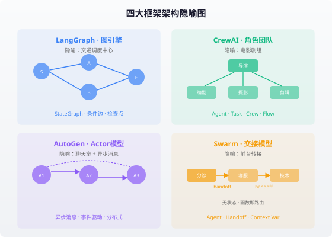
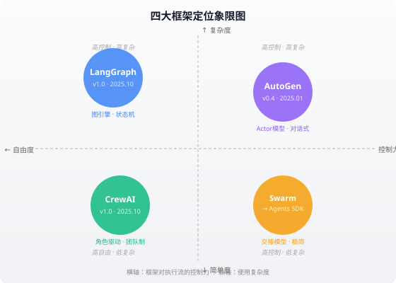

### 第20章 多Agent框架实战

> 📖 本章你将学会：掌握四大主流多Agent框架的核心设计哲学与代码实战，理解各框架的架构隐喻，建立基于实际需求的框架选型决策能力

#### 开篇：四种兵器，四种武学

想象你是一位武术大师，面对不同的对手需要选择不同的兵器。长枪适合正面冲锋，双刀灵活多变，盾牌稳健防御，暗器出其不意。多Agent框架也是如此——没有"最强"的框架，只有"最合适"的兵器。

2025年的多Agent框架生态，已经从"百框架大战"收敛为四大主流阵营。它们各有不同的设计哲学：

**LangGraph** 是"图引擎派"——把Agent协作建模为有向图，节点是Agent，边是控制流，像交通调度中心一样精确指挥每一步。

**CrewAI** 是"角色团队派"——把Agent协作建模为人类团队，每个Agent有角色、目标、背景故事，像电影剧组一样分工明确。

**OpenAI Swarm**（及其继任者 Agents SDK）是"极简交接派"——用最少的抽象实现Agent间的控制权转移，像前台总机一样简洁高效。

**AutoGen** 是"对话协作派"——把Agent协作建模为异步消息传递的Actor系统，像聊天室一样灵活对话。

本章将逐一拆解这四大框架的设计内核，并通过代码实战让你感受它们各自的表达力与边界。

---

#### 20.1 LangGraph：图引擎驱动的多Agent编排

##### 20.1.1 设计哲学：一切皆图

LangGraph 的核心洞察是：**Agent协作的本质是有状态的控制流**。

传统Agent框架把"执行顺序"藏在提示词里——"先做A再做B"靠自然语言描述，LLM可能不遵守。LangGraph 把它变成了显式的图结构：每个节点是一个Agent或函数，边定义了执行路径，条件边允许根据状态动态路由。

这个设计借鉴了 Google 的 **Pregel** 分布式图计算模型和 Apache Beam 的数据流处理思想。用一句话概括：**LangGraph = StateGraph（状态图） + 条件边（动态路由） + 检查点（持久化）**。

比喻：如果其他框架是"给Agent发指令让它自己协作"，LangGraph 是"搭建一条带红绿灯的高速公路，每个Agent在指定的路口上岗"。



##### 20.1.2 核心概念

| 概念 | 作用 | Java类比 |
|------|------|----------|
| `StateGraph` | 定义状态结构和节点拓扑 | `DAGraph<State>` |
| `State`（TypedDict） | 共享状态，所有节点读写 | `SharedContext` 对象 |
| `Node` | 执行单元，接收状态返回部分更新 | `Function<State, Partial<State>>` |
| `Edge` | 固定路由，A完成后必到B | 固定调用链 |
| `Conditional Edge` | 动态路由，根据状态选择下一节点 | `if-else` 分支 |
| `Checkpointer` | 自动持久化每步状态 | `@Transactional` 快照 |
| `Command` | 节点返回的指令，含状态更新+路由目标 | `Command` 模式 |

##### 20.1.3 Supervisor 模式实战

LangGraph 在 2025年2月27日发布了 `langgraph-supervisor` 库，将Supervisor模式从"设计模式"升级为"一等公民"抽象。

以下是一个完整的多Agent Supervisor 示例——构建一个"研究+编程"双Agent团队：

```python
from langchain.chat_models import init_chat_model
from langgraph.prebuilt import create_react_agent
from langgraph_supervisor import create_supervisor

# 1. 初始化模型
model = init_chat_model("openai:gpt-4o")

# 2. 创建研究Agent（带Web搜索工具）
research_agent = create_react_agent(
    model=model,
    tools=[web_search_tool, document_reader_tool],
    prompt="You are a research expert. Find accurate information.",
    name="research_expert"
)

# 3. 创建编程Agent（带代码执行工具）
coder_agent = create_react_agent(
    model=model,
    tools=[python_executor_tool],
    prompt="You are a coding expert. Write clean, tested code.",
    name="code_expert"
)

# 4. 创建Supervisor——项目经理角色
supervisor = create_supervisor(
    agents=[research_agent, coder_agent],
    model=model,
    prompt=(
        "You manage a research expert and a code expert.\n"
        "Delegate research tasks to the researcher.\n"
        "Delegate coding tasks to the coder.\n"
        "Synthesize their outputs for the user."
    ),
    output_mode="last_message"  # 只保留Worker最终回复，节省token
).compile()

# 5. 运行
result = supervisor.invoke({
    "messages": [{"role": "user", "content": "研究2025年Go语言并发特性，写一个示例程序"}]
})
```

`output_mode` 参数是信噪比管理的关键——`"full_history"` 保留所有中间步骤（调试用），`"last_message"` 只保留最终结果（生产用）。这直接影响上下文窗口的消耗和后续LLM调用的质量。

##### 20.1.4 Swarm 模式与 Handoff

LangGraph 在 2025年3月6日发布了 `langgraph-swarm` 库，实现了去中心化的交接模式。与Supervisor不同，Swarm模式没有中央调度器——每个Agent通过 `handoff_tool` 将控制权直接转交给另一个Agent：

```python
from langgraph.types import Command
from langgraph.prebuilt import create_handoff_tool

# 创建交接工具：将控制权交给酒店Agent
transfer_to_hotel = create_handoff_tool(
    agent_name="hotel_assistant",
    description="转交给酒店助手处理住宿预订"
)

# 航班Agent配备交接工具
flight_agent = create_react_agent(
    model=model,
    tools=[flight_search_tool, transfer_to_hotel],
    prompt="你是航班助手。用户订完航班后，转交给酒店助手。",
    name="flight_assistant"
)
```

2024年12月引入的 `Command` 原语是交接机制的底层实现——当节点返回 `Command(goto="target_agent", update={...})` 时，不仅更新状态，还指定了下一个执行节点。这比传统的工作流引擎更灵活，因为路由决策可以嵌入在Agent的执行逻辑中。

##### 20.1.5 生产级特性

LangGraph v1.0（2025年10月22日发布稳定版）的核心卖点不是"能跑多Agent"，而是**生产级可靠性**：

| 特性 | 说明 | 工程价值 |
|------|------|----------|
| **Durable Execution** | 服务器重启后从检查点恢复 | 长时间任务不丢失进度 |
| **Human-in-the-Loop** | `interrupt()` 暂停等待人工审批 | 高风险决策需人类把关 |
| **Time Travel** | 回溯任意历史状态重放 | 调试复杂工作流 |
| **Streaming** | Token级 + 节点级流式输出 | 用户实时感知进度 |
| **Cross-thread Memory** | 跨对话会话记忆 | Agent有长期记忆 |

> 💡 **LangChain 基准测试发现**（2025年6月）：Supervisor模式在多领域任务中存在"翻译损耗"——Supervisor转述Worker结果时会引入错误。解决方案是 `create_forward_message_tool`，让Supervisor直接转发Worker回复而非重新生成。

---

#### 20.2 CrewAI：角色驱动的多Agent团队

##### 20.2.1 设计哲学：模拟人类团队

CrewAI 的核心洞察是：**人类团队的协作模式已经被几千年验证有效，为什么不照搬？**

CrewAI 为每个Agent赋予三重属性——`Role`（角色）、`Goal`（目标）、`Backstory`（背景故事）。这不是花架子：背景故事为LLM提供了丰富的上下文锚点，显著降低了角色漂移（Role Drift）和幻觉。

比喻：如果LangGraph是"交通调度中心"，CrewAI就是"电影剧组"——导演（Manager Agent）统筹全局，编剧写剧本，摄影师拍画面，剪辑师做后期，每个角色有明确的专业领域和职责边界。

CrewAI 于2025年10月20日发布 v1.0 GA版，标志着从实验性框架向生产级框架的正式过渡。核心wheel小于1MB，纯Python实现，不依赖LangChain——这意味着更快的执行速度和更少的依赖冲突。

##### 20.2.2 核心概念

| 概念 | 作用 | 隐喻 |
|------|------|------|
| `Agent` | 角色化智能体，含role/goal/backstory | 剧组成员 |
| `Task` | 工作单元，绑定到特定Agent | 剧本中的一场戏 |
| `Crew` | Agent+Task的编排容器 | 整个剧组 |
| `Process` | 协作模式：sequential/hierarchical | 拍摄流程 |
| `Flow` | 事件驱动的确定性管道 | 拍摄日程表 |
| `Tool` | Agent可调用的外部能力 | 摄影机/道具 |

##### 20.2.3 实战：研究→分析→报告

以下是一个完整的CrewAI多Agent团队示例：

```python
from crewai import Agent, Task, Crew, Process

# 1. 定义三个角色化Agent
researcher = Agent(
    role="高级数据研究员",
    goal="发现关于 {topic} 的前沿发展动态",
    backstory="你是一位经验丰富的研究员，擅长挖掘最新技术趋势。",
    tools=[web_search, document_reader],
    verbose=True
)

analyst = Agent(
    role="数据分析师",
    goal="将研究发现转化为结构化洞察",
    backstory="你是一位严谨的分析师，善于从海量信息中提炼关键结论。",
    verbose=True
)

writer = Agent(
    role="技术报告撰写人",
    goal="将分析结果写成清晰易懂的报告",
    backstory="你是一位技术写作专家，擅长把复杂概念讲简单。",
    verbose=True
)

# 2. 定义任务链
research_task = Task(
    description="收集关于 {topic} 的5个权威来源",
    agent=researcher,
    expected_output="包含5个来源的结构化研究摘要"
)

analysis_task = Task(
    description="分析研究发现，提炼3个核心洞察",
    agent=analyst,
    expected_output="包含3个核心洞察的分析报告"
)

report_task = Task(
    description="将分析结果写成一份1000字的技术报告",
    agent=writer,
    expected_output="Markdown格式的完整技术报告"
)

# 3. 组建团队并执行
crew = Crew(
    agents=[researcher, analyst, writer],
    tasks=[research_task, analysis_task, report_task],
    process=Process.sequential  # 顺序执行：研究→分析→写作
)

result = crew.kickoff(inputs={"topic": "2025年多Agent框架对比"})
```

##### 20.2.4 Crews vs Flows：自主与确定的平衡

CrewAI v1.0 的核心创新是 **Hybrid Orchestration（混合编排）**：

- **Crews**：自主探索模式，Agent根据角色自主决策，适合需要灵活推理的任务
- **Flows**：确定性管道，用 `@start`、`@listen`、`@router` 注解构建事件驱动图，适合需要严格控制的流程

```python
from crewai.flow.flow import Flow, listen, start, router

class ReportPipeline(Flow):
    @start()
    def fetch_data(self):
        return collect_raw_data()  # 确定性步骤

    @listen(fetch_data)
    def analyze(self, data):
        # 这里可以嵌入一个Crew，让Agent团队自主分析
        analysis_crew = Crew(agents=[analyst], tasks=[...])
        return analysis_crew.kickoff(inputs={"data": data})

    @router(analyze)
    def route_by_quality(self, result):
        if result.confidence > 0.8:
            return "publish"
        else:
            return "review"  # 低质量走人工审核

    @listen("publish")
    def auto_publish(self, result):
        return publish_report(result)

    @listen("review")
    def manual_review(self, result):
        return send_to_reviewer(result)
```

比喻：Flows 是"拍摄日程表"（确定性的），Crews 是"现场即兴发挥"（自主的）。两者结合，既有流程控制又有创造空间。

> ⚠️ **生产警告**：CrewAI的Network模式（Agent间自由对话）在复杂场景下容易产生无限循环。LangChain基准测试显示，当Agent数量超过5个时，自由对话模式的完成率显著下降。生产环境建议使用 sequential 或 hierarchical 模式。

---

#### 20.3 OpenAI Swarm：极简交接模型

##### 20.3.1 设计哲学：两个原语打天下

OpenAI Swarm 的设计哲学是**极简主义**——整个框架只有两个核心抽象：`Agent` 和 `Handoff`。

Swarm 是 OpenAI Solutions 团队发布的**实验性教育框架**，明确声明不用于生产环境。但它的设计思想——"交接即路由"——影响深远，最终演化为 OpenAI 官方的 **Agents SDK**（生产级，含Tracing、Guardrails、Streaming）。

比喻：如果LangGraph是"高速公路网"，CrewAI是"电影剧组"，Swarm就是"前台总机"——用户来电，前台判断该转给谁，转过去就不管了。没有中心调度器，没有全局状态图，关系是隐式地由交接函数织出来的。

##### 20.3.2 核心概念

| 概念 | 作用 | 特点 |
|------|------|------|
| `Agent` | instructions + functions + model | 无状态，每次调用重新实例化 |
| `Handoff` | 函数返回另一个Agent即完成交接 | 路由即函数调用 |
| `Context Variables` | 跨Agent共享的上下文字典 | 在无状态系统中模拟状态 |
| `client.run()` | 执行循环：LLM→工具→交接→返回 | 自动处理多轮 |

##### 20.3.3 实战：客服分诊系统

```python
from swarm import Swarm, Agent

client = Swarm()

# 定义三个Agent
def transfer_to_billing():
    return billing_agent  # 返回另一个Agent = 交接

def transfer_to_tech():
    return tech_agent

triage_agent = Agent(
    name="分诊助手",
    instructions="你是客服分诊助手。账单问题转给billing，技术问题转给tech。",
    functions=[transfer_to_billing, transfer_to_tech],
)

billing_agent = Agent(
    name="账单助手",
    instructions="你只处理账单相关问题。精确回答费用、退款、发票问题。",
)

tech_agent = Agent(
    name="技术助手",
    instructions="你只处理技术支持问题。提供清晰的故障排除步骤。",
)

# 运行：用户消息自动路由到正确的Agent
response = client.run(
    agent=triage_agent,
    messages=[{"role": "user", "content": "我上个月被重复扣费了"}],
)
# → 分诊Agent判断是账单问题 → 交接给billing_agent → billing_agent回答

print(response.messages[-1]["content"])
```

`client.run()` 的执行循环是：获取当前Agent的completion → 执行工具调用 → 如果函数返回了新Agent则切换 → 更新context_variables → 如果没有新函数调用则返回。

##### 20.3.4 从Swarm到Agents SDK

OpenAI Agents SDK 是 Swarm 的生产级继任者，核心模式不变（交接即工具调用），但增加了生产级特性：

| 特性 | Swarm（实验性） | Agents SDK（生产级） |
|------|-----------------|---------------------|
| Tracing | 无 | 内置，OpenAI Dashboard可视化 |
| Guardrails | 无 | 输入/输出校验，防注入 |
| Streaming | 基础 | 完整事件流 + 全异步 |
| TypeScript | 无 | Python + TypeScript双SDK |
| 持久化 | 无状态 | 内置记忆管理 |

```python
# Agents SDK 写法（与Swarm模式一脉相承）
from agents import Agent, Runner, handoff

triage = Agent(name="分诊", instructions="路由到正确的专家")
billing = Agent(name="账单", instructions="精确回答账单问题")
support = Agent(name="技术", instructions="友好的技术支持")

# 声明式交接
triage.handoffs = [handoff(billing), handoff(support)]

result = Runner.run_sync(triage, "我的卡被重复扣费了")
print(result.final_output)     # 由billing处理
print(result.last_agent.name)  # → "账单"
```

> 💡 **选型建议**：Swarm 适合学习和理解交接模式（几百行Python就能读懂整个框架）。如果你的技术栈以OpenAI为主，Agents SDK 是自然的生产级选择。如果你需要跨模型厂商或更复杂的控制流，考虑LangGraph或CrewAI。

---

#### 20.4 AutoGen：对话式多Agent协作

##### 20.4.1 设计哲学：Actor模型 + 异步消息

AutoGen（微软研究院）的 v0.4 版本于2025年1月14日发布，是一次彻底的架构重写。核心变化是从同步对话模型转向**异步事件驱动的Actor模型**。

Actor模型是并发编程的经典范式：每个Actor是一个独立的计算单元，通过异步消息通信，不共享内存。AutoGen 把每个Agent当作一个Actor，Agent之间通过消息传递协作——这比同步轮询更自然地表达了"一个Agent在等待API响应时，另一个Agent可以并行工作"的场景。

比喻：如果LangGraph是"交通调度中心"，CrewAI是"电影剧组"，Swarm是"前台总机"，AutoGen就是"异步聊天室"——每个人可以同时发消息，不需要等别人说完才能开口。

##### 20.4.2 三层架构

AutoGen v0.4 采用分层设计，各层职责清晰：

| 层级 | 职责 | 适用场景 |
|------|------|----------|
| **Core** | Actor模型运行时、消息路由、本地/分布式运行时 | 需要底层控制的高级用户 |
| **AgentChat** | 高层API：AssistantAgent、UserProxyAgent、GroupChat | 快速原型和常见模式 |
| **Extensions** | 模型客户端、代码执行器、第三方集成 | 连接OpenAI/Azure/MCP等 |

AgentChat层保持了与v0.2的兼容性，让现有代码迁移成本低。但底层已经完全重写为异步架构。

##### 20.4.3 实战：群聊式代码审查

```python
import asyncio
from autogen_agentchat.agents import AssistantAgent
from autogen_agentchat.teams import RoundRobinGroupChat
from autogen_agentchat.conditions import TextMentionTermination
from autogen_agentchat.ui import Console
from autogen_ext.models.openai import OpenAIChatCompletionClient

async def code_review_pipeline():
    model = OpenAIChatCompletionClient(model="gpt-4o")

    # 定义三个角色
    coder = AssistantAgent(
        name="程序员",
        model_client=model,
        system_message="你是一个Python程序员。根据需求写代码。"
    )

    reviewer = AssistantAgent(
        name="审查员",
        model_client=model,
        system_message="你是一个代码审查员。检查代码质量、安全性和性能。"
    )

    fixer = AssistantAgent(
        name="修复员",
        model_client=model,
        system_message="你根据审查意见修复代码问题。审查通过后说'DONE'。"
    )

    # 轮询式群聊
    termination = TextMentionTermination("DONE")
    team = RoundRobinGroupChat(
        [coder, reviewer, fixer],
        termination_condition=termination
    )

    await Console(team.run_stream(
        task="写一个函数：输入URL列表，并发抓取内容，返回结果字典。"
    ))

asyncio.run(code_review_pipeline())
```

AutoGen 的 `GroupChatManager` 支持多种发言人选择策略：`RoundRobinGroupChat`（轮询）、`SelectorGroupChat`（LLM决定谁发言）、手动选择等。

##### 20.4.4 分布式与跨语言

AutoGen v0.4 的Actor模型天然支持分布式部署——不同Agent可以运行在不同进程甚至不同机器上，通过消息队列通信。这让它成为构建跨组织协作Agent系统的理想选择。

同时，v0.4 引入了跨语言支持（Python + .NET），C#编写的Agent可以与Python Agent无缝协作。微软正在将 AutoGen 与 Semantic Kernel 合并为 **Microsoft Agent Framework**，这将是企业级Agent平台的长期方向。

> ⚠️ **注意**：AutoGen v0.4 的API与v0.2有显著差异。如果你在阅读2024年的教程，请注意它们可能基于旧版API。v0.4全面采用 `async/await`，所有交互都是异步的。

---

#### 20.5 框架对比与选型

##### 20.5.1 四维对比



| 维度 | LangGraph | CrewAI | Swarm/Agents SDK | AutoGen |
|------|-----------|--------|------------------|---------|
| **核心隐喻** | 图/状态机 | 角色团队 | 交接/前台 | Actor/聊天室 |
| **通信模型** | 共享State + 条件边 | 消息传递 + 任务链 | 函数返回即路由 | 异步消息 |
| **状态管理** | 显式TypedDict + Checkpointer | 内存 + 记忆系统 | 无状态 + Context Var | 事件驱动 + 持久化 |
| **异步支持** | 支持 | 有限 | 客户端同步 | 全面async/await |
| **分布式** | 单进程为主 | 单进程 | 客户端 | 原生分布式 |
| **可观测性** | LangSmith + Studio | OpenTelemetry内置 | Agents SDK Tracing | OpenTelemetry |
| **HITL** | `interrupt()`一等公民 | Flow + guardrail | Guardrails | UserProxyAgent |
| **学习曲线** | 中高 | 低中 | 极低 | 中高 |
| **生产就绪** | v1.0稳定版 | v1.0 GA | SDK生产级 | v0.4（持续迭代） |
| **生态规模** | LangChain生态最大 | 100K+开发者 | OpenAI官方 | 微软+学术 |

##### 20.5.2 选型决策框架

选框架不是选"最好的"，而是选"约束匹配度最高的"。以下是决策路径：

**第一步：你的Agent数量和关系复杂度如何？**

- 2-3个Agent，简单交接 → **Swarm/Agents SDK**（最轻量）
- 3-5个Agent，有明确角色分工 → **CrewAI**（角色驱动最直觉）
- 5+个Agent，复杂控制流/循环/分支 → **LangGraph**（图引擎最强）
- 需要分布式/跨语言/长时间运行 → **AutoGen**（Actor模型最健壮）

**第二步：你的控制需求是什么？**

- 需要精确控制每一步执行路径 → LangGraph（条件边显式路由）
- 需要角色专业化但流程可灵活 → CrewAI（Crew+Flow混合）
- 需要最简实现快速验证 → Swarm/Agents SDK（两个原语搞定）
- 需要Agent自主协作和并行 → AutoGen（异步消息不阻塞）

**第三步：你的生产约束是什么？**

- 需要长时间运行+故障恢复 → LangGraph（Durable Execution + Checkpoint）
- 需要企业级可观测性 → CrewAI（内置Tracing）或 LangGraph（LangSmith）
- 深度绑定OpenAI生态 → Agents SDK（原生Tracing + Guardrails）
- 微软技术栈/Azure → AutoGen（与Semantic Kernel融合）

##### 20.5.3 一个实际选型案例

**场景**：构建一个企业知识库问答系统，需要3个Agent——检索Agent（查知识库）、推理Agent（分析问题）、回答Agent（生成回答）。

**分析**：
- Agent数量少（3个），关系清晰
- 需要严格控制流程：必须先检索再推理再回答
- 需要可观测性用于调试
- 不需要分布式

**推荐**：CrewAI（sequential模式）或 LangGraph（线性StateGraph）

如果选CrewAI：
```python
crew = Crew(
    agents=[retriever, reasoner, answerer],
    tasks=[retrieve_task, reason_task, answer_task],
    process=Process.sequential
)
```

如果选LangGraph：
```python
graph = StateGraph(QAState)
graph.add_node("retrieve", retrieve_node)
graph.add_node("reason", reason_node)
graph.add_node("answer", answer_node)
graph.add_edge("retrieve", "reason")
graph.add_edge("reason", "answer")
graph.add_edge("answer", END)
```

CrewAI代码更简洁直觉，LangGraph控制力更强、可扩展性更好（未来加条件分支只需加条件边）。对于这个简单场景，CrewAI是更快的起点；如果预期未来复杂度会增长，LangGraph是更稳妥的长期投资。

---

#### 20.6 本章小结

##### 核心认知

**认知一：框架的"设计哲学"比"功能列表"更重要。** LangGraph追求控制力（图引擎），CrewAI追求直觉性（角色团队），Swarm追求极简性（交接原语），AutoGen追求健壮性（Actor模型）。理解哲学才能选对工具。

**认知二：没有"万能框架"，只有"约束匹配"。** 2-3个Agent选Swarm/CrewAI，复杂控制流选LangGraph，分布式场景选AutoGen。选型不是选最强的，是选最合适的。

**认知三：生产可靠性来自工程基建，不是框架选择。** LangGraph的Durable Execution、CrewAI的Tracing、Agents SDK的Guardrails——这些"无聊"的工程特性才是生产环境真正需要的。

**认知四：Swarm虽"死"，交接模式永生。** Swarm作为实验框架已被Agents SDK取代，但"交接即路由"的核心思想影响了所有框架——LangGraph的 `create_handoff_tool`、CrewAI的任务链、AutoGen的消息传递，本质上都是不同形式的交接。

##### 框架速查表

| 你的需求 | 首选框架 | 备选 |
|----------|----------|------|
| 快速原型（2-3 Agent） | Swarm/Agents SDK | CrewAI |
| 角色明确的专业团队 | CrewAI | LangGraph |
| 复杂控制流/循环/分支 | LangGraph | — |
| 分布式/跨语言 | AutoGen | — |
| 长时间运行+故障恢复 | LangGraph | AutoGen |
| OpenAI深度绑定 | Agents SDK | — |
| 微软/Azure技术栈 | AutoGen | LangGraph |
| 最大生态和社区 | LangGraph | CrewAI |

##### 比喻回顾

| 框架 | 核心比喻 | 一句话记忆 |
|------|----------|-----------|
| LangGraph | 交通调度中心 | 每个Agent在指定路口上岗，红绿灯精确指挥 |
| CrewAI | 电影剧组 | 导演统筹，各角色专业分工，有剧本有即兴 |
| Swarm | 前台总机 | 来电判断转给谁，转过去就不管了 |
| AutoGen | 异步聊天室 | 每人可同时发消息，不阻塞，跨房间跨语言 |

---

> 📌 第五篇到此完结。从第17章的架构模式，到第18章的通信协议，到第19章的协作策略，再到本章的框架实战——你已经掌握了多Agent系统从设计到落地的完整知识链。下一篇，我们将进入开源框架的深度解读，拆解真实的Agent系统源码。
