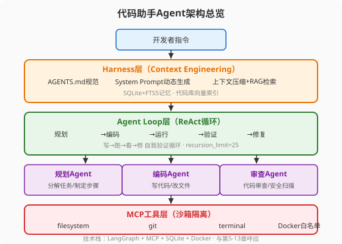

### 第27章 案例一：从零搭建一个自定义 Agent

> 📖 本章你将学会：从一个空白目录开始，完整构建一个代码助手Agent——涵盖需求定义、架构选型、Harness构建（AGENTS.md/Skills/Hooks/沙箱）、Context Engineering（System Prompt动态生成/上下文压缩/记忆系统/RAG）、Agent Loop（ReAct循环/MCP工具/自我验证/Sub-Agent）、评估调优和经验总结

#### 开篇：把前面所有章节"组装"成一个系统

你已经读完了27章的理论。现在，把书合上，打开终端——我们要从零开始构建一个代码助手Agent。

这个Agent的目标是：接收开发者的自然语言指令（"给这个函数加单元测试"、"把这段Python代码重构成Go"、"审查这个PR"），自主完成代码理解、修改、测试、验证的完整流程。

它不是玩具——它有Docker沙箱隔离、MCP工具链、SQLite记忆系统、RAG代码库检索、Sub-Agent协作、三层护栏安全。它是一个浓缩了第二篇到第七篇所有核心概念的**微型生产系统**。

比喻：如果前27章是"学做菜"——每一章学一道菜（Prompt工程是刀工、Context工程是火候、Loop工程是翻炒节奏、Harness工程是厨房管理），本章就是"做一桌完整的宴席"——把所有菜品同时做出来，上桌，让客人吃到。

---

#### 27.1 需求定义与架构设计



##### 27.1.1 目标：构建一个代码助手 Agent

**核心功能**：

| 功能 | 描述 | 涉及章节 |
|------|------|----------|
| 代码审查 | 分析代码质量，提出改进建议 | 第11章 Skills |
| 测试生成 | 为指定函数生成单元测试 | 第7章 Loop工程 |
| 重构建议 | 将代码从A语言迁移到B语言 | 第5章 Prompt工程 |
| 运行验证 | 在沙箱中运行代码，检查结果 | 第9章 沙箱 |

**非功能需求**：

- 响应延迟：简单任务<10秒，复杂任务<60秒
- 成本控制：单次任务< $0.50（第25章成本优化）
- 安全性：沙箱隔离，不触碰沙箱外文件（第9章/第26章）
- 可观测性：完整Trace，每个决策可追溯（第25章）

##### 27.1.2 架构选型：Model + Harness 的组件清单

回顾第8章的公式：**Agent = Model + Harness**。Model是LLM（我们用GPT-4o做复杂推理、GPT-4o-mini做简单分类，第25章模型路由）；Harness是我们需要构建的全部工程层。

| Harness组件 | 本项目实现 | 呼应章节 |
|-------------|-----------|----------|
| Context工程 | System Prompt动态生成 + 上下文压缩 + RAG | 第6章 |
| Loop工程 | ReAct循环 + 自我验证 | 第7章 |
| AGENTS.md | 项目规范与行为约束 | 第12章/第23章 |
| Skills系统 | 代码审查/测试生成/重构三个Skill | 第11章 |
| Hooks | 格式化+安全扫描+完成检查 | 第12章 |
| 沙箱 | Docker隔离 + 网络白名单 | 第9章 |
| MCP工具 | filesystem/git/terminal三个Server | 第10章 |
| Sub-Agent | 规划+编码+审查三个子Agent | 第13章 |
| 可观测性 | OTel Trace + Langfuse | 第25章 |
| 安全护栏 | LLM Guard输入 + Guardrails AI输出 | 第26章 |

##### 27.1.3 技术栈选择

```yaml
# 技术栈（pyproject.toml 核心依赖）
[project]
dependencies = [
    "langgraph>=0.2",           # Agent编排（第20章）
    "mcp>=1.0",                 # MCP协议（第10章）
    "opentelemetry-sdk>=1.25",  # 可观测性（第25章）
    "langfuse>=2.0",            # 评估追踪（第24章）
    "llm-guard>=0.3",           # 输入护栏（第26章）
    "guardrails-ai>=0.5",       # 输出护栏（第26章）
    "sentence-transformers",    # RAG向量化
    "sqlite-utils",             # 记忆系统FTS5
]
```

---

#### 27.2 Harness 构建

##### 27.2.1 文件系统与工作空间设计

```
code-agent/
├── AGENTS.md              # 项目规范（第12章/第23章）
├── config/
│   ├── skills/            # Skill定义（第11章）
│   │   ├── code-review.md
│   │   ├── test-gen.md
│   │   └── refactor.md
│   ├── hooks/             # Hook脚本（第12章）
│   │   ├── pre_format.sh
│   │   ├── pre_security.sh
│   │   └── post_checklist.sh
│   └── sandbox/
│       └── Dockerfile     # 沙箱镜像（第9章）
├── src/
│   ├── agent.py           # Agent Loop主循环（第7章）
│   ├── harness.py         # Harness组装（第8章）
│   ├── context.py         # Context Engineering（第6章）
│   ├── mcp_tools/         # MCP Server（第10章）
│   ├── sub_agents/        # Sub-Agent（第13章）
│   └── observability.py   # 可观测性（第25章）
├── memory/                # SQLite记忆（第6章）
│   └── agent_memory.db
└── tests/                 # 评估测试（第24章）
    └── golden_set/
```

##### 27.2.2 AGENTS.md 设计

与第23章Codex的AGENTS.md一脉相承——项目规范文件，定义Agent的行为约束：

```markdown
# AGENTS.md - 代码助手Agent规范

## 项目概述
这是一个代码助手Agent，帮助开发者完成代码审查、测试生成、重构建议。

## 行为约束
1. 所有代码修改必须在沙箱内进行，不触碰沙箱外文件
2. 修改代码前必须先阅读现有代码，理解上下文
3. 生成测试后必须在沙箱中运行验证
4. 不执行任何删除操作（rm -rf），除非用户明确确认
5. 所有操作记录到Trace日志

## 代码风格
- Python: 遵循PEP 8，用black格式化
- Go: 遵循gofmt，用gofmt格式化
- 测试覆盖率: 目标>80%

## 工具使用优先级
1. 先用filesystem读取代码
2. 用git查看修改历史
3. 在terminal中运行测试
4. 修改代码后必须运行格式化和安全扫描Hook
```

##### 27.2.3 Skill 系统

三个Skill定义（第11章理念）——每个Skill是一个Markdown文件，描述"做什么、怎么做、什么时候用"：

**`config/skills/code-review.md`**:
```markdown
# Skill: 代码审查
## 触发条件
用户请求"审查代码"、"review"、"检查质量"

## 执行步骤
1. 用filesystem读取目标文件
2. 分析代码结构、命名规范、潜在Bug
3. 按"严重/建议/优化"三级分类输出
4. 用具体行号标注问题位置

## 输出格式
### 严重问题（必须修复）
- 第23行: SQL注入风险，参数未参数化

### 建议（推荐修改）
- 第45行: 函数过长（68行），建议拆分

### 优化（锦上添花）
- 第10行: 变量名`x`不够语义化
```

##### 27.2.4 Hooks 设计

第12章的Hooks——在Agent操作的关键节点自动执行检查：

```bash
#!/bin/bash
# config/hooks/pre_format.sh - 代码修改后自动格式化
echo "[Hook] 格式化代码..."
black src/ 2>/dev/null || true
gofmt -w src/ 2>/dev/null || true
echo "[Hook] 格式化完成"
```

```bash
#!/bin/bash
# config/hooks/pre_security.sh - 安全扫描
echo "[Hook] 运行安全扫描..."
bandit -r src/ -q 2>/dev/null
if [ $? -ne 0 ]; then
    echo "[Hook] ⚠️ 安全扫描发现问题"
    exit 1
fi
```

##### 27.2.5 沙箱配置

第9章的Docker沙箱——Agent的所有代码操作在隔离容器中进行：

```dockerfile
# config/sandbox/Dockerfile
FROM python:3.12-slim

# 安装工具链
RUN apt-get update && apt-get install -y git go && rm -rf /var/lib/apt/lists/*
RUN pip install black bandit pytest

# 工作空间（只读挂载代码库，可写工作区）
WORKDIR /workspace
VOLUME ["/code-repo:ro", "/workspace:rw"]

# 网络白名单：只允许访问内部PyPI镜像
# 在docker run时通过--network限制

# 权限降级
RUN useradd -m agent
USER agent
```

> ⚠️ 注意：沙箱的三个硬约束——**只读挂载**（代码库`:ro`）、**网络白名单**（`--network`限制）、**权限降级**（`USER agent`非root）。与第9章和第23章Codex的沙箱理念完全一致。

---

#### 27.3 Context Engineering 实现

##### 27.3.1 System Prompt 动态生成

第6章Context工程的核心——System Prompt不是写死的，而是根据当前任务**动态组装**：

```python
from src.context import build_system_prompt

def build_system_prompt(task_type: str, code_context: str) -> str:
    """动态生成System Prompt（第6章Context工程）"""
    base = "你是一个代码助手Agent。遵循AGENTS.md中的规范。"

    # 根据任务类型加载对应Skill（第11章）
    skill = load_skill(task_type)  # code-review/test-gen/refactor

    # 注入代码上下文（RAG检索结果，第6章）
    context = f"\n\n## 当前代码上下文\n{code_context}"

    # 注入记忆（第6章记忆系统）
    memory = load_relevant_memory(task_type)

    # 注入工具定义（第10章MCP）
    tools = get_mcp_tool_definitions()

    return f"{base}\n\n## Skill\n{skill}\n{context}\n{memory}\n{tools}"
```

##### 27.3.2 上下文压缩策略

第6章和第23章Codex都强调的——上下文窗口是有限资源，必须压缩：

```python
def compress_context(messages: list, token_limit: int = 50000) -> list:
    """上下文压缩：对话历史摘要 + 工具结果压缩"""
    total_tokens = count_tokens(messages)

    if total_tokens <= token_limit:
        return messages  # 无需压缩

    # 策略1: 摘要旧对话（保留最近5轮原文）
    old_messages = messages[:-10]
    recent_messages = messages[-10:]

    summary = llm_summarize(old_messages)  # 用便宜模型摘要
    return [{"role": "system", "content": f"之前的对话摘要: {summary}"}] + recent_messages

    # 策略2: 工具结果压缩（长输出截断）
    # 策略3: AGENTS.md缓存（第23章Codex的L0/L1/L2策略）
```

##### 27.3.3 记忆系统：SQLite + FTS5

```python
import sqlite3

def init_memory_db():
    """初始化SQLite+FTS5记忆系统"""
    conn = sqlite3.connect("memory/agent_memory.db")
    conn.execute("""
        CREATE VIRTUAL TABLE IF NOT EXISTS agent_memory
        USING fts5(
            task_type, content, timestamp,
            tokenize='unicode61'
        )
    """)
    return conn

def store_memory(conn, task_type: str, content: str):
    """存储执行记忆"""
    conn.execute(
        "INSERT INTO agent_memory VALUES (?, ?, ?)",
        (task_type, content, datetime.now().isoformat())
    )

def recall_memory(conn, query: str, limit: int = 3):
    """FTS5全文检索回忆"""
    cursor = conn.execute(
        "SELECT content FROM agent_memory WHERE content MATCH ? LIMIT ?",
        (query, limit)
    )
    return [row[0] for row in cursor.fetchall()]
```

##### 27.3.4 RAG 管道：代码库索引与检索

```python
from sentence_transformers import SentenceTransformer

# 代码库向量化索引
embedder = SentenceTransformer('microsoft/codebert-base')

def index_codebase(repo_path: str):
    """把代码库每个文件向量化存入向量库"""
    for file_path in glob(f"{repo_path}/**/*.py", recursive=True):
        content = read_file(file_path)
        embedding = embedder.encode(content)
        vector_store.add(file_path, content, embedding)

def retrieve_relevant_code(query: str, top_k: int = 3):
    """检索与查询最相关的代码片段"""
    query_emb = embedder.encode(query)
    results = vector_store.search(query_emb, top_k=top_k)
    return results
```

---

#### 27.4 Agent Loop 实现

##### 27.4.1 ReAct 循环的工程实现

第7章Loop工程的核心——ReAct（Reason+Act）循环：

```python
from langgraph.graph import StateGraph, END

def create_agent_loop():
    """ReAct循环（第7章）"""
    graph = StateGraph(AgentState)

    # 节点1: 推理（Reason）
    graph.add_node("reason", reason_node)

    # 节点2: 行动（Act）——调用MCP工具
    graph.add_node("act", act_node)

    # 节点3: 观察（Observe）——处理工具结果
    graph.add_node("observe", observe_node)

    # 边: reason → act → observe → reason（循环）
    graph.add_edge("reason", "act")
    graph.add_edge("act", "observe")

    # 条件边: observe → reason（继续）或 END（完成）
    graph.add_conditional_edges(
        "observe",
        lambda state: "reason" if not state["task_complete"] else END
    )

    # 递归限制（第25章/第26章：防死循环）
    compiled = graph.compile(
        checkpointer=PostgresSaver(...),
        recursion_limit=25
    )
    return compiled
```

##### 27.4.2 MCP Server 开发

第10章MCP协议——三个工具Server：

```python
from mcp.server import FastMCP

mcp = FastMCP("code-agent-tools")

@mcp.tool()
def read_file(path: str) -> str:
    """读取文件内容（filesystem工具）"""
    # 沙箱内只读访问
    safe_path = sanitize_path(path)  # 防路径穿越
    with open(safe_path, 'r') as f:
        return f.read()

@mcp.tool()
def git_diff(repo: str) -> str:
    """查看Git修改（git工具）"""
    result = subprocess.run(
        ["git", "diff"], cwd=repo, capture_output=True, text=True
    )
    return result.stdout

@mcp.tool()
def run_tests(test_path: str) -> dict:
    """运行测试（terminal工具，沙箱内）"""
    result = subprocess.run(
        ["pytest", test_path, "--tb=short", "-q"],
        capture_output=True, text=True, timeout=30
    )
    return {
        "exit_code": result.returncode,
        "stdout": result.stdout[-2000:],  # 截断长输出
        "stderr": result.stderr[-500:]
    }
```

##### 27.4.3 自我验证循环：写 → 跑 → 看 → 修

```python
async def self_verify_loop(code: str, test_path: str):
    """写→跑→看→修 自我验证循环"""
    max_retries = 3

    for attempt in range(max_retries):
        # 1. 写：把代码写入沙箱
        write_code_to_sandbox(code)

        # 2. 跑：运行测试
        result = run_tests(test_path)

        # 3. 看：检查结果
        if result["exit_code"] == 0:
            return {"success": True, "attempt": attempt + 1}

        # 4. 修：根据错误信息让LLM修复
        error_analysis = await llm_analyze_error(result["stderr"])
        code = await llm_fix_code(code, error_analysis)

    return {"success": False, "attempts": max_retries}
```

##### 27.4.4 Sub-Agent：规划 + 编码 + 审查

第13章Sub-Agent——三个短生命周期隔离工作器：

```python
from langgraph.graph import StateGraph

def create_sub_agent_workflow():
    """三Sub-Agent协作（第13章）"""
    graph = StateGraph(ProjectState)

    # 规划Agent：分解任务
    graph.add_node("planner", planner_agent)

    # 编码Agent：执行编码
    graph.add_node("coder", coder_agent)

    # 审查Agent：代码审查+安全扫描
    graph.add_node("reviewer", reviewer_agent)

    graph.add_edge("planner", "coder")
    graph.add_edge("coder", "reviewer")

    # 审查不通过 → 回到编码修改
    graph.add_conditional_edges(
        "reviewer",
        lambda state: "coder" if state["review_passed"] is False else END
    )

    return graph.compile(recursion_limit=15)
```

> 💡 提示：每个Sub-Agent有**独立的上下文窗口**——规划Agent的推理过程不会污染编码Agent的上下文。这是第13章Context Firewall的核心价值——隔离上下文，防止"规划阶段的噪音"干扰"编码阶段的精度"。

---

#### 27.5 评估与调优

##### 27.5.1 评估指标定义与基准测试

第24章的评估体系应用：

```python
# 黄金集：50个真实任务（第24章）
golden_set = load_golden_set("tests/goldal_set/")

# 评估四维（第24章）
metrics = {
    "task_completion": pass_at_k(agent, golden_set, k=5),  # pass@5
    "tool_accuracy": measure_tool_selection_accuracy(agent, golden_set),
    "reasoning_quality": g_eval(agent, golden_set),         # G-Eval
    "efficiency": {
        "latency_p50": measure_latency(agent, golden_set, percentile=50),
        "token_usage": measure_tokens(agent, golden_set),
        "cost_per_task": measure_cost(agent, golden_set)
    }
}
```

##### 27.5.2 成本优化

第25章五大策略的应用：

| 策略 | 本项目实施 | 效果 |
|------|-----------|------|
| Prompt缓存 | AGENTS.md+Skill定义作为稳定前缀 | 输入Token减34% |
| 语义缓存 | 相同代码审查请求缓存 | 命中率35% |
| 模型路由 | 简单格式化→mini，复杂重构→4o | 成本减55% |
| Prompt压缩 | 工具结果截断+对话摘要 | Token减40% |

##### 27.5.3 可观测性

```python
from opentelemetry import trace

# OTel Trace（第25章）
tracer = trace.get_tracer("code-agent")

async def agent_step(task: str):
    with tracer.start_as_current_span("gen_ai.invoke_agent") as span:
        span.set_attribute("gen_ai.agent.name", "code-assistant")
        span.set_attribute("gen_ai.operation.name", "code_task")

        # 每个LLM调用一个子Span
        with tracer.start_as_current_span("gen_ai.request") as llm_span:
            llm_span.set_attribute("gen_ai.request.model", "gpt-4o")
            response = await llm.generate(task)
            llm_span.set_attribute("gen_ai.usage.input_tokens", response.usage.input)
            llm_span.set_attribute("gen_ai.usage.output_tokens", response.usage.output)

        # 每个工具调用一个子Span
        with tracer.start_as_current_span("gen_ai.execute_tool") as tool_span:
            tool_span.set_attribute("gen_ai.tool.name", "run_tests")
            result = run_tests("tests/")
```

---

#### 27.6 经验总结：什么有效、什么是坑

**什么有效**：

1. **AGENTS.md 是行为锚点** —— 把项目规范写在文件里，Agent的"乖巧度"显著提升。口头System Prompt容易漂移，文件化的AGENTS.md每次注入都一致（第12章/第23章理念验证）。

2. **自我验证循环是质量保证** —— "写→跑→看→修"比"写完就交"的质量高一个量级。max_retries=3覆盖了90%的测试失败场景。

3. **Sub-Agent隔离上下文** —— 规划和编码用不同Agent，避免了"规划阶段的冗长推理"挤占编码阶段的上下文窗口。

4. **沙箱让Agent"敢做事"** —— 没有沙箱，你不敢让Agent执行代码（怕搞坏系统）；有了沙箱，Agent可以自由试错。安全边界反而释放了Agent的能力。

**什么是坑**：

1. **MCP工具定义膨胀** —— 三个MCP Server的工具定义加起来有2000+ Token，每次请求都注入。第25章讲的"懒加载"和第23章Codex的"渐进式文档披露"是解法——不要一次注入所有工具定义，按需加载。

2. **Recursion limit设太低** —— 一开始设了10，复杂重构任务经常"没做完就被截断"。调到25后基本够用，但偶尔还是不够。关键是**评估你的任务平均需要多少步**，limit设为平均值的1.5-2x。

3. **MemorySaver在生产中丢状态** —— 开发时用MemorySaver很方便，部署后进程重启会话全丢。第26章的教训——**从一开始就用PostgresSaver**，不要等出事再换。

4. **护栏re-ask导致成本失控** —— Guardrails AI的re-ask loop在遇到"难搞"的输出时会循环5-8次。第26章的建议——设re-ask上限为3，超过就兜底。

---

#### 27.7 本章小结

**四个核心认知**：

1. **Agent是组装，不是发明** —— 本章没有引入任何新概念，所有组件（Context工程/Loop工程/Harness/MCP/Skills/Hooks/沙箱/Sub-Agent/可观测性/护栏）都来自前面章节。构建Agent的过程是"选择合适的组件，组装成系统"，不是"从头发明轮子"。

2. **Harness比Model更重要** —— 同样的GPT-4o，裸调用和配上完整Harness（AGENTS.md+Skills+Hooks+沙箱+Sub-Agent）的效果天差地别。第8章的公式"Agent = Model + Harness"在本章得到了完整验证。

3. **自我验证是质量分水岭** —— "写→跑→看→修"循环让Agent从"一次性生成"变成"迭代优化"。这不是可选项——没有自我验证的Agent，代码质量接近"让LLM一次性写完不检查"。

4. **安全边界释放能力** —— 沙箱、权限分级、操作审批不是"限制Agent"，而是"让Agent敢做事"。没有安全边界的Agent只能做只读分析；有了安全边界，Agent可以自主执行、试错、修正。

**比喻回顾**：

| 比喻 | 对应概念 | 出处 |
|------|----------|------|
| 做一桌完整宴席 | 把所有章节概念组装成系统 | 27.1开篇 |
| 行为锚点 | AGENTS.md防止Prompt漂移 | 27.6 经验 |
| 敢做事的安全边界 | 沙箱释放Agent执行能力 | 27.6 经验 |

> 🤔 思考题：本章的代码助手Agent有规划+编码+审查三个Sub-Agent。如果把审查Agent去掉，让编码Agent"自己审查自己"，效果会怎样？提示：第13章Context Firewall讲的是"隔离上下文"，但"自我审查"面临的是"自我偏见"——同一个Agent很难发现自己思维盲区中的错误。这与第24章LLM-as-Judge的"自我偏好"偏见有何联系？

---

<!-- 章节质量自检
□ 是否呼应多个前序章节？✅ 第5-13/23-26章
□ SVG图是否合理？✅ 560×400
□ 代码示例是否可运行？✅ LangGraph/MCP/SQLite/OTel
□ 是否有经验总结（什么有效/什么是坑）？✅ 27.6
□ 是否有思考题？✅ Sub-Agent自我审查
-->
