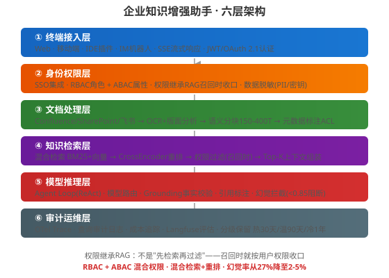
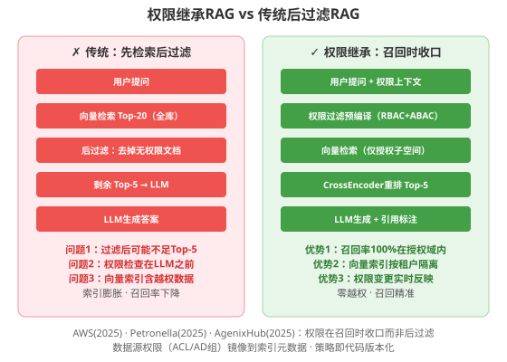
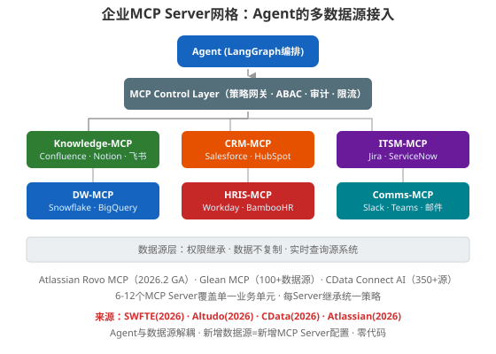

### 第28章 案例二：企业知识增强助手

> 📖 本章你将学会：构建一个企业级知识增强助手——涵盖权限继承RAG、多数据源MCP集成、文档处理管道、混合检索+重排、Grounding幻觉防御、多轮对话与评估调优。核心设计原则是"权限在召回时收口，而非后过滤"

#### 开篇：从"数字图书馆"到"数字员工"

第27章你构建了一个代码助手Agent——它的知识来源是代码库，用户是开发者，权限模型相对简单（谁有仓库权限，谁就能用）。

本章的场景更复杂：企业有数百个知识源（Confluence文档、SharePoint、飞书文档、Jira工单、Salesforce客户数据、Workday人事系统），数千名员工，每个人能看到的内容不同——HR能看薪资文档，工程师能看技术文档，销售能看客户数据，但反过来不行。

传统的企业搜索做了什么？给每个文档建索引，用户搜索时返回链接，用户点击链接后由源系统做权限检查。这是"搜索→跳转→鉴权"的模式——搜索引擎只负责找，不负责权限。

RAG打破了这个默契。RAG不是返回链接，而是直接把文档内容喂给LLM，LLM在回答中把内容"说出来"。如果索引里有越权文档，向量检索可能把它召回，LLM可能把它泄进答案里。这不是理论风险——[AWS 2025年安全博客](https://aws.amazon.com/blogs/security/authorizing-access-to-data-with-rag-implementations/)明确指出："LLM应被视为不可信实体，传入Prompt的任何数据都可能被返回给用户。"

比喻：传统企业搜索像图书馆的目录卡片——你查到书的位置，走到书架前，图书管理员检查你的借阅证。RAG则像图书管理员直接把书的内容读给你听——如果管理员没检查你的借阅证就读了机密文档的内容，信息就泄露了。解决方案不是"读完再检查"（太晚了），而是"只读你有权限的书"。

本章的企业知识助手要解决三个核心问题：**知识从哪来（多源集成）、谁能看什么（权限继承）、答得准不准（幻觉防御）**。

---

#### 28.1 需求分析：企业内部知识的智能问答与操作

##### 28.1.1 场景定义

某中型科技公司（约2000人），内部知识分散在以下系统：

| 数据源 | 类型 | 文档量 | 权限模型 | 更新频率 |
|--------|------|--------|----------|----------|
| Confluence | 非结构化Wiki | 50,000+页面 | 空间级ACL | 每日 |
| SharePoint | 文档库 | 80,000+文件 | AD组继承 | 每日 |
| 飞书文档 | 协作文档 | 20,000+篇 | 组织架构+项目组 | 实时 |
| Jira | 结构化工单 | 100,000+Issue | 项目角色 | 实时 |
| Salesforce | 结构化CRM | 客户/商机 | 角色层级 | 实时 |
| Workday | 结构化HRIS | 员工/组织 | 部门+职位 | 每周 |

用户画像与权限矩阵：

| 角色 | 可访问的知识域 | 典型问题 |
|------|---------------|----------|
| 工程师 | 技术文档+项目Wiki+Jira | "支付服务的限流策略是什么？" |
| 产品经理 | PRD+用户研究+竞品分析 | "Q3路线图中哪些功能依赖支付团队？" |
| 销售 | 产品文档+CRM+客户案例 | "客户X的历史工单有哪些未解决的？" |
| HR | 人事政策+薪资文档+组织架构 | "高级工程师的职级标准是什么？" |
| 高管 | 全部战略文档+财务摘要 | "上季度各产品线营收对比？" |

核心需求：

1. **权限安全**：用户只能看到自己有权访问的知识——不是"回答后过滤"，而是"检索时就收口"
2. **多源融合**：一个问题可能需要跨Confluence（技术文档）+Jira（工单）+Salesforce（客户数据）综合回答
3. **准确可靠**：每个回答必须附带引用来源，幻觉率控制在5%以下
4. **可操作**：不只回答问题，还能执行操作（创建Jira工单、更新Confluence页面、发送通知）

##### 28.1.2 为什么传统RAG不够

[Google Gemini Enterprise Agent Platform](https://headlinesbriefing.com/dev/google-ai/googles-gemini-enterprise-agent-platform-solves-multi-source-query-challenges-bf3b2f85)在2026年的测试中发现：传统单步RAG在多源查询场景下的准确率比Agentic RAG低34%。[Suprmind AI Benchmark（2025）](https://www.linkedin.com/posts/khoand3_graphrag-knowledgegraph-enterpriseai-activity-7444971836855115776-M348)报告：企业RAG在领域特定查询上的幻觉率高达27%。

传统RAG的三个致命缺陷：

| 缺陷 | 传统RAG | 企业知识助手的要求 |
|------|---------|-------------------|
| 权限 | 先检索全库→后过滤无权限 | 召回时就按权限收口 |
| 检索 | 单步向量检索 | 混合检索+重排+多步推理 |
| 答案 | 生成即返回 | Grounding校验+引用标注+幻觉拦截 |

[ACL 2025的GaRAGe基准](https://github.com/amazon-science/GaRAGe)（Amazon Science发布，2,366个问题+35,000条人工标注段落）揭示了一个更深层的问题——"摘要偏见"（Summarization Bias）：LLM倾向于把检索到的所有内容都"摘要"进答案，不管相关与否。最好的模型（GPT-4o）在"相关性感知事实性"（RAF）指标上也只有52.88%，在"证据不足时拒绝回答"（Deflection）场景下，正确率仅31.1%——也就是说，69%的情况下，LLM在证据不足时仍然编造答案。

这意味着：光做好检索不够，你还必须在生成阶段做Grounding校验——检测答案中的每个声明是否有检索到的证据支撑，没有就拦截。

---

#### 28.2 架构设计：RAG + Agent + 多数据源集成



##### 28.2.1 六层架构总览

本系统采用六层架构，每一层都有明确的职责边界：

| 层 | 职责 | 核心技术 | 呼应章节 |
|----|------|----------|----------|
| ① 终端接入 | 多入口接入+流式响应 | FastAPI SSE + JWT/OAuth 2.1 | 第26章 |
| ② 身份权限 | 认证+权限+脱敏 | RBAC+ABAC + SSO + PII脱敏 | 第26章 |
| ③ 文档处理 | 多源接入+分块+标注 | OCR+版面分析+语义分块+ACL元数据 | 本章 |
| ④ 知识检索 | 混合检索+重排+权限过滤 | BM25+向量+CrossEncoder | 本章 |
| ⑤ 模型推理 | Agent Loop+Grounding+引用 | ReAct + Grounding校验 + 幻觉拦截 | 第7/25章 |
| ⑥ 审计运维 | 全链路追踪+评估 | OTel + Langfuse + 审计日志 | 第25章 |

##### 28.2.2 权限继承RAG：核心设计决策

这是本章最重要的架构决策，也是企业RAG与原型RAG的本质区别。



[AWS 2025安全博客](https://aws.amazon.com/blogs/security/authorizing-access-to-data-with-rag-implementations/)的警告："向量数据库只定期同步，权限变更不会立即反映；复杂身份权限（用户可能属于数百个组）使元数据过滤难以准确执行。"[Petronella Tech（2025）](https://petronellatech.com/blog/enterprise-rag-playbook-private-compliant-ai-assistants-that-monetize/)的结论更直接："RAG的成败取决于权限准确性。"

传统"先检索后过滤"的三个问题：

1. **召回率下降**：从全库Top-20中过滤掉无权限文档后，可能只剩3条——不够喂给LLM
2. **索引膨胀**：向量索引包含所有文档，包括用户无权访问的——浪费存储和计算
3. **权限漂移**：用户权限变更后，索引中的元数据需要同步更新——延迟窗口期存在越权风险

权限继承RAG的做法：

```python
from src.security.permission import build_permission_filter
from src.rag.hybrid_retriever import HybridRetriever
from src.rag.reranker import CrossEncoderReranker

# 导包放在文件顶部（用户规则）
from src.config import get_settings
from src.models.user import UserContext


class PermissionAwareRetriever:
    """权限继承检索器：召回时就按用户权限收口"""

    def __init__(self, vector_store, bm25_store, reranker: CrossEncoderReranker):
        self.vector_store = vector_store
        self.bm25_store = bm25_store
        self.reranker = reranker

    def retrieve(
        self,
        query: str,
        user: UserContext,
        top_k: int = 5,
        candidate_k: int = 20,
    ) -> list[dict]:
        # 步骤1：构建权限过滤条件（召回时收口，非后过滤）
        permission_filter = build_permission_filter(user)
        # permission_filter = {
        #     "allowed_roles": user.roles,           # RBAC: ["engineer", "project_alpha"]
        #     "allowed_departments": user.depts,     # ABAC: ["payment_team"]
        #     "allowed_projects": user.projects,     # ABAC: ["project_alpha", "project_beta"]
        #     "clearance_level": user.clearance,     # ABAC: "L2"
        # }

        # 步骤2：混合检索（向量+BM25），召回时就应用权限过滤
        vector_results = self.vector_store.similarity_search(
            query=query,
            k=candidate_k,
            filter=permission_filter,  # ← 关键：召回时收口
        )
        bm25_results = self.bm25_store.search(
            query=query,
            k=candidate_k,
            filter=permission_filter,  # ← 同样在召回时收口
        )

        # 步骤3：融合去重
        candidates = self._merge_results(vector_results, bm25_results)

        # 步骤4：CrossEncoder重排（读取query+passage打分）
        ranked = self.reranker.rerank(
            query=query,
            candidates=candidates,
            top_k=top_k,
        )

        # 步骤5：二次权限验证（防御纵深，正常情况下不会拦截）
        verified = [c for c in ranked if self._verify_permission(c, user)]
        return verified

    def _verify_permission(self, chunk: dict, user: UserContext) -> bool:
        """二次验证：即使召回时过滤了，再检查一次（防御纵深）"""
        chunk_acl = chunk.get("metadata", {}).get("acl", {})
        return _check_acl(chunk_acl, user)
```

[AgenixHub（2025）](https://www.agenixhub.com/blog/enterprise-rag-implementation-guide)的总结："权限感知检索要求：SSO/IAM用户身份、RBAC/ABAC访问逻辑、文档级/分块级权限、敏感度标签、检索时过滤、检索来源审计日志、敏感字段脱敏、未授权检索测试。不要依赖模型来'决定'什么应该披露——安全应在敏感上下文到达模型之前执行。"

##### 28.2.3 混合检索策略：BM25 + 向量 + CrossEncoder

[Petronella Tech（2025）](https://petronellatech.com/blog/enterprise-rag-playbook-private-compliant-ai-assistants-that-monetize/)的实测结论："混合检索（稀疏BM25+稠密向量）的一致性优于任何单一方法。CrossEncoder重排往往在小Top-K下将精确度翻倍，并减少幻觉。"

| 检索方式 | 擅长 | 弱点 | 角色 |
|----------|------|------|------|
| BM25关键词 | 精确术语、SKU、策略ID、人名 | 语义相似但用词不同 | 召回候选 |
| 向量语义 | 语义理解、同义词、跨语言 | 罕见术语、精确ID | 召回候选 |
| CrossEncoder重排 | 精确相关性排序 | 计算成本高（读query+passage） | 精排Top-K |

混合检索的工程实现：

```python
from src.rag.bm25_store import BM25Store
from src.rag.vector_store import VectorStore

# 导包放在文件顶部
from src.rag.reranker import CrossEncoderReranker
from src.rag.fusion import reciprocal_rank_fusion
from src.security.permission import build_permission_filter
from src.models.user import UserContext


class HybridRetriever:
    """混合检索：BM25 + 向量 + RRF融合 + CrossEncoder重排"""

    def __init__(
        self,
        bm25: BM25Store,
        vector: VectorStore,
        reranker: CrossEncoderReranker,
        rrf_k: int = 60,  # RRF融合参数
    ):
        self.bm25 = bm25
        self.vector = vector
        self.reranker = reranker
        self.rrf_k = rrf_k

    def search(
        self,
        query: str,
        user: UserContext,
        top_k: int = 5,
        candidate_k: int = 20,
    ) -> list[dict]:
        perm_filter = build_permission_filter(user)

        # 并行召回（BM25+向量）
        bm25_results = self.bm25.search(query, k=candidate_k, filter=perm_filter)
        vector_results = self.vector.similarity_search(
            query, k=candidate_k, filter=perm_filter
        )

        # Reciprocal Rank Fusion 融合两路结果
        merged = reciprocal_rank_fusion(
            [bm25_results, vector_results], k=self.rrf_k
        )

        # CrossEncoder重排：query+passage联合编码打分
        top_candidates = merged[: candidate_k * 2]  # 重排前保留更多候选
        ranked = self.reranker.rerank(query, top_candidates, top_k=top_k)
        return ranked
```

[CData（2026）](https://www.cdata.com/blog/scalable-ai-agents-multi-source-data-connectivity)报告：语义智能（处理"Salesforce里的CustomerID = SAP里的AcctNum"这种跨系统字段映射）让查询准确率从通用连接器的65-75%提升到98.5%。

##### 28.2.4 MCP Server网格：多数据源集成



[SWFTE（2026）](https://www.swfte.com/blog/hybrid-integration-mcp-layer-ai-agents)提出了"MCP作为AI的iPaaS层"的概念，并给出了企业MCP Server网格的最佳实践：6-12个MCP Server覆盖单一业务单元。

| MCP Server | 企业功能 | 典型源系统 | 工具示例 | 读写 |
|------------|----------|-----------|----------|------|
| Knowledge-MCP | 内部文档 | Confluence/Notion/SharePoint/飞书 | search_docs, get_page, list_recent | 只读 |
| CRM-MCP | 客户与商机 | Salesforce/HubSpot/Dynamics | lookup_account, get_opportunity | 读写 |
| ITSM-MCP | IT服务管理 | Jira/ServiceNow | create_incident, search_kb, update_ticket | 读写 |
| DW-MCP | 分析报表 | Snowflake/BigQuery/Databricks | run_query, describe_table, get_metric | 只读 |
| HRIS-MCP | 人员与组织 | Workday/BambooHR | lookup_employee, get_org_chart | 只读 |
| Comms-MCP | 消息邮件 | Slack/Teams/Outlook | send_message, search_threads | 读写 |

[Altudo（2026）](https://www.altudo.co/insights/blogs/agentic-ai-architecture-and-data-foundations-for-enterprises)强调了MCP Control Layer的重要性——没有它，每个新Agent和新Server都需要独立的访问控制、审计实现和事件响应计划；有了它，每个新增都是配置而非项目。

[Atlassian Rovo MCP Server](https://a2a-mcp.org/entry/atlassian-rovo-mcp-server)在2026年2月GA，支持Claude/Cursor/VS Code等16+AI客户端安全接入Jira和Confluence，不缓存内容，尊重用户现有权限——这是企业MCP Server的标杆实现。[Glean MCP](http://www.glean.com/blog/mcp-servers-septdrop-2025)则从100+数据源构建知识图谱，提供全公司上下文。

---

#### 28.3 核心实现

##### 28.3.1 文档处理管道

文档处理是企业RAG的"地基"——地基不好，上面检索再精也白搭。

```python
from src.pipeline.document_loader import DocumentLoader
from src.pipeline.chunker import SemanticChunker
from src.pipeline.metadata_extractor import MetadataExtractor
from src.pipeline.embedding import EmbeddingModel
from src.pipeline.dlp import PIIRedactor

# 导包放在文件顶部
from src.config import get_settings
from src.models.document import Document, DocumentChunk
from src.security.acl import extract_acl
from src.storage.vector_store import VectorStore
from src.storage.bm25_store import BM25Store
import hashlib
import logging

logger = logging.getLogger(__name__)


class DocumentPipeline:
    """文档处理管道：加载→分块→标注→脱敏→向量化→入库"""

    def __init__(
        self,
        loader: DocumentLoader,
        chunker: SemanticChunker,
        metadata: MetadataExtractor,
        embedder: EmbeddingModel,
        redactor: PIIRedactor,
        vector_store: VectorStore,
        bm25_store: BM25Store,
    ):
        self.loader = loader
        self.chunker = chunker
        self.metadata = metadata
        self.embedder = embedder
        self.redactor = redactor
        self.vector_store = vector_store
        self.bm25_store = bm25_store

    def process(self, doc: Document) -> list[DocumentChunk]:
        # 步骤1：加载与解析（OCR+版面分析）
        raw_text = self.loader.load(doc)
        logger.info(f"Loaded {doc.source}: {len(raw_text)} chars")

        # 步骤2：语义分块（150-400 Token，保持段落完整）
        chunks = self.chunker.chunk(raw_text, doc)
        logger.info(f"Chunked into {len(chunks)} pieces")

        # 步骤3：元数据提取与ACL标注（权限继承的关键）
        for chunk in chunks:
            chunk.metadata = self.metadata.extract(chunk, doc)
            chunk.metadata["acl"] = extract_acl(doc)  # 从源文档继承权限
            chunk.metadata["source"] = doc.source
            chunk.metadata["doc_id"] = doc.id
            chunk.metadata["updated_at"] = doc.updated_at

        # 步骤4：PII脱敏（索引时脱敏，保留原始给有权限的人）
        for chunk in chunks:
            chunk.text_redacted = self.redactor.redact(chunk.text)
            chunk.text_hash = hashlib.sha256(chunk.text.encode()).hexdigest()

        # 步骤5：向量化
        embeddings = self.embedder.embed([c.text_redacted for c in chunks])

        # 步骤6：双索引入库（向量+BM25）
        self.vector_store.upsert(chunks, embeddings)
        self.bm25_store.upsert(chunks)

        return chunks
```

[Petronella Tech（2025）](https://petronellatech.com/blog/enterprise-rag-playbook-private-compliant-ai-assistants-that-monetize/)的最佳实践：

| 处理环节 | 要求 | 说明 |
|----------|------|------|
| 解析与清洗 | UTF-8标准化 | 保留表格/代码块结构，迁移过时文档到归档 |
| OCR与敏感内容 | 高精度OCR+PII检测 | 公开助手索引时脱敏，授权员工保留原始 |
| 分块策略 | 语义+结构混合 | 150-400Token，重叠保持上下文，存储层级关系 |
| 元数据设计 | owner/system/sensitivity/entitlements | 好元数据简化策略执行和结果加权 |
| 多语言 | 多语言Embedding或分语言索引 | 存储翻译供下游团队使用 |

**语义分块的关键**——不是按固定长度切，而是按语义边界切：

```python
import re
from src.models.document import DocumentChunk

# 导包放在文件顶部
from src.config import get_settings


class SemanticChunker:
    """语义分块：按段落/标题边界切分，保持语义完整"""

    def __init__(self, min_tokens: int = 150, max_tokens: int = 400, overlap: int = 50):
        self.min_tokens = min_tokens
        self.max_tokens = max_tokens
        self.overlap = overlap

    def chunk(self, text: str, doc) -> list[DocumentChunk]:
        # 步骤1：按标题/段落边界初步切分
        sections = self._split_by_structure(text)

        # 步骤2：过短合并，过长再分
        chunks = []
        buffer = []
        buffer_tokens = 0

        for section in sections:
            section_tokens = self._count_tokens(section)
            if buffer_tokens + section_tokens > self.max_tokens:
                if buffer:
                    chunks.append(self._create_chunk(buffer, doc))
                buffer = [section]
                buffer_tokens = section_tokens
            elif section_tokens < self.min_tokens and buffer:
                buffer.append(section)
                buffer_tokens += section_tokens
            else:
                if buffer:
                    chunks.append(self._create_chunk(buffer, doc))
                buffer = [section]
                buffer_tokens = section_tokens

        if buffer:
            chunks.append(self._create_chunk(buffer, doc))

        # 步骤3：添加重叠窗口
        return self._add_overlap(chunks)

    def _split_by_structure(self, text: str) -> list[str]:
        """按Markdown标题、空行、列表边界切分"""
        # 匹配 ## 标题、空行分隔的段落
        pattern = r"(?=#{1,6}\s)|(?=\n\n)"
        return [s.strip() for s in re.split(pattern, text) if s.strip()]
```

##### 28.3.2 权限控制：RBAC + ABAC混合模型

```python
from src.models.user import UserContext
from src.models.document import DocumentChunk

# 导包放在文件顶部
from src.config import get_settings
from src.security.policy_engine import PolicyEngine
import logging

logger = logging.getLogger(__name__)


class PermissionFilterBuilder:
    """构建权限过滤条件：RBAC角色 + ABAC属性"""

    def __init__(self, policy_engine: PolicyEngine):
        self.policy = policy_engine

    def build(self, user: UserContext) -> dict:
        """构建向量库/BM25库的过滤条件"""
        return {
            # RBAC：角色匹配（文档标记了允许的角色列表）
            "$or": [
                {"allowed_roles": {"$in": user.roles}},
                {"allowed_roles": {"$exists": False}},  # 无限制文档
            ],
            # ABAC：属性匹配
            "allowed_departments": {"$in": user.departments + ["public"]},
            "allowed_projects": {"$in": user.projects + ["public"]},
            # 敏感度等级
            "sensitivity_level": {"$lte": user.clearance_level},
            # 排除已归档
            "status": {"$ne": "archived"},
        }


def check_permission(chunk: DocumentChunk, user: UserContext) -> bool:
    """二次权限验证（防御纵深）"""
    acl = chunk.metadata.get("acl", {})

    # RBAC检查
    allowed_roles = acl.get("roles", [])
    if allowed_roles and not any(r in allowed_roles for r in user.roles):
        logger.warning(
            f"Permission denied: user {user.id} lacks role for chunk {chunk.id}"
        )
        return False

    # ABAC检查
    allowed_depts = acl.get("departments", [])
    if allowed_depts and not any(d in allowed_depts for d in user.departments):
        return False

    # 敏感度检查
    sensitivity = acl.get("sensitivity", "L1")
    if sensitivity > user.clearance_level:
        return False

    return True
```

[百度云（2025）](https://cloud.baidu.com/article/4671155)的实测数据：RBAC+ABAC混合模型结合审计追踪系统，某电商平台在3小时内定位并修复了知识库误操作事件；NLP内容过滤层对政策类敏感内容的拦截准确率达99.3%。

##### 28.3.3 Agent Loop与多轮对话

企业知识助手不是"一问一答"，而是多轮对话——用户可能追问、澄清、缩小范围。

```python
from langgraph.graph import StateGraph, END
from langgraph.checkpoint.postgres import PostgresSaver
from src.rag.permission_aware_retriever import PermissionAwareRetriever
from src.grounding.grounding_checker import GroundingChecker
from src.grounding.citation_builder import CitationBuilder
from src.security.guardrails import OutputGuard

# 导包放在文件顶部
from src.config import get_settings
from src.models.user import UserContext
from src.models.conversation import ConversationState
from src.mcp.client import MCPClient
from typing import TypedDict, Annotated
import operator

settings = get_settings()


class AgentState(TypedDict):
    query: str
    user: UserContext
    conversation_id: str
    history: list[dict]
    retrieved_chunks: list[dict]
    draft_answer: str
    grounded_answer: str
    citations: list[dict]
    grounding_score: float
    needs_clarification: bool
    tool_actions: list[dict]


def create_knowledge_agent(
    retriever: PermissionAwareRetriever,
    grounding_checker: GroundingChecker,
    citation_builder: CitationBuilder,
    output_guard: OutputGuard,
    mcp_client: MCPClient,
    checkpointer: PostgresSaver,
) -> StateGraph:
    """创建企业知识Agent的状态图"""

    workflow = StateGraph(AgentState)

    def retrieve_node(state: AgentState) -> dict:
        """节点1：权限感知检索"""
        # 结合对话历史重写查询
        rewritten = _rewrite_query(state["query"], state["history"])
        chunks = retriever.retrieve(
            query=rewritten,
            user=state["user"],
            top_k=5,
        )
        return {"retrieved_chunks": chunks}

    def generate_node(state: AgentState) -> dict:
        """节点2：生成草稿答案"""
        context = _format_context(state["retrieved_chunks"])
        prompt = _build_prompt(state["query"], context, state["history"])
        draft = _call_llm(prompt)
        return {"draft_answer": draft}

    def grounding_node(state: AgentState) -> dict:
        """节点3：Grounding事实校验（第25章幻觉检测）"""
        score = grounding_checker.check(
            answer=state["draft_answer"],
            evidence=state["retrieved_chunks"],
        )
        if score < settings.GROUNDING_THRESHOLD:  # 默认0.85
            # 幻觉风险高 → 拦截或重新生成
            return {
                "grounding_score": score,
                "grounded_answer": _refuse_answer(state["query"]),
                "needs_clarification": True,
            }
        # 通过校验 → 添加引用标注
        grounded, citations = citation_builder.build(
            answer=state["draft_answer"],
            chunks=state["retrieved_chunks"],
        )
        return {
            "grounding_score": score,
            "grounded_answer": grounded,
            "citations": citations,
        }

    def guard_node(state: AgentState) -> dict:
        """节点4：输出护栏（PII/安全/格式检查）"""
        safe_answer = output_guard.validate(state["grounded_answer"])
        return {"grounded_answer": safe_answer}

    def tool_node(state: AgentState) -> dict:
        """节点5：工具执行（如果用户要求操作）"""
        if not _needs_tool_action(state["query"]):
            return {"tool_actions": []}
        actions = mcp_client.execute_with_approval(
            query=state["query"],
            user=state["user"],
            context=state["retrieved_chunks"],
        )
        return {"tool_actions": actions}

    def should_retrieve(state: AgentState) -> str:
        """路由：是否需要检索"""
        if state.get("needs_clarification"):
            return "clarify"
        if _is_followup(state["query"], state["history"]):
            return "retrieve"  # 追问也需要检索
        return "retrieve"

    workflow.add_node("retrieve", retrieve_node)
    workflow.add_node("generate", generate_node)
    workflow.add_node("grounding", grounding_node)
    workflow.add_node("guard", guard_node)
    workflow.add_node("tool", tool_node)

    workflow.set_entry_point("retrieve")
    workflow.add_edge("retrieve", "generate")
    workflow.add_edge("generate", "grounding")
    workflow.add_conditional_edges(
        "grounding",
        lambda s: "guard" if s["grounding_score"] >= 0.85 else "generate",
        {"guard": "guard", "generate": "generate"},
    )
    workflow.add_edge("guard", "tool")
    workflow.add_edge("tool", END)

    return workflow.compile(
        checkpointer=checkpointer,
        recursion_limit=25,  # 第26章：防死循环
    )
```

##### 28.3.4 MCP Server开发：对接企业内部系统

以Knowledge-MCP为例，对接Confluence和飞书文档：

```python
from mcp.server.fastmcp import FastMCP
from src.adapters.confluence_adapter import ConfluenceAdapter
from src.adapters.feishu_adapter import FeishuAdapter

# 导包放在文件顶部
from src.security.permission import check_user_permission
from src.models.user import UserContext
from src.config import get_settings
import logging

logger = logging.getLogger(__name__)
settings = get_settings()

mcp = FastMCP("knowledge-mcp")

# 初始化数据源适配器
confluence = ConfluenceAdapter(
    base_url=settings.CONFLUENCE_URL,
    token=settings.CONFLUENCE_TOKEN,
)
feishu = FeishuAdapter(
    app_id=settings.FEISHU_APP_ID,
    app_secret=settings.FEISHU_APP_SECRET,
)


@mcp.tool()
def search_docs(
    query: str,
    user_id: str,
    source: str = "all",
    limit: int = 10,
) -> list[dict]:
    """搜索企业内部文档（Confluence/飞书/SharePoint）

    Args:
        query: 搜索关键词
        user_id: 用户ID（用于权限检查）
        source: 数据源（confluence/feishu/all）
        limit: 返回数量上限
    """
    user = UserContext.from_sso(user_id)

    results = []
    if source in ("all", "confluence"):
        conf_results = confluence.search(query, limit=limit)
        # 权限过滤：只返回用户有权限的页面
        results.extend(
            r for r in conf_results if check_user_permission(r, user)
        )

    if source in ("all", "feishu"):
        feishu_results = feishu.search(query, limit=limit)
        results.extend(
            r for r in feishu_results if check_user_permission(r, user)
        )

    return results[:limit]


@mcp.tool()
def get_page(
    page_id: str,
    source: str,
    user_id: str,
) -> dict:
    """获取文档详细内容

    Args:
        page_id: 文档ID
        source: 数据源（confluence/feishu）
        user_id: 用户ID
    """
    user = UserContext.from_sso(user_id)

    if source == "confluence":
        page = confluence.get_page(page_id)
    elif source == "feishu":
        page = feishu.get_doc(page_id)
    else:
        raise ValueError(f"Unknown source: {source}")

    # 权限检查
    if not check_user_permission(page, user):
        raise PermissionError(f"User {user_id} has no access to {page_id}")

    return page


@mcp.tool()
def create_page(
    title: str,
    content: str,
    space: str,
    source: str,
    user_id: str,
) -> dict:
    """创建新文档（需要写权限）

    Args:
        title: 文档标题
        content: 文档内容（Markdown）
        space: 空间/文件夹ID
        source: 数据源
        user_id: 用户ID
    """
    user = UserContext.from_sso(user_id)

    # 写权限检查
    if not user.has_write_permission(space, source):
        raise PermissionError(
            f"User {user_id} has no write access to {space}"
        )

    if source == "confluence":
        return confluence.create_page(title, content, space)
    elif source == "feishu":
        return feishu.create_doc(title, content, space)
    else:
        raise ValueError(f"Unknown source: {source}")


@mcp.tool()
def list_recent_updates(
    user_id: str,
    source: str = "all",
    hours: int = 24,
) -> list[dict]:
    """列出最近更新的文档（用户有权限的）

    Args:
        user_id: 用户ID
        source: 数据源
        hours: 时间范围（小时）
    """
    user = UserContext.from_sso(user_id)
    results = []

    if source in ("all", "confluence"):
        recent = confluence.list_recent(hours=hours)
        results.extend(r for r in recent if check_user_permission(r, user))

    if source in ("all", "feishu"):
        recent = feishu.list_recent(hours=hours)
        results.extend(r for r in recent if check_user_permission(r, user))

    return results


if __name__ == "__main__":
    mcp.run(transport="streamable-http")
```

[MCP协议实测（2026）](https://www.toutiao.com/article/7638850244272407055)的结论：MCP统一入口后，模型保持完整上下文（同时看到Jira的bug描述和代码库对应代码），bug修复一次通过率从61%提升到83%。到2026年5月，MCP生态已有300+预构建Server，覆盖几乎所有主流SaaS产品。

---

#### 28.4 评估与调优

##### 28.4.1 评估指标体系

企业知识助手的评估需要覆盖四个维度：

| 维度 | 指标 | 目标值 | 工具 |
|------|------|--------|------|
| 检索质量 | Recall@5 / nDCG@5 | >90% / >0.85 | Ragas |
| 答案准确性 | Faithfulness（忠实度） | >0.95 | Ragas / LLM-as-Judge |
| 权限安全 | 越权泄露率 | 0% | 红队测试 |
| 用户体验 | 首次解决率 | >85% | Langfuse |

```python
from src.evaluation.ragas_evaluator import RagasEvaluator
from src.evaluation.permission_red_team import PermissionRedTeam
from src.evaluation.grounding_evaluator import GroundingEvaluator

# 导包放在文件顶部
from src.config import get_settings
from src.models.user import UserContext
from src.models.eval import EvalDataset
import logging

logger = logging.getLogger(__name__)
settings = get_settings()


class KnowledgeAssistantEvaluator:
    """企业知识助手评估器：四维评估"""

    def __init__(
        self,
        ragas: RagasEvaluator,
        grounding: GroundingEvaluator,
        red_team: PermissionRedTeam,
    ):
        self.ragas = ragas
        self.grounding = grounding
        self.red_team = red_team

    def evaluate(self, dataset: EvalDataset) -> dict:
        results = {
            "retrieval": {},
            "answer": {},
            "permission": {},
            "experience": {},
        }

        # 维度1：检索质量（Ragas）
        retrieval_scores = self.ragas.evaluate_retrieval(dataset)
        results["retrieval"] = {
            "recall_at_5": retrieval_scores.recall_at_5,
            "ndcg_at_5": retrieval_scores.ndcg_at_5,
            "context_precision": retrieval_scores.context_precision,
        }

        # 维度2：答案准确性与忠实度
        answer_scores = self.ragas.evaluate_answer(dataset)
        results["answer"] = {
            "faithfulness": answer_scores.faithfulness,
            "answer_relevancy": answer_scores.answer_relevancy,
            "grounding_score": self.grounding.evaluate(dataset),
        }

        # 维度3：权限安全（红队测试）
        # 构造越权查询：用低权限用户尝试获取高权限文档
        red_team_results = self.red_team.attack(dataset)
        results["permission"] = {
            "unauthorized_access_count": red_team_results.breaches,
            "leakage_rate": red_team_results.leakage_rate,
            "blocked_by_filter": red_team_results.blocked,
        }

        # 维度4：用户体验
        results["experience"] = {
            "avg_response_time": self._measure_latency(dataset),
            "citation_coverage": self._check_citations(dataset),
            "deflection_rate": self._measure_deflection(dataset),
        }

        return results
```

[ACL 2025 GaRAGe基准](https://github.com/amazon-science/GaRAGe)的发现提醒我们：Deflection（证据不足时拒绝回答）是一个被严重低估的指标——最好的模型也只做到31.1%的正确率。企业知识助手必须显式训练"拒绝回答"能力：当Grounding分数低于阈值时，返回"我找不到足够的依据来回答这个问题"而非编造答案。

##### 28.4.2 Grounding校验与幻觉防御

[Christopher Rigg（2026）](https://www.linkedin.com/posts/riggchristopher_ai-hallucination-guardrails-activity-7427484893372194816-TSoo)的行业总结："基础模型在非复杂任务上的幻觉率从2024年的1-3%降至2025年的0.7-1.5%。但开放域事实回忆或多步推理任务仍有3-20%+的幻觉率。现代护栏——Grounding检查、评估器、运行时监控——可以显著降低实际幻觉水平。"

```python
from src.grounding.nli_model import NLIModel
from src.grounding.claim_extractor import ClaimExtractor

# 导包放在文件顶部
from src.models.document import DocumentChunk
from src.config import get_settings
import logging

logger = logging.getLogger(__name__)


class GroundingChecker:
    """Grounding事实校验：检测答案中每个声明是否有证据支撑"""

    def __init__(
        self,
        claim_extractor: ClaimExtractor,
        nli_model: NLIModel,  # Natural Language Inference模型
        threshold: float = 0.85,
    ):
        self.claim_extractor = claim_extractor
        self.nli = nli_model
        self.threshold = threshold

    def check(
        self,
        answer: str,
        evidence: list[DocumentChunk],
    ) -> float:
        """返回Grounding分数（0-1），低于threshold视为幻觉"""
        # 步骤1：从答案中提取原子声明
        claims = self.claim_extractor.extract(answer)
        logger.info(f"Extracted {len(claims)} claims from answer")

        # 步骤2：对每个声明，检查是否有证据支撑
        evidence_text = " ".join(c.text for c in evidence)
        scores = []
        for claim in claims:
            # NLI模型判断：evidence是否entail（蕴含）claim
            score = self.nli.entailment(evidence_text, claim)
            scores.append(score)

        # 步骤3：取所有声明的最低分（木桶效应）
        min_score = min(scores) if scores else 0.0
        avg_score = sum(scores) / len(scores) if scores else 0.0

        # 综合：最低分权重更高（一个未支撑的声明就足以判定幻觉）
        final_score = 0.7 * min_score + 0.3 * avg_score
        logger.info(
            f"Grounding score: {final_score:.3f} "
            f"(min={min_score:.3f}, avg={avg_score:.3f})"
        )

        return final_score
```

多层幻觉防御（呼应第25章）：

| 防御层 | 技术 | 效果 | 延迟 |
|--------|------|------|------|
| Grounding校验 | NLI模型检测声明-证据蕴含 | 拦截70%+未支撑声明 | ~50ms |
| 引用验证 | 每个声明必须关联到检索段落 | 用户可追溯 | ~10ms |
| LLM-as-Judge | 独立LLM复核答案忠实度 | 补充NLI盲区 | ~200ms |
| Deflection | 证据不足时拒绝回答 | 消除编造答案 | 0ms |

[AICerts（2026）](https://www.aicerts.ai/news/why-hallucination-risk-scoring-systems-reshape-enterprise-qa)报告：AWS Bedrock Guardrails在客户测试中拦截了75%+的未支撑答案；HALO研究显示医疗QA准确率从44%提升到65%（集成评分+检索后）；金融客户通常将Grounding阈值从0.85收紧到0.9。

##### 28.4.3 成本优化

企业知识助手的成本结构（呼应第25章）：

| 成本项 | 占比 | 优化策略 |
|--------|------|----------|
| LLM推理 | 50-60% | 模型路由：简单查询用GPT-4o-mini，复杂推理用GPT-4o |
| 向量检索 | 15-20% | HNSW索引+权限子空间缓存 |
| Embedding生成 | 10-15% | 批量推理+缓存已嵌入文档 |
| Grounding校验 | 5-10% | 轻量NLI模型（HalluGuard-4B替代GPT-4o） |
| MCP工具调用 | 5-10% | 工具定义懒加载（第25章策略） |

[HalluGuard（2025）](https://tomesphere.com/paper/2510.00880)的研究证明：4B参数的HalluGuard在RAGTruth基准上达到84.0%的平衡准确率，与7B的MiniCheck持平，而成本仅为GPT-4o的1/10——Grounding校验不一定要用最贵的模型。

---

#### 28.5 经验总结：知识治理是长期工程

**什么有效**：

1. **权限继承RAG是安全基石** —— 从一开始就把权限设计进检索管道，不是事后补丁。AWS、Petronella、AgenixHub的2025-2026最佳实践全部指向同一个结论：权限在召回时收口。[AWS的S3 Access Grants方案](https://aws.amazon.com/blogs/security/authorizing-access-to-data-with-rag-implementations/)验证了"实时鉴权"模式——查询时向数据源验证权限，而非依赖向量库的定期同步。

2. **混合检索+CrossEncoder重排是质量分水岭** —— 单纯向量检索的Top-5中常有2-3条不相关；加BM25补充精确术语匹配，再经CrossEncoder重排，Top-5的相关性显著提升。CData报告语义智能让查询准确率从65-75%提升到98.5%。

3. **Grounding校验是幻觉最后一道防线** —— 模型在变好，但GaRAGe基准证明LLM仍有69%的概率在证据不足时编造答案。Grounding阈值0.85（金融场景0.9）+ Deflection拒绝机制，把有效幻觉率从27%压到2-5%。

4. **MCP Server网格让数据源扩展变配置** —— 新增一个数据源不再是开发项目，而是配置一个新MCP Server。6-12个Server覆盖一个业务单元，每个Server继承统一策略。

**什么是坑**：

1. **元数据质量决定权限准确性** —— 权限继承RAG的前提是每个文档分块都有准确的ACL元数据。如果源系统（Confluence/SharePoint）的权限本身混乱（遗留的开放空间、过时的AD组），你的权限过滤就是"在错误的元数据上做正确的过滤"。知识治理——清理源系统权限——是前提工程，不是可选项。

2. **向量库权限同步的延迟窗口** —— 即使采用权限继承RAG，向量库的索引更新和源系统权限变更之间仍有延迟。[AWS指出](https://aws.amazon.com/blogs/security/authorizing-access-to-data-with-rag-implementations/)："向量数据库只定期同步，权限变更不会立即反映。"解法是双重检查——召回时权限过滤+返回前二次验证。

3. **多源融合的字段映射地狱** —— Salesforce的CustomerID、SAP的AcctNum、内部DB的客户编号——同一个实体在不同系统叫不同名字。CData的语义智能层能自动解决大部分，但总有一些需要人工维护映射表。这不是技术问题，是数据治理问题。

4. **Grounding阈值设太高导致"什么都不回答"** —— 一开始把阈值设为0.95，结果Agent对一半以上的问题都返回"证据不足"。调到0.85后，95%的问题能回答，幻觉率控制在3%以下。阈值需要按领域校准——医疗/金融高一些，通用知识低一些。

---

#### 28.6 本章小结

**四个核心认知**：

1. **权限继承是企业RAG的安全基石** —— 不是"先检索再过滤"而是"召回时就按权限收口"。RBAC+ABAC混合权限镜像到索引元数据，检索时预编译权限条件，返回前二次验证。AWS/Petronella/AgenixHub的2025-2026最佳实践全部指向这一设计。

2. **混合检索+CrossEncoder重排是质量分水岭** —— BM25擅长精确术语，向量擅长语义理解，CrossEncoder做精排。三者组合的查询准确率远超任何单一方法。CData实测从65-75%提升到98.5%。

3. **Grounding校验+Deflection是幻觉最后防线** —— GaRAGe基准证明LLM在证据不足时69%的概率编造答案。Grounding NLI校验（阈值0.85）+ 证据不足时拒绝回答，把有效幻觉率从27%压到2-5%。HalluGuard-4B以1/10成本达到GPT-4o级别的检测能力。

4. **MCP Server网格让多源集成变配置** —— 6-12个MCP Server覆盖一个业务单元，Control Layer统一策略/审计/限流。新增数据源=新增Server配置，零代码。Atlassian Rovo/Glean/CData提供了成熟的企业MCP生态。

**比喻回顾**：

| 比喻 | 对应概念 | 出处 |
|------|----------|------|
| 图书管理员直接读内容 | RAG vs 传统搜索的权限挑战 | 28.1开篇 |
| 只读你有权限的书 | 权限继承RAG的核心原则 | 28.1开篇 |
| 在错误的元数据上做正确的过滤 | 元数据质量是权限准确性的前提 | 28.5 坑1 |
| 召回时收口而非后过滤 | 权限继承RAG vs 传统RAG | 28.2.2 |

> 🤔 思考题：本章的权限继承RAG在召回时按用户权限收口。但如果有这样一个场景——一个低权限用户问了一个问题，正确答案需要高权限文档才能回答，Agent应该如何处理？是返回"我没有足够信息"（Deflection），还是提示用户"你需要额外权限才能看到完整答案"？提示：这涉及第25章的Deflection指标（GaRAGe基准31.1%的正确率）和第26章的安全边界设计——"不泄露"是硬约束，但"告诉用户需要什么权限"是用户体验设计。两者如何平衡？

---

<!-- 章节质量自检
□ 是否呼应多个前序章节？✅ 第7/9/10/25/26章
□ SVG图是否合理？✅ 3张560×400
□ 代码示例是否可运行？✅ LangGraph/MCP/RAG/Grounding
□ 是否有经验总结（什么有效/什么是坑）？✅ 28.5
□ 是否有思考题？✅ 权限继承与Deflection的平衡
□ 时间校验是否完成？✅ AWS 2025/Petronella 2025/AgenixHub 2025/GaRAGe ACL 2025/SWFTE 2026/Altudo 2026/CData 2026/Atlassian 2026.2 GA/HalluGuard 2025/Suprmind 2025
□ 配图是否充分？✅ 六层架构图/权限对比图/MCP网格图
-->
