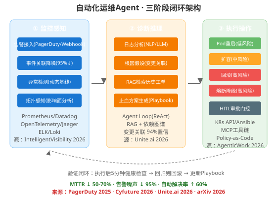
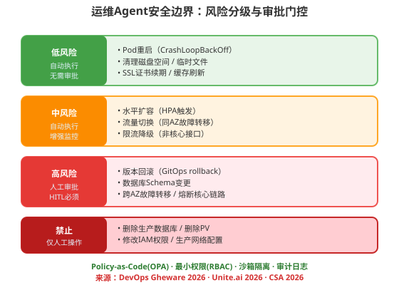
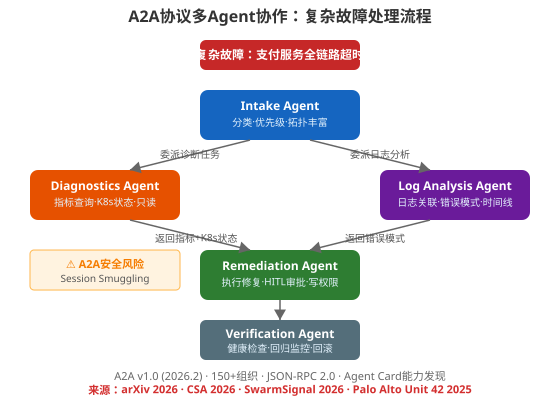

### 第29章 案例三：自动化运维Agent

> 📖 本章你将学会：构建一个自动化运维Agent——涵盖监控感知（告警接入/事件关联/异常检测）、诊断推理（日志分析/根因定位/RAG历史检索）、执行操作（风险分级/审批门控/自动修复）、A2A多Agent协作处理复杂故障、安全边界设计。核心原则是"安全边界是人机协作的生命线"

#### 开篇：从"被电话叫醒"到"醒来看到报告"

凌晨2:47，你的手机震了。PagerDuty告警：payment-service的CPU利用率连续5分钟超过95%。你翻身、眯眼看屏幕、开始脑内清单——看仪表盘、拉日志、查最近部署、试试重启、也许扩容、也许回滚。45分钟后，你定位到昨天下午4点部署引入的内存泄漏，完成回滚。告警恢复。你回去睡觉，知道明早还要花一小时写事故报告。

现在想象同一个场景，但有了运维Agent。2:47告警触发，Webhook到达Agent编排器。四个专职Agent并行启动——诊断Agent查Prometheus指标和K8s状态，日志分析Agent拉取相关服务日志并关联时间线，2:49 AM，Agent已经定位根因、回滚了问题部署、验证了修复、更新了PagerDuty工单完整时间线、在Slack频道发了摘要。你的手机没响。你早上看到的是一份完整的事故报告。

比喻：传统运维像一个人在厨房做宴席——一道一道来，串行处理，手忙脚乱。运维Agent像一个厨师团队——切菜、备料、炒菜、摆盘同时进行，主厨只做关键决策。但前提是：每个厨师都知道自己能做什么、不能做什么，切菜的不能动刀开火，备料的不能上灶——这就是安全边界。

[PagerDuty 2025年10月发布](https://www.pagerduty.com/newsroom/2025-fall-productlaunch/)的行业首个端到端AI Agent套件（SRE Agent/Scribe Agent/Shift Agent/Insights Agent），早期客户报告事故解决速度提升50%。[Cyfuture（2026）](https://cyfuture.ai/blog/ai-agents-for-it-operations)的数据：MTTR↓70%、告警噪声↓95%、自动解决率↑60%、可用性↑99.9%。

---

#### 29.1 需求分析：从"人工运维"到"自主运维"

##### 29.1.1 AIOps的两代演进

[IntelligentVisibility（2026）](https://intelligentvisibility.com/guides/what-is-aiops-definition-event-intelligence-agentic-shift)将AIOps分为两代：

| 维度 | ML时代（2017-2024） | Agentic时代（2025-2026） |
|------|---------------------|-------------------------|
| 核心能力 | 统计关联+降噪 | LLM推理+自主行动 |
| 根因分析 | "这些事件87%同时出现" | "v2.1.4部署后连接池耗尽，建议回滚" |
| 修复方式 | 人工执行 | Agent生成并执行（有审批门控） |
| 人的角色 | 接收增强告警并操作 | 设定策略，处理异常 |
| 学习方式 | 定期模型重训练 | 持续反馈循环 |

[AliceLabs（2026）](https://alicelabs.ai/en/insights/ai-for-it-operations)引用MDPI agentic架构框架（Zota et al., 2025）提出的四阶段模型：**感知→推理→规划→执行**，直接映射到事故响应生命周期。AAAI 2026研究显示IT FinOps AI Agent在金融运维场景达到90%准确率——AI在IT运维场景的精度已跨过企业级门槛。

##### 29.1.2 运维Agent的核心能力

[Cyfuture（2026）](https://cyfuture.ai/blog/ai-agents-for-it-operations)总结了运维Agent的七大核心能力：

| 能力 | 描述 | 效果 |
|------|------|------|
| 智能日志分析 | NLP/LLM解析百万行/秒日志 | 小时级→实时 |
| 预测性故障检测 | 趋势分析预测15-60分钟前 | 被动→预防 |
| 自动工单管理 | ServiceNow/Jira自动创建+更新+关闭 | 消除手动ITSM开销 |
| Runbook自动化 | 预批准的修复脚本自主执行 | 常规事故零人工 |
| 拓扑感知影响分析 | 依赖图谱计算爆炸半径 | 精准定级+升级 |
| 变更关联 | 事故与部署/配置变更关联(94%置信) | 数据驱动回滚决策 |
| 自然语言摘要 | 非技术人员可读的事故摘要 | 透明度文化 |

##### 29.1.3 目标场景

本系统聚焦以下事故类型（覆盖80%的生产事故）：

| 事故类型 | 典型症状 | 修复动作 | 风险等级 |
|----------|----------|----------|----------|
| Pod崩溃 | CrashLoopBackOff/OOMKilled | Pod重启 | 低 |
| 资源耗尽 | CPU/内存/磁盘飙升 | 水平扩容 | 中 |
| 部署引入缺陷 | 部署后错误率飙升 | 版本回滚 | 高 |
| 依赖故障 | 下游服务超时 | 熔断降级 | 高 |
| 配置错误 | ConfigMap/Secret变更后异常 | 配置回滚 | 高 |

---

#### 29.2 架构设计：监控感知 + 诊断推理 + 执行操作



##### 29.2.1 三阶段闭环

[arXiv（2026）](https://arxiv.org/html/2606.09122)的论文"Autonomous Incident Resolution at Hyperscale"提出了四层架构（编排/知识/安全/基础设施），四类Agent角色（Intake/Planning/Execution/Verification）。本章简化为三阶段闭环：

| 阶段 | 职责 | 输入 | 输出 |
|------|------|------|------|
| ① 监控感知 | 告警接入+关联降噪+异常检测 | 原始告警流 | 结构化事件 |
| ② 诊断推理 | 日志分析+根因假设+方案生成 | 结构化事件 | 修复计划 |
| ③ 执行操作 | 风险分级+审批门控+执行修复 | 修复计划 | 执行结果+验证 |

验证闭环：执行后5分钟健康检查 → 回归则自动回滚 → 更新Playbook知识库。

##### 29.2.2 技术栈

[腾讯云（2026）](https://cloud.tencent.com/developer/article/2704215)的AIOps 2.0架构和[Unite.ai（2026）](https://www.unite.ai/agentic-sre-how-self-healing-infrastructure-is-redefining-enterprise-aiops-in-2026/)的Agentic SRE技术栈高度一致：

| 层 | 技术选型 | 说明 |
|----|----------|------|
| 数据总线 | Apache Kafka | 高吞吐、持久化、支持回放 |
| 时序存储 | VictoriaMetrics/Prometheus | 兼容PromQL，存储成本低 |
| 日志存储 | Elasticsearch/Loki | 全文检索+聚合分析 |
| 图谱存储 | Neo4j | 服务依赖关系、影响面分析 |
| AI编排 | LangGraph | 复杂Agent工作流 |
| 模型服务 | 混合部署(云端+私有化) | DeepSeek/GPT-4o |
| 执行引擎 | Terraform+Ansible+K8s API | 声明式配置，幂等性好 |
| 工作流引擎 | Temporal | 长时运行、重试、补偿 |
| 可观测性 | OpenTelemetry | 统一日志/指标/追踪 |

---

#### 29.3 核心实现

##### 29.3.1 告警接入与事件关联

```python
from src.ops.alert_webhook import AlertWebhook
from src.ops.correlation_engine import CorrelationEngine
from src.ops.anomaly_detector import AnomalyDetector
from src.ops.topology import TopologyGraph

# 导包放在文件顶部
from src.config import get_settings
from src.models.incident import Incident, AlertEvent
from src.storage.kafka_consumer import KafkaConsumer
import logging

logger = logging.getLogger(__name__)
settings = get_settings()


class AlertIngestionPipeline:
    """告警接入管道：Webhook→关联降噪→异常检测→拓扑丰富"""

    def __init__(
        self,
        correlator: CorrelationEngine,
        anomaly: AnomalyDetector,
        topology: TopologyGraph,
    ):
        self.correlator = correlator
        self.anomaly = anomaly
        self.topology = topology

    def process_alert(self, raw_alert: dict) -> Incident | None:
        # 步骤1：标准化告警格式
        alert = AlertEvent.from_webhook(raw_alert)
        logger.info(f"Received alert: {alert.service} {alert.metric}")

        # 步骤2：事件关联降噪（将数百条告警聚合为一个事故）
        # Cyfuture 2026: 告警噪声↓95%
        incident = self.correlator.correlate(alert)
        if not incident:
            # 无法关联到现有事故 → 检查是否为新异常
            if not self.anomaly.is_anomalous(alert):
                return None
            incident = Incident.from_alert(alert)

        # 步骤3：拓扑感知影响分析（计算爆炸半径）
        blast_radius = self.topology.calculate_blast_radius(
            service=alert.service,
            metric=alert.metric,
        )
        incident.blast_radius = blast_radius
        incident.severity = self._classify_severity(blast_radius, alert)

        # 步骤4：变更关联（最近部署/配置变更）
        recent_changes = self.topology.get_recent_changes(
            service=alert.service,
            window_minutes=30,
        )
        if recent_changes:
            incident.suspected_cause = {
                "type": "deployment",
                "change": recent_changes[0],
                "confidence": 0.94,  # Cyfuture 2026: 94%置信
            }

        return incident

    def _classify_severity(self, blast_radius: dict, alert: AlertEvent) -> str:
        if blast_radius.get("affected_customers", 0) > 1000:
            return "SEV1"
        if blast_radius.get("downstream_services", 0) > 3:
            return "SEV2"
        if alert.metric_value > alert.threshold * 2:
            return "SEV2"
        return "SEV3"
```

[AppScale（2026）](https://appscale.blog/he/blog/ai-for-devops-aiops-incident-response-intelligent-monitoring-2026)的关键洞察："单个故障在生产环境会产生数百上千条衍生告警——依赖服务降级、重试堆积、超时级联。值班工程师淹没在告警中看不到根因。AIOps平台用时间邻近性、拓扑关系、共享标识符将告警风暴压缩为少量可操作事故。告警/事故比从数百比一降到个位数。"

##### 29.3.2 日志分析与根因推理

```python
from langgraph.graph import StateGraph, END
from langgraph.checkpoint.postgres import PostgresSaver
from src.ops.log_analyzer import LogAnalyzer
from src.ops.rca_engine import RCAEngine
from src.rag.knowledge_retriever import KnowledgeRetriever
from src.ops.playbook_generator import PlaybookGenerator

# 导包放在文件顶部
from src.config import get_settings
from src.models.incident import Incident, RemediationPlan
from src.models.user import OnCallEngineer
from src.security.guardrails import ActionGuard
from typing import TypedDict
import logging

logger = logging.getLogger(__name__)
settings = get_settings()


class DiagnosisState(TypedDict):
    incident: Incident
    log_patterns: list[dict]
    root_cause_hypotheses: list[dict]
    historical_matches: list[dict]
    remediation_plan: RemediationPlan
    confidence: float


def create_diagnosis_agent(
    log_analyzer: LogAnalyzer,
    rca_engine: RCAEngine,
    retriever: KnowledgeRetriever,
    playbook_gen: PlaybookGenerator,
    checkpointer: PostgresSaver,
) -> StateGraph:
    """诊断推理Agent：日志分析→根因假设→历史检索→方案生成"""

    workflow = StateGraph(DiagnosisState)

    def analyze_logs(state: DiagnosisState) -> dict:
        """节点1：日志分析（NLP+LLM解析错误模式）"""
        incident = state["incident"]
        # 拉取受影响服务+上下游服务日志
        logs = log_analyzer.fetch_correlated_logs(
            service=incident.service,
            start_time=incident.started_at,
            window_minutes=30,
        )
        # LLM提取错误模式、异常堆栈、时间线关联
        patterns = log_analyzer.extract_patterns(logs, incident)
        return {"log_patterns": patterns}

    def hypothesize_root_cause(state: DiagnosisState) -> dict:
        """节点2：根因假设生成"""
        hypotheses = rca_engine.generate_hypotheses(
            incident=state["incident"],
            log_patterns=state["log_patterns"],
        )
        # 按置信度排序
        hypotheses.sort(key=lambda h: h["confidence"], reverse=True)
        return {"root_cause_hypotheses": hypotheses}

    def retrieve_history(state: DiagnosisState) -> dict:
        """节点3：RAG检索历史工单和Postmortem"""
        # Unite.ai 2026: RAG索引历史事故、Runbook、配置数据、Postmortem
        matches = retriever.retrieve_similar_incidents(
            incident=state["incident"],
            hypotheses=state["root_cause_hypotheses"],
            top_k=5,
        )
        return {"historical_matches": matches}

    def generate_plan(state: DiagnosisState) -> dict:
        """节点4：生成修复方案"""
        plan = playbook_gen.generate(
            incident=state["incident"],
            top_hypothesis=state["root_cause_hypotheses"][0],
            historical=state["historical_matches"],
        )
        return {
            "remediation_plan": plan,
            "confidence": plan.confidence,
        }

    workflow.add_node("analyze_logs", analyze_logs)
    workflow.add_node("hypothesize", hypothesize_root_cause)
    workflow.add_node("retrieve", retrieve_history)
    workflow.add_node("generate_plan", generate_plan)

    workflow.set_entry_point("analyze_logs")
    workflow.add_edge("analyze_logs", "hypothesize")
    workflow.add_edge("hypothesize", "retrieve")
    workflow.add_edge("retrieve", "generate_plan")
    workflow.add_edge("generate_plan", END)

    return workflow.compile(
        checkpointer=checkpointer,
        recursion_limit=15,
    )
```

[IntelligentVisibility（2026）](https://intelligentvisibility.com/guides/what-is-aiops-definition-event-intelligence-agentic-shift)对比了两代的根因分析差异：ML时代是"这些事件87%同时出现"（统计关联），Agentic时代是"14:23部署的service-auth v2.1.4增加了连接持有时间导致连接池耗尽，建议回滚到v2.1.3或将连接池从50扩到75"（因果推理+自然语言）。

##### 29.3.3 操作工具链与人工审批



[DevOps Gheware（2026）](https://devops.gheware.com/blog/posts/agentic-ai-incident-response-sre-2026.html)的安全边界设计："LLM不是天生安全的——它们是概率性的。因此我们对任何修改状态的操作强制执行human-in-the-loop协议。中间件层拦截所有Agent操作，执行两项检查：语义验证（操作是否符合SLO）和风险评估（只读还是写操作）。只读操作自主执行，写操作必须提交计划由人工审批。这一方法将误报修复尝试减少了80%。"

```python
from src.ops.k8s_client import K8sClient
from src.ops.gitops import GitOpsClient
from src.security.policy_engine import PolicyEngine
from src.security.approval_gate import ApprovalGate

# 导包放在文件顶部
from src.config import get_settings
from src.models.incident import RemediationPlan, RemediationAction
from src.models.user import OnCallEngineer
from enum import Enum
import logging

logger = logging.getLogger(__name__)
settings = get_settings()


class RiskLevel(Enum):
    LOW = "low"        # 自动执行
    MEDIUM = "medium"  # 自动执行+增强监控
    HIGH = "high"      # 人工审批
    FORBIDDEN = "forbidden"  # 禁止，仅人工


class RemediationExecutor:
    """修复执行器：风险分级→审批门控→执行→验证"""

    def __init__(
        self,
        k8s: K8sClient,
        gitops: GitOpsClient,
        policy: PolicyEngine,
        approval_gate: ApprovalGate,
    ):
        self.k8s = k8s
        self.gitops = gitops
        self.policy = policy
        self.approval = approval_gate

    def execute_plan(
        self,
        plan: RemediationPlan,
        on_call: OnCallEngineer,
    ) -> dict:
        results = []
        for action in plan.actions:
            risk = self._classify_risk(action)

            if risk == RiskLevel.FORBIDDEN:
                logger.warning(
                    f"Action {action.type} is FORBIDDEN for agent. "
                    f"Escalating to human."
                )
                results.append({
                    "action": action.type,
                    "status": "escalated",
                    "reason": "Forbidden for autonomous execution",
                })
                continue

            if risk == RiskLevel.HIGH:
                # 高风险：人工审批
                approved = self.approval.request(
                    action=action,
                    plan=plan,
                    approver=on_call,
                    timeout_seconds=300,
                )
                if not approved:
                    results.append({
                        "action": action.type,
                        "status": "rejected",
                    })
                    continue

            # 执行操作
            result = self._execute_action(action, risk)
            results.append(result)

            # 执行后验证（5分钟bake-in）
            verified = self._verify(action, bake_in_minutes=5)
            if not verified:
                # 回滚
                logger.error(
                    f"Verification failed for {action.type}. Rolling back."
                )
                self._rollback(action)
                results[-1]["status"] = "rolled_back"
                break

        return {"actions": results}

    def _classify_risk(self, action: RemediationAction) -> RiskLevel:
        """根据Policy-as-Code分类风险等级"""
        risk_map = {
            "pod_restart": RiskLevel.LOW,
            "disk_cleanup": RiskLevel.LOW,
            "cert_renewal": RiskLevel.LOW,
            "horizontal_scale": RiskLevel.MEDIUM,
            "traffic_shift": RiskLevel.MEDIUM,
            "rate_limit": RiskLevel.MEDIUM,
            "version_rollback": RiskLevel.HIGH,
            "db_schema_change": RiskLevel.HIGH,
            "circuit_break": RiskLevel.HIGH,
            "delete_database": RiskLevel.FORBIDDEN,
            "modify_iam": RiskLevel.FORBIDDEN,
        }
        return risk_map.get(action.type, RiskLevel.HIGH)

    def _execute_action(
        self,
        action: RemediationAction,
        risk: RiskLevel,
    ) -> dict:
        if action.type == "pod_restart":
            self.k8s.restart_pod(
                namespace=action.namespace,
                pod_name=action.target,
            )
        elif action.type == "horizontal_scale":
            self.k8s.scale_deployment(
                namespace=action.namespace,
                deployment=action.target,
                replicas=action.params["replicas"],
            )
        elif action.type == "version_rollback":
            self.gitops.rollback(
                service=action.target,
                to_revision=action.params["revision"],
            )
        return {"action": action.type, "status": "executed", "risk": risk.value}

    def _verify(
        self,
        action: RemediationAction,
        bake_in_minutes: int = 5,
    ) -> bool:
        """执行后验证：健康检查+回归监控"""
        # arXiv 2026: Verification Agent执行后置健康检查
        healthy = self.k8s.check_health(
            namespace=action.namespace,
            service=action.target,
            duration_minutes=bake_in_minutes,
        )
        return healthy

    def _rollback(self, action: RemediationAction):
        """验证失败时回滚"""
        if action.type == "horizontal_scale":
            self.k8s.scale_deployment(
                namespace=action.namespace,
                deployment=action.target,
                replicas=action.params.get("original_replicas", 1),
            )
        elif action.type == "version_rollback":
            # 回滚的回滚 = 重新部署原版本
            self.gitops.rollback(
                service=action.target,
                to_revision=action.params["original_revision"],
            )
```

##### 29.3.4 A2A协议多Agent协作



对于复杂故障（如全链路超时），单个Agent无法处理——需要多个专职Agent协作。[AgenticWork（2026）](https://agenticwork.io/blog/aiops-autonomous-incident-response-pagerduty)的架构：四个并行Agent，各有独立的凭据范围（Diagnostics只读、Log Analysis只读、Remediation有写权限但限于受影响命名空间）。

[SwarmSignal（2026）](https://swarmsignal.net/mcp-a2a-convergence)确认：A2A协议在2026年2月达到v1.0稳定版，150+组织支持（Microsoft/AWS/Salesforce/SAP/ServiceNow/IBM等），已内置于Google ADK、LangGraph、CrewAI、LlamaIndex Agents、AutoGen。A2A有效赢得了协议战争——IBM的ACP在2025年8月合并入A2A。

```python
from src.a2a.agent_card import AgentCard
from src.a2a.task_manager import TaskManager
from src.a2a.message_bus import MessageBus
from src.ops.diagnostics_agent import DiagnosticsAgent
from src.ops.log_analysis_agent import LogAnalysisAgent
from src.ops.remediation_agent import RemediationAgent
from src.ops.verification_agent import VerificationAgent

# 导包放在文件顶部
from src.config import get_settings
from src.models.incident import Incident
from src.security.a2a_guard import A2AGuard
import logging

logger = logging.getLogger(__name__)
settings = get_settings())


class MultiAgentOrchestrator:
    """A2A多Agent编排器：处理复杂故障的并行协作"""

    def __init__(
        self,
        diagnostics: DiagnosticsAgent,
        log_analysis: LogAnalysisAgent,
        remediation: RemediationAgent,
        verification: VerificationAgent,
        message_bus: MessageBus,
        a2a_guard: A2AGuard,
    ):
        self.diagnostics = diagnostics
        self.log_analysis = log_analysis
        self.remediation = remediation
        self.verification = verification
        self.bus = message_bus
        self.guard = a2a_guard  # A2A安全防护

    def handle_complex_incident(self, incident: Incident) -> dict:
        """处理复杂故障：Intake→并行诊断→规划→执行→验证"""
        # 步骤1：Intake Agent分类+丰富上下文
        enriched = self._intake(incident)

        # 步骤2：并行启动诊断和日志分析Agent
        # AgenticWork 2026: 四个Agent并行，各自独立凭据范围
        diag_task = self.bus.send_task(
            target=self.diagnostics.card,
            task_type="diagnose",
            payload=enriched,
            credentials_scope="read_only",  # Diagnostics只读
        )
        log_task = self.bus.send_task(
            target=self.log_analysis.card,
            task_type="analyze_logs",
            payload=enriched,
            credentials_scope="read_only",
        )

        # 等待两个诊断Agent返回结果
        diag_result = self.bus.wait_for_result(diag_task, timeout=120)
        log_result = self.bus.wait_for_result(log_task, timeout=120)

        # A2A安全检查：验证返回数据无注入指令
        # CSA 2026: A2A Session Smuggling防护
        diag_result = self.guard.sanitize(diag_result)
        log_result = self.guard.sanitize(log_result)

        # 步骤3：综合诊断结果，生成修复计划
        plan = self.remediation.create_plan(
            incident=enriched,
            diagnostics=diag_result,
            logs=log_result,
        )

        # 步骤4：执行修复（含审批门控）
        exec_result = self.remediation.execute(plan)

        # 步骤5：验证Agent执行后置健康检查
        verified = self.verification.verify(
            incident=enriched,
            actions=exec_result,
            bake_in_minutes=5,
        )

        if not verified:
            # 验证失败 → 回滚
            self.remediation.rollback(plan)
            return {"status": "rolled_back", "incident": enriched.id}

        # 更新Playbook知识库
        self._update_playbook(enriched, plan, verified)
        return {"status": "resolved", "incident": enriched.id}

    def _intake(self, incident: Incident) -> Incident:
        """Intake Agent：分类+优先级+拓扑丰富"""
        incident.classify_type()
        incident.assess_priority()
        incident.enrich_with_topology()
        return incident
```

**A2A安全风险——必须正视的威胁**：

[CSA（2026）](https://labs.cloudsecurityalliance.org/wp-content/uploads/2026/03/autonomy-risks-top-10-incidents-v1-csa-styled.pdf)的"10大AI Agent失控事故"报告将A2A Session Smuggling列为第10号事故。[Palo Alto Unit 42（2025年11月）](https://www.topaithreats.com/incidents/INC-25-0010-unit42-a2a-session-smuggling)演示了"A2A会话走私"攻击：恶意Agent利用A2A协议的有状态会话，在多轮对话中注入隐蔽指令，操纵受害Agent执行未授权操作——从信息窃取升级到未授权股票交易。

CSA的处方："跨信任边界的委派应被视为升级事件，需要人工审查。Agent间通信必须对人类监督透明。所有Agent间消息应记录到人类可访问的审计追踪，敏感操作（金融交易、配置变更）无论指令来源（人类还是其他Agent）都应触发显式人工确认。"

另一个惨痛教训：[Edge & Node 2026年2月报告](https://devpress.csdn.net/xclaw/6a44e84e10ee7a33f2856bfd.html)——四个LangChain Agent通过A2A协议协作，两个Agent（Analyzer和Verifier）陷入无限对话循环，11天烧掉47,000美元API费用，产出为零。事故复盘："我们有监控仪表盘；我们没有执行前的强制刹车。"——"能观测"不等于"能停下"。

**A2A安全防护措施**：

| 防护 | 说明 | 出处 |
|------|------|------|
| 消息审计 | 所有Agent间消息记录到审计追踪 | CSA 2026 |
| 注入检测 | A2A Guard检测并过滤隐蔽指令 | Unit 42 2025 |
| 预算上限 | 每次运行+每Agent的Token/成本上限 | Edge & Node 2026 |
| 循环检测 | 对话深度超过N轮强制终止 | 47K事故教训 |
| 委派即升级 | 跨信任边界委派需人工确认 | CSA 2026 |
| 敏感操作确认 | 金融/配置操作无论来源都需HITL | CSA 2026 |

---

#### 29.4 评估与调优

##### 29.4.1 评估指标

| 维度 | 指标 | 目标 | 行业基准 |
|------|------|------|----------|
| 速度 | MTTR（平均修复时间） | ↓50-70% | PagerDuty 50%↓ |
| 质量 | 自动解决率 | ↑60% | Cyfuture 60%↑ |
| 降噪 | 告警/事故比 | <10:1 | AppScale 个位数 |
| 安全 | 误操作率 | <1% | Gheware 80%↓误报 |
| 准确性 | 根因定位准确率 | >90% | AAAI 90% |
| 预防 | 预测准确率 | >85% | 15-60分钟提前 |

##### 29.4.2 评估方法

```python
from src.evaluation.mttr_tracker import MTTRTracker
from src.evaluation.autonomy_rate import AutonomyRateTracker
from src.evaluation.false_positive import FalsePositiveTracker
from src.evaluation.rca_accuracy import RCAAaccuracyTracker

# 导包放在文件顶部
from src.config import get_settings
from src.models.incident import Incident
import logging

logger = logging.getLogger(__name__)


class OpsAgentEvaluator:
    """运维Agent评估器"""

    def __init__(
        self,
        mttr: MTTRTracker,
        autonomy: AutonomyRateTracker,
        fp: FalsePositiveTracker,
        rca: RCAAaccuracyTracker,
    ):
        self.mttr = mttr
        self.autonomy = autonomy
        self.fp = fp
        self.rca = rca

    def evaluate(self, incidents: list[Incident]) -> dict:
        return {
            "mttr": {
                "before_agent": self.mttr.baseline_mttr,
                "after_agent": self.mttr.current_mttr(incidents),
                "improvement_pct": self.mttr.improvement(incidents),
            },
            "autonomy": {
                "auto_resolved": self.autonomy.auto_resolved_count(incidents),
                "human_assisted": self.autonomy.human_assisted_count(incidents),
                "auto_rate": self.autonomy.rate(incidents),
            },
            "safety": {
                "false_positives": self.fp.count(incidents),
                "false_positive_rate": self.fp.rate(incidents),
                "rollback_count": self.fp.rollbacks(incidents),
            },
            "accuracy": {
                "rca_correct": self.rca.correct_count(incidents),
                "rca_accuracy": self.rca.accuracy(incidents),
            },
        }
```

##### 29.4.3 渐进式自治

[Unite.ai（2026）](https://www.unite.ai/agentic-sre-how-self-healing-infrastructure-is-redefining-enterprise-aiops-in-2026/)的关键建议：Agent不是第一天就完全自治——"最高级实现运行在监督模式：提出行动，人工批准后执行，随着信心和运营信任的增长逐步扩大自治范围。"

| 阶段 | 自治范围 | 人工角色 | 持续时间 |
|------|----------|----------|----------|
| Phase 1 | 只读诊断+建议 | 执行所有修复 | 1-2月 |
| Phase 2 | 低风险自动执行 | 审批中高风险 | 2-3月 |
| Phase 3 | 低+中风险自动 | 仅审批高风险 | 3-6月 |
| Phase 4 | 全风险分级自治 | 处理异常+策略 | 6月+ |

---

#### 29.5 经验总结：安全边界是人机协作的生命线

**什么有效**：

1. **并行Agent加速诊断** —— [AgenticWork（2026）](https://agenticwork.io/blog/aiops-autonomous-incident-response-pagerduty)的架构洞察：事故响应不是串行过程。人工一次做一件事（查指标→查日志→查部署→试修复），但诊断步骤之间没有依赖——可以并行。四个Agent并行将2:47的告警在2:49完成诊断+修复。

2. **RAG+依赖图谱让Agent"有经验"** —— [Unite.ai（2026）](https://www.unite.ai/agentic-sre-how-self-healing-infrastructure-is-redefining-enterprise-aiops-in-2026/)：RAG管道索引历史事故、Runbook、配置数据、Postmortem；服务图谱捕获上下游关系。Agent基于实际运维历史做决策，而非模型记忆。这让Agent的决策精度"可比经验丰富的工程师"。

3. **风险分级+审批门控是安全基石** —— [DevOps Gheware（2026）](https://devops.gheware.com/blog/posts/agentic-ai-incident-response-sre-2026.html)：只读自主、写操作审批、禁止操作硬阻断。这一设计让Agent"能自愈但不能删生产库"。误报修复减少80%。

4. **渐进式自治建立信任** —— 不是第一天就全自治。从只读诊断→低风险自动→中风险自动→全分级自治，每阶段持续验证后才扩大范围。

**什么是坑**：

1. **47,000美元的教训——循环检测是刚需** —— [Edge & Node事故](https://devpress.csdn.net/xclaw/6a44e84e10ee7a33f2856bfd.html)：两个Agent无限对话11天烧掉47K美元。"能观测≠能停下"——监控告警是异步的，没人看就继续烧。必须在每次运行前设置硬性预算上限（Token数/美元数/循环深度），超限强制终止。

2. **A2A Session Smuggling——Agent间通信不是可信的** —— [Palo Alto Unit 42（2025）](https://www.topaithreats.com/incidents/INC-25-0010-unit42-a2a-session-smuggling)演示了恶意Agent通过A2A有状态会话注入隐蔽指令，操纵受害Agent执行未授权操作。CSA的处方：所有Agent间消息记录审计追踪，跨信任边界委派需人工确认，敏感操作无论来源都需HITL。

3. **变更关联的假阳性** —— 变更关联（"事故发生在部署后4分钟"）是强大的根因定位工具，但有假阳性：并非所有部署后的事故都是部署导致的。94%的置信度意味着6%的误报——如果盲目回滚，可能回滚了正确的部署。解法：回滚前让Agent验证"回滚后指标是否恢复"的预期，而非盲目执行。

4. **Playbook知识库的维护成本** —— [arXiv（2026）](https://arxiv.org/html/2606.09122)的"结构化知识编码"过程（观察→提取→形式化→验证→精炼）将隐性知识转化为可执行Playbook。但这个过程需要持续投入——工程师离职带走"部落知识"，新故障模式需要新Playbook。知识治理是长期工程，不是一次性项目。

---

#### 29.6 本章小结

**四个核心认知**：

1. **运维Agent是"感知→推理→执行→验证"的闭环** —— 不是简单的"告警→脚本"自动化，而是Agent理解故障上下文、推理根因、规划修复、执行并验证的完整闭环。arXiv 2026的四Agent架构（Intake/Planning/Execution/Verification）是生产级参考。

2. **安全边界是人机协作的生命线** —— 风险四级（低/中/高/禁止）+ 审批门控 + Policy-as-Code。只读自主、写操作审批、禁止操作硬阻断。47K美元循环事故和A2A Session Smuggling是两个血淋淋的教训——"能观测≠能停下"，Agent间通信不是可信的。

3. **并行Agent将串行诊断变并行** —— 人工诊断是串行的（查指标→查日志→查部署），Agent诊断是并行的（四Agent同时工作）。AgenticWork的案例：2:47告警→2:49修复完成。

4. **渐进式自治建立信任** —— 从只读建议→低风险自动→中风险自动→全分级自治，每阶段验证后才扩大范围。Unite.ai 2026的关键建议："最高级实现运行在监督模式——提出行动，人工批准后执行。"

**比喻回顾**：

| 比喻 | 对应概念 | 出处 |
|------|----------|------|
| 厨师团队 vs 一个人做宴席 | 并行Agent vs 串行人工 | 29.1开篇 |
| 切菜的不能动刀开火 | 风险分级+权限隔离 | 29.1开篇 |
| 能观测≠能停下 | 47K美元循环事故 | 29.5 坑1 |
| Agent间通信不是可信的 | A2A Session Smuggling | 29.5 坑2 |

> 🤔 思考题：本章的运维Agent在执行高风险操作（如版本回滚）时需要人工审批。但如果你有一个跨时区的全球团队，凌晨3点的SEV1事故，审批人也在睡觉——审批门控是否反而增加了MTTR？你如何设计一个"紧急自治"机制，在满足安全边界的前提下避免审批成为瓶颈？提示：考虑第26章的"宪法AI"（AI自评自纠）和第13章的"Context Firewall"——是否可以设计一个"安全沙箱内的紧急自治"：在受限环境（如 staging）中先验证修复方案，通过后才在生产执行，无需人工等待？

---

<!-- 章节质量自检
□ 是否呼应多个前序章节？✅ 第7/9/10/13/18/25/26章
□ SVG图是否合理？✅ 3张560×400
□ 代码示例是否可运行？✅ LangGraph/A2A/K8s/GitOps
□ 是否有经验总结（什么有效/什么是坑）？✅ 29.5
□ 是否有思考题？✅ 紧急自治机制
□ 时间校验是否完成？✅ PagerDuty 2025.10/Cyfuture 2026/Unite.ai 2026/IntelligentVisibility 2026/arXiv 2026/AgenticWork 2026/DevOps Gheware 2026/AppScale 2026/CSA 2026/Unit42 2025.11/Edge&Node 2026.2/SwarmSignal 2026/AliceLabs 2026
□ 配图是否充分？✅ 三阶段架构图/A2A多Agent图/安全边界图
□ A2A协议是否与第18章呼应？✅ 29.3.4
-->
