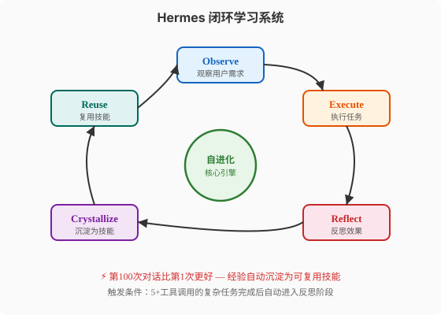
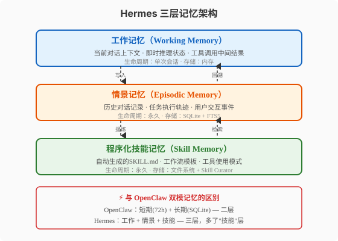
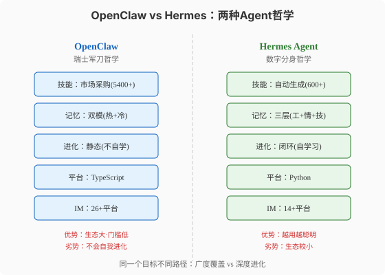

### 第22章 Hermes Agent深度解读

> 📖 本章你将学会：理解Hermes Agent自进化能力的架构原理（闭环学习五步循环），掌握三层记忆与技能自动生成的工程实现，建立Hermes与OpenClaw的系统性对比认知

#### 开篇：两匹不同的马

上一章我们认识了OpenClaw——那位"带5400本操作手册的管家"。他能力全面，覆盖26个平台，但你发现一个问题：他的手册是"买来的"，不是"自己写的"。他不会从经验中学习——第一次犯的错，第一百次还会犯。

这一章的主角Hermes Agent走了一条完全不同的路。它的官方标语是"The agent that grows with you"——**一个与你共同成长的Agent**。它没有5400本买来的手册，但它会自己"写手册"：每次完成一个复杂任务后，它会反思"我是怎么做到的"，然后把成功经验沉淀成一个新的Skill。下次遇到类似任务，它不需要从头摸索——直接调用自己写的Skill。

比喻：如果OpenClaw是"百科全书式管家"——什么都懂一点，靠的是广博的知识库；Hermes就是"学徒式管家"——一开始可能不如OpenClaw能干，但它每天都在学习，第100次服务你时比第1次好得多。

这两种哲学没有对错——OpenClaw适合"即时广覆盖"场景（装上就能用），Hermes适合"长期深度协作"场景（越用越默契）。本章我们拆解Hermes的"自进化"引擎。

---

#### 22.1 Hermes Agent是什么

##### 22.1.1 项目起源：Nous Research的自进化实验

Hermes Agent由**Nous Research**于2026年2月发布。Nous Research是一家专注于开源AI研究的机构，此前以Hermes系列大语言模型闻名（Hermes-2、Hermes-3等微调模型在开源社区有很高声誉）。Hermes Agent是他们从"训练模型"到"构建Agent系统"的战略延伸。

项目采用MIT许可，Python编写，GitHub地址在[nous-research/hermes-agent](https://github.com/nous-research/hermes-agent)。截至2026年8月，Star数约140K-175K。

> ⚠️ 注意：Hermes Agent与Hermes大语言模型是同一个团队的不同项目。Hermes LM是"模型"（权重），Hermes Agent是"框架"（代码）。Hermes Agent不限定使用Hermes LM——它支持200+模型，包括GPT、Claude、DeepSeek、Llama等。不要把两者混淆。

Hermes Agent在2026年5月创造了一个里程碑：它在OpenRouter（一个统一模型API路由平台）上的使用量超越了OpenClaw，成为**日处理tokens最多的Agent框架**——日处理220B+（2200亿）tokens。这意味着全球通过OpenRouter调用的Agent推理中，Hermes占了最大份额。

##### 22.1.2 核心定位："The agent that grows with you"

这个标语不是营销口号，而是架构设计的出发点和归宿。让我们拆解"grows with you"的三个层面：

**"grows"——会成长**：传统Agent的能力边界是固定的——你给它10个工具，它永远只有10个工具。Hermes的能力边界是动态的——它会在使用过程中自动生成新技能，能力随时间扩展。第1天它可能只有600个内置技能，用一个月后可能变成800个（600原始+200自生成）。

**"with you"——与你协同成长**：Hermes的技能不是凭空生成的，而是基于"你的使用模式"。如果你是程序员，它会生成代码审查、测试生成的技能；如果你是研究员，它会生成文献检索、论文摘要的技能。同一个Hermes，在 不同用户手中进化出不同的技能集——这就是"数字分身"（Digital Twin）的由来。

**"you"——以你为中心**：Hermes的一切设计都围绕"单个用户"展开——五级权限模型由你配置，零追踪意味着不收集任何遥测数据，技能进化服务于你的工作流。这与企业级Agent（服务于组织目标）形成对比。

##### 22.1.3 "养马"现象：与OpenClaw的差异化竞争

OpenClaw的"养龙虾"现象我们上一章讲过。Hermes的增长被社区称为"养马"（Breeding）——不像龙虾那样爆发式蜕壳，而像马匹那样稳步成长。Hermes的Star增长曲线比OpenClaw慢但更稳：从发布到100K用了约4个月，而OpenClaw用了约2个月。但Hermes的**用户留存率**更高——一旦用户度过了"初始化阶段"（让Hermes学习自己的工作模式），就很难换回其他框架。

这种差异化竞争的核心是：**OpenClaw卖的是"开箱即用的广度"，Hermes卖的是"越用越聪明的深度"**。

---

#### 22.2 核心差异化：自进化能力

##### 22.2.1 闭环学习系统：五步循环



Hermes的核心引擎是一个五步闭环学习系统：

**Observe（观察）**：Agent接收用户消息，解析意图，理解当前任务。这一步与普通Agent的"感知"阶段无异——读消息、查上下文、识别需求。

**Execute（执行）**：Agent调用工具和技能完成任务。这一步的关键是——Hermes会**完整记录执行轨迹**（execution trace）：调用了哪些工具、按什么顺序、每步的输入输出、中间的推理过程。这个轨迹是后续"反思"的原料。

**Reflect（反思）**：任务完成后，Agent回顾执行轨迹，回答三个问题：哪些步骤是必要的？哪些是冗余的？有没有更好的路径？反思由LLM完成——Agent用自己的"元认知"能力审视自己的行为。

**Crystallize（结晶）**：如果反思发现"这个任务模式值得记住"，Agent将执行轨迹提炼为一个**SKILL.md文件**——提取通用步骤、去掉任务特定细节、补充触发条件和使用说明。这个Skill被存入技能记忆，下次类似任务可直接复用。

**Reuse（复用）**：当新任务到达时，Agent先检查是否有匹配的已有技能。如果有，直接加载Skill的指令，按既定步骤执行——不再需要从头推理。这大幅减少了token消耗和推理时间。

> 💡 提示：这五步不是每次对话都走完的。只有**复杂任务**（定义为"5+工具调用"的任务）才会触发完整的闭环学习。简单任务（如"今天天气如何"）直接执行，不走反思-结晶流程。这是一个关键的成本控制设计——如果每次对话都反思，token消耗会翻三倍。

##### 22.2.2 技能自动生成：从执行轨迹到SKILL.md

Hermes的技能自动生成是它最独特的工程贡献。让我们看一个具体例子：

假设用户要求Hermes"分析这个GitHub仓库的代码质量并生成报告"。Hermes的执行轨迹可能是：

```
1. 调用MCP filesystem工具 → 读取仓库目录结构
2. 调用Bash工具 → 运行cloc统计代码行数
3. 调用Bash工具 → 运行eslint/pylint检查
4. 调用MCP github工具 → 获取Issue和PR统计
5. 调用Bash工具 → 运行complexity分析工具
6. LLM推理 → 综合以上结果生成报告
```

六步调用，超过5步阈值——触发反思。Agent反思后生成SKILL.md：

```yaml
---
name: repo-code-quality-report
description: >
  分析指定GitHub仓库的代码质量，生成综合报告。
  包含代码统计、lint检查、Issue分析和复杂度评估。
triggers:
  - "代码质量"
  - "code quality"
  - "分析仓库"
keywords:
  - repo
  - lint
  - complexity
  - report
---

# 仓库代码质量分析

## 执行步骤
1. 读取仓库目录结构（MCP filesystem → list_dir）
2. 统计代码行数（Bash → cloc --by-file .）
3. 运行lint检查（Bash → eslint . --format json || pylint .）
4. 获取Issue统计（MCP github → list_issues --state all）
5. 分析复杂度（Bash → complexity-check.py --threshold 15）
6. 综合生成报告（LLM → 模板：质量评分+问题清单+改进建议）

## 输出格式
Markdown报告，包含：质量评分(1-10)、问题清单、改进建议
```

注意这个自动生成的Skill做了几个关键**抽象**：

- 去掉了任务特定的仓库地址（"这个仓库"→"指定仓库"）
- 提取了通用步骤而非具体命令
- 补充了触发条件和输出格式
- 保留了工具调用链但泛化了参数

下次用户说"分析另一个仓库的代码质量"，Hermes直接加载这个Skill，按既定步骤执行——不需要重新推理"该怎么做"。

##### 22.2.3 技能持续进化：Skill Curator的七天周期

技能生成不是"一次生成永不变"。Hermes有一个叫**Skill Curator**的后台守护进程（v0.12.0引入），每七天对所有自动生成的技能执行一次"维护周期"：

**Grading（评级）**：统计每个Skill在过去七天的使用次数、成功率、用户反馈。高频高成功率的Skill评级上升，低频低成功率的下降。

**Consolidating（合并）**：如果两个Skill的触发条件高度重叠（如"代码质量分析"和"仓库质量评估"），Skill Curator会尝试合并它们——保留更通用的版本，删除冗余的。

**Pruning（修剪）**：连续四周未被使用的Skill会被标记为"休眠"。连续八周未使用的Skill会被归档（不删除，但从活跃技能列表移除）。这防止了技能库无限膨胀导致初始加载token过多。

这个过程与第11章讲的SkillsBench研究结论完全一致：**"Skill贵精不贵多，紧凑优于冗长"**。Skill Curator是把这个研究结论工程化——不是靠人工筛选，而是靠自动化的七天周期维护。

##### 22.2.4 Nudge Engine：主动反思触发器

除了任务完成后的被动反思，Hermes还有一个**Nudge Engine**——主动反思触发器。Nudge（轻推）的含义是：Agent在不执行任务时，也会主动"想想"过去的表现。

Nudge Engine的触发条件包括：

- **时间触发**：每24小时执行一次"日回顾"，检查当天是否有未结晶的复杂任务
- **错误触发**：当任务失败率超过阈值（如连续3次失败），触发"为什么总是失败"的深度反思
- **对比触发**：当Agent发现自己的做法与内置最佳实践不一致时，触发"我的做法是否需要改进"

Nudge Engine生成的反思结论不直接变成Skill——它会先以"反思笔记"形式存入情景记忆，等待下次同类任务时作为参考。只有当同样的反思结论出现三次以上，才会被Crystallize为Skill。这个"三次确认"机制防止了"一次性的灵光一闪"被错误地固化——毕竟，不是所有反思结论都值得长期记住。

---

#### 22.3 架构设计

##### 22.3.1 三层记忆架构



Hermes的记忆架构比OpenClaw的"双模记忆"多了一层——三层记忆：

**工作记忆（Working Memory）**：对应"当前对话上下文"。存储当前会话的对话轮次、即时推理状态、工具调用中间结果。生命周期：单次会话。存储介质：内存。这与OpenClaw的"72小时热缓存"类似，但生命周期更短——会话结束即清理。

**情景记忆（Episodic Memory）**：对应"历史对话记录"。存储所有历史对话、任务执行轨迹、用户交互事件。生命周期：永久。存储介质：SQLite + FTS5全文检索。这是Hermes"反思"和"技能生成"的数据源——没有完整的情景记忆，Agent无法回顾"上次是怎么做的"。

**程序化技能记忆（Skill Memory）**：对应"自动生成的SKILL.md"。存储从经验中提炼的可复用技能。生命周期：永久（但受Skill Curator维护）。存储介质：文件系统（Markdown文件）。这是Hermes与OpenClaw最大的区别——OpenClaw没有这一层，它的技能全是"买来的"（ClawHub市场），不是"自己写的"。

三层之间的数据流：

- **工作→情景**（写入）：会话结束后，工作记忆中的对话和轨迹被持久化到情景记忆
- **情景→技能**（提炼）：复杂任务的执行轨迹经反思后，被Crystallize为技能记忆
- **技能→工作**（检索）：新任务到达时，从技能记忆中检索匹配Skill，注入工作记忆
- **情景→工作**（回溯）：从情景记忆中检索相关历史，注入工作记忆的上下文

> 💡 提示：这个三层架构与第6章（Context工程）讲的三层记忆理论完全对应——工作记忆=短期记忆，情景记忆=长期记忆，技能记忆=程序化记忆（procedural memory，心理学中的"如何做"记忆，如骑自行车）。Hermes是第一个把"程序化记忆"单独建层的Agent框架。

##### 22.3.2 消息网关：14+ IM平台统一接入

Hermes的消息网关与OpenClaw的Gateway在架构上类似——都是"平台适配层"，统一不同IM平台的API差异。但有两个关键区别：

**平台数量**：Hermes支持14+平台（WhatsApp/Telegram/Discord/Slack等），少于OpenClaw的26+。这不是技术能力差距，而是产品定位差异——Hermes更聚焦"核心平台"，不做长尾覆盖。

**会话管理**：Hermes的会话管理比OpenClaw更重——每次会话不仅加载上下文，还执行一次"技能匹配"（从技能记忆中检索与当前消息最相关的Skill）。这让Hermes的首响应延迟略高于OpenClaw（多了技能检索开销），但后续步骤更高效（有Skill指导，减少试错）。

##### 22.3.3 多执行环境：本地/Docker/E2B/SSH/Modal

Hermes的另一个工程亮点是**多执行环境**支持——Agent的代码执行不限于本地沙箱，可以在五种环境中运行：

| 环境 | 适用场景 | 安全级别 | 延迟 |
|------|---------|---------|------|
| 本地 | 日常任务、文件操作 | 中（受用户权限约束） | 最低 |
| Docker | 隔离执行、依赖管理 | 高（容器隔离） | 低 |
| E2B | 云端沙箱、不可信代码 | 最高（远程隔离） | 中（网络） |
| SSH | 远程服务器操作 | 中（依赖SSH配置） | 中（网络） |
| Modal | 无服务器计算、GPU任务 | 高（云平台隔离） | 高（冷启动） |

用户可以在`config.yaml`中为不同任务指定不同环境：

```yaml
execution_environments:
  default: local              # 默认本地执行
  code_execution: docker      # 代码执行用Docker隔离
  untrusted_code: e2b         # 不信任的代码用E2B云端
  data_analysis: modal        # 数据分析用Modal（可GPU加速）
```

这个设计与第9章（沙箱与安全执行）的"权限分级"理念呼应——不同风险级别的操作用不同隔离级别的环境。

---

#### 22.4 安全与部署

##### 22.4.1 五级权限管控模型

Hermes的五级权限模型与第9章讲的"五级权限：只读→完全自主"完全一致，但Hermes的工程实现有一个独到设计——**权限与技能绑定**。

| 级别 | 名称 | 能做什么 | 典型场景 |
|------|------|---------|---------|
| L1 | Read-Only | 只读文件、查询信息 | 信息查询、状态检查 |
| L2 | Suggest | 提出建议，需用户确认后执行 | 代码修改建议、配置变更 |
| L3 | Auto-Edit | 自动编辑文件，不执行命令 | 文件重构、文档更新 |
| L4 | Workspace-Write | 在工作空间内执行命令 | 编译、测试、lint |
| L5 | Full-Auto | 完全自主，无限制 | 受信任的自动化任务 |

Hermes的独到设计是：**每个自动生成的Skill自带权限声明**。当技能被Crystallize时，系统会分析该技能涉及的 操作类型，自动打上权限标签。比如"代码质量分析"Skill涉及Bash执行（cloc/eslint），会被标记为L4。当用户的全局权限是L2时，这个Skill即使被触发也不会自动执行——会降级为"建议模式"（L2），等用户确认。

这解决了"技能自动生成可能越权"的安全隐患——你不能让一个自动生成的技能绕过用户设置的全局权限上限。

##### 22.4.2 零追踪：无遥测、无数据收集

Hermes的安全承诺中有一条非常醒目：**Zero Tracking**（零追踪）。

这意味着Hermes不收集任何遥测数据——不发送使用统计、不上报错误日志、不回传性能指标。所有日志只存在用户本地。这与很多开源框架形成对比——它们虽然开源，但内置了遥测代码（usage analytics），将用户的 使用数据上报到作者的服务器。

零追踪的设计动机有两个：

**隐私承诺**：Hermes定位为"数字分身"——它知道你的工作习惯、文件内容、对话历史。如果这些信息通过遥测泄露，"数字分身"就变成了"数字间谍"。零追踪是这个定位的必要前提。

**本地优先一致性**：Hermes与OpenClaw一样坚持"本地优先"——数据在本地。如果一边说"数据在本地"，一边偷偷上报遥测，就是自相矛盾。零追踪让"本地优先"成为完整的承诺。

> ⚠️ 注意：零追踪不等于"无审计"。Hermes仍然在本地维护完整的执行日志（存在SQLite中），用户可以随时查看Agent做了什么。区别在于：日志在本地，不在云端；日志由用户控制，不由开发者控制。

##### 22.4.3 容器安全加固

当Hermes在Docker环境中执行代码时，它采用了一套严格的安全加固措施：

```dockerfile
# Hermes Docker 安全加固配置
# 1. 只读根目录
FROM python:3.12-slim
COPY --from=builder /app /app
# 根目录只读，只有/tmp可写
RUN chmod 555 / && chmod 777 /tmp

# 2. 权限降级：不用root运行
RUN useradd -m -s /bin/bash hermes
USER hermes

# 3. PID限制：防止fork炸弹
# 在docker run时通过 --pids-limit 100 实现

# 4. 网络隔离：默认无网络
# 在docker run时通过 --network none 实现
# 需要网络时用自定义网络+白名单
```

这四项加固措施与第9章讲的沙箱安全原则完全一致——**最小权限、最小攻击面、最小资源**。只读根目录防止恶意代码修改系统文件；权限降级确保即使被攻破也只是普通用户权限；PID限制防止资源耗尽攻击；网络隔离防止数据外传。

---

#### 22.5 Hermes vs OpenClaw



经过两章的深度解读，我们可以系统地对比这两个框架了。

| 维度 | OpenClaw | Hermes Agent | 差异本质 |
|------|---------|-------------|----------|
| 核心哲学 | 广度覆盖（瑞士军刀） | 深度进化（数字分身） | 买技能 vs 长技能 |
| 技能来源 | ClawHub市场（5400+） | 自动生成（600+初始） | 外部依赖 vs 自给自足 |
| 技能进化 | 静态（不自学） | 闭环学习（五步循环） | 固定能力 vs 动态能力 |
| 记忆架构 | 双模（热+冷） | 三层（工+情+技） | 缺少"技能记忆"层 |
| 记忆注入 | ~1300 tokens | ~1300 tokens | 相同的Context Rot防御 |
| 平台语言 | TypeScript | Python | 生态差异 |
| IM覆盖 | 26+平台 | 14+平台 | 广度差异 |
| 执行环境 | 本地为主 | 5种（本地/Docker/E2B/SSH/Modal） | Hermes更灵活 |
| 安全模型 | Exec Policy Engine | 五级权限+技能绑定 | 不同路径，同等 rigor |
| 遥测 | 有（可关闭） | 零追踪（默认） | 隐私哲学差异 |
| Star数 | ~370K | ~140K-175K | OpenClaw更热门 |
| OpenRouter使用量 | 第二 | 第一（220B+ tokens/日） | Hermes更重度 |

**选型建议**：

选OpenClaw如果你需要：即时广覆盖（装上就能用5400+技能）、多平台覆盖（26+IM）、TypeScript生态对接、快速原型验证。

选Hermes如果你需要：长期深度协作（越用越聪明）、技能自动生成（不需要手动写Skill）、多执行环境（Docker/E2B/SSH/Modal）、零追踪隐私保护。

**两者结合的最佳实践**：用OpenClaw做"广覆盖前端"（处理多平台消息路由），用Hermes做"深度进化后端"（处理需要长期学习的复杂任务）。通过A2A协议（第18章）让两个Agent协作——OpenClaw接收消息并路由，遇到需要深度处理的任务委托给Hermes。这就像公司里"前台"（OpenClaw）和"高级顾问"（Hermes）的分工。

---

#### 22.6 本章小结

Hermes Agent的核心设计可以浓缩为四个认知：

1. **闭环学习是自进化的引擎** —— Observe→Execute→Reflect→Crystallize→Reuse五步循环，让Agent从"执行者"变成"学习者"。关键约束是"5+工具调用才触发"——成本控制的工程智慧。比喻：就像一个学徒每次干完活都要写"工作总结"，但不是每次都写——只有复杂项目才值得总结。

2. **三层记忆多了"技能记忆"** —— 工作记忆保即时，情景记忆保历史，技能记忆保"怎么做"。第三层是Hermes与OpenClaw的本质区别——OpenClaw的技能是"买来的"，Hermes的是"自己写的"。比喻：前两层是"记事本"和"日记"，第三层是"操作手册"——前两个记住"发生了什么"，第三个记住"该怎么做"。

3. **Skill Curator是技能的免疫系统** —— 七天周期的Grading/Consolidating/Pruning，防止技能库无限膨胀。"三次确认"机制防止一次性灵感被错误固化。比喻：就像图书管理员定期整理书架——评级热门书、合并重复书、下架冷门书。

4. **零追踪不是技术问题，是哲学承诺** —— "数字分身"知道你太多秘密，如果遥测泄露就是"间谍"。零追踪让"本地优先"成为完整的承诺。比喻：你的私人日记本不应该有"出版社可以远程查看"的功能。

| 机制 | Hermes实现 | 理论呼应 |
|------|-----------|----------|
| 闭环学习 | 五步循环+5步阈值 | 第7章Loop工程+第8章Harness熵管理 |
| 三层记忆 | 工作+情景+技能 | 第6章三层记忆架构 |
| 技能自动生成 | 执行轨迹→SKILL.md | 第11章Skill系统+11.7节自动创建 |
| Skill Curator | 七天Grading/Consolidating/Pruning | 第11章SkillsBench"贵精不贵多" |
| 五级权限 | 权限与技能绑定 | 第9章五级权限模型 |
| 零追踪 | 无遥测、无数据收集 | 本地优先哲学 |
| 容器加固 | 只读根目录/降级/PID限制 | 第9章沙箱安全 |
| 多执行环境 | 本地/Docker/E2B/SSH/Modal | 第9章沙箱方案 |

| 比喻 | 源域 | 目标域 |
|------|------|--------|
| 学徒式管家 | 从经验中学习的学徒 | Hermes自进化Agent |
| 数字分身 | 与你共同成长的数字镜像 | Hermes核心定位 |
| 养马 | 稳步成长的马匹 | Hermes的稳步增长 |
| 操作手册 | 自己写的操作手册 | 技能记忆层 |
| 图书管理员 | 定期整理书架 | Skill Curator七天周期 |
| 免疫系统 | 每次感染后强化防御 | 闭环学习从错误中进化 |

> 🤔 思考题：Hermes的闭环学习让它"越用越聪明"，但这种"聪明"有边界吗？如果用户的工作模式发生变化（如从程序员转做产品经理），Hermes积累的程序员技能会不会变成"包袱"？Skill Curator的修剪机制能解决这个问题吗？下一章我们看Codex CLI如何用另一种哲学——"Harness Engineering"——来保证Agent的可靠性。
