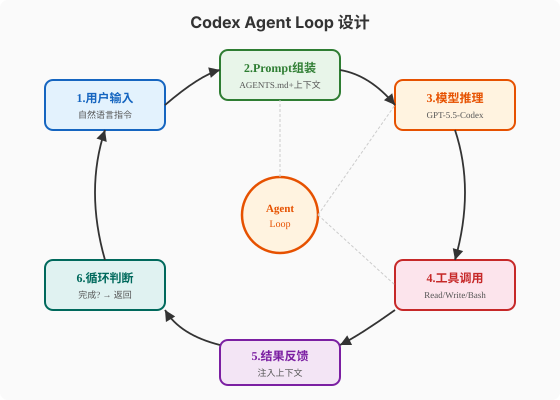
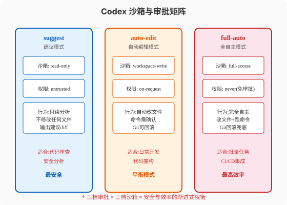
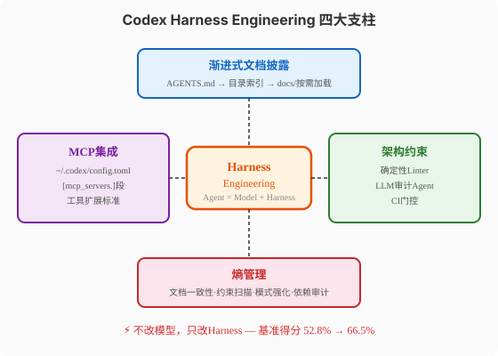

### 第23章 OpenAI Codex深度解读

> 📖 本章你将学会：理解Codex CLI的四层架构与Agent Loop设计，掌握AGENTS.md标准与三档沙箱审批的工程原理，建立对Harness Engineering四大支柱的系统性认知

#### 开篇：不是"聊天写代码"，是"在工程里工作"

你用过ChatGPT写代码吗？体验是这样的：你在聊天窗口粘贴一段代码，说"帮我加个异常处理"，AI返回修改后的代码，你手动复制粘贴回IDE。来回几次后，你发现聊天窗口里的代码和编辑器里的代码已经不同步了——你忘了粘贴最新版本，AI基于旧代码做了修改，你不得不重新解释上下文。

Codex CLI解决的就是这个"上下文不同步"问题。它不是"聊天窗口里写代码"，而是"在你的工程目录里工作"——它自己读代码库、自己改文件、自己跑测试、自己输出可审查的diff。你不需要复制粘贴任何东西。

比喻：如果ChatGPT是"远程顾问"——你打电话描述问题，他口头给建议，你自己动手；Codex就是"坐在你旁边的同事"——他直接看你的屏幕，自己上手改代码，改完告诉你"我改了这三个文件，跑了测试全绿，你review一下"。

2025年4月16日，OpenAI发布了Codex CLI——一个用Rust（96%代码）编写的终端编程Agent，Apache-2.0许可，GitHub地址在[openai/codex](https://github.com/openai/codex)。截至2026年8月，Star数约85K-104K+。它已经从单纯的CLI工具进化为一个覆盖CLI/桌面应用/Web/IDE扩展的统一Agent平台。

本章我们拆解这个"终端编程Agent标杆"的内部构造。

---

#### 23.1 Codex是什么

##### 23.1.1 项目起源：从CLI到统一平台

Codex CLI的诞生可以追溯到OpenAI内部的一个工程痛点：2025年初，OpenAI的工程师们发现，即使有GPT-4o这样强大的模型，代码生成的生产效率提升仍然有限——瓶颈不在模型能力，而在"模型与工程环境之间的鸿沟"。模型能生成代码，但它看不到你的项目结构、不知道你的编码规范、不能跑你的测试。这个鸿沟就是第8章讲的**Harness**——让模型可靠工作的系统环境。

Codex CLI的第一个版本（v0.1，2025年4月）极其简洁：一个Rust写的CLI，能读当前目录的文件、用`apply_patch`修改文件、在沙箱里跑命令。没有花哨的UI，没有Web界面，就是终端里的一个`codex`命令。但这种"极简但扎实"的风格正是它获得开发者青睐的原因——程序员不需要又一个花哨的IDE插件，他们需要一个能在终端里可靠工作的工具。

从v0.1到v0.134.0（2026年5月），Codex经历了几次重要演进：

- **v0.20**（2025年Q3）：引入AGENTS.md标准——vendor-neutral的项目指令文件
- **v0.50**（2025年Q4）：引入三档沙箱（read-only/workspace-write/danger-full-access）
- **v0.80**（2026年Q1）：引入Profiles命名配置和`/plan`规划模式
- **v0.100**（2026年Q1）：引入MCP集成（`~/.codex/config.toml`中`[mcp_servers.]`段）
- **v0.134.0**（2026年5月）：引入`/resume`会话恢复和Task Brain统一任务模型

到2026年8月，Codex已经不只是一个CLI——它有四个产品形态：

| 形态 | 定位 | 用户场景 |
|------|------|---------|
| CLI | 核心引擎 | 终端工作流，SSH远程开发 |
| 桌面应用 | GUI封装 | 不熟悉终端的开发者 |
| Web (Codex Cloud) | 云端执行 | 需要GPU或隔离环境的任务 |
| IDE扩展 | 编辑器集成 | VS Code / JetBrains用户 |

四种形态共享同一个Agent引擎和同一套配置体系——`config.toml`在CLI和桌面应用间通用，AGENTS.md在所有形态中一致生效。

##### 23.1.2 核心定位：终端优先的自主编码Agent

Codex的定位有三个关键词：

**"终端优先"**（Terminal-First）：Codex的核心是CLI，其他形态（桌面/Web/IDE）都是CLI的封装或扩展。这个设计与OpenClaw（IM优先）和Hermes（多平台优先）形成对比——Codex面向的是"每天在终端里工作的程序员"，不是"在WhatsApp里聊天的普通用户"。

**"自主编码"**（Autonomous Coding）：Codex不只是"帮你补全代码"（那是Copilot的定位），它是"自己写代码、自己改代码、自己跑测试、自己修bug"。用户给一个高层指令（"给这个API加分页功能并写测试"），Codex自己完成从分析到实现到验证的全流程。

**"Agent"**：Codex是一个Agent，不是一个工具。区别在于——工具是被调用的（你按Tab触发Copilot补全），Agent是自主循环的（你给指令，它自己决定该读哪些文件、改哪些代码、跑什么测试）。这个"自主循环"就是第7章讲的Agent Loop。

##### 23.1.3 产品形态与GPT-5.5-Codex模型线

Codex CLI默认使用OpenAI的**GPT-5.5-Codex**模型线——这是专门为代码任务优化的模型分支。与通用GPT-5.5相比，Codex模型线在以下方面做了专门优化：

- **长上下文代码理解**：支持128K tokens上下文窗口，专门优化了代码库级别的理解能力
- **结构化输出**：对`apply_patch`格式的输出做了专门训练，减少格式错误
- **工具调用准确性**：对Read/Write/Edit/Bash四个核心工具的调用准确率高于通用模型

> ⚠️ 注意：Codex CLI不限定使用OpenAI模型。从v0.100开始，它支持通过`config.toml`配置其他模型提供商（如Anthropic Claude、DeepSeek）。但GPT-5.5-Codex仍然是默认推荐，因为`apply_patch`格式和工具调用的专门优化只在Codex模型线上完整生效。

---

#### 23.2 Agent Loop设计

##### 23.2.1 六步循环



Codex的Agent Loop可以分解为六步循环：

**1. 用户输入**：用户在终端输入自然语言指令，如"给`/api/users`加分页功能"。Codex将指令存入会话状态。

**2. Prompt组装**：Codex不是把用户指令直接发给模型，而是组装一个完整的上下文包：

```
[System Prompt]
  - Codex身份与行为约束
  - 当前沙箱模式（read-only/workspace-write/full-access）
  - 审批策略（untrusted/on-request/never）

[AGENTS.md内容]
  - 项目根目录的AGENTS.md（如有）
  - 当前工作目录的AGENTS.md（如有，覆盖根目录）
  - 层级合并，最近文件最后追加

[对话历史]
  - 当前会话的对话轮次
  - 压缩后的历史上下文

[工具结果]
  - 上一步工具调用的返回值

[用户指令]
  - 本轮用户输入
```

这个组装过程就是第6章（Context工程）讲的"运行时上下文组装"——不是设计时写死的，而是每次推理前动态构建的。

**3. 模型推理**：组装好的Prompt发给GPT-5.5-Codex，模型返回一个或多个操作指令——可能是"读文件X""编辑文件Y""执行命令Z"或"任务完成，返回结果"。

**4. 工具调用**：Codex执行模型请求的操作。核心工具只有四个（与Pi agent core一致）：

| 工具 | 作用 | 沙箱约束 |
|------|------|---------|
| Read | 读取文件内容 | 受read-only约束 |
| Write | 创建/覆盖文件 | 受workspace-write约束 |
| Edit (apply_patch) | 精确编辑文件片段 | 受workspace-write约束 |
| Bash | 执行Shell命令 | 受沙箱网络/文件约束 |

**5. 结果反馈**：工具执行结果被注入上下文，作为下一轮推理的输入。如果Read返回了文件内容，这个内容会出现在下一轮Prompt的"工具结果"部分。

**6. 循环判断**：如果模型返回"任务完成"，循环结束，结果展示给用户。如果模型返回新的操作指令，回到第3步继续推理。如果超过最大迭代数或Token预算，强制终止。

##### 23.2.2 上下文窗口管理：Token追踪与自动压缩

Codex的上下文窗口管理是它Harness Engineering的核心组件之一。在一个复杂的编码任务中，Agent可能需要读十几个文件、执行多次命令——这些结果累积起来很容易超出128K tokens的上下文窗口。

Codex的解决方案是**Token追踪 + 自动压缩**：

**Token追踪**：Codex在每一轮循环中实时追踪当前上下文的token总量。当总量达到阈值（默认为上下文窗口的70%，约90K tokens）时，触发压缩。

**自动压缩策略**：

- **对话历史摘要**：将早期的对话轮次用LLM压缩为一段摘要（"用户要求加分页功能，Agent已读取了users.py和routes.py，发现了现有的查询逻辑在users.py:42"）
- **工具结果压缩**：Read返回的大文件只保留相关片段（如只保留函数签名和关键逻辑行，去掉空行和注释）
- **AGENTS.md缓存**：AGENTS.md内容在首次加载后缓存，不重复计入token
- **滑动窗口**：保留最近N轮完整对话 + 压缩后的早期历史

这个机制与第6章讲的"上下文压缩与记忆管理"完全对应——Codex是Context Engineering理论在编码Agent领域的工程化标杆。

##### 23.2.3 Codex的Harness工程实践

Codex的Agent Loop不是"裸循环"——它在循环的各阶段植入了多个Harness组件，这就是第8章讲的"每当Agent犯错，就设计一个方案让它永远不再犯"的工程实践。

| Loop阶段 | Harness组件 | 作用 |
|---------|------------|------|
| Prompt组装 | AGENTS.md注入 | 让Agent知道项目规范 |
| Prompt组装 | 沙箱模式声明 | 让Agent知道自己被约束 |
| 工具调用前 | 审批拦截器 | 高风险操作需用户确认 |
| 工具调用后 | Linter自动运行 | 改完代码立即检查格式 |
| 工具调用后 | 测试自动运行 | 改完代码立即跑测试 |
| 循环判断 | Token预算检查 | 防止无限循环烧钱 |
| 循环判断 | 循环检测 | 防止重复操作死循环 |
| 任务完成前 | Pre-Completion检查 | 返回前最后确认 |

这些Harness组件不是可选的"插件"——它们是Codex Agent Loop的内置部分，默认开启。用户可以通过`config.toml`调整参数，但不能完全关闭。这就是"Harness Engineering"的含义：**可靠性不是靠模型能力，而是靠系统设计**。

---

#### 23.3 AGENTS.md与沙箱机制

##### 23.3.1 AGENTS.md：vendor-neutral的项目指令标准

AGENTS.md是Codex最重要的工程贡献之一——它定义了一套**vendor-neutral**（厂商中立）的项目指令标准。

> 💡 提示：AGENTS.md的概念在第12章（Rule与Hooks）已经讲过。这里聚焦Codex的具体实现和层级合并机制。

AGENTS.md的核心设计是**层级合并**（Hierarchical Merging）：

```
project/
├── AGENTS.md              ← 根级指令（项目通用规范）
├── src/
│   ├── AGENTS.md          ← src目录指令（源码特定规范）
│   └── api/
│       └── AGENTS.md      ← api目录指令（API特定规范）
```

当Codex在`src/api/`目录工作时，它会加载三层AGENTS.md并合并：

1. 先加载根级`AGENTS.md`（项目通用规范）
2. 再加载`src/AGENTS.md`（覆盖或补充根级）
3. 最后加载`src/api/AGENTS.md`（覆盖或补充上级）

合并规则是"**最近文件最后追加**"——更靠近当前工作目录的AGENTS.md优先级更高。如果根级说"使用4空格缩进"，`src/api/AGENTS.md`说"API层使用2空格缩进"，则API层用2空格，其他层用4空格。

> ⚠️ 注意：单个AGENTS.md文件最大32KB。超过32KB的部分会被截断。这是为了防止AGENTS.md过大导致上下文窗口被占满。如果项目规范确实很长，应该拆分到子目录的AGENTS.md中，而不是写一个巨大的根级文件。

AGENTS.md的内容没有强制格式，但推荐的 结构是：

```markdown
# 项目指令

## 项目概述
这是一个Python FastAPI后端项目，使用SQLAlchemy ORM。

## 编码规范
- 使用4空格缩进
- 函数必须有类型注解
- 所有公开函数必须有docstring

## 测试要求
- 使用pytest
- 测试文件放在tests/目录
- 每个PR必须保持测试覆盖率不低于80%

## 架构约束
- API层不直接访问数据库，必须通过Service层
- Service层不返回ORM对象，必须转换为DTO
- 所有外部API调用必须有重试和超时
```

这个设计的美妙之处在于：**它是Markdown，不是配置文件**。任何开发者都能读懂、能用Git追踪变更、能在code review中讨论。这与`.eslintrc.json`或`pyproject.toml`等JSON/TOML配置形成对比——那些格式对非工具链专家不友好。

AGENTS.md的vendor-neutral特性意味着它不绑定Codex——Cursor、Windsurf、Aider等工具也在逐步支持AGENTS.md标准。这意味着你写一份AGENTS.md，可以在不同AI编码工具间复用——这就是标准的威力。

##### 23.3.2 三档审批与三档沙箱



Codex的安全模型是**三档审批 × 三档沙箱**的矩阵设计。

**三档审批**（Approval Mode）控制"Agent执行操作前是否需要用户确认"：

| 档位 | 名称 | 行为 |
|------|------|------|
| 1 | `untrusted` | 所有写操作和命令执行都需用户确认 |
| 2 | `on-request` | 文件编辑自动执行，命令执行需确认 |
| 3 | `never` | 全部自动执行，无需确认 |

**三档沙箱**（Sandbox Mode）控制"Agent能做什么"：

| 档位 | 名称 | 文件权限 | 网络权限 |
|------|------|---------|---------|
| 1 | `read-only` | 只读 | 禁止 |
| 2 | `workspace-write` | 工作空间内可写 | 禁止 |
| 3 | `danger-full-access` | 全盘可写 | 允许 |

审批和沙箱是**正交**的——可以任意组合。比如"workspace-write沙箱 + on-request审批"意味着：Agent可以自动编辑工作空间内的文件，但执行命令需要确认。这是一种平衡安全性和效率的常见配置。

> 💡 提示：这与第9章讲的"五级权限模型"在理念上一致——Codex的三档是五级的简化版，更适合编码场景的权限粒度。

##### 23.3.3 macOS Seatbelt / Linux Landlock沙箱

Codex的沙箱不是"应用层模拟"——它是操作系统级的隔离机制。

**macOS Seatbelt**：Codex在macOS上使用`sandbox-exec`（Seatbelt）实现沙箱——这与Safari浏览器使用的是同一层安全机制。Seatbelt在内核层面限制进程的文件系统访问、网络访问和系统调用。即使Agent的代码执行被注入恶意指令，也无法绕过Seatbelt的内核级限制。

**Linux Landlock + seccomp**：Codex在Linux上使用Landlock（需要kernel 5.13+）和seccomp实现沙箱。Landlock允许非特权进程自主设置文件系统访问限制，seccomp过滤危险系统调用。两者结合提供了与Seatbelt等效的隔离级别。

> ⚠️ 注意：Linux Landlock需要kernel 5.13或更高版本。如果你的Linux内核版本低于5.13，Codex会降级为"仅seccomp"模式——文件系统隔离会减弱。在生产环境中使用Codex full-auto模式前，务必确认内核版本。

##### 23.3.4 Git回滚：full-auto的最终安全网

即使有沙箱隔离，`full-auto`模式仍然有风险——Agent可能"合法地"做了错误操作（如删除了重要文件、修改了配置）。Codex的最终安全网是**Git回滚**。

在`full-auto`模式启动时，Codex会自动创建一个Git stash或临时分支，记录当前工作区状态。如果Agent的操作导致了不可接受的变更，用户可以用一条命令回滚：

```bash
codex rollback  # 回滚到Agent操作前的状态
```

这个设计的前提是：**工作区必须在Git版本控制下**。如果项目没有初始化Git，Codex会拒绝在`full-auto`模式运行——没有回滚能力就不允许全自主。这是一个"硬约束"——不是建议，是强制。

---

#### 23.4 Codex的Harness Engineering

##### 23.4.1 OpenAI百万行零人工代码实验



2026年2月11日，OpenAI发布了一篇震惊业界的博客：[Harness Engineering](https://openai.com/index/harness-engineering/)。这篇博客披露了一个实验——**3人团队，5个月，~100万行代码，~1500个PRs，零人工代码**。

这个实验的核心方法论就是Harness Engineering：不改进模型，只改进Harness（Agent的工作环境），让Agent的输出质量从"需要大量人工修改"提升到"可以直接合并"。

实验的关键数据：

- **模型固定**：全程使用GPT-5.5-Codex，不更换模型
- **Harness优化**：AGENTS.md迭代、Linter规则强化、审计Agent引入、文档一致性检查
- **结果**：PR合并率从初期的~30%提升到后期的~85%

这证明了第8章的核心论点：**Agent = Model + Harness**。同样的模型，通过优化Harness，输出质量可以提升近3倍。这个实验是Harness Engineering从"理论"到"业界共识"的转折点。

##### 23.4.2 渐进式文档披露

Codex的Harness Engineering四大支柱之一是**渐进式文档披露**（Progressive Document Disclosure）。

传统做法是把所有项目文档塞进System Prompt——如果项目有100页文档，上下文窗口就被占满了。Codex的做法是分层：

- **L0**：AGENTS.md只放"目录索引"——告诉Agent"项目有哪些文档，在哪里"，而不是全文
- **L1**：当Agent需要某方面的信息时，自己用Read工具读取`docs/`目录下的对应文档
- **L2**：文档内部的交叉引用也是渐进式的——`docs/architecture.md`引用`docs/api-design.md`，Agent按需追踪

这与第11章讲的Skills渐进式披露是同一个原理——**不是全量加载，而是按需加载**。区别在于Skills系统是"能力渐进披露"，AGENTS.md是"知识渐进披露"。

##### 23.4.3 架构约束：确定性Linter + LLM审计Agent

Codex的架构约束是双层的：

**确定性Linter**（第一层）：每次Agent修改代码后，自动运行项目的Linter（eslint/pylint/golangci-lint等）。Linter是确定性的——同样的代码永远得到同样的检查结果。这确保了基本的代码规范不被违反。如果Linter报错，Agent必须修复后才能继续。

**LLM审计Agent**（第二层）：Linter只能检查语法和简单规范，无法判断"这个修改是否符合架构约束"。Codex引入了一个独立的"审计Agent"——它不修改代码，只审查主Agent的修改是否符合AGENTS.md中声明的架构约束。比如AGENTS.md说"API层不直接访问数据库"，审计Agent会检查主Agent的修改是否违反这条约束。

双层约束的设计理念是：**确定性规则用确定性工具检查，语义规则用LLM检查**。不混用——Linter不做语义判断（它做不到），审计Agent不做语法检查（它不如Linter高效）。

##### 23.4.4 熵管理

"熵"（Entropy）在Codex语境中指"系统混乱度的增长"——随着代码库增大、文档增多、依赖变多，系统的"熵"会自然增加，导致Agent的输出质量下降。

Codex的熵管理有四个维度：

**文档一致性**：确保AGENTS.md中描述的规范与实际代码一致。如果AGENTS.md说"用4空格缩进"但代码中混用了2空格和4空格，Agent会困惑——遵循文档还是遵循现有代码？Codex定期扫描这种不一致，提醒用户修正。

**约束扫描**：定期检查AGENTS.md中的约束是否仍然适用。如果项目从单体架构迁移到微服务，旧的"API层不直接访问数据库"约束可能需要调整。

**模式强化**：当Agent发现代码库中存在某种一致的模式（如所有Service类都有`retry`装饰器），Codex会在AGENTS.md中补充这条隐式规范，让未来的Agent操作自动遵循。

**依赖审计**：检查项目依赖是否有已知安全漏洞（类似`npm audit`或`pip-audit`），防止Agent引入不安全的依赖。

> 💡 提示：熵管理是第8章Harness三大支柱之一。Codex是第一个把"熵管理"从抽象概念落地为具体工程实践的框架——文档一致性扫描、约束扫描、模式强化、依赖审计，每一项都是可操作的自动化流程。

##### 23.4.5 MCP集成

Codex的MCP集成让Agent能调用外部工具服务器。配置在`~/.codex/config.toml`中：

```toml
# ~/.codex/config.toml (TOML格式，非旧版YAML)

[mcp_servers.filesystem]
command = "npx"
args = ["@modelcontextprotocol/server-filesystem", "/home/user/project"]

[mcp_servers.github]
command = "npx"
args = ["@modelcontextprotocol/server-github"]
env = { GITHUB_TOKEN = "ghp_xxx" }

[mcp_servers.postgres]
command = "npx"
args = ["@modelcontextprotocol/server-postgres", "postgres://localhost/mydb"]
```

> ⚠️ 注意：Codex的配置文件是**TOML格式**（`config.toml`），不是旧版的YAML。从v0.50开始，Codex废弃了YAML配置，全面转向TOML。如果你看到网上有Codex的YAML配置教程，那已经过时了。

MCP集成让Codex从"只能读写本地文件"扩展到"能操作GitHub Issues、查询数据库、调用任何MCP Server"。这与第10章讲的MCP协议完全对应——Codex是MCP Host的一个具体实现。

Codex的MCP集成还有一个高级特性——**Profiles命名配置**。用户可以在`config.toml`中定义多个Profile，每个Profile有不同的MCP Server组合：

```toml
[profiles.web-dev]
mcp_servers = ["filesystem", "github", "postgres"]
model = "gpt-5.5-codex"
sandbox = "workspace-write"

[profiles.data-science]
mcp_servers = ["filesystem", "jupyter", "duckdb"]
model = "gpt-5.5-codex"
sandbox = "workspace-write"
```

使用时通过`--profile`参数切换：`codex --profile web-dev "加个用户API"`。这让同一个Codex安装可以服务于不同的工作场景——Web开发用一套工具，数据科学用另一套。

---

#### 23.5 本章小结

Codex的核心设计可以浓缩为四个认知：

1. **Agent Loop是六步循环+多层Harness** —— 用户输入→Prompt组装→模型推理→工具调用→结果反馈→循环判断。每一步都植入Harness组件（AGENTS.md注入/审批拦截/Linter检查/Token预算/循环检测/Pre-Completion检查）。比喻：Loop是发动机，Harness是底盘和刹车系统——没有Harness的Loop是"会跑但会翻车"的发动机。

2. **AGENTS.md是vendor-neutral的项目指令标准** —— 层级合并（最近文件最后追加）、32KB上限、Markdown格式、Git可追踪。不绑定Codex——Cursor/Windsurf/Aider也在支持。比喻：就像`.gitignore`——一个简单的约定，但因为所有工具都遵守，成为了行业标准。

3. **三档审批×三档沙箱是安全与效率的渐进式权衡** —— suggest/auto-edit/full-auto × read-only/workspace-write/full-access。OS级隔离（Seatbelt/Landlock）。Git回滚是full-auto的最终安全网。比喻：就像自动驾驶的L1-L5——不是"有"和"没有"的二元选择，而是渐进式的 autonomy 级别。

4. **Harness Engineering四大支柱是"不改模型改系统"** —— 渐进式文档披露/架构约束/熵管理/MCP集成。OpenAI百万行实验证明：同样模型，优化Harness，PR合并率从30%→85%。比喻：同样的马（Model），配上更好的缰绳和马鞍（Harness），就能跑出更好的成绩。

| 机制 | Codex实现 | 理论呼应 |
|------|----------|----------|
| Agent Loop | 六步循环+多层Harness | 第7章Loop工程 |
| 上下文管理 | Token追踪+自动压缩 | 第6章Context工程 |
| AGENTS.md | 层级合并+32KB上限+vendor-neutral | 第12章Rule系统 |
| 三档沙箱 | read-only/workspace-write/full-access | 第9章沙箱与安全执行 |
| 三档审批 | untrusted/on-request/never | 第9章权限分级 |
| OS级隔离 | macOS Seatbelt / Linux Landlock+seccomp | 第9章沙箱方案 |
| Harness Engineering | 四大支柱（文档/约束/熵/MCP） | 第8章Harness工程 |
| MCP集成 | config.toml [mcp_servers.] + Profiles | 第10章MCP协议 |

| 比喻 | 源域 | 目标域 |
|------|------|--------|
| 坐在旁边的同事 | 直接看屏幕自己上手改代码 | Codex在工程目录里工作 |
| 发动机+底盘 | 发动机提供动力，底盘保障安全 | Agent Loop + Harness组件 |
| .gitignore | 简单约定成为行业标准 | AGENTS.md vendor-neutral标准 |
| 自动驾驶L1-L5 | 渐进式autonomy级别 | 三档审批×三档沙箱 |
| 马+缰绳 | 同样的马配更好的缰绳跑更好 | 同模型+优化Harness=更高质量 |

> 🤔 思考题：Codex的Harness Engineering证明了"不改模型改系统"能大幅提升质量。但Harness的搭建本身需要工程投入——AGENTS.md编写、Linter配置、审计Agent设计、熵管理流程。这个投入的ROI如何衡量？什么样的项目值得投入Harness Engineering，什么样的项目不值得？这是第七篇"工程化与安全"要回答的问题。
