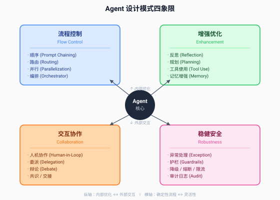
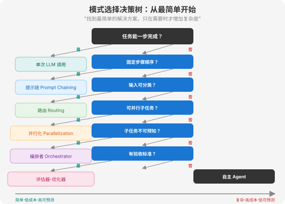

# 第 14 章 模式总览：Agent 设计模式的分类体系

> *"找到最简单的解决方案，只在需要时才增加复杂度。"*
> *—— Erik Schluntz & Barry Zhang, Building Effective Agents (Anthropic, 2024.12)*

---

## 14.1 为什么需要设计模式

### 14.1.1 从"写脚本"到"建系统"

大多数开发者第一次接触 Agent，都是从一段不到 50 行的脚本开始的：

```python
# 一个最简单的 ReAct Agent
while not done:
    thought = llm("思考下一步做什么")
    action = llm("选择一个工具调用")
    result = execute_tool(action)
    done = check_if_done(result)
```

这段脚本能跑。它甚至能解决一些实际问题。但当你试图把它放进生产环境时，问题就来了：

- **任务变复杂了。** 客户不满足于"回答一个问题"，他们要"处理一封邮件"——先分类、再检索历史、再起草回复、最后检查语气。50 行脚本变成了 500 行 `if-else`，每个分支都在调 LLM，逻辑像意大利面一样纠缠在一起。
- **出错了你不知道哪坏了。** Agent 跑了 20 步，第 14 步的 LLM 调用返回了一个幻觉，后面 6 步全建立在错误前提上。你打开日志，发现 20 步的推理链像一部长篇小说，你花了两个小时才定位到第 14 步。
- **换个框架就推倒重来。** 你用 LangChain 0.1 写的代码，迁移到 LangGraph 要重写；迁移到 CrewAI 又要重写。每次换框架，你都在重新发明同样的轮子。

这些问题的根源是同一个：**你在写脚本，不是在建系统。**

脚本思维是"想到哪写到哪"——遇到分类就加个 `if`，遇到并行就开个线程，遇到错误就 `try-except`。系统思维是"先选架构，再写代码"——在动手之前，你已经知道这个系统属于哪种模式，每种模式的失败点在哪里，该用什么机制来防御。

> **比喻：盖房子。**

> 脚本思维是"想到哪盖到哪"——先砌一面墙，发现不够高就加砖，发现没窗户就凿洞，发现要塌了就支根柱子。最后房子能住，但结构混乱，改一处动全身。

> 系统思维是"先看图纸再施工"——图纸上的"两室一厅"就是设计模式。你不会把厨房设计在卧室中间，因为"两室一厅"这个模式已经告诉你：功能分区是必要的。你可以用砖、用混凝土、用钢结构来实现"两室一厅"，但功能分区的原则不变。

Agent 设计模式就是 Agent 系统的"户型图"。

### 14.1.2 模式 > 框架：跨越框架更迭的长期资产

2023 年至今，Agent 框架经历了一个"大爆发→大洗牌"的周期：

| 时间 | 热门框架 | 核心抽象 | 现状 |
|------|---------|---------|------|
| 2023 上半年 | LangChain | Chain（链式调用） | API 大改，大量代码废弃 |
| 2023 下半年 | AutoGPT / BabyAGI | 自主循环 Agent | 原型好玩，生产不可用 |
| 2024 上半年 | LangGraph | StateGraph（图驱动编排） | 逐渐成熟，但学习曲线陡 |
| 2024 下半年 | CrewAI | Crew + Agent + Task | 角色模型受欢迎，但功能受限 |
| 2025 上半年 | OpenAI Agents SDK | Agent + Handoff | 官方背书，但生态尚浅 |
| 2025 下半年 | OpenClaw / Hermes | 文件驱动 + Skills | 开源社区爆发 |

如果你追着框架学，你会一直在"学新 API → 写新代码 → 框架过时 → 再学"的循环里打转。

但如果你换一个视角，看这些框架**实现了哪些模式**，画面就清晰了：

| 模式 | LangChain | LangGraph | CrewAI | OpenAI SDK | OpenClaw |
|------|-----------|-----------|--------|------------|----------|
| 顺序流水线 | Chain | 顺序边 | 顺序 Task | 顺序 Agent | 顺序 Skill |
| 条件路由 | Router Chain | 条件边 | — | Handoff | — |
| 并行执行 | — | 并行边 | 并行 Task | — | 并行 Sub-Agent |
| 编排者-执行者 | — | Supervisor | Crew + Crew | Orchestrator | — |
| 反思循环 | — | 反思节点 | — | — | Nudge Engine |

你看，**同一个模式，每个框架用不同的 API 实现，但本质完全一样**。LangChain 叫 `RouterChain`，LangGraph 叫"条件边"，CrewAI 没有原生支持——但模式本身没有变。

> **模式是框架的"超集"。** 框架实现了一部分模式，但模式比任何一个框架都大。掌握了模式，你不仅能用任何框架，还能在框架缺失时自己实现。

这就是为什么 Anthropic 在《Building Effective Agents》开篇就强调：**"从直接使用 LLM API 开始，而不是从框架开始。"** 他们观察到，最成功的 Agent 实现并不依赖复杂框架，而是用简单的、可组合的模式构建。框架会帮你快速启动，但在生产环境中，它增加的抽象层往往遮蔽了底层的 prompt 和响应，让调试变得更难。

这句话不是反框架——Anthropic 自己也维护着 Claude Agent SDK——而是提醒开发者：**先理解模式，再选择框架**。框架是模式的工程实现，模式是框架的设计灵魂。灵魂比肉身长寿。

---

## 14.2 模式分类框架

### 14.2.1 四象限分类法

Anthropic 在 2024 年 12 月的论文中给出了五种工作流模式和一种自主 Agent 模式，这是目前业界最被广泛引用的分类。但真实世界的 Agent 系统远不止五种——学术界和工业界陆续提出了 20 多种模式。

2025 年 8 月，北京交通大学和马克斯·普朗克研究所的联合团队在 arXiv 发表综述《LLM-based Agentic Reasoning Frameworks: A Survey from Methods to Scenarios》，将 Agent 方法分为三级递进体系：单 Agent 方法（Prompt 工程 + 自我提升）、基于工具的方法（工具集成 + 选择 + 使用）、多 Agent 方法（组织架构 + 交互协议）。同年，IEEE CONECCT 2025 会议上 Joyce 和 Maheshwari 提出了七组 Agentic AI 架构模式分类法，而《Journal of Systems and Software》上 Liu 等人进一步细化出 18 种组合模式。

这些分类各有侧重，但对工程师来说都有一个共同的问题：**太学术了，不好用**。工程师需要的不是一篇论文，而是一张能在 30 秒内定位"我的系统属于哪一类"的地图。

我们提出一个**四象限分类法**，用两个正交维度切分所有 Agent 设计模式：

- **纵轴**：内部优化 ↔ 外部交互。模式服务于 Agent 自身的推理质量（内部），还是服务于 Agent 与外部世界的交互（外部）？
- **横轴**：确定性流程 ↔ 灵活性。模式的控制流是预定义的代码路径（高确定性），还是由 LLM 动态决定（高灵活性）？



四个象限分别对应四大类模式：

#### 流程控制模式（左上：内部 + 确定性）

这类模式关注 **Agent 内部的任务执行流程**，控制流是预定义的代码路径。开发者决定步骤顺序、分支条件、并行度，LLM 只负责在每个步骤内执行具体任务。

核心模式：
- **Prompt Chaining（提示链）**：顺序流水线，上一步输出是下一步输入
- **Routing（路由）**：条件分发，分类后走不同处理路径
- **Parallelization（并行化）**：同时执行独立任务，分 sectioning（分段）和 voting（投票）两种变体
- **Orchestrator-Worker（编排者-执行者）**：中央 LLM 动态分解任务、分配子任务、综合结果

#### 增强优化模式（右上：内部 + 灵活性）

这类模式关注 **提升 Agent 单次推理的质量**，控制流由 LLM 动态决定。它们不是"流程"而是"能力增强"——让 Agent 想得更好、记得更多、用工具更准。

核心模式：
- **Reflection（反思）**：Agent 自我评估输出，迭代优化
- **Planning（规划）**：先制定计划再执行，支持动态调整
- **Tool Use（工具使用）**：调用外部工具弥补 LLM 局限
- **Memory-Augmented（记忆增强）**：跨会话经验积累与复用

#### 交互协作模式（左下：外部 + 确定性/灵活性）

这类模式关注 **Agent 与外部实体（人类或其他 Agent）的协作**，控制流可能是预定义的（如固定审批节点），也可能是动态的（如辩论中 Agent 自主决定何时反驳）。

核心模式：
- **Human-in-the-Loop（人机协作）**：关键决策引入人类判断
- **Delegation（委派）**：任务分发与专业化分工
- **Debate（辩论）**：多视角对抗提升结论质量
- **Consensus（共识）**：多 Agent 投票与聚合
- **Handoff（交接）**：Agent 间的任务转交

#### 稳健安全模式（右下：外部 + 确定性）

这类模式关注 **保障系统在异常情况下的稳健性**，控制流是确定性的代码逻辑——不依赖 LLM 判断，而是硬编码的安全机制。

核心模式：
- **Exception Handling（异常处理）**：优雅降级，不让错误击穿系统
- **Guardrails（护栏）**：输入输出边界控制
- **Fallback（降级）**：备份方案设计
- **Circuit Breaker（熔断）**：防止级联失败
- **Rate Limiting（限流）**：成本与负载控制

### 14.2.2 四象限的本质

这个分类不是随意的切割，而是有底层逻辑的。

**纵轴（内部 ↔ 外部）回答的是"模式服务于谁"。** 流程控制和增强优化服务于 Agent 自身——让它的推理更准、执行更稳。交互协作和稳健安全服务于外部世界——让人类能介入、让系统不崩溃。一个成熟的 Agent 系统，必须在两个方向上都有覆盖。

**横轴（确定性 ↔ 灵活性）回答的是"谁来决定控制流"。** 流程控制和稳健安全由代码决定——步骤顺序是写死的、安全规则是硬编码的。增强优化和交互协作由 LLM 决定——什么时候反思、什么时候求助人类，是 Agent 自己判断的。

> **比喻：餐厅运营。**

> 流程控制是**后厨流水线**——备菜→炒菜→装盘→出餐，顺序固定，每个工位有明确职责（确定性 + 内部）。
>
> 增强优化是**厨师技能提升**——尝味道、调配方、学新菜，是厨师自己的判断（灵活性 + 内部）。
>
> 交互协作是**前厅服务**——服务员和顾客沟通、经理协调不同厨师、遇到特殊需求临时调整（外部）。
>
> 稳健安全是**卫生与消防制度**——食材过期必须丢弃、着火自动喷淋，是硬性规则不商量（确定性 + 外部）。

一家好餐厅，四个方面缺一不可。一个好 Agent，同样如此。

### 14.2.3 Anthropic 五大模式在四象限中的位置

Anthropic 的五种工作流模式全部属于**流程控制象限**（左上），它们是预定义代码路径的内部执行流程。这一点很重要——Anthropic 的分类聚焦于"工作流"，而真实系统还需要增强、协作和安全模式的补充。

| Anthropic 模式 | 四象限归属 | 一句话定义 |
|----------------|-----------|-----------|
| Prompt Chaining | 流程控制 | 顺序流水线，上一步输出喂下一步 |
| Routing | 流程控制 | 分类后分发到专门处理路径 |
| Parallelization | 流程控制 | 并行执行独立任务后聚合 |
| Orchestrator-Worker | 流程控制 | 中央 LLM 动态分解任务并分配 |
| Evaluator-Optimizer | 流程控制 | 生成→评估→优化的质量闭环 |

Anthropic 的五种模式是流程控制象限的核心，但只是四象限中的四分之一。第 15 章会深入展开这五种模式加上增强优化模式，第 16 章覆盖交互协作和稳健安全模式。

### 14.2.4 模式的可组合性

四象限分类最重要的洞察不是"有哪些模式"，而是**模式可以组合**。

Anthropic 在论文中特别强调："这些模式是可组合的：路由模式经常喂入提示链；编排者-执行者经常在工作者层包裹评估器-优化器；并行化可以嵌入任何其他模式。"

举个真实例子：一个企业客服 Agent 的架构可能是这样的——

```
用户消息 → [路由] 分为售前/售后/技术三类
  ├─ 售前 → [提示链] 检索产品库 → 生成推荐 → 检查合规
  ├─ 售后 → [评估器-优化器] 生成退款方案 → 评估风险 → 优化方案
  └─ 技术 → [编排者-Worker] 分解为日志分析+配置检查+知识库检索
              ↓
         [人机协作] 高风险退款需人工审批
              ↓
         [护栏] 输出内容审核 + 敏感信息过滤
              ↓
         [降级] 如果 LLM 超时，返回模板回复
```

这个系统用到了四象限中的**全部四类模式**：路由和提示链（流程控制）、评估器-优化器和编排者-Worker（流程控制）、人机协作（交互协作）、护栏和降级（稳健安全）。

**模式组合是 Agent 架构设计的核心技能。** 单一模式很少能解决真实问题——真实问题总是需要多种模式的协同。第 15 章末尾会专门讲模式组合实战，第 16 章会讲安全模式如何与流程模式配合。

> **模式可组合性的三条原则：**
> 1. **流程控制模式是骨架**——任何系统都先选流程模式（顺序/路由/并行/编排），再叠加其他模式
> 2. **增强优化模式是肌肉**——在骨架之上加反思、规划、工具使用，提升单步质量
> 3. **稳健安全模式是免疫系统**——包裹在最外层，防止异常击穿

---

## 14.3 模式选择决策树

知道了有哪些模式，下一个问题是：**我的系统该用哪种模式？**



Anthropic 给出的核心建议是："找到最简单的解决方案，只在需要时才增加复杂度。" 这句话翻译成决策树就是——**从最简单的开始，逐步加码**。

```
你的任务能一步完成吗？
│
├─ 是 → 单次 LLM 调用 + 检索/示例（不需要模式）
│
└─ 否 → 任务有固定的步骤顺序吗？
    │
    ├─ 是 → 步骤之间需要质量检查吗？
    │       │
    │       ├─ 是 → Prompt Chaining + 门控（提示链）
    │       └─ 否 → Prompt Chaining（简单顺序）
    │
    └─ 否 → 输入可以分成不同类别，各类别处理方式不同吗？
        │
        ├─ 是 → Routing（路由）
        │
        └─ 否 → 任务有可并行的独立子部分吗？
            │
            ├─ 是 → 需要多个视角/多次尝试提升置信度吗？
            │       │
            │       ├─ 是 → Parallelization - Voting（投票并行）
            │       └─ 否 → Parallelization - Sectioning（分段并行）
            │
            └─ 否 → 子任务在输入到达前无法预知吗？
                │
                ├─ 是 → Orchestrator-Worker（编排者-执行者）
                │
                └─ 否 → 任务有明确的验收标准，且迭代能提升质量吗？
                    │
                    ├─ 是 → Evaluator-Optimizer（评估器-优化器）
                    │
                    └─ 否 → 任务是开放性的，无法预测步数吗？
                        │
                        ├─ 是 → 自主 Agent（LLM 自己决定控制流）
                        │
                        └─ 否 → 重新审视任务定义，可能需要拆分
```

### 决策树的五条黄金法则

决策树看起来很清晰，但实际使用中有五个容易踩的坑：

**法则 1：先问"需不需要 Agent"，再问"用哪种模式"。**

Anthropic 反复强调："Agentic 系统通常用延迟和成本换取更好的任务表现，你应该考虑这个交易何时值得。" 很多任务根本不需要 Agent——一个带 few-shot 示例的单次 LLM 调用就够了。如果你能在 10 行代码里用单次调用解决问题，就别上 5 种模式的组合。

> **数据点**：Anthropic 报告中提到，他们合作的最成功的团队，"大多数场景"用的是单次 LLM 调用加上检索和示例，而不是复杂的多步 Agent。

**法则 2：Workflow 优先，Agent 兜底。**

Anthropic 对 Workflow 和 Agent 做了明确区分：

| 维度 | Workflow | Agent |
|------|----------|-------|
| 控制流 | 预定义代码路径 | LLM 动态决定 |
| 可预测性 | 高——每次走相同路径 | 低——路径随任务变化 |
| 成本/延迟 | 低——步数已知 | 高——步数不确定 |
| 调试难度 | 低——失败定位到具体步骤 | 高——需要沙箱测试和护栏 |
| 适用场景 | 步骤可预知的任务 | 开放性、步数不可预知的任务 |

**能用 Workflow 解决的，不要用 Agent。** Workflow 的可预测性远高于 Agent——因为你写了控制流，你知道每一步是什么。Agent 的控制流在 LLM 脑子里，每次可能不一样，错误会复合。

**法则 3：从最简单的模式开始，逐步加码。**

模式选择不是一次性决策，而是渐进式演进：

```
单次调用 → 提示链 → 路由 → 并行 → 编排者-执行者 → 自主 Agent
  简单                                                                      复杂
  低成本                                                                    高成本
  高可预测                                                              低可预测
```

每次向右移动一步，都要问：**"增加的复杂度，换来了可衡量的质量提升吗？"** 如果答案不是明确的"是"，就留在原地。

**法则 4：评估器-优化器只在有明确验收标准时用。**

评估器-优化器模式（生成→评估→优化循环）看起来很优雅，但它有一个前提：**评估器必须有清晰的验收标准**。如果验收标准是模糊的（"写得更好一点"），循环会无止境地跑下去，烧光 Token。

适合评估器-优化器的场景：文学翻译（验收标准：语义保真 + 风格一致）、代码生成（验收标准：测试通过）、数学证明（验收标准：逻辑正确）。不适合的场景：创意写作、开放问答——这些没有客观标准。

**法则 5：编排者-执行者是最贵的模式，设置预算上限。**

编排者-执行者（Orchestrator-Worker）是最灵活的模式——中央 LLM 根据输入动态分解任务。但"动态分解"意味着每次调用都可能产生不同数量、不同类型的子任务，成本不可预测。

Anthropic 明确建议：使用编排者-Worker 时，**必须设置工作者数量上限和单任务预算上限**。否则，一个过度热衷于分解的编排者可能把一个任务拆成 20 个子任务，每个子任务又拆成 5 个子子任务——Token 消耗呈指数级增长。

---

## 14.4 本章小结

### 三个核心认知

**认知 1：模式比框架长寿。**

LangChain 的 `Chain` 类会改名，LangGraph 的 `StateGraph` API 会重构，CrewAI 的 `Crew` 可能被取代——但"把任务拆成顺序步骤""先分类再分发""并行执行后聚合"这些架构思路不会消失。投资学模式，是在为未来的框架更迭买保险。

**认知 2：四象限覆盖全场景。**

流程控制（怎么走流程）、增强优化（怎么想得更好）、交互协作（怎么和人/Agent 配合）、稳健安全（怎么不出事）——四象限覆盖了 Agent 系统设计的全部维度。一个成熟的生产级 Agent，通常需要四象限模式的组合，而不是单一模式。

**认知 3：简单优先，逐步加码。**

Anthropic 的建议值得反复强调："找到最简单的解决方案，只在需要时才增加复杂度。" 单次调用能解决的，不上提示链；提示链能解决的，不上编排者；编排者能解决的，不上自主 Agent。每一步复杂度的增加，都必须有可衡量的质量提升来证明其合理性。

### 关键数据

| 数据 | 来源 | 含义 |
|------|------|------|
| Anthropic 五大工作流模式 | Schluntz & Zhang, "Building Effective Agents", 2024.12 | 业界最被引用的 Agent 模式分类 |
| Hacker News 763 分 | 2024.12 发布 | Agent 工程文献的传播热度 |
| AgentCoder 使 HumanEval 从 67%→96.3% | Zhao et al., arXiv 2508.17692, 2025.8 | 框架（模式）设计比模型本身更影响性能 |
| 18 种 FMB Agent 组合模式 | Liu et al., JSS 220, 2025 | 学术界对模式分类的细化 |
| Token 使用量解释 80% 性能方差 | Anthropic 内部研究 | 模式选择直接影响 Token 效率 |

### 比喻回顾

| 比喻 | 对应概念 |
|------|---------|
| 菜谱 vs 锅具 | 模式 vs 框架——菜谱告诉你做法，不规定用什么锅 |
| 两室一厅户型图 | 设计模式——功能分区原则不变，建材可选 |
| 盖房子先看图纸 | 系统思维 vs 脚本思维——先选架构再写代码 |
| 餐厅四方面 | 四象限——后厨流水线/厨师技能/前厅服务/卫生消防 |
| 免疫系统 | 稳健安全模式——包裹最外层，防止异常击穿 |

---

*下接 → [第 15 章 流程控制与增强优化模式](./第15章%20流程控制与增强优化模式.md)*
