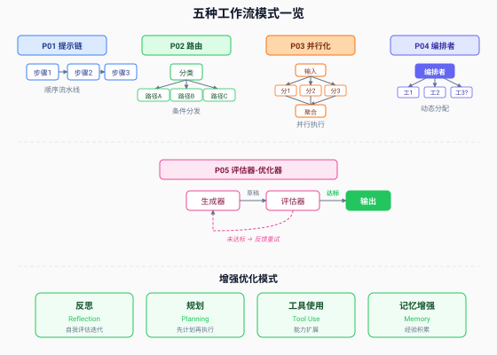
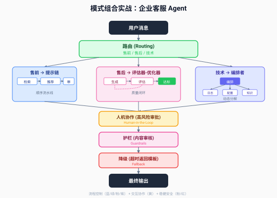

# 第 15 章 流程控制与增强优化模式

> *"框架可以帮助你快速启动，但在生产中不要犹豫减少抽象层，用基本组件构建。"*
> *—— Anthropic, Building Effective Agents (2024.12)*

---

第 14 章给出了四象限分类地图。从本章开始，我们逐个象限展开，深入每种模式的内部结构、适用场景、失败模式和工程要点。

本章覆盖左上象限（流程控制）和右上象限（增强优化），共九种模式。第 16 章覆盖下半部分两个象限。



---

## 15.1 流程控制模式

流程控制模式是 Agent 系统的"骨架"——它们定义了任务从输入到输出的执行路径。Anthropic 在 2024 年 12 月的论文中定义了五种工作流模式，按复杂度从低到高排列：提示链、路由、并行化、编排者-执行者、评估器-优化器。

这五种模式有一个共同特征：**控制流由代码预定义，不由 LLM 决定**。这是"工作流"区别于"自主 Agent"的根本分界线。

### 15.1.1 Prompt Chaining（提示链）：顺序流水线

**定义**：将任务分解为固定的顺序步骤，每步一个 LLM 调用，上一步的输出是下一步的输入。步骤之间可以插入"门控"（gate）——程序化的检查点，用于验证中间结果是否满足条件，不满足则提前终止或回退。

**结构**：

```
输入 → [LLM 步骤1] → 门控 → [LLM 步骤2] → 门控 → [LLM 步骤3] → 输出
```

**适用场景**：任务可以干净地分解为固定子任务，每个子任务比整体更简单。用延迟换准确性——多步调用比单步调用慢，但每步的"自由度"更小，出错概率更低。

**典型例子**：
- 生成营销文案 → 翻译成英文（两步固定顺序）
- 先生成文档大纲 → 检查大纲是否满足要求 → 基于大纲写正文
- 代码生成：先写函数签名 → 再写实现 → 最后写测试

**门控的价值**：门控是提示链区别于"简单串联"的关键。没有门控，一个步骤的错误会无声地传播到后续所有步骤。门控可以是：
- **格式检查**：返回的是不是合法 JSON？长度是否在预期范围？
- **内容检查**：大纲是否包含至少 3 个章节？代码是否有语法错误？
- **阈值判断**：分类置信度是否高于 0.8？

```python
# 提示链示例：生成文档 → 检查 → 完善
def prompt_chaining(topic: str) -> str:
    # 步骤1：生成大纲
    outline = llm(f"为'{topic}'生成文档大纲")

    # 门控1：大纲至少3个章节
    if len(outline.sections) < 3:
        return "大纲质量不足，终止"

    # 步骤2：基于大纲写正文
    draft = llm(f"基于以下大纲写正文：{outline}")

    # 门控2：正文长度大于500字
    if len(draft) < 500:
        draft = llm(f"扩展以下内容到至少500字：{draft}")

    # 步骤3：润色
    final = llm(f"润色以下文档：{draft}")
    return final
```

**失败模式**：
- **门控缺失**：没有门控的提示链只是"串联调用"，错误会级联传播
- **过度拆分**：把 2 步能完成的任务拆成 8 步，增加延迟和成本但没提升质量
- **步骤耦合**：步骤之间隐含依赖（步骤 2 期望步骤 1 输出特定格式），但没有显式验证

> **比喻：工厂流水线。**
> 提示链就是工厂流水线——每个工位完成一道工序，产品传到下一个工位。门控就是质检站——不合格的产品在质检站被拦下，不会流到下一道工序。没有质检站的流水线，一个工位的失误会变成最终产品的缺陷。

### 15.1.2 Routing（路由）：条件分发

**定义**：先用分类器对输入进行分类，然后根据类别将输入分发到不同的后续处理路径。分类器本身可以是 LLM，也可以是确定性规则（关键词匹配、正则表达式）。

**结构**：

```
输入 → [分类器] → 类别A → [专门处理A]
                → 类别B → [专门处理B]
                → 类别C → [专门处理C]
```

**适用场景**：输入有明确的不同类别，各类别需要不同的处理方式。路由的核心价值是"分离关注点"——每条路径只处理自己擅长的类别，可以针对性优化。

**典型例子**：
- 客服系统：退款问题走退款流程，技术问题走技术支持流程，一般咨询走 FAQ
- 模型分级路由：简单问题路由到 Haiku（便宜快），复杂问题路由到 Sonnet（贵但好）
- 代码审查：按语言路由到不同的审查 prompt（Python/Java/Go 各一套）

**分类器的选择**：路由模式成败的关键在于分类器。

| 分类器类型 | 准确率 | 延迟 | 成本 | 适用场景 |
|-----------|--------|------|------|---------|
| 关键词/正则 | 中 | 极低 | 零 | 类别有明显词汇特征 |
| 小模型分类 | 高 | 低 | 极低 | 高频大量请求 |
| LLM 分类 | 很高 | 中 | 中 | 类别边界模糊 |
| Embedding 相似度 | 高 | 低 | 低 | 有标准样本库 |

**关键决策**：分类错误时怎么办？两种策略：
- **兜底路径**：设一个"默认路径"处理无法分类的输入，避免系统卡死
- **置信度阈值**：分类器输出置信度，低于阈值时走最通用的处理路径或请求人工介入

**失败模式**：
- **类别定义模糊**：分类器分不清"退款咨询"和"退款申请"，路由到错误路径
- **无兜底**：遇到未知类别时系统崩溃
- **分类开销过大**：用 Opus 做分类，分类成本比处理成本还高

> **比喻：医院分诊台。**
> 路由就是医院的分诊台——护士（分类器）快速判断你的症状属于哪科，然后指引你去对应的诊室。分诊准确率决定了你能不能看对医生。如果分错了——皮肤病被分到内科——你得重新排队，浪费时间。如果没有"全科诊室"（兜底路径），罕见症状会让分诊台束手无策。

### 15.1.3 Parallelization（并行化）：同时执行独立任务

**定义**：将任务拆分为多个可并行的子任务，同时执行，最后聚合结果。有两种变体：
- **Sectioning（分段）**：把任务拆成不同的独立子部分，各部分并行处理后合并
- **Voting（投票）**：同一个任务跑多次（可能用不同 prompt 或温度），对结果投票取多数

**结构**：

```
Sectioning:                         Voting:
输入 → ┬→ [子任务1] ┐              输入 → ┬→ [尝试1] ┐
       ├→ [子任务2] ┤ → 聚合              ├→ [尝试2] ┤ → 投票
       └→ [子任务3] ┘                     └→ [尝试3] ┘
```

**适用场景**：
- **Sectioning**：任务有天然的可拆分边界——比如审查一段代码的不同方面（安全/性能/可读性），可以并行检查
- **Voting**：需要更高置信度——同一个问题让 3 个 LLM 独立回答，取多数答案。适用于有明确正确答案的任务（数学计算、事实问答）

**性能特征**：并行化的延迟由最慢的一个调用决定，不是所有调用的总和。这是它优于提示链的关键——3 个并行调用和 1 个调用的延迟几乎相同，但质量和吞吐量更高。

**典型例子**：
- 代码安全审查：一个 LLM 检查注入漏洞，另一个检查认证问题，第三个检查配置泄露——三路并行，结果合并
- 内容审核多视角：多个 LLM 从不同角度评估同一内容，降低误判率
- 翻译投票：同一文本用 3 种不同 prompt 翻译，投票选最佳

**失败模式**：
- **假并行**：子任务之间有隐含依赖，被迫串行执行，延迟没降低
- **聚合困难**：并行结果如何合并？投票时平票怎么办？需要预设聚合策略
- **成本线性增长**：N 路并行意味着 N 倍的 Token 消耗，需要权衡质量提升是否值得

> **比喻：餐厅出餐。**
> Sectioning 像一道菜的不同部分同时做——炒饭的米饭在蒸、蔬菜在切、肉在腌，最后一起炒。Voting 像让三个厨师各自独立做同一道菜，然后品鉴师选最好的一份。前者的前提是各部分真的独立（肉腌好了不影响米饭蒸），后者的前提是"最好"有客观标准。

### 15.1.4 Orchestrator-Worker（编排者-执行者）：中央调度

**定义**：一个中央 LLM（编排者）根据输入动态分解任务，将子任务分配给多个工作者 LLM 执行，最后综合工作者返回的结果。

**与并行的关键区别**：并行化的子任务是**预定义的**——你在代码里写死了"分 3 路"。编排者-Worker 的子任务是**动态的**——编排者根据具体输入决定需要几个工作者、每个工作者干什么。

**结构**：

```
输入 → [编排者 LLM] → 动态分解 → ┬→ [工作者1] ┐
                                 ├→ [工作者2] ┤ → 综合 → 输出
                                 └→ [工作者3] ┘
                                       ↑
                              (数量和任务由编排者决定)
```

**适用场景**：复杂任务，子任务在输入到达前无法预知。典型场景是多文件代码修改——你事先不知道要改几个文件、每个文件改什么，需要编排者"看了输入才知道怎么拆"。

**典型例子**：
- 多文件代码修改：编排者分析需求，动态决定需要修改哪些文件，分配给不同工作者
- 多源搜索：编排者根据查询决定搜索哪些来源（GitHub/Stack Overflow/官方文档），分配给工作者
- 报告生成：编排者根据主题决定需要哪些章节，分给工作者各自撰写，最后合并

**成本特征**：这是五种模式中最贵的。原因有二：
1. 编排者本身是一个 LLM 调用，且通常需要用强模型（因为它要做规划）
2. 工作者数量不固定——一个"过度热情"的编排者可能把简单任务拆成 10 个子任务

**必须设置的护栏**：
- **工作者数量上限**：比如最多 5 个，超过则合并或放弃
- **单任务预算上限**：每个工作者最多消耗 N 个 Token
- **分解质量检查**：编排者分解后，程序化检查子任务是否有大量重叠

**失败模式**：
- **过度分解**：编排者把"写一个函数"拆成"写函数签名""写参数验证""写函数体""写注释""写测试"5 个子任务——每个都很简单，但编排开销巨大
- **分解不当**：子任务之间有依赖，但编排者不知道，导致工作者各自为政，结果无法合并
- **编排者瓶颈**：所有工作者的结果都要回到编排者做综合，编排者成为单点瓶颈

> **比喻：项目经理。**
> 编排者就是项目经理——拿到需求后，决定需要几个工程师、每人做什么。好的项目经理知道"这事儿两个人就够了"，差的项目经理把一个任务拆成二十个工单，光协调就花了半天。编排者-Worker 的成本警告，本质上是在说：**别让项目经理变成最大的瓶颈。**

### 15.1.5 Evaluator-Optimizer（评估器-优化器）：质量闭环

**定义**：一个生成器 LLM 产出候选结果，一个评估器 LLM 对结果进行评估并提供反馈，如果不达标则生成器根据反馈改进，循环往复直到评估器通过或达到迭代上限。

**结构**：

```
输入 → [生成器] → 候选 → [评估器] → 达标 → 输出
                         ↑     ↓
                         └─ 反馈 ──┘ (未达标)
```

**适用场景**：有明确的验收标准，且迭代能带来可衡量的质量提升。验收标准必须清晰、可判断——这是评估器-优化器模式的前提条件。

**典型例子**：
- 文学翻译：评估器检查语义保真度和风格一致性，生成器根据反馈调整用词
- 代码生成：评估器运行测试用例，生成器根据失败测试修改代码
- 数学证明：评估器检查逻辑推导，生成器修补漏洞

**关键设计**：评估器必须有**迭代上限**。没有上限的评估循环会无止境地"还能更好"下去，烧光 Token。迭代上限通常设 3-5 次——研究表明，大多数质量提升发生在前 3 次迭代，之后边际收益急剧递减。

**评估器的两种形态**：
- **LLM 评估器**：另一个 LLM 实例，用不同 prompt 扮演"评审"角色。灵活但主观
- **程序化评估器**：确定性代码检查——测试通过率、格式校验、规则匹配。客观但覆盖面窄

最佳实践是混合使用：程序化评估器做硬性检查（测试必须通过），LLM 评估器做软性检查（代码是否优雅、翻译是否自然）。

**失败模式**：
- **验收标准模糊**：评估器说"还不够好"但说不清具体哪里不好，生成器无从改进
- **评估器和生成器同质化**：用同一个模型同一套 prompt 做评估和生成，等于自己给自己打分
- **无限循环**：没有迭代上限，评估器永远不满意

> **比喻：作家和编辑。**
> 生成器是作家，评估器是编辑。作家交初稿，编辑批注"这段逻辑不通""那个证据不够"。作家改完再交，编辑再看。好的编辑反馈具体可操作（"第三段的论据需要数据支撑"），差的编辑反馈模糊（"整体感觉差点意思"）。循环不能无限——到了截稿日期（迭代上限），无论完不完美都要发。

---

## 15.2 增强优化模式

流程控制模式定义了"怎么走流程"，增强优化模式定义了"怎么让每一步想得更好"。它们不是流程的替代，而是流程中每一步的"能力增强剂"。

### 15.2.1 Reflection（反思）：自我改进循环

**定义**：Agent 在生成输出后，自我评估输出质量，识别问题并改进。反思可以发生在单步内部（生成→自检→修正），也可以发生在整个任务完成后（复盘→总结经验→下次改进）。

**结构**：

```
生成输出 → 自我评估 → 发现问题 → 修正 → 改进输出
```

**与评估器-优化器的区别**：评估器-优化器有两个独立角色（生成器 + 评估器），反思是**同一个 Agent 自己评估自己**。这更像人类的"写完检查一遍"，而不是"交给别人审"。

**适用场景**：
- 代码生成：写完代码后自检——有没有边界情况没处理？有没有命名不规范？
- 推理任务：得出结论后反思——推理链条有没有跳步？有没有忽略反面证据？
- 内容创作：写完文章后自检——逻辑是否连贯？论据是否充分？

**学术背景**：反思模式在学术界有大量研究支撑。Reflexion（Shinn et al., 2023）是最早系统化提出"语言反思"的框架——Agent 在任务失败后生成文字反思，将反思存入记忆，下次尝试时参考。Self-Refine（Madaan et al., 2023）进一步提出"生成→批评→重写"的三步循环。2025 年的综述（Zhao et al., arXiv 2508.17692）将反思归类为"单 Agent 自我提升"范式的核心技术。

**工程要点**：
- **反思 prompt 要具体**：不是"检查一下有没有问题"，而是"检查以下三个方面：边界条件、异常处理、命名规范"
- **反思要有阈值**：不是每次都反思——简单任务直接输出，复杂任务才触发反思
- **反思结果要持久化**：反思发现的问题模式应该存入记忆，避免重复犯同样的错

> **比喻：棋手复盘。**
> 反思就是棋手下完棋后的复盘——不是重新下一盘，而是回顾刚才的棋路，找出哪步走错了、为什么走错、下次怎么走。复盘不改变已下完的棋局，但提升下一局的质量。ReAct Agent 的反思环节，本质上就是"每走一步就小复盘一次"。

### 15.2.2 Planning（规划）：任务分解与路径生成

**定义**：Agent 在执行前先生成行动计划——把大目标分解为有序的子步骤，然后逐步执行。规划可以在任务开始时一次性生成（Plan-and-Execute），也可以在执行过程中动态调整（自适应规划）。

**结构**：

```
目标 → [规划器] → 计划(步骤1, 步骤2, ..., 步骤N)
                        ↓
                   逐步执行 → 结果
                        ↓
                   (可选) 根据执行结果调整计划
```

**与编排者-Worker 的区别**：编排者-Worker 的规划是"分给不同工作者并行做"，Planning 的规划是"我自己按顺序做"。前者是分工，后者是排序。

**两种规划策略**：

| 策略 | 特点 | 适用场景 |
|------|------|---------|
| 一次性规划 (Plan-then-Execute) | 开始时生成完整计划，执行时不改 | 步骤可预知、环境稳定 |
| 自适应规划 (Re-Plan) | 执行每步后根据结果调整后续计划 | 环境不确定、需要动态应变 |

**学术背景**：Plan-and-Solve（Wang et al., 2023）是规划模式的经典实现——先让 LLM 生成完整计划再执行，解决了 ReAct 模式"走一步看一步"导致的短视问题。ReWOO（Reasoning without Observation）进一步将规划和执行解耦——规划阶段不消耗观察结果，减少 Token 消耗。

**失败模式**：
- **计划过于理想化**：规划器生成的计划假设一切顺利，没有考虑失败分支
- **规划开销过大**：简单任务花大量 Token 做规划，规划成本超过执行成本
- **计划刚性**：环境变了但计划不调整，按过时计划执行

> **比喻：旅行规划。**
> Planning 就是做旅行攻略——先决定去哪些城市、每天去哪些景点、怎么交通，然后再出发。一次性规划是"出发前做好完整攻略，路上不改"，自适应规划是"每天根据前一天的情况调整后续行程"。纯 ReAct（走一步看一步）则是"不做攻略，到了再说"——灵活但容易迷路。

### 15.2.3 Tool Use（工具使用）：能力扩展

**定义**：Agent 通过调用外部工具（API、代码执行器、搜索引擎、数据库）来扩展自身能力，弥补 LLM 的固有局限——无法实时计算、无法访问外部数据、无法执行代码。

**结构**：

```
LLM 推理 → 决定调用工具 → [工具执行] → 返回结果 → LLM 继续推理
```

**适用场景**：几乎所有生产级 Agent 都需要工具使用。没有工具的 Agent 只是一个聊天机器人。

**工具分类**：
- **信息获取类**：Web 搜索、知识库检索、数据库查询
- **计算执行类**：代码解释器、计算器、Shell 命令
- **操作执行类**：文件读写、发送邮件、创建工单
- **通信类**：MCP 工具调用、A2A Agent 通信（第 18 章详述）

**工程要点**：Anthropic 在论文中特别强调——**工具设计比 prompt 优化更重要**。他们在构建 SWE-bench Agent 时发现，优化工具接口的时间比优化 prompt 还多。好的工具设计遵循"防呆"（Poka-yoke）原则：

```python
# 反例：容易出错的工具
def edit_file(filepath, content):
    """编辑文件"""
    pass  # 相对路径？绝对路径？覆盖还是追加？

# 正例：防呆设计
def edit_file_absolute(abs_filepath: str, content: str, mode: str = "overwrite"):
    """
    编辑文件的绝对路径。

    Args:
        abs_filepath: 文件绝对路径 (如 /home/user/project/src/main.py)
        content: 新文件内容
        mode: "overwrite" 覆盖 | "append" 追加

    Example:
        edit_file_absolute("/home/user/main.py", "print('hello')", "overwrite")
    """
    pass  # 强制绝对路径，明确模式，带示例
```

> **比喻：工具箱。**
> 工具使用就是给 Agent 发一个工具箱。但工具箱里每件工具的说明书很重要——一把标注不清的螺丝刀（"可以拧螺丝"），远不如一把标注精确的螺丝刀（"十字头 #2，适用于 M3-M6 螺丝，顺时针拧紧逆时针松开"）。Anthropic 把工具接口设计叫做 ACI（Agent-Computer Interface），和 HCI（Human-Computer Interface）同等重要。

### 15.2.4 Memory-Augmented（记忆增强）：经验积累

**定义**：Agent 通过持久化存储跨会话的信息，在后续任务中检索和复用过往经验。记忆增强让 Agent 从"每次从零开始"进化为"越用越聪明"。

**结构**：

```
任务执行 → 产出经验 → 存入记忆库
                         ↓
新任务 → 检索相关记忆 → 注入上下文 → 执行
```

**三层记忆架构**（与第 6 章呼应）：

| 记忆类型 | 存储机制 | 容量 | 用途 |
|---------|---------|------|------|
| 短期记忆 | 上下文窗口 | 有限 | 当前对话/任务状态 |
| 工作记忆 | 会话级存储 | 中等 | 跨轮次的任务进展 |
| 长期记忆 | 向量数据库/知识图谱 | 无限 | 跨会话的经验和知识 |

**记忆检索策略**：
- **相似度检索**：用 Embedding 找语义相近的过往经验
- **时间衰减**：近期记忆权重更高
- **重要性评分**：标注记忆的重要程度，优先检索高价值记忆

**学术背景**：2025 年的综述（Wang et al., "Cognitive Autonomy at Scale"）将记忆模块列为 Agent 架构的四大核心模块之一（Profiling + Memory + Planning + Action），并指出"自主性不是来自模型规模，而是来自推理、记忆和工具使用在结构化架构中的整合"。

> **比喻：三层笔记本。**
> 短期记忆是便签纸——写在手边，用完就扔。工作记忆是当日日记——记录今天的任务进展，明天可能参考。长期记忆是档案柜——存放重要的经验和知识，按需检索。没有档案柜的 Agent 每天都在重复同样的错误；有档案柜的 Agent 能从历史中学习。

---

## 15.3 模式组合实战

真实世界的 Agent 系统很少只用一种模式。模式的力量在于**可组合性**——不同模式嵌套、串联、包裹，形成多层次的架构。

Anthropic 在论文中明确指出："这些模式是可组合的：路由模式经常喂入提示链；编排者-Worker 经常在工作者层包裹评估器-优化器；并行化可以嵌入任何其他模式。"

本节通过三个典型组合，展示模式组合的工程实践。

### 15.3.1 路由 + 反思：条件式自我改进

**场景**：一个代码审查 Agent。简单代码（工具函数）直接审查即可，复杂代码（核心业务逻辑）需要审查后反思一轮。

**架构**：

```
代码提交 → [路由: 复杂度分类]
  ├─ 简单 → [审查] → 输出
  └─ 复杂 → [审查] → [反思: 自检遗漏] → [补充审查] → 输出
```

**设计要点**：路由器用程序化指标（代码行数、圈复杂度、嵌套深度）做分类，不用 LLM——因为复杂度是客观的。反思环节只对复杂代码触发，简单代码不浪费 Token。

### 15.3.2 并行 + 投票：多路径共识

**场景**：一个高危操作审批 Agent。删除生产数据库表这种操作，不能只靠一次 LLM 判断——需要多个独立视角交叉验证。

**架构**：

```
操作请求 → [并行 Voting]
  ├→ [安全视角审查] ┐
  ├→ [合规视角审查] ├→ 投票 → 全部通过 → 执行
  └→ [业务视角审查] ┘      任意否决 → 拒绝
```

**设计要点**：三个审查器用不同的 prompt——安全视角检查"会不会导致数据泄露"，合规视角检查"是否符合审计要求"，业务视角检查"是否真的需要删除"。投票规则是"一票否决"——任何一个视角反对，操作就被拒绝。这比单次 LLM 判断可靠得多。

### 15.3.3 编排 + 规划：复杂任务分解

**场景**：一个技术文档生成 Agent。给定一个开源项目，自动生成完整的 API 文档——需要分析代码结构、提取接口、编写示例、组织章节。

**架构**：



上图展示了一个更完整的企业客服 Agent 架构，它组合了路由、提示链、评估器-优化器、编排者-Worker、人机协作、护栏、降级共七种模式。这个系统覆盖了四象限中的全部四类——流程控制（路由+提示链+评估器+编排者）、增强优化（隐含在各步骤中）、交互协作（人机协作审批）、稳健安全（护栏+降级）。

**模式组合的三条原则**：

**原则 1：流程控制是骨架，先选流程再叠增强。** 任何组合都从流程模式开始——先决定"用路由还是编排者"，再在流程的每个节点上叠加反思、规划等增强模式。

**原则 2：增强模式按需叠加，不是越多越好。** 反思和规划都有成本。简单步骤不需要反思，明确路径不需要规划。只在"容易出错"和"路径不确定"的地方叠加增强。

**原则 3：安全模式包裹最外层。** 护栏和降级放在整个流程的最外层，像免疫系统的皮肤——不管内部流程多复杂，外部始终有一层保护。

---

## 15.4 本章小结

### 三个核心认知

**认知 1：五种流程模式按复杂度递增，按需选择。**

提示链（最简单、最便宜）→ 路由（加一个分类器）→ 并行化（加并发）→ 编排者-Worker（加动态分解）→ 评估器-优化器（加迭代循环）。从最简单的开始，只在需要时向右移动一步。

**认知 2：增强模式提升单步质量，不改变流程结构。**

反思让 Agent 自检、规划让 Agent 先想后做、工具使用让 Agent 突破能力边界、记忆增强让 Agent 积累经验。它们是流程模式中每一步的"增强剂"，不是流程的替代。

**认知 3：模式组合是架构设计的核心技能。**

真实系统永远是多模式组合。流程控制是骨架、增强优化是肌肉、稳健安全是免疫系统——三者缺一不可。组合时遵循"先骨架再肌肉最后免疫"的顺序。

### 关键数据

| 数据 | 来源 | 含义 |
|------|------|------|
| Anthropic 五大模式 | Schluntz & Zhang, 2024.12 | 流程控制模式的标准分类 |
| AgentCoder: HumanEval 67%→96.3% | Zhao et al., 2025.8 | 模式设计（框架）比模型本身更影响性能 |
| Reflexion / Self-Refine | Shinn / Madaan, 2023 | 反思模式的学术奠基 |
| Anthropic: 工具设计比 Prompt 优化更重要 | Building Effective Agents | ACI（Agent-Computer Interface）的重要性 |
| 18 种 FMB Agent 组合模式 | Liu et al., JSS 2025 | 模式组合的学术分类 |

### 比喻回顾

| 比喻 | 对应模式 |
|------|---------|
| 工厂流水线 + 质检站 | 提示链——门控是质检站 |
| 医院分诊台 | 路由——分类准确率决定路由质量 |
| 餐厅出餐（分工 vs 投票） | 并行化——sectioning vs voting |
| 项目经理 | 编排者——别让协调变成最大成本 |
| 作家和编辑 | 评估器-优化器——编辑反馈要具体 |
| 棋手复盘 | 反思——不改已下完的棋，提升下一局 |
| 旅行规划 | 规划——先做攻略再出发 |
| 工具箱 + 说明书 | 工具使用——ACI 和 HCI 一样重要 |
| 三层笔记本 | 记忆增强——便签/日记/档案柜 |

---

*下接 → [第 16 章 交互协作与稳健安全模式](./第16章%20交互协作与稳健安全模式.md)*
