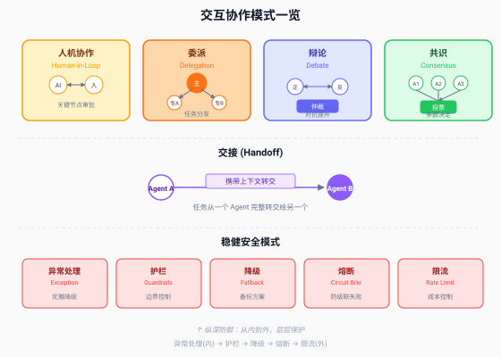
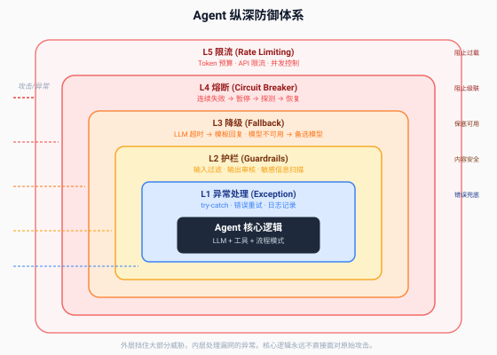

# 第 16 章 交互协作与稳健安全模式

> *"开发者指令通过 system prompt 提供的安全约束，并不比用户输入享有更高优先级——LLM 将两者作为同一个 token 流概率性处理。"*
> *—— Red Hat, "Deploy Secure Agentic AI" (2026.06)*

---

第 15 章覆盖了上半象限——流程控制和增强优化，关注 Agent 内部的执行流程和推理质量。本章覆盖下半象限——交互协作和稳健安全，关注 Agent 与外部世界的交互和系统的防御能力。

如果说前五章教你如何让 Agent "做得好"，本章教你如何让 Agent "不出事"。



---

## 16.1 交互协作模式

交互协作模式关注 Agent 与外部实体——人类或其他 Agent——之间的协作。它们解决的核心问题是：**单个 Agent 的能力有限，什么时候需要引入外部智慧？**

### 16.1.1 Human-in-the-Loop（人机协作）：关键决策引入人类

**定义**：在 Agent 执行流程的关键节点，暂停执行并请求人类判断。人类可以批准、拒绝、修改或补充 Agent 的提议，然后 Agent 继续执行。

**结构**：

```
Agent 执行 → 触发条件 → [暂停] → 人类判断 → 继续/终止/修改
```

**触发人机协作的典型场景**：
- **高风险操作**：删除生产数据、发送外部邮件、执行支付——这些操作不可逆或影响大，必须人类确认
- **低置信度判断**：Agent 对自己的输出置信度低于阈值时，主动求助人类
- **道德/合规决策**：涉及用户隐私、法律合规的场景，人类必须有最终决定权
- **首次执行**：Agent 第一次做某类任务时，人类监督；熟练后取消监督

**设计要点**：

人机协作的设计核心是**何时暂停**。暂停太频繁，Agent 退化成手动工具，用户疲惫；暂停太少，Agent 可能在关键时刻失控。三种常见策略：

| 策略 | 机制 | 适用场景 |
|------|------|---------|
| 固定节点 | 在流程中预设审批点 | 合规要求严格的场景（如金融交易） |
| 置信度阈值 | Agent 自评置信度 < N 时暂停 | Agent 能较准确自评的场景 |
| 操作分级 | 按操作风险等级决定是否暂停 | 操作类型多样的通用 Agent |

**与 Codex CLI 的呼应**：第 9 章提到 Codex CLI 的三档审批模式（suggest / auto-edit / full-auto），本质上就是人机协作的设计。`suggest` 模式下每个操作都暂停等人类确认；`auto-edit` 模式下编辑操作自动执行但高风险操作暂停；`full-auto` 模式下全自动但靠沙箱和 Git 回滚兜底。这三种模式对应了"暂停频率"的不同档位。

**失败模式**：
- **审批疲劳**：每个小操作都要求确认，用户开始无脑点"同意"，审批形同虚设
- **上下文丢失**：暂停后人类回来时，Agent 没有提供足够的上下文，人类不知道在审什么
- **阻塞无超时**：Agent 暂停后无限等待人类，人类忘了回来，任务永远卡住

> **比喻：手术中的麻醉师。**
> 人机协作就像手术中麻醉师的角色——主刀医生（Agent）负责操作，麻醉师（人类）在关键节点监控生命体征并有权叫停。不是每一步都要麻醉师确认（那会让手术无法进行），但在关键节点（开刀前、大出血时）麻醉师的判断是生命线。关键是"关键节点暂停"，不是"每步暂停"。

### 16.1.2 Delegation（委派）：任务分发与专业化

**定义**：一个主 Agent 将子任务委派给专门的子 Agent 执行，子 Agent 独立完成后将结果返回给主 Agent。委派是"分工"——不同 Agent 做自己擅长的事。

**结构**：

```
主 Agent → 识别子任务 → 委派 → [专业子 Agent] → 返回结果 → 主 Agent 整合
```

**与编排者-Worker 的区别**：编排者-Worker 是"动态分解后并行分配"，委派是"按专业能力分发"。编排者像项目经理临时分工，委派像公司按部门分工——技术问题找技术部，财务问题找财务部。

**典型场景**：
- 编码 Agent 遇到文档问题 → 委派给文档 Agent
- 通用 Agent 遇到专业领域（法律/医学）→ 委派给领域专家 Agent
- 主 Agent 负责对话 → 委派给搜索 Agent 做信息检索

**与 Sub-Agent 的关系**（第 13 章呼应）：委派是 Sub-Agent 架构的功能目的——Sub-Agent 的技术机制（Context Firewall、模型分级）服务于委派模式。父 Agent 委派给子 Agent，子 Agent 在自己的干净上下文中执行，只返回压缩结果。

**设计要点**：
- **委派粒度**：委派的是"完整的子任务"而非"单步操作"——子 Agent 应该能独立完成一个有意义的子任务
- **结果格式约定**：主 Agent 和子 Agent 之间需要约定结构化的返回格式，避免自然语言理解偏差
- **委派成本意识**：每次委派意味着一个新的 Agent 会话，有上下文初始化成本（与第 13 章 15x token 消耗呼应）

> **比喻：公司部门分工。**
> 委派就是公司里的部门分工——CEO 不亲自写代码、不亲自做账、不亲自跑销售，而是把任务委派给工程部、财务部、销售部。每个部门（子 Agent）在自己专业领域内独立工作，向 CEO（主 Agent）汇报结果。CEO 的能力不在于什么都懂，而在于知道"这件事该找谁"。

### 16.1.3 Debate（辩论）：多视角对抗提升质量

**定义**：多个 Agent 从不同视角对同一问题给出各自的观点，相互质疑和反驳，最终通过仲裁或收敛得出更高质量的结论。

**结构**：

```
问题 → [Agent A: 正方观点] ↔ [Agent B: 反方观点] → [仲裁 Agent] → 结论
                    ↑↓ 互相质疑
```

**适用场景**：高价值决策需要多角度审视——投资判断、技术方案选择、风险评估。辩论模式的核心价值是"对抗出真知"——单个 Agent 容易陷入单一视角的偏见，多 Agent 对抗能暴露盲点。

**典型例子**：
- 投资决策：一个 Agent 论证"应该投资"，另一个论证"不应该投资"，仲裁 Agent 综合判断
- 代码架构评审：一个 Agent 主张"用微服务"，另一个主张"用单体"，第三轮综合利弊
- 安全分析：红队 Agent 找漏洞，蓝队 Agent 做防御，仲裁评估整体风险

**设计要点**：
- **角色分配要明确**：每个 Agent 有明确的立场和论证职责，不是"随便讨论"
- **轮次控制**：辩论不能无限进行，通常 2-3 轮即可——更多的轮次边际收益递减
- **仲裁机制**：辩论结束后需要一个仲裁 Agent 或投票机制做最终决策

**学术背景**：多 Agent 辩论在学术界被称为"MAD"（Multi-Agent Debate）。2025 年的综述（Zhao et al., arXiv 2508.17692）将其归类为"多 Agent 交互协议"中的"竞争"模式，与"合作"和"谈判"并列。MADebate 是典型的分布式多 Agent 辩论框架。

> **比喻：法庭对抗。**
> 辩论就是法庭上的控辩双方——检察官（Agent A）力证有罪，律师（Agent B）力证无罪，法官（仲裁 Agent）听取双方后裁决。设计的核心不是"让两个 AI 吵架"，而是"通过结构化对抗暴露单视角看不到的盲点"。

### 16.1.4 Consensus（共识）：多 Agent 投票与聚合

**定义**：多个独立 Agent 对同一问题各自给出答案，通过投票或聚合机制得出最终结论。

**结构**：

```
问题 → ┬→ [Agent 1] → 答案1 ┐
       ├→ [Agent 2] → 答案2 ├→ 投票/聚合 → 最终答案
       └→ [Agent 3] → 答案3 ┘
```

**与并行化 Voting 的区别**：第 15 章的并行 Voting 是"同一个 LLM 跑多次"，共识模式是"不同的 Agent 各自独立判断"。差异在于 Agent 的多样性——不同 Agent 可以有不同的 prompt、不同的模型、甚至不同的工具集，多样性更高。

**聚合策略**：
- **多数投票**：取多数答案。适用于有明确正确答案的场景（事实问答、分类）
- **加权投票**：不同 Agent 有不同权重。专家 Agent 权重高于通用 Agent
- **级联聚合**：按置信度排序，高置信度答案优先采纳
- **仲裁聚合**：一个仲裁 Agent 审查所有答案，选择或综合出最终答案

**适用场景**：需要高置信度判断的场合——医疗诊断辅助、安全风险判定、大额交易审批。

> **比喻：专家会诊。**
> 共识就是医院的专家会诊——多位专家各自独立看同一个病例，给出各自诊断，然后集体讨论得出最终诊断。单看一个专家可能有偏见，三个专家一致认同的诊断可信度远高于单个专家。

### 16.1.5 Handoff（交接）：Agent 间的任务转交

**定义**：一个 Agent 将当前任务（包括上下文、已完成的进展、剩余目标）完整转交给另一个 Agent 继续执行。交接后，原 Agent 退出，新 Agent 接管。

**结构**：

```
Agent A 执行 → 触发交接条件 → [携带上下文转交] → Agent B 继续执行 → 完成
```

**与委派的区别**：委派是"主 Agent 委派子任务给子 Agent，主 Agent 仍在"，交接是"Agent A 把整个任务交给 Agent B，Agent A 退出"。委派是分工，交接是换人。

**触发交接的典型场景**：
- **能力边界**：通用 Agent 发现任务需要专业能力 → 交接给专业 Agent
- **上下文超限**：Agent 上下文窗口快满了 → 交接给新 Agent（携带压缩后的上下文）
- **用户请求**：用户要求换一个 Agent（比如从代码 Agent 切换到文档 Agent）

**设计要点**：
- **上下文传递**：交接时必须传递足够的上下文，让新 Agent 无缝接管。传递什么、压缩什么，是核心设计决策
- **交接协议**：结构化的交接消息——当前状态、已完成步骤、待完成步骤、注意事项
- **OpenAI Agents SDK 的 Handoff 原语**：OpenAI 的 Agents SDK 将交接作为一等公民——Agent 可以声明 `handoff` 到其他 Agent，框架自动处理上下文传递

> **比喻：值班交接。**
> 交接就像医院的值班交接——上一班医生下班前，把每个病人的当前状态、已做检查、待做事项写在交接单上，交给下一班医生。好的交接单让新医生五分钟内进入状态，差的交接单让新医生从头了解每个病人。Agent 交接的上下文就是那张"交接单"。

---

## 16.2 稳健安全模式

稳健安全模式关注系统在异常情况下的生存能力。它们不提升 Agent 的"聪明程度"，但确保 Agent "不犯致命错误"。

Red Hat 在 2026 年 6 月的技术文章中指出了一个关键洞察：**"现代 Agentic AI 架构代表了应用逻辑的范式转移——从确定性的、基于规则的控制流，转向由 LLM 驱动的非确定性、随机性推理引擎。"** 这种非确定性正是安全风险的根源——你不能假设 Agent 每次都做"正确"的事，必须有确定性的安全机制兜底。

### 16.2.1 Exception Handling（异常处理）：优雅降级

**定义**：捕获 Agent 执行过程中的异常（工具调用失败、LLM 超时、格式解析错误），进行适当的错误处理，不让异常击穿到用户层面。

**结构**：

```
Agent 执行 → try { 工具调用/LLM调用 } catch { 记录日志 → 降级处理 } → 继续/返回兜底结果
```

**Agent 常见异常类型**：

| 异常类型 | 原因 | 处理策略 |
|---------|------|---------|
| LLM 超时 | 网络延迟/模型过载 | 重试（最多 N 次）→ 切换备选模型 → 返回兜底 |
| 工具调用失败 | API 不可用/参数错误 | 重试 → 报告给 Agent 让其调整 → 跳过该工具 |
| JSON 解析失败 | LLM 输出格式不符 | 重新请求（附加格式约束）→ 降级到文本解析 |
| 上下文超限 | Token 超过窗口 | 压缩历史 → 交接新 Agent（第 13 章） |
| 循环检测 | Agent 反复执行同一操作 | 打破循环 → 强制终止 → 报告 |

**设计要点**：
- **重试有上限**：不是无限重试，通常 3 次。超过则降级
- **异常信息对 Agent 友好**：工具调用失败时，返回给 Agent 的错误信息应该包含"为什么失败"和"建议怎么调整"——这和第 9 章的"Linter 输出为 Agent 设计"一脉相承
- **兜底结果**：当所有重试和降级都失败时，返回一个安全的兜底结果（如模板回复），而不是把异常栈暴露给用户

```python
# Agent 异常处理示例
def agent_with_exception_handling(task):
    for attempt in range(MAX_RETRIES):
        try:
            result = llm_call(task)
            parsed = parse_json(result)  # 可能抛 JSON 解析异常
            return parsed
        except JSONParseError:
            task += "\n注意：必须返回合法 JSON 格式"
            continue
        except TimeoutError:
            switch_to_backup_model()
            continue
        except ToolError as e:
            # 把工具错误信息返回给 Agent，让它自己调整
            task += f"\n工具调用失败：{e}. 请调整参数重试。"
            continue

    # 所有重试失败，返回兜底
    return FALLBACK_RESPONSE
```

> **比喻：飞机的冗余系统。**
> 异常处理就像飞机的冗余系统——主液压系统失效时自动切换到备用系统，备用也失效时还有手动操控。乘客（用户）不需要知道中间发生了什么，只需要安全到达（得到合理结果）。关键是"永远不让一个故障导致系统完全崩溃"。

### 16.2.2 Guardrails（护栏）：输入输出边界控制

**定义**：在 Agent 接收输入和产生输出的边界上，设置确定性的过滤和校验机制，阻止不合规的内容进出。

**结构**：

```
用户输入 → [输入护栏] → Agent 处理 → [输出护栏] → 返回用户
               ↓                        ↓
            拦截不合规              拦截不合规
```

**输入护栏**：
- **Prompt 注入检测**：检测用户输入中是否包含试图覆盖 system prompt 的指令
- **敏感信息过滤**：阻止用户输入中的密码、密钥、个人隐私信息进入 Agent
- **输入格式校验**：确保输入符合预期格式（长度、类型、字符集）
- **意图分类**：拒绝不在 Agent 服务范围内的请求

**输出护栏**：
- **内容审核**：检测输出中是否包含有害、违规、歧视性内容
- **敏感信息脱敏**：确保输出不泄露内部系统信息、其他用户数据
- **格式校验**：确保输出符合承诺的格式（JSON schema、长度限制）
- **行为约束**：确保 Agent 没有执行超出权限的操作

**关键洞察**：Red Hat 的研究指出一个重要事实——**system prompt 中的安全约束并不比用户输入享有更高优先级**。LLM 将 system prompt 和 user input 作为同一个 token 流处理，这意味着"你在 system prompt 里写的'不要泄露密码'并不能可靠地阻止 prompt 注入攻击"。这就是为什么需要确定性的护栏——它们不依赖 LLM 的"理解"，而是用代码硬性过滤。

> **比喻：高速公路护栏。**
> 护栏就是高速公路两侧的金属护栏——不干预正常行驶（合法输入输出畅通无阻），但在车辆偏离赛道时（不合规内容）硬性挡住。护栏不依赖驾驶员（LLM）的自觉，而是物理上的刚性边界。

### 16.2.3 Fallback（降级）：备份方案设计

**定义**：当主方案失败时，自动切换到备选方案，保证系统基本可用。降级的核心是"宁可差一点，不能完全不可用"。

**典型降级链**：

```
GPT-4 (主) → 超时 → Claude 3.5 (备) → 超时 → 本地小模型 (兜底) → 模板回复 (最终兜底)
```

**设计要点**：
- **降级链预设**：不是临时想备选方案，而是提前设计好降级链
- **降级质量阶梯**：每一级降级，质量下降但可用性保证。最终兜底应该是"零 AI 依赖"的——比如纯模板回复
- **降级触发条件**：明确什么条件触发降级——超时阈值、错误次数、资源限制
- **降级通知**：降级时应该通知用户"当前服务质量可能下降"，保持透明

> **比喻：飞机的备降机场。**
> 降级就像飞机在目的地天气不好时飞往备降机场——虽然不是原定目的地（质量下降），但安全着陆了（系统可用）。备降机场是提前规划好的，不是临时找的。最终兜底（模板回复）就像迫降——不优雅，但保命。

### 16.2.4 Circuit Breaker（熔断）：防止级联失败

**定义**：当某个组件（LLM API、工具服务）连续失败达到阈值时，熔断器"跳闸"——暂停对该组件的请求，经过冷却期后尝试恢复。

**状态机**：

```
Closed（正常）→ 失败率 > 阈值 → Open（熔断，请求被拒）
                                    ↓ 冷却期后
                              Half-Open（探测，放行少量请求）
                                ├→ 成功 → Closed（恢复）
                                └→ 失败 → Open（继续熔断）
```

**适用场景**：
- LLM API 限流/不可用时，防止 Agent 无限重试加重 API 负担
- 工具服务不可用时，防止 Agent 卡在"调用→失败→重试"的死循环
- 多 Agent 系统中，防止一个子 Agent 的失败级联到整个系统

**设计要点**：
- **熔断阈值**：通常设为"连续 N 次失败"或"失败率 > X%"
- **冷却期**：熔断后的等待时间，通常 30-60 秒
- **半开探测**：冷却期后不是全量恢复，而是放行少量请求探测——成功则恢复，失败则继续熔断
- **与降级配合**：熔断期间走降级方案，不是直接报错

> **比喻：电路保险丝。**
> 熔断就是家里的保险丝（空气开关）——电流过载时自动跳闸，保护电器不被烧毁。跳闸后你不会马上推上去（冷却期），而是先排查问题，然后小心地推上去试一下（半开探测）。如果还跳，说明问题没解决，继续等。

### 16.2.5 Rate Limiting（限流）：成本与负载控制

**定义**：限制 Agent 在单位时间内的请求量或 Token 消耗量，防止成本失控和系统过载。

**三个维度的限流**：

| 维度 | 限制对象 | 典型阈值 | 目的 |
|------|---------|---------|------|
| 请求频率 | 每秒/每分钟 API 调用次数 | 60 次/分钟 | 防止 API 限流 |
| Token 消耗 | 每次会话/每天 Token 总量 | 100K tokens/会话 | 成本控制 |
| 并发数 | 同时执行的 Agent 数量 | 最多 10 个并发 | 资源控制 |

**设计要点**：
- **多级限流**：不是只限一个维度，而是请求频率 + Token + 并发三层限流
- **用户级限流**：不同用户有不同配额——免费用户 100 次/天，付费用户 1000 次/天
- **任务级预算**：单个任务设 Token 预算上限——与第 14 章编排者-Worker 的预算上限呼应
- **限流通知**：接近限额时提前通知用户，而不是突然中断

> **比喻：自助餐限取。**
> 限流就像自助餐的"每次限取两盘"规则——不限制你吃多少总量（那靠你的钱包/预算控制），但限制你一次拿多少（防止一个人把菜品全部端走，后面的人没得吃）。Agent 限流同理——不限制你用多少总量（那靠预算控制），但限制你每分钟能调多少次（防止压垮服务）。

---

## 16.3 纵深防御：安全模式的组合

五种安全模式不是孤立的，它们构成一个**纵深防御体系**——从外到内层层保护 Agent 核心逻辑。



上图展示了五层防御的嵌套关系。最外层是限流（挡住过载），向内依次是熔断（挡住级联）、降级（保底可用）、护栏（内容安全）、异常处理（错误兜底），最内核是 Agent 逻辑。

**纵深防御的三条原则**：

**原则 1：外层优先。** 能在外层挡住的威胁，不要让它进入内层。限流挡住了 80% 的过载请求，剩下的 20% 由熔断处理；熔断挡住了级联失败，剩下的由降级处理……每一层只处理"漏网"的威胁。

**原则 2：确定性优先于概率性。** 护栏用代码过滤（确定性），不依赖 LLM 判断（概率性）。因为 Red Hat 指出——LLM 无法可靠地区分"安全指令"和"注入指令"，安全约束必须用代码实现。

**原则 3：最终兜底零 AI 依赖。** 最内层的兜底方案（模板回复）不依赖任何 AI——即使所有 LLM 都不可用，系统仍然能返回一个基本可用的响应。

---

## 16.4 本章小结

### 三个核心认知

**认知 1：交互协作模式让 Agent "会求助"。**

人机协作在关键节点引入人类判断，委派让 Agent 专业分工，辩论通过对抗暴露盲点，共识通过多视角提升置信度，交接让任务在不同 Agent 间流转。这些模式共同扩展了单 Agent 的能力边界。

**认知 2：稳健安全模式让 Agent "不致命"。**

异常处理兜住执行错误，护栏在边界拦截不合规内容，降级保证基本可用，熔断防止级联失败，限流控制成本和负载。这些模式不提升智能，但保证生存。

**认知 3：纵深防御是安全模式的核心策略。**

五层防御从外到内嵌套——限流→熔断→降级→护栏→异常处理——每一层只处理漏网的威胁。最终兜底零 AI 依赖，确保系统在极端情况下仍能安全降级。

### 关键数据

| 数据 | 来源 | 含义 |
|------|------|------|
| system prompt 安全约束不比 user input 优先级高 | Red Hat, 2026.06 | 安全必须用确定性代码实现，不能依赖 LLM |
| 多 Agent 辩论 (MAD) 分类 | Zhao et al., 2025.8 | 辩论是"竞争"型交互协议 |
| OpenAI Agents SDK 将 Handoff 作为一等公民 | OpenAI, 2025 | 交接模式被框架原生支持 |
| 五层纵深防御 | 本书综合 | 安全模式的组合策略 |

### 比喻回顾

| 比喻 | 对应模式 |
|------|---------|
| 手术中的麻醉师 | 人机协作——关键节点暂停 |
| 公司部门分工 | 委派——按专业能力分发 |
| 法庭对抗 | 辩论——结构化对抗暴露盲点 |
| 专家会诊 | 共识——多视角提升置信度 |
| 值班交接 | 交接——结构化上下文转交 |
| 飞机冗余系统 | 异常处理——永远不让单故障击穿 |
| 高速公路护栏 | 护栏——刚性边界不依赖自觉 |
| 备降机场 | 降级——提前规划备选方案 |
| 电路保险丝 | 熔断——过载跳闸，冷却探测 |
| 自助餐限取 | 限流——限制频率不限制总量 |

---

*本篇完。下接 → [第五篇 · 多 Agent 系统](../第五篇%20·%20多Agent系统/第五篇%20·%20多Agent系统.md)*
