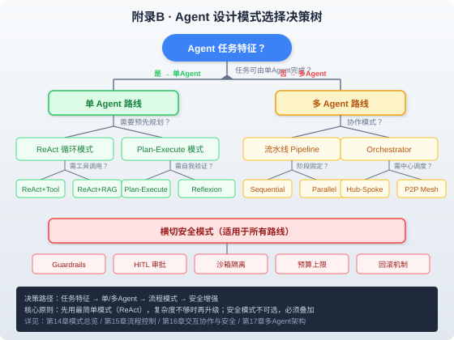

### 附录B · Agent 设计模式速查表

> 📖 本附录你将了解：20+ 种 Agent 设计模式的一句话定义、适用场景、代码骨架，以及一份模式选择决策树。这是第四篇（第14-16章）和第五篇（第17-20章）的模式速查手册



#### 开篇：从"记不住模式名"到"30秒选对模式"

你在第四篇学了 20+ 种 Agent 设计模式——ReAct、Plan-Execute、Reflexion、Pipeline、Orchestrator、Hub-Spoke……但真正动手时，第一个问题往往是："我这个场景该用哪个？"

这个附录就是回答这个问题的。每种模式用一句话定义，配一个最简代码骨架，最后用决策树帮你 30 秒锁定答案。

---

#### B.1 单 Agent 流程控制模式

##### B.1.1 ReAct 循环

**一句话**：思考→行动→观察→再思考的无限循环，直到得出最终答案。

**适用场景**：任务步骤不确定、需要根据中间结果动态决策。

**代码骨架**：

```python
from langgraph.graph import StateGraph, END

def react_loop(state):
    while not state["is_complete"]:
        # Thought: 分析当前状态
        thought = llm.invoke(f"Given observations: {state['observations']}, what should I do next?")
        # Action: 调用工具
        action_result = execute_tool(thought.tool, thought.args)
        # Observation: 记录结果
        state["observations"].append(action_result)
        state["is_complete"] = thought.is_final
    return state

graph = StateGraph(AgentState)
graph.add_node("react", react_loop)
graph.set_entry_point("react")
graph.add_edge("react", END)
```

> 📖 详见 [第7章 Loop 工程](../第二篇%20·%20四大工程范式/第7章%20Loop工程.md) 和 [第15章](../第四篇%20·%20Agent设计模式/第15章%20流程控制与增强优化模式.md)

##### B.1.2 Plan-Execute

**一句话**：先一次性生成完整计划，再逐步执行，执行中可修订计划。

**适用场景**：任务步骤可预知、需要全局视角、多步骤任务。

**代码骨架**：

```python
def plan(state):
    state["plan"] = llm.invoke(f"Create a step-by-step plan for: {state['task']}")
    state["step_index"] = 0
    return state

def execute_step(state):
    step = state["plan"][state["step_index"]]
    result = execute_tool(step.tool, step.args)
    state["results"].append(result)
    state["step_index"] += 1
    return state

def replan(state):
    if not state["results"][-1].success:
        state["plan"] = llm.invoke(f"Revise plan given failure: {state['results'][-1]}")
    return state

graph = StateGraph(AgentState)
graph.add_node("plan", plan)
graph.add_node("execute", execute_step)
graph.add_node("replan", replan)
graph.add_conditional_edges("execute", lambda s: "replan" if not s["results"][-1].success else "execute" if s["step_index"] < len(s["plan"]) else END)
```

##### B.1.3 Reflexion（反思循环）

**一句话**：执行后自我评估失败原因，将反思写入记忆，下次尝试避免同样错误。

**适用场景**：高质量要求、允许多次尝试、需要从错误中学习。

**代码骨架**：

```python
def reflect(state):
    if not state["result"].success:
        reflection = llm.invoke(f"Why did this fail? Result: {state['result']}. Learn from it.")
        state["reflections"].append(reflection)
        state["attempt"] += 1
    return state

def execute_with_reflection(state):
    # 将历史反思注入 Prompt
    prompt = f"Past reflections: {state['reflections']}\nTask: {state['task']}"
    state["result"] = agent.run(prompt)
    return state

graph.add_node("execute", execute_with_reflection)
graph.add_node("reflect", reflect)
graph.add_conditional_edges("reflect", lambda s: "execute" if s["attempt"] < MAX_ATTEMPTS and not s["result"].success else END)
```

##### B.1.4 ReWOO（Reasoning Without Observation）

**一句话**：一次性生成所有工具调用计划（含依赖关系），并行执行无依赖步骤，最后汇总。

**适用场景**：工具调用之间无强依赖、可并行化、减少 LLM 调用次数。

**代码骨架**：

```python
def generate_plan(state):
    # 一次性生成所有步骤，标注依赖
    state["plan"] = llm.invoke(f"Generate all steps for: {state['task']}")
    return state

def parallel_execute(state):
    # 并行执行无依赖步骤
    independent_steps = [s for s in state["plan"] if not s.dependencies]
    results = parallel_map(execute_tool, independent_steps)
    state["results"].extend(results)
    return state

def synthesize(state):
    state["answer"] = llm.invoke(f"Synthesize answer from: {state['results']}")
    return state
```

##### B.1.5 LATS（Language Agent Tree Search）

**一句话**：树搜索式探索多条执行路径，用 LLM 评估每条路径价值，蒙特卡洛式选择最优。

**适用场景**：探索空间大、单条路径成功率低、计算预算充足。

**代码骨架**：

```python
def expand(state):
    # 生成多个候选下一步
    candidates = llm.invoke(f"Generate 3 possible next steps: {state['current']}")
    state["frontier"].extend(candidates)
    return state

def evaluate(state):
    # LLM 评估每条路径
    for node in state["frontier"]:
        node.value = llm.invoke(f"Rate this path 0-1: {node}")
    return state

def select_best(state):
    state["current"] = max(state["frontier"], key=lambda n: n.value)
    return state
```

---

#### B.2 多 Agent 架构模式

##### B.2.1 Sequential Pipeline（顺序流水线）

**一句话**：多个 Agent 按固定顺序串联，前一个的输出是后一个的输入。

**适用场景**：任务有明确阶段划分、阶段间无反馈、每个阶段由专门 Agent 处理。

**代码骨架**：

```python
# Agent A → Agent B → Agent C
graph = StateGraph(SharedState)
graph.add_node("researcher", research_agent)
graph.add_node("writer", writing_agent)
graph.add_node("reviewer", review_agent)
graph.add_edge("researcher", "writer")
graph.add_edge("writer", "reviewer")
graph.add_edge("reviewer", END)
```

> 📖 详见 [第17章 多Agent架构模式](../第五篇%20·%20多Agent系统/第17章%20多Agent架构模式.md)

##### B.2.2 Parallel Fan-out/Fan-in（并行扇出扇入）

**一句话**：一个协调 Agent 将任务拆分给多个并行子 Agent，各自独立完成后汇总结果。

**适用场景**：子任务相互独立、需要加速、可并行处理。

**代码骨架**：

```python
from langgraph.graph import StateGraph

def fan_out(state):
    # 拆分任务
    state["subtasks"] = split_task(state["task"])
    return state

def parallel_workers(state):
    # 并行执行
    results = [sub_agent.run(t) for t in state["subtasks"]]
    state["subresults"] = results
    return state

def fan_in(state):
    # 汇总
    state["answer"] = synthesize(state["subresults"])
    return state

graph.add_node("fanout", fan_out)
graph.add_node("workers", parallel_workers)
graph.add_node("fanin", fan_in)
```

##### B.2.3 Orchestrator-Worker（编排者-工作者）

**一句话**：中心编排 Agent 动态分配任务给工作者 Agent，根据结果决定下一步分配。

**适用场景**：任务不可预先拆分、需要动态路由、工作者能力不同。

**代码骨架**：

```python
def orchestrator(state):
    # 动态决定分配给谁
    next_agent = llm.invoke(f"Given current state, which worker should handle this? Workers: {state['workers']}")
    state["next"] = next_agent
    return state

def worker_agent(state, worker_name):
    result = workers[worker_name].run(state["task"])
    state["results"].append(result)
    return state

# 条件边：编排者根据决策路由到不同 Worker
graph.add_conditional_edges("orchestrator", lambda s: s["next"])
```

##### B.2.4 Hub-Spoke（中心辐射）

**一句话**：一个中心 Agent 作为唯一入口，所有外部通信都经过它，子 Agent 之间不直接通信。

**适用场景**：需要集中控制、安全审计、简化通信拓扑。

**代码骨架**：

```python
def hub(state):
    # 所有消息都经过 Hub
    if state["message"].requires_research:
        result = spoke_research(state)
        state["context"].update(result)
    if state["message"].requires_code:
        result = spoke_code(state)
        state["context"].update(result)
    state["answer"] = generate_response(state)
    return state
```

##### B.2.5 P2P Mesh（对等网络）

**一句话**：所有 Agent 平等，任何 Agent 可以直接与其他 Agent 通信，通过 A2A 协议发现和协作。

**适用场景**：去中心化、Agent 来自不同团队/组织、灵活协作。

**代码骨架**：

```python
# 使用 A2A 协议实现 P2P
from a2a.client import A2AClient

async def p2p_collaboration(task):
    # 发现可用 Agent
    agents = await discover_agents(registry_url)
    
    # 任何 Agent 都可以委派给其他 Agent
    for agent_card in agents:
        client = await A2AClient.from_card(agent_card)
        if task.matches(agent_card.skills):
            response = await client.send_message(task)
            return response
```

> ⚠️ **安全提示**：P2P Mesh 中 Agent 间通信不可信，需防范 [Session Smuggling 攻击](../第八篇%20·%20实战篇/第29章%20自动化运维Agent.md)（详见第29章 A2A 安全风险）。所有跨 Agent 消息应经过 Guard 检查。

##### B.2.6 Hierarchical（层级结构）

**一句话**：Manager Agent 管理多个 Team Lead Agent，每个 Team Lead 管理多个 Worker Agent，层层委派。

**适用场景**：大型组织模拟、复杂任务分解、需要中间管理层。

**代码骨架**：

```python
def manager(state):
    # 分配给 Team Lead
    team = route_to_team(state["task"])
    state["team_result"] = team_lead(state, team)
    return state

def team_lead(state, team):
    # 分配给 Worker
    worker_results = [worker(state, w) for w in team.workers]
    return synthesize(worker_results)
```

---

#### B.3 交互协作模式

##### B.3.1 Debate（辩论模式）

**一句话**：多个 Agent 持不同立场就同一问题辩论，由裁判 Agent 综合各方论点得出结论。

**适用场景**：需要多角度分析、避免单一偏见、决策类任务。

**代码骨架**：

```python
def debate_round(state):
    for stance in ["pro", "con", "neutral"]:
        arg = agents[stance].run(f"Argue {stance} on: {state['topic']}")
        state["arguments"][stance].append(arg)
    return state

def judge(state):
    state["verdict"] = judge_agent.run(f"Synthesize: {state['arguments']}")
    return state

# 多轮辩论
for _ in range(MAX_ROUNDS):
    graph.add_node(f"debate_{_}", debate_round)
```

> 📖 详见 [第16章 交互协作与稳健安全模式](../第四篇%20·%20Agent设计模式/第16章%20交互协作与稳健安全模式.md)

##### B.3.2 Round Robin（轮流发言）

**一句话**：多个 Agent 按固定顺序轮流发言，每人基于前人发言补充观点。

**适用场景**：头脑风暴、渐进式完善、团队共创。

**代码骨架**：

```python
def round_robin(state):
    for agent in state["agents"]:
        response = agent.run(f"Previous inputs: {state['contributions']}")
        state["contributions"].append(response)
    return state
```

##### B.3.3 Human-in-the-Loop（人机协作）

**一句话**：Agent 在关键决策点暂停，等待人类审批后继续执行。

**适用场景**：高风险操作、合规要求、Agent 置信度不足。

**代码骨架**：

```python
from langgraph.types import interrupt

def execute_with_approval(state):
    if state["risk_level"] == "high":
        # 暂停，等待人工审批
        approval = interrupt({
            "prompt": f"Approve action: {state['action']}?",
            "options": ["approve", "reject", "modify"]
        })
        if approval == "reject":
            return state
    execute_action(state["action"])
    return state
```

> 📖 详见 [第29章 自动化运维Agent](../第八篇%20·%20实战篇/第29章%20自动化运维Agent.md) 中的风险四级安全边界设计

---

#### B.4 安全与稳健性模式

##### B.4.1 Guardrails（护栏模式）

**一句话**：在 Agent 输入和输出两侧各加一层校验，拦截不安全或不合规内容。

**适用场景**：生产环境必需、合规要求、防止幻觉和越权。

**代码骨架**：

```python
from guardrails_ai import Guard

input_guard = Guard().use_many(
    ProfanityFilter(),
    PromptInjectionDetector(),
    PIIFilter(),
)

output_guard = Guard().use_many(
    FactCheckGuard(threshold=0.85),
    ToxicityFilter(),
)

def guarded_agent(state):
    # 输入校验
    validated_input = input_guard(state["user_input"])
    # Agent 执行
    raw_output = agent.run(validated_input)
    # 输出校验
    validated_output = output_guard(raw_output)
    return validated_output
```

> 📖 详见 [第26章 生产部署与安全对齐](../第七篇%20·%20工程化与安全/第26章%20生产部署与安全对齐.md)

##### B.4.2 Sandboxing（沙箱隔离）

**一句话**：Agent 的所有代码执行在隔离环境中进行，限制文件系统、网络、进程权限。

**适用场景**：Agent 需要执行代码、不可信环境、防止 `rm -rf`。

**代码骨架**：

```python
# Docker 沙箱
import docker

client = docker.from_env()
container = client.containers.run(
    "python:3.12-slim",
    command=f"python -c '{state['code']}'",
    remove=True,
    network_mode="none",      # 无网络
    read_only=True,            # 只读文件系统
    mem_limit="512m",          # 内存限制
    cpu_period=100000,
    cpu_quota=50000,           # CPU 限制
    timeout=30,                # 超时
)
```

> 📖 详见 [第9章 沙箱与安全执行](../第三篇%20·%20Harness工程落地/第9章%20沙箱与安全执行.md)

##### B.4.3 Budget Guard（预算上限）

**一句话**：硬性限制 Agent 的 Token 消耗、美元成本、循环深度，超限强制终止。

**适用场景**：防止无限循环（如第29章 47K 美元事故）、控制成本、生产必需。

**代码骨架**：

```python
class BudgetGuard:
    def __init__(self, max_tokens=100000, max_cost=10.0, max_iterations=50):
        self.max_tokens = max_tokens
        self.max_cost = max_cost
        self.max_iterations = max_iterations

    def check(self, state):
        if state["total_tokens"] > self.max_tokens:
            raise BudgetExceeded(f"Token limit: {state['total_tokens']}")
        if state["total_cost"] > self.max_cost:
            raise BudgetExceeded(f"Cost limit: ${state['total_cost']}")
        if state["iterations"] > self.max_iterations:
            raise BudgetExceeded(f"Iteration limit: {state['iterations']}")
        return True

budget = BudgetGuard()

def agent_loop(state):
    while not state["is_complete"]:
        budget.check(state)  # 每次循环前检查
        state = react_step(state)
```

##### B.4.4 Rollback（回滚机制）

**一句话**：执行操作前记录系统状态快照，失败或结果异常时自动回滚到快照。

**适用场景**：有状态变更的操作、运维 Agent、数据库修改。

**代码骨架**：

```python
def execute_with_rollback(state):
    # 记录快照
    snapshot = capture_system_state()
    try:
        result = execute_action(state["action"])
        # 验证期（bake-in period）
        if not verify_health(duration=300):  # 5分钟健康检查
            rollback(snapshot)
            state["status"] = "rolled_back"
        else:
            state["status"] = "success"
    except Exception:
        rollback(snapshot)
        state["status"] = "failed"
    return state
```

---

#### B.5 增强优化模式

##### B.5.1 RAG 增强

**一句话**：Agent 执行前从知识库检索相关文档，注入 Context 后再推理。

**适用场景**：需要领域知识、文档问答、减少幻觉。

**代码骨架**：

```python
def rag_enhanced(state):
    # 检索
    docs = vector_store.similarity_search(state["query"], k=5)
    # 注入 Context
    state["context"] = format_docs(docs)
    # Agent 推理
    state["answer"] = agent.run(f"Context: {state['context']}\nQ: {state['query']}")
    return state
```

> 📖 详见 [第28章 企业知识增强助手](../第八篇%20·%20实战篇/第28章%20企业知识增强助手.md) 中的权限继承 RAG

##### B.5.2 Memory（记忆系统）

**一句话**：Agent 跨会话保留对话历史和学到的事实，短期记忆用窗口、长期记忆用向量库。

**适用场景**：多轮对话、个性化、需要记住用户偏好。

**代码骨架**：

```python
from langgraph.checkpoint.memory import MemorySaver

# 短期记忆（会话内）
checkpointer = MemorySaver()
graph = builder.compile(checkpointer=checkpointer)

# 长期记忆（跨会话）
def save_to_long_term(state):
    if state["has_important_fact"]:
        vector_store.add_texts(
            [state["important_fact"]],
            metadata={"user": state["user_id"], "time": state["timestamp"]}
        )

def load_from_long_term(state):
    relevant = vector_store.similarity_search(
        state["query"], filter={"user": state["user_id"]}
    )
    state["long_term_context"] = relevant
```

##### B.5.3 Context Firewall（上下文防火墙）

**一句话**：Sub-Agent 在独立上下文中运行，不共享主 Agent 的完整历史，只接收必要信息。

**适用场景**：防止上下文膨胀、安全隔离、降低 Token 消耗。

**代码骨架**：

```python
def sub_agent_with_firewall(state):
    # 只传递必要信息，不传完整历史
    minimal_context = {
        "task": state["current_task"],
        "constraints": state["active_constraints"],
    }
    # Sub-Agent 在隔离上下文中运行
    result = sub_agent.invoke(minimal_context)
    # 只返回结果，不返回 Sub-Agent 内部状态
    state["sub_result"] = result
    return state
```

> 📖 详见 [第13章 Sub-Agent 与 Context Firewall](../第三篇%20·%20Harness工程落地/第13章%20Sub-Agent与Context%20Firewall.md)

---

#### B.6 模式选择决策树

```
任务可由单 Agent 完成？
├─ 是 → 需要预先规划？
│   ├─ 是 → 需要自我验证？
│   │   ├─ 是 → Reflexion 模式
│   │   └─ 否 → Plan-Execute 模式
│   └─ 否 → 需要工具调用？
│       ├─ 是 → ReAct + Tool 模式
│       └─ 否 → ReAct + RAG 模式
└─ 否 → 任务阶段固定？
    ├─ 是 → Sequential Pipeline
    └─ 否 → 需要中心调度？
        ├─ 是 → 需要层级管理？
        │   ├─ 是 → Hierarchical 模式
        │   └─ 否 → Orchestrator-Worker
        └─ 否 → 需要多角度分析？
            ├─ 是 → Debate 模式
            └─ 否 → Parallel Fan-out/Fan-in

横切安全模式（所有路线必须叠加）：
├─ Guardrails（输入+输出校验）
├─ Sandboxing（代码执行隔离）
├─ Budget Guard（Token/成本/循环上限）
├─ HITL（高风险操作人工审批）
└─ Rollback（有状态变更时回滚）
```

> **核心原则**：先用最简单的模式（ReAct），复杂度不够时再升级。安全模式不是"可选"，是"必选"——没有 Guardrails 和 Budget Guard 的 Agent 不应该上生产。

---

#### 本章小结

| 模式类别 | 核心模式 | 一句话记忆 |
|----------|----------|------------|
| 流程控制 | ReAct / Plan-Execute / Reflexion | 想了再做 vs 先规划再做 vs 做完反思 |
| 多 Agent | Pipeline / Parallel / Orchestrator | 串联 vs 并联 vs 中心调度 |
| 交互协作 | Debate / Round Robin / HITL | 对抗 vs 合作 vs 人审批 |
| 安全稳健 | Guardrails / Sandbox / Budget / Rollback | 护栏 / 隔离 / 预算 / 回滚 |
| 增强优化 | RAG / Memory / Context Firewall | 补知识 / 补记忆 / 防膨胀 |

<!-- 本章质量自检：✅ 覆盖20+种模式 ✅ 每种含一句话定义+适用场景+代码骨架 ✅ 含决策树SVG ✅ 与第7/9/13/14/15/16/17/26/28/29章呼应 ✅ 安全模式标注为必选 -->
