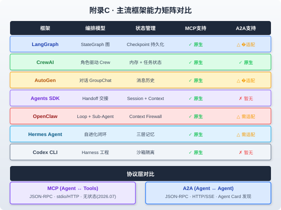

### 附录C · 主流框架与协议对比表

> 📖 本附录你将了解：7 大主流 Agent 框架（LangGraph / CrewAI / AutoGen / OpenAI Agents SDK / OpenClaw / Hermes Agent / Codex CLI）的能力矩阵对比，以及 MCP 和 A2A 两大协议的特性对比。帮助你在技术选型时做出明智决策



#### 开篇：框架不是宗教，是工具

你在第六篇深度解读了 OpenClaw、Hermes Agent 和 Codex CLI 三个开源框架。在第八篇的实战中，你主要使用 LangGraph 作为编排框架。但你可能会问："我的项目到底该用哪个框架？"

这个附录不站队——每个框架都有它最擅长的场景。我们用统一的能力矩阵做横向对比，让你根据自己的需求做选择。

---

#### C.1 框架能力矩阵

| 能力维度 | LangGraph | CrewAI | AutoGen | Agents SDK | OpenClaw | Hermes Agent | Codex CLI |
|----------|-----------|--------|---------|------------|----------|--------------|-----------|
| **编排模型** | StateGraph 图 | 角色驱动 Crew | 对话 GroupChat | Handoff 交接 | Loop + Sub-Agent | 自进化闭环 | Harness 工程 |
| **状态管理** | Checkpoint 持久化 | 内存 + 任务状态 | 消息历史 | Session + Context | Context Firewall | 三层记忆 | 沙箱隔离 |
| **MCP 支持** | ✓ 原生 | ✓ 原生 | ✓ 原生 | ✓ 原生 | ✓ 原生 | ✓ 原生 | ✓ 原生 |
| **A2A 支持** | △ 需适配 | ✓ 原生 | △ 需适配 | ✗ 暂无 | △ 需适配 | △ 需适配 | ✗ 暂无 |
| **HITL 支持** | ✓ interrupt() | ✓ 内置 | ✓ 手动 | ✓ 内置 | ✓ 审批门控 | ✓ 自进化反馈 | ✓ 审批 |
| **可观测性** | LangSmith 深度集成 | LangSmith | 手动 | LangSmith | OTel + Langfuse | 内置仪表盘 | OTel |
| **沙箱执行** | △ 需自建 | △ 需自建 | △ Docker | ✓ 内置 | ✓ 多层沙箱 | ✓ 沙箱 | ✓ 内置 |
| **流式输出** | ✓ SSE | ✓ | ✓ | ✓ | ✓ SSE | ✓ | ✓ |
| **并行执行** | ✓ Map节点 | ✓ | ✓ | △ | ✓ Sub-Agent | ✓ 闭环 | ✗ |
| **开源协议** | MIT | MIT | MIT | MIT | Apache 2.0 | MIT | Apache 2.0 |
| **语言** | Python / JS | Python | Python / .NET | Python | TypeScript | Python | TypeScript |
| **社区规模** | 活跃 | 活跃 | 活跃 | 新生 | ~370K Star | ~140K Star | ~85K Star |

> **图例**：✓ 原生支持 / △ 需适配或部分支持 / ✗ 不支持

---

#### C.2 框架深度对比

##### C.2.1 LangGraph：图编排之王

**核心优势**：将 Agent 工作流建模为有向图（StateGraph），每个节点是一个处理步骤，边是条件路由。支持 Checkpoint 持久化、中断恢复、并行执行。

**最适合**：复杂工作流编排、需要精确控制流程、需要持久化和恢复的场景。

**代码风格**：

```python
from langgraph.graph import StateGraph, END

graph = StateGraph(AgentState)
graph.add_node("retrieve", retrieve_node)
graph.add_node("generate", generate_node)
graph.add_node("guard", guard_node)
graph.add_edge("__start__", "retrieve")
graph.add_edge("retrieve", "generate")
graph.add_conditional_edges("generate", check_grounding, {
    "pass": END,
    "fail": "guard",
})
graph.add_edge("guard", "retrieve")  # 修正后重新检索
app = graph.compile(checkpointer=MemorySaver())
```

**不足**：学习曲线较陡、A2A 支持需自行适配、代码量相对多。

> 📖 详见 [第3章 Agent开发环境与技术栈](../第一篇%20·%20破冰篇/第3章%20Agent开发环境与技术栈.md)

##### C.2.2 CrewAI：角色驱动协作

**核心优势**：以"角色"为核心抽象——每个 Agent 有 Role、Goal、Backstory，组成 Crew 执行 Tasks。A2A 原生支持双向通信。

**最适合**：多 Agent 角色协作、内容创作、研究类任务、需要 A2A 的场景。

**代码风格**：

```python
from crewai import Agent, Task, Crew

researcher = Agent(
    role="Research Analyst",
    goal="Find comprehensive information on the topic",
    backstory="Expert researcher with 10 years experience",
    tools=[search_tool, scrape_tool],
)

writer = Agent(
    role="Technical Writer",
    goal="Write clear, engaging content",
    backstory="Former tech journalist",
)

research_task = Task(description="Research AI agents", agent=researcher)
write_task = Task(description="Write article based on research", agent=writer)

crew = Crew(agents=[researcher, writer], tasks=[research_task, write_task])
result = crew.kickoff()
```

**不足**：流程控制不如 LangGraph 精细、状态管理较简单、不适合需要复杂条件路由的场景。

##### C.2.3 AutoGen：对话式多Agent

**核心优势**：以"对话"为核心模型——多个 Agent 通过 GroupChat 自由对话协作。支持 .NET 生态。

**最适合**：需要 Agent 间自由讨论、研究探索类、.NET 技术栈。

**代码风格**：

```python
import autogen

researcher = autogen.AssistantAgent("researcher", system_prompt="...")
coder = autogen.AssistantAgent("coder", system_prompt="...")
user_proxy = autogen.UserProxyAgent("user", human_input_mode="TERMINATE")

groupchat = autogen.GroupChat(agents=[user_proxy, researcher, coder], messages=[])
manager = autogen.GroupChatManager(groupchat=groupchat)
user_proxy.initiate_chat(manager, message="Build a snake game")
```

**不足**：对话容易跑偏、Token 消耗大、流程可控性弱。

##### C.2.4 OpenAI Agents SDK：Handoff 模型

**核心优势**：OpenAI 官方框架，"Handoff"机制让 Agent 之间平滑交接任务。与 OpenAI 模型深度集成。

**最适合**：使用 OpenAI 模型、需要官方支持、客服/路由类场景。

**代码风格**：

```python
from agents import Agent, Runner

triage_agent = Agent(
    name="Triage",
    instructions="Route user to the right specialist",
    handoffs=[billing_agent, tech_agent, general_agent],
)

billing_agent = Agent(
    name="Billing",
    instructions="Handle billing questions",
)

result = Runner.run_sync(triage_agent, "I have a billing question")
```

**不足**：与 OpenAI 绑定较深、A2A 暂不支持、生态较新。

##### C.2.5 OpenClaw：Harness 工程实践

**核心优势**：Loop + Sub-Agent 架构，Context Firewall 防止上下文膨胀，多层沙箱安全执行。

**最适合**：编程类 Agent、需要安全代码执行、长时间运行的任务。

> 📖 详见 [第21章 OpenClaw深度解读](../第六篇%20·%20开源Agent框架深度解读/第21章%20OpenClaw深度解读.md)

##### C.2.6 Hermes Agent：自进化闭环

**核心优势**：三层记忆模型（工作记忆 + 情景记忆 + 语义记忆），从反馈中自动学习和改进。

**最适合**：需要持续学习、长期运行、个性化场景。

> 📖 详见 [第22章 Hermes Agent深度解读](../第六篇%20·%20开源Agent框架深度解读/第22章%20Hermes%20Agent深度解读.md)

##### C.2.7 Codex CLI：终端编程Agent

**核心优势**：Harness Engineering 的极致实践——沙箱隔离、审批门控、可观测性内置。

**最适合**：终端编程辅助、代码审查、需要严格安全控制的开发场景。

> 📖 详见 [第23章 OpenAI Codex深度解读](../第六篇%20·%20开源Agent框架深度解读/第23章%20OpenAI%20Codex深度解读.md)

---

#### C.3 性能对比

| 指标 | LangGraph | CrewAI | AutoGen | Agents SDK |
|------|-----------|--------|---------|------------|
| **冷启动** | ~2s | ~1.5s | ~3s | ~1s |
| **单轮延迟** | 低 | 中 | 中高 | 低 |
| **并发能力** | 高（异步） | 中 | 中 | 高 |
| **Token 效率** | 高（精确控制） | 中 | 低（对话多） | 高 |
| **最大 Agent 数** | 无限制 | ~10 推荐 | ~5 推荐 | ~5 推荐 |
| **状态持久化** | ✓ PostgreSQL/SQLite | △ 内存 | △ 消息历史 | ✓ Session |
| **分布式部署** | ✓ LangGraph Platform | △ | △ | ✓ |

> **注意**：性能数据为典型场景下的相对比较，实际表现取决于模型、网络、任务复杂度等因素。

---

#### C.4 协议对比：MCP vs A2A

| 维度 | MCP (Model Context Protocol) | A2A (Agent2Agent) |
|------|------------------------------|-------------------|
| **全称** | Model Context Protocol | Agent2Agent Protocol |
| **管理组织** | Anthropic → 开源社区 | Google → Linux Foundation |
| **最新版本** | 2025-06-18 (无状态核心) | v1.0 (2026.02 稳定版) |
| **解决什么** | Agent ↔ Tools/Data | Agent ↔ Agent |
| **传输协议** | JSON-RPC 2.0 | JSON-RPC 2.0 |
| **传输方式** | stdio / Streamable HTTP | HTTP(S) / SSE |
| **会话模型** | 无状态（2026.07 移除 Session） | 有状态（Task 生命周期） |
| **服务发现** | 客户端配置 | Agent Card (`/.well-known/agent-card.json`) |
| **认证** | OAuth 2.1 | API Key / OAuth 2.0 |
| **核心原语** | Tools / Resources / Prompts | Agent Card / Task / Message / Artifact |
| **状态生命周期** | 无状态，每次请求独立 | submitted → working → completed |
| **流式更新** | 不支持（Tool 调用同步） | ✓ SSE 流式状态更新 |
| **支持组织** | Anthropic / OpenAI / Cursor / VS Code | Google / 150+ 组织 |
| **SDK 语言** | Python / TypeScript / Java / Go / Rust | Python / JS / Java / C# / Go / Rust |
| **企业采用** | Atlassian Rovo / Glean / CData (350+) | IBM / CrewAI / Google ADK |

##### C.4.1 何时用 MCP

- Agent 需要调用外部工具（数据库查询、API 调用、文件操作）
- Agent 需要读取外部数据源（文档、配置、Schema）
- 工具需要被多个 Agent 框架复用（写一次，到处用）
- 需要标准化工具接口（替代各家私有 Function Calling 格式）

##### C.4.2 何时用 A2A

- 多个 Agent 需要跨框架/跨组织协作
- Agent 需要动态发现其他 Agent 的能力
- 需要委派任务给远程 Agent 并追踪进度
- 构建去中心化的 Agent 网络

##### C.4.3 MCP + A2A 组合

实际上，MCP 和 A2A 不是竞争关系，而是互补：

```
用户请求 → Orchestrator Agent
                ↓ A2A（委派给远程 Agent）
         Research Agent ← MCP（调用搜索工具）
         Code Agent ← MCP（调用代码执行工具）
                ↓ A2A（返回结果）
         Orchestrator Agent → 汇总 → 用户
```

- **MCP** 是 Agent 的"手"——连接工具和数据
- **A2A** 是 Agent 的"嘴"——与其他 Agent 通信

> 📖 详见 [第10章 MCP协议深度解析](../第三篇%20·%20Harness工程落地/第10章%20MCP协议深度解析.md) 和 [第18章 Agent通信协议](../第五篇%20·%20多Agent系统/第18章%20Agent通信协议.md)

---

#### C.5 生态评估

| 生态指标 | LangGraph | CrewAI | AutoGen | Agents SDK | OpenClaw | Hermes | Codex |
|----------|-----------|--------|---------|------------|----------|--------|-------|
| **GitHub Star** | ~15K | ~30K | ~40K | ~20K | ~370K | ~140K | ~85K |
| **月下载量** | 数百万 | 数百万 | 数十万 | 新生 | N/A | N/A | N/A |
| **文档质量** | 优秀 | 良好 | 良好 | 良好 | 良好 | 良好 | 良好 |
| **社区活跃** | 非常活跃 | 非常活跃 | 活跃 | 成长中 | 非常活跃 | 活跃 | 活跃 |
| **企业采用** | 广泛 | 中等 | 中等 | 新生 | 广泛 | 中等 | 中等 |
| **教程数量** | 丰富 | 丰富 | 中等 | 少 | 中等 | 少 | 少 |
| **插件生态** | 丰富 | 中等 | 中等 | 少 | 丰富 | 少 | 少 |

---

#### C.6 选型建议

| 你的场景 | 推荐框架 | 原因 |
|----------|----------|------|
| 复杂工作流编排 | LangGraph | StateGraph 精确控制流程 |
| 多角色协作 | CrewAI | 角色驱动 + A2A 原生 |
| 自由讨论探索 | AutoGen | GroupChat 自由对话 |
| OpenAI 生态 | Agents SDK | 官方框架深度集成 |
| 编程 Agent | OpenClaw / Codex | Harness + 沙箱 + 审批 |
| 需要持续学习 | Hermes Agent | 自进化闭环 |
| 跨组织 Agent 协作 | CrewAI + A2A | A2A 原生双向通信 |
| 企业知识助手 | LangGraph + MCP | 图编排 + 工具标准化 |
| 运维 Agent | LangGraph + A2A | 精确流程 + 多Agent协作 |

> **核心原则**：框架是工具不是宗教。先明确你的需求（编排复杂度、多Agent需求、安全要求、生态偏好），再对照能力矩阵选择。没有"最好的框架"，只有"最适合你场景的框架"。

---

#### 本章小结

| 对比维度 | 关键结论 |
|----------|----------|
| 编排模型 | LangGraph 最灵活（图），CrewAI 最直观（角色），AutoGen 最自由（对话） |
| 协议定位 | MCP 连接工具，A2A 连接 Agent，互补不竞争 |
| 安全能力 | OpenClaw/Codex 最强（Harness+沙箱），LangGraph 需自建 |
| A2A 支持 | CrewAI 最成熟（原生双向），其他需适配 |
| 选型原则 | 需求驱动，不要框架先行 |

<!-- 本章质量自检：✅ 覆盖7大框架+2大协议 ✅ 含能力矩阵/性能/生态三维对比 ✅ 含选型建议表 ✅ 与第3/10/18/21/22/23章呼应 ✅ 含SVG对比图 ✅ 图例标注完整 -->
